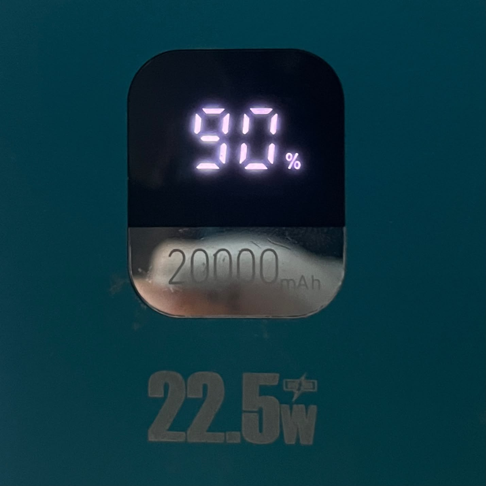
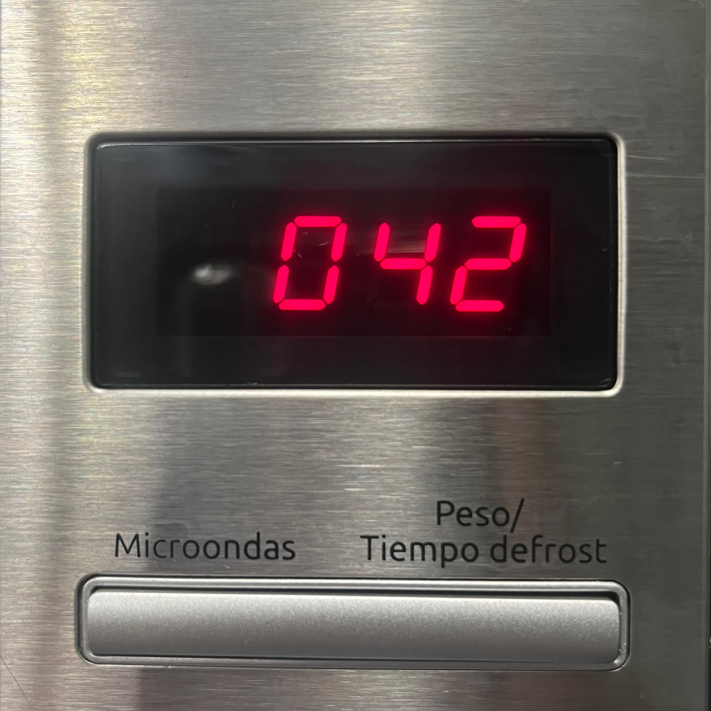
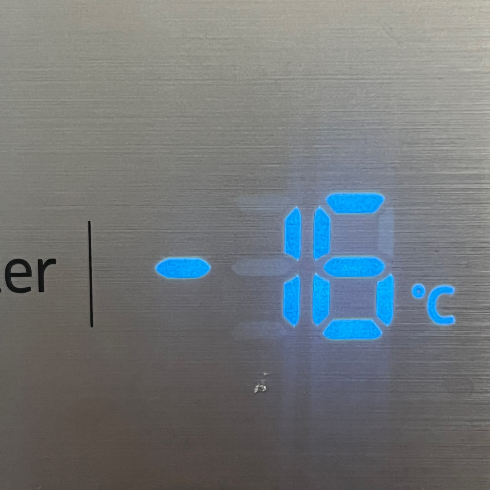

# sesion-01a

## apuntes sesión

**primer bloque**

"la terminal" es como utilizar el computador en modo administrador

fijarse de estar en el lugar correcto, ósea en mi repositorio, hacer cambios solo si ya he hecho update Branch en sync fork

comentario con la descripción del cambio echo en el commit

para una imagen
!\[alt text](ubicación)
ej: !\[imagen portada libro](./libro-hacker.jpg)

**segundo bloque**

hablamos de las variables (datos) del ascensor tanto como internos y constantes

* botones
* ejes
* poleas
* contrapeso
* sensores
* niveles

**"sudo rm rf"
sudo** ejecuta la orden
**rm** remove
**r** borrar carpetas y contenido
**f** borrar e ignorar avisos sin una confirmación

cita las sesiones **a** de las 10 paginas del libro

(resumen, al menos dos citas, incluir preguntas - referentes - etc)

orden

* sesión
* apuntes sesión
* encargos
* lectura

## encargos

1. Antes de comenzar, quiero comentar que hacer algo personal o hablar sobre mi me cuesta tanto, me considero amante de todo pero experta en nada, siempre mi mentalidad ha sido aprender muchas cosas, me cuesta encasillarme en algo puntual. Dicho eso

En las variables soy resolutiva, autodidacta y autoexigente, lo que me lleva a funcionar de tal manera de buscar diversas opciones para poder sacar algo adelante y no quedarme bloqueada en el proceso, cuando aprendo o me enseñan algo prefiero buscar la respuesta antes de preguntarla, parte de eso lo estoy mejorando con aceptar que básicamente no se todo, y eso esta bien, por algo estoy ahí, para aprender, busco mejorar y alcanzar metas que a mi me satisface, para poder corregir y perfeccionar las situaciones o productos

parte de mi autorretrato es destacar que uno esta en un constante proceso de cambio y aprendizaje

2. Pantalla de segmentos
Las pantallas de segmentos son segmentos rectangulares que se prenden o se apagan en distintas posiciones para lograr vizualizar algún número o letra, en este caso lo vi reflejado en mi batería portátil, microondas y mi refrigerador.

Me percate que en los casos recolectados, tiene un pequeño indicador para acompañar a la pantalla de segmento, por ejemplo para numero de batería existe un %, lo que se entiende que es la cantidad de batería que tiene, y en el refrigerador esta acompañado de un - y c que nos ayuda a posicionarnos en un contexto

## lectura
