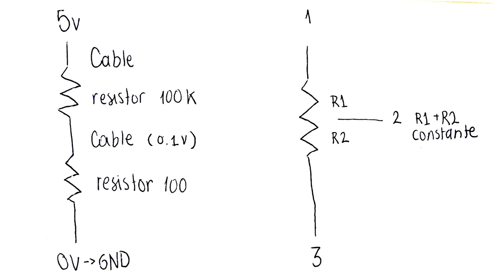
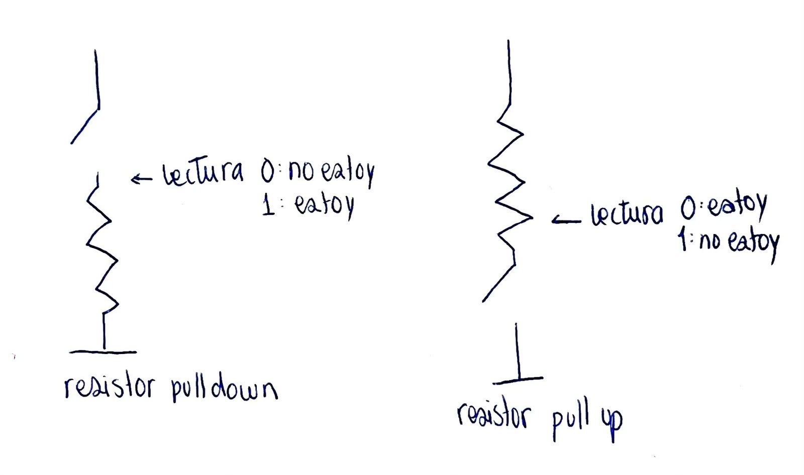
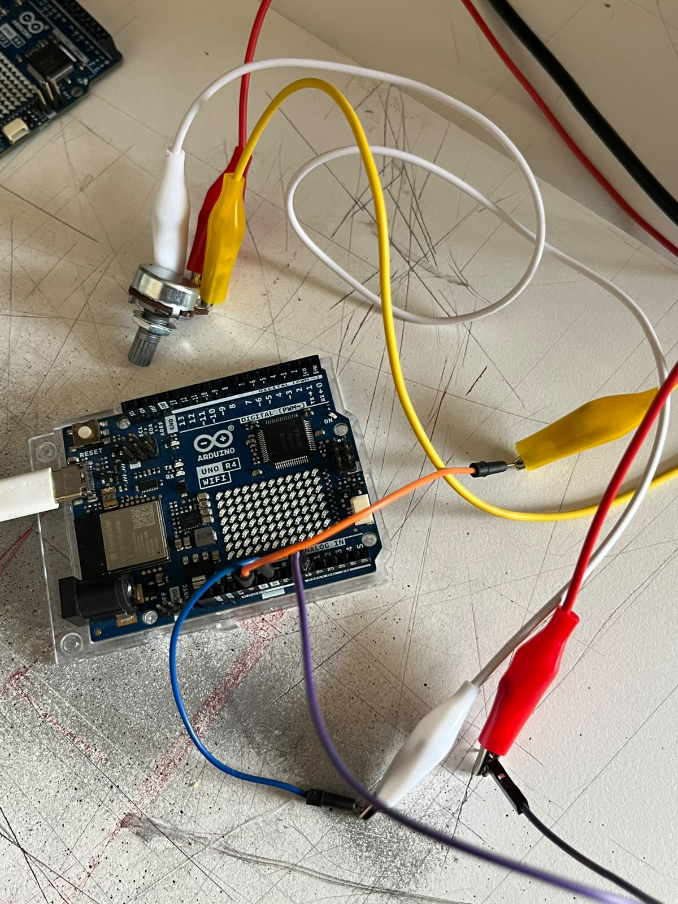
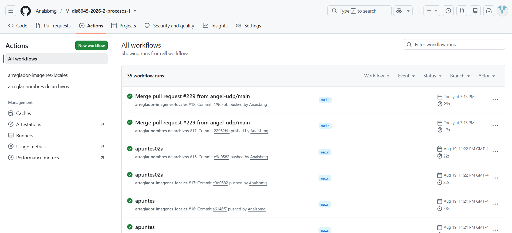

# sesion-02a

## apuntes sesión

Potenciómetro pot perillas 0- algo (resistor variable)
	Potencia=energía/tiempo
	*voltaje tiene que ver con energía y voltaje con tiempo




potenciómetro: a audio - b lineales

botón toggle (interruptor) son distintos a pushbuttons (temporales)

+ _/ _ N.O = normalmente open -> ___
+ ___N.C = normalmente conectado -> _/ _

VCC= voltaje de conexión continua
+3V3
+5V


	
breadboard= protoboard

**analog-in** es para lo que esta definido
digital puede mutar, dependiendo de las instrucciones que se les de

botones lado digital
pote análogo a

**BIN** se le puede inyectar más energía (no lo vamos a utilizar)

**Ejercicio clases**

Arduino GND - cable - 5V - cable - (solo concecciones sin una fuente de poder) - caimanes para hacer más fáciles las conexiones - se conecta al pote (dejando la del centro solo) - A0 va conectado a la para de al medio del pote 



```cpp
int patitalectura = A0;

const - constante

serial.begin (n) --> cantidad de mensajes (símbolos - baulios)

const int patitaLectura = A0;

int valorLectura = -1;

void setup() {

Serial.begin (9600);

}

void loop() {
  valorLectura = analogRead(patitaLectura);
  Serial.println(valorLectura);
}
```

Código oficial:
```cpp
const int patitaLectura = A0;

int valorLectura = -1;

void setup() {

  Serial.begin(9600);

}

void loop() {
 valorLectura = analogRead(patitaLectura); 
 Serial.println(valorLectura);
}
```

un valor mínimo de 0
valor medio 
un valor máximo de 1023
2 elevado a 10 (0 a 1023)
los números importan dentro de un contexto 
10 bits

int 1/4= 0,25 al ser int debe ser un numero entero, entonces en este caso es 0

utilizamos: 
[botonDigital](https://docs.arduino.cc/built-in-examples/digital/Button/)
[analogoSerial](https://docs.arduino.cc/built-in-examples/basics/AnalogReadSerial/)

## encargos

1. Todo correcto con github worfklows 
2. Grupo con antoloch y ccarlabelenn

## lectura

**Cruzar la mirada** *resignificar a las artes en la sociedad actual* de Rosario García Huidobro Munita

Rosario García Huidobro Munita Licenciada en Artes de la Universidad Católica de Chile y profesora de educación media de la Universidad Gabriela Mistral, además es Doctora en Artes y educación de la Universidad de Barcelona. Sus líneas investigativas van de la mano con los y las artistas, docentes, artes, feminismo, perspectivas de genero entre otras. 

La primera parte de la lectura la vi muy ligada a lo artístico y pedagógico y como se podían fusionar  

+ "También recuerdo un taller de autorretratos que realicé para infantes de primaria, donde aprendimos sobre cómo dibujar-nos. Recuerdo que se generaba un silencio incómodo y extraño, al ritmo del son de los lápices, mientras niños y niñas se dibujaban muy concentradamente. Comencé a observar en esas sesiones algo que me pareció curioso. Me interesó la imagen visual de cómo el grupo aprendía, porque existía la necesidad en los niños/as de observar el proceso de creación de sus compañeros/as. Intenté captar esas imágenes de saber compartido en mi propio proyecto artístico." (García-Huidobro Munita, 2020, p12)

+ "Estas ideas me permiten continuar el debate por el papel ontológico del o la artista. Cuando pensamos en su ontología no nos referimos solamente a su composición como persona situada, a lo que es, sino a esa subjetividad deseante (Fernández, 2011), a lo que va siendo en su multiplicidad de actos y relaciones. En cierto sentido, a lo que Deleuze llama pliegues. Es desde esta premisa que un/a artista no solo crea, produce un algo o una experiencia, sino que se hace a sí mismo desde esas experiencias de pliegues. Los pliegues que rescatamos en este libro son prácticas artísticas y culturales con un sentido social y transformador que emerge de las aulas, talleres, investigaciones o espacios de diálogo y que, al aparecer en los centros expositivos, han ido mostrando no solo un nuevo perfil de artistas, sino también una nueva forma de entender Las artes para provocar nuevos pliegues y cruces de esta disciplina con otras." (García-Huidobro Munita, 2020, p16)

Seleccione estas citas ya que considero que son claves para esta primera parte, hablar de lo observado es muy valioso, me gusto que justo en el primer encargo hablamos de las variables de cada uno, el poder destacar el proceso sobre el resultado es muy valioso, es una experiencia. Lograr definir a un artista personalmente considero que es muy difícil, ya que existen muchas áreas las que abarca un artista y en esta cita habla sobre que la definición de este depende totalmente de la formación y su identidad, al hablar de pliegue habla también de una esencia, lo que no logra un "artista genio" como lo comenta.
