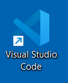
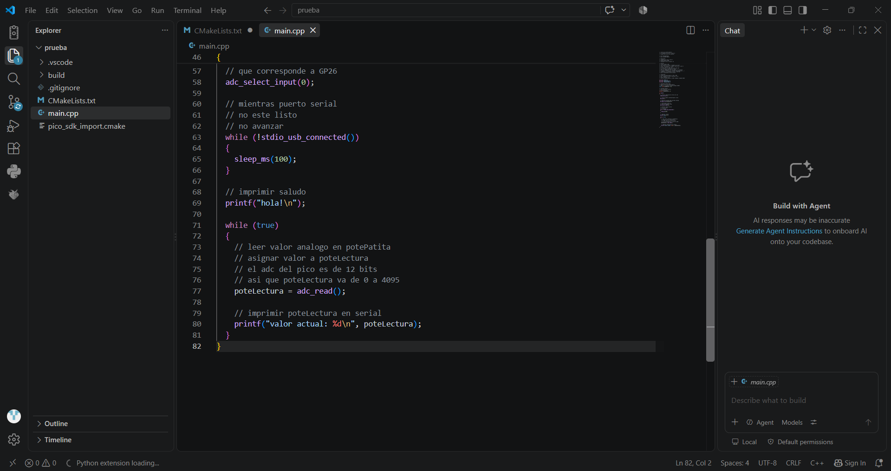

# sesion-02b

clase cancelada por cierre de udp

## apuntes sesión

* Cuando tengamos dudas o problemas siempre hablar de versiones, ya que este puede ser el problema
* Si queremos pedirle algo a Claude debemos hablar de las versiones, etc
* Micropython
* Pico, Pico 2, Pico W, Pico 2 W (w = Wireless = inalámbrico)
* Risc-v no lo utilizaremos
* Versiones V0.0.0 Mayor-Menor-Parche
  - Mayor: Modificaciones que dejan de funcionar con las versiones anteriores
  - Menor: Agrega funciones nuevas, sigue siendo compatible
  - Parche: arreglar errores pequeños 
* utilizaremos SPI y I2C
* .vscode no lo tocaremos
* build son los resultados
* gitgnore no lo utilizaremos
* main.cpp es el código
* main es un entero
* \n es enter
* adc de análogo a lo digital

## encargos

1. 
2. 

## lectura
