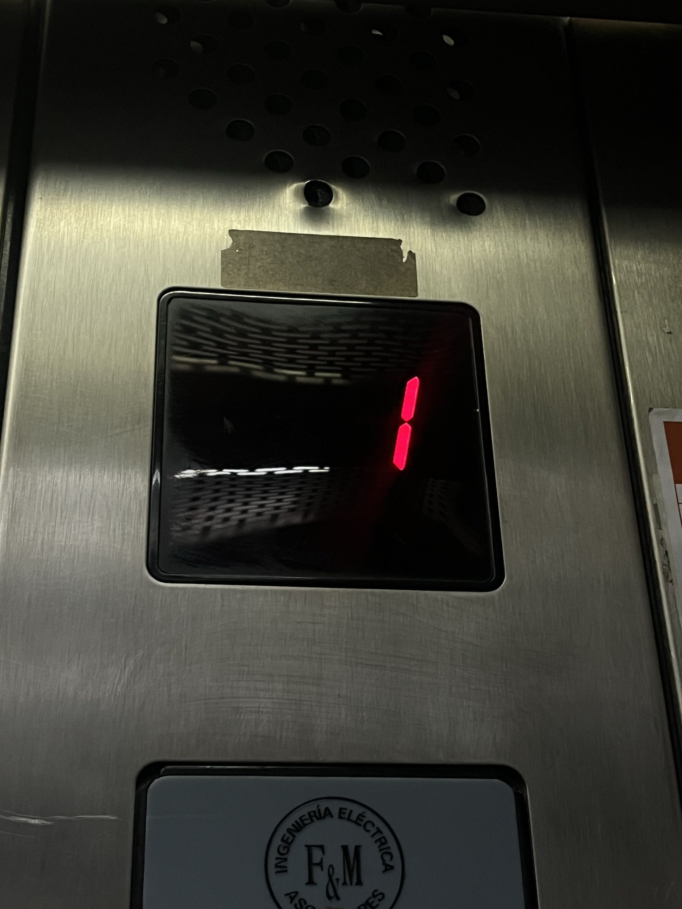
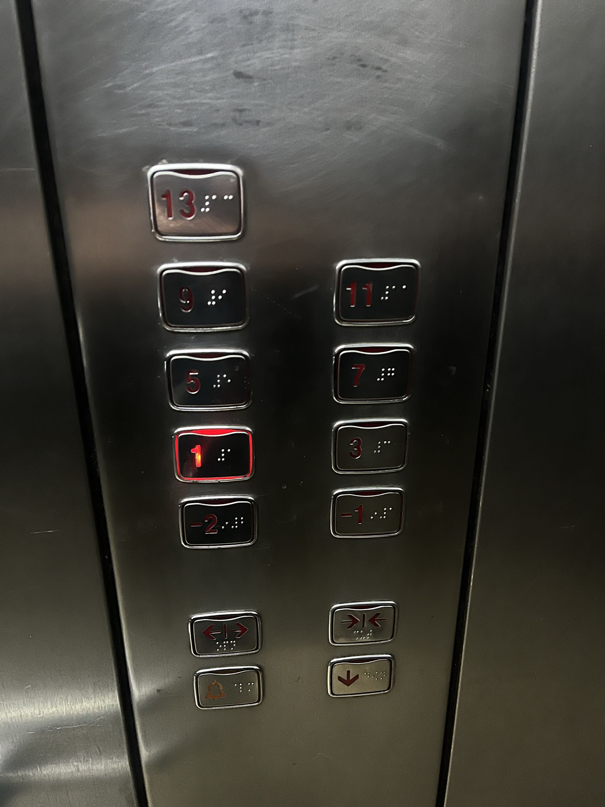
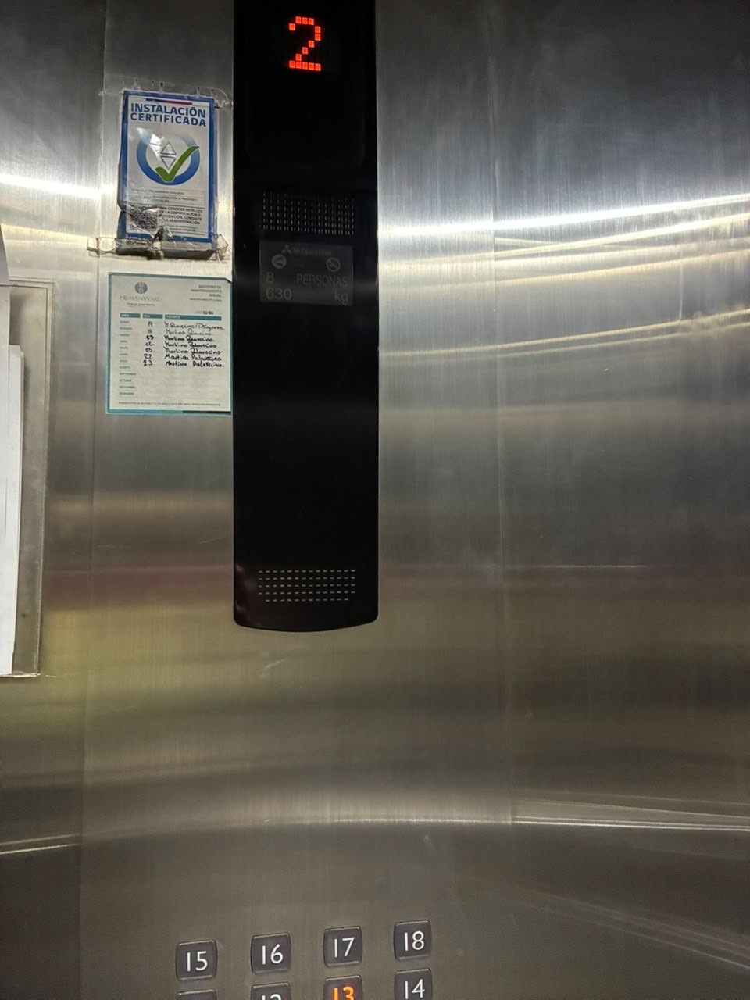
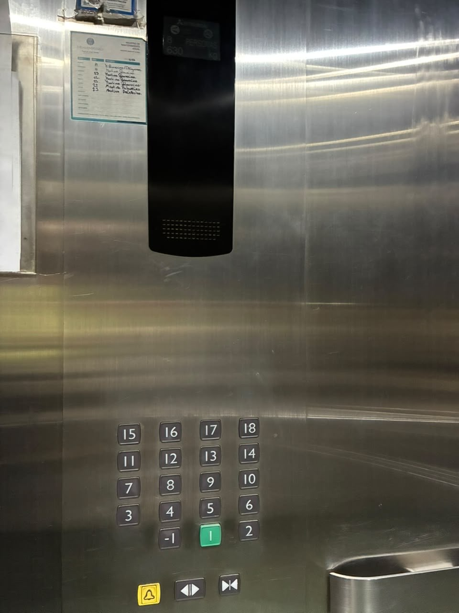

# sesion-00b

## apuntes sesión

## encargos

### Ascensor 1

  

bueno, este primer ascensor no sé si es muy bueno, se divide en pares e impares, los números van ascendiendo en forma de zigzag, este solo tiene indicador de números en el piso número 1, el cual está indicado en el tablero, de igual manera cuenta con los botones de emergencia no tan bien diferenciados, por otro lado, en los otros pisos no tiene indicador en cada piso, pero este ascensor tiene una maña que al estar llegando la luz del botón para llamar a este empieza a titilar.

### Ascensor 2

  

el segundo ascensor es bastante común la verdad, cuenta con indicador de pisos en cada uno, y el panel interior contiene todos los números y botones de emergencia, bastante bien diferenciados, no solo par o impar, en el tablero del interior los números van ascendiendo por hileras horizontales y bastante asimétricas, lo que me incomoda en cierto punto, pero funciona bastante bien, este igual cuenta con piso uno bien indicado e incluso es de un color distinto, a diferencia del primero, este para llamarlo tiene un botón de subida y otro de bajada.

## lectura
