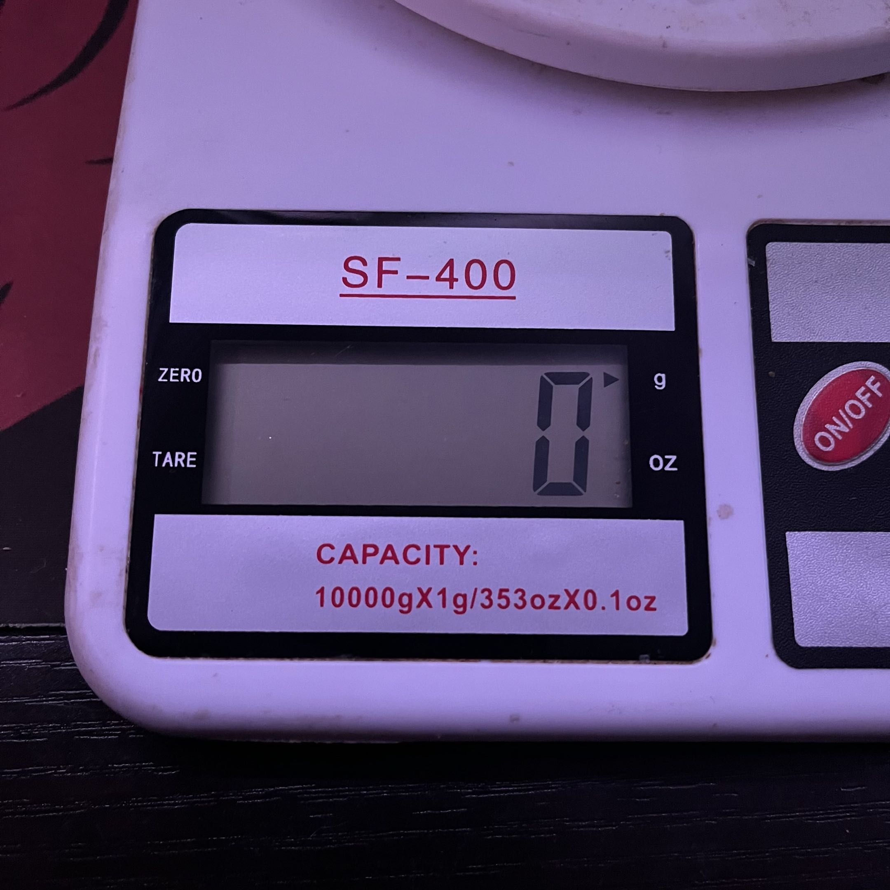
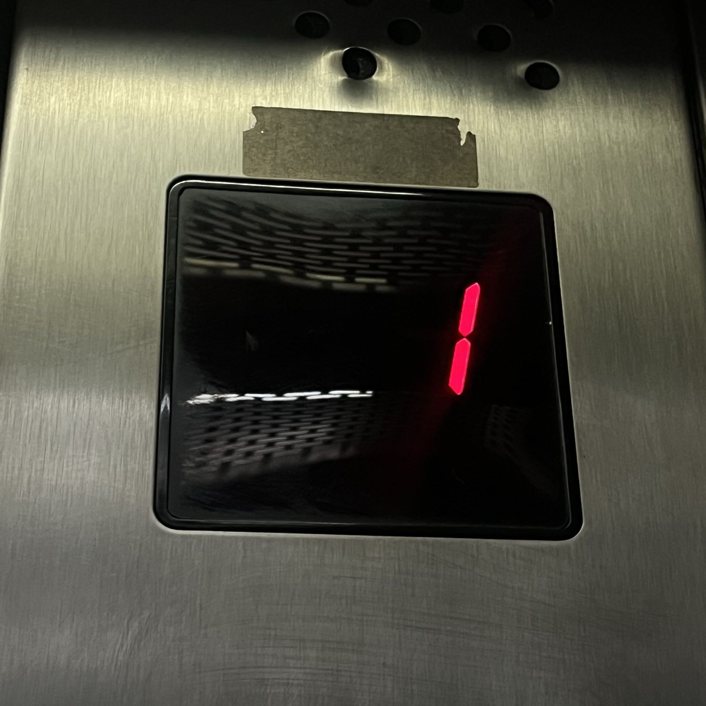
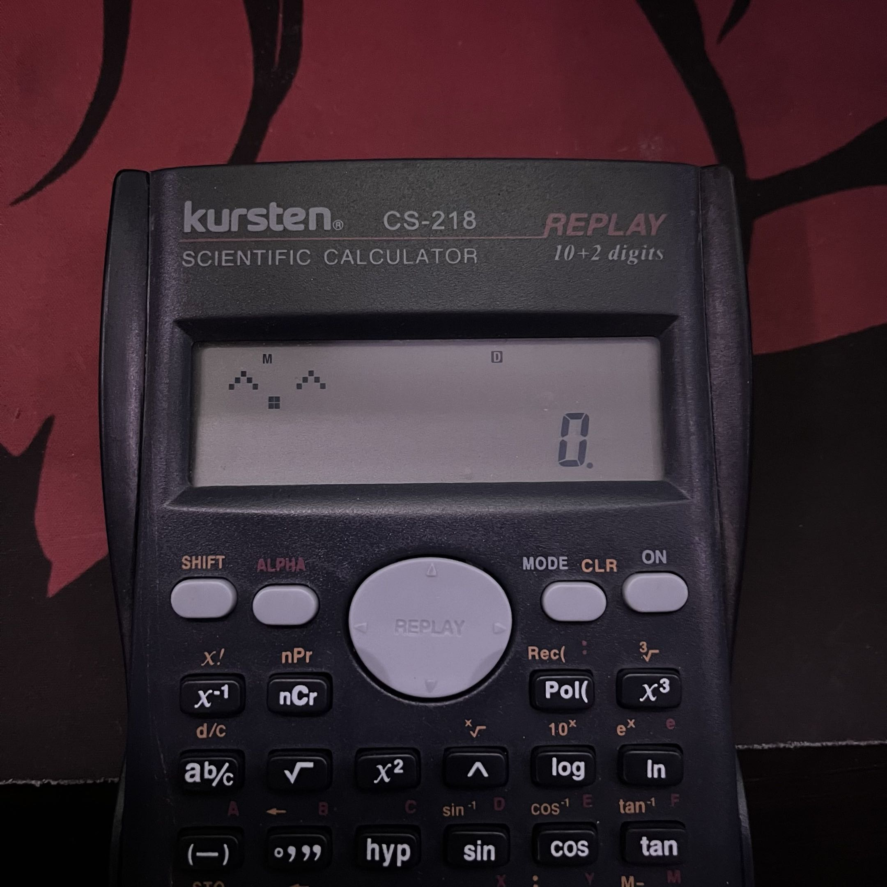

# sesion-01a

## apuntes sesión

primer bloque: en la primera parte de la sesión se hizo la elección de un libro para hacer su lectura a medida vaya avanzando el semestre, para posteriormente hacer una introducción a lo que es github y los markdown para poder utilizar en el taller, y finalmente para pasar a la organización de las carpetas.

segundo bloque: se hizo una actividad grupal relacionada con el encargo de la clase 00b, para poder entender los fundamentos base de la programación y la importancia de la buena comunicación, explicación y escritura al momento de programar.

## encargos

### autorretrato

#### variables:

- nombre: Carlo Martínez.
- edad: 24.
- color favorito: rojo.
- hobby: jugar y salir.
- música favorita: r&b.
- juego favorito: resident evil 4 remake.

#### funciones:

- jugar.
- escuchar musica.
- ver anime.
- salir con amigos.
- leer.

### investigación pantalla de segmentos 

#### pantalla 1:

  

- lugar: pesa.
- ubicación: parte frontal de la pesa.
- contexto: se utiliza para medir el peso de objetos.
- uso: mostrar el peso medido.
- alfabeto posible: numérico y símbolos.
- tipo de pantalla: display de 7 segmentos.
- descripción: la pantalla muestra el peso medido utilizando segmentos de cristal líquido, también presenta símbolos para indicar la unidad de medida.

#### pantalla 2:

 

- lugar: ascensor.
- ubicación: panel interior del ascensor.
- contexto: la pantalla indica el piso en el que se encuentra el ascensor.
- uso: mostrar el número del piso.
- alfabeto posible: numérico.
- tipo de pantalla: display de 7 segmentos.
- descripción: la pantalla utiliza segmentos de color rojo para formar el número del piso. En este caso se muestra el número 1.

#### pantalla 3:

 

- lugar: calculadora científica.
- ubicación: parte superior de la calculadora.
- contexto: se utiliza para realizar operaciones matemáticas.
- uso: mostrar números, operaciones y resultados.
- alfabeto posible: numérico, letras y algunos símbolos.
- tipo de pantalla: display de segmentos.
- descripción: la pantalla utiliza segmentos para representar números y algunos caracteres, también incluye símbolos que indican diferentes funciones o estados de la calculadora.

## lectura
