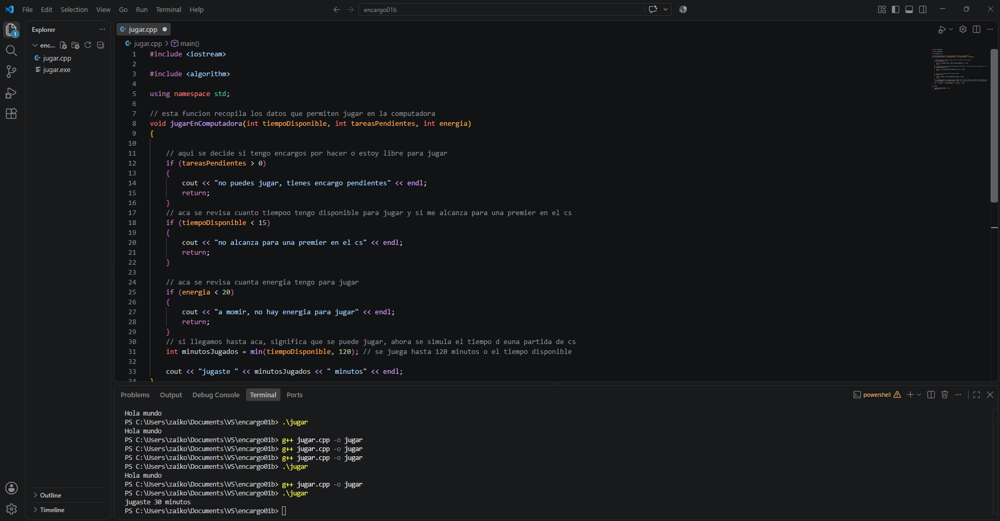

# sesion-01b

## apuntes sesión

## primer bloque 0900-1030: 
- en la primera sección se inicia teniendo una charla sobre algunas figuras históricas relacionadas con el núcleo del ramo, para posteriormente pasar a la revisión de algunos encargos de el día martes, haciendo énfasis en uno en el cual habían algunos conceptos de programación con los cuales trabajaremos mas adelante en la clase

- posteriormente, a modo de grabación, se hace una introducción al software de arduino ide, y las bases de los arduinos uno r3 y uno r4

- ### importante: la linea de código debe estar siempre con los comentarios de lo que debería hacer/como debería funcionar

## segundo bloque 1100-1250:
- se hace una explicación paso a paso de como programar a una persona en el software de arduino ide, revisar mas adelante el resultado final subido a github

- se nos entrega un arduino uno 4 wifi para intentar encender un led mediante la programación de este
  
## encargos

encargo01b:

1. tratar de correr un código en el microcontrolador asignado a cada dupla, incluir referentes, citas, comentarios, imágenes, descripciones textuales, y en caso de éxito o fracaso incluir aciertos, preguntas, dramas, atados. recordatorio que estos apuntes son personales, cada persona sube su versión.

2. proponer una función con nombre, tipo, argumentos y uso, que modele algún área de su interés, por ejemplo subirCerro(enBicicleta), tomarMetro(conPaseEscolar), etc. escribir en pseudocódigo los pasos que necesita esa función internamente para que literalmente funcione.

hice la función jugarEnComputadora, que trata de replicar algo que me pasa a mí en el día a día: saber si en este momento puedo ponerme a jugar en el pc, tomando en cuenta si tengo encargos pendientes, cuánto tiempo libre tengo y qué tan cansado estoy. si esas tres cosas van bien, la función calcula y muestra cuántos minutos voy a jugar.

```cpp
#include <iostream>

#include <algorithm>

using namespace std;

// esta funcion recopila los datos que permiten jugar en la computadora
void jugarEnComputadora(int tiempoDisponible, int tareasPendientes, int energia)
{

    // aqui se decide si tengo encargos por hacer o estoy libre para jugar
    if (tareasPendientes > 0)
    {
        cout << "no puedes jugar, tienes encargo pendientes" << endl;
        return;
    }
    // aca se revisa cuanto tiempoo tengo disponible para jugar y si me alcanza para una premier en el cs
    if (tiempoDisponible < 15)
    {
        cout << "no alcanza para una premier en el cs" << endl;
        return;
    }

    // aca se revisa cuanta energia tengo para jugar
    if (energia < 20)
    {
        cout << "a momir, no hay energia para jugar" << endl;
        return;
    }
    // si llegamos hasta aca, significa que se puede jugar, ahora se simula el tiempo d euna partida de cs
    int minutosJugados = min(tiempoDisponible, 120); // se juega hasta 120 minutos o el tiempo disponible

    cout << "jugaste " << minutosJugados << " minutos" << endl;
}

int main()
{
    jugarEnComputadora(30, 0, 70);
    return 0;
}
```

aciertos y dramas
- al principio no entendia bien dónde iban las llaves { } de cada if, las tenía metidas una dentro de otra por error, y el código nunca llegaba a revisar el tiempo ni la energía.
- lo más estresante de todo el proceso fue instalar el compilador (MinGW con MSYS2) y dejarlo en el PATH de Windows, mucho más complicado que escribir el código en sí, ya que instale visual studio code por recomendación de unos amigos informaticos.
- una vez que entendí cómo funcionaba un if, los otros dos me costaron mucho menos porque seguían el mismo orden.
- al final tuve un atado ya que la parte de lectura quedaba dentro del código y no sabia el por que, consegui arreglarlo agregando los tres backticks al final del codigo

  

## lectura
