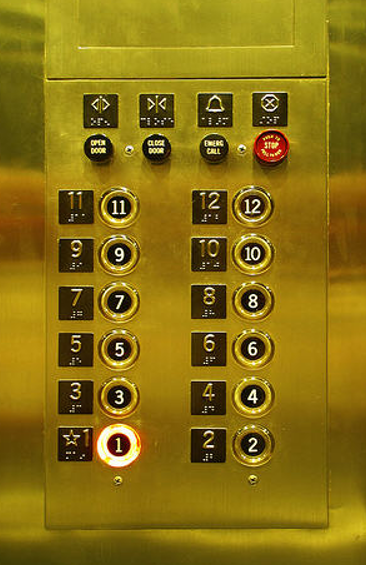
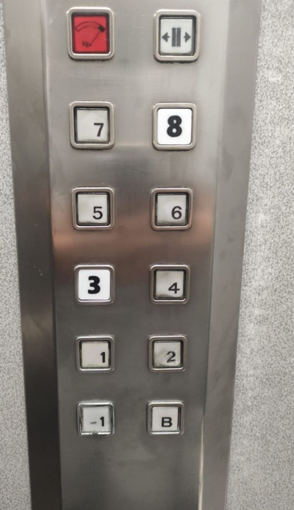
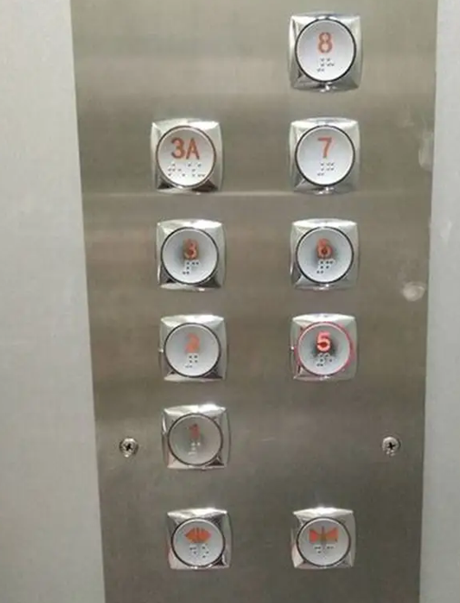

# sesion-00b

## apuntes sesión

## encargos
Botones ascensores:
 
El orden de los botones va de abajo a arriba, los botones de arriba con funciones que no son las de subir o bajar, tienen texto que te dice para que sirven.
Los botones con los pisos tienen los números inscritos y al lado de los botones se repite.
El boton de emergencia para parar es de color rojo y pone stop. (esta función no la había visto nunca)
No hay piso 0, comienza en el uno.
Tienen Braille.

 

En el misnmo botón están escritos los números.
Hay un botón que pone B.
Hay piso -1 pero no hay piso 0.
No hay botón para cerrar las puertas pero si hay para abrirlas.
Hay un botón que sirve para indicar que se ha pasado el límite de peso.

 
No existe el piso 4.
Los botones están distribuidos de forma escalonada.

## lectura
