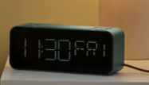
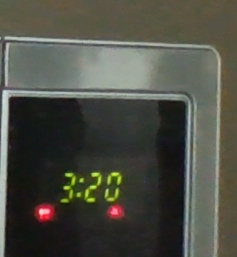

# sesion-01a

## apuntes sesión

## encargos
Lo vuelvo a pegar porque no se me había guardado

Autorretrato:

Variables: Mi edad, mi altura, mi  nombre, si estoy cansado o no o
Funciones: Despertarme, levantar una pierna, mover la mano, o si estoy cansado entonces irme a dormir.

La calculadora no está hecha de un segment display habitual, está hecha con un LCD de matriz de puntos, lo que permite esto a diferencia de un segment display habitual es que te permite también mostrar muchos más símbolos como letras, lo que permite poder calcular más variables desconocidas o números como el e o pi.
Un segment display de este tipo también permite tener gradaciones, es decir mostrar diferentes símbolos con diferentes tonalidades.

En cambio el despertador y el microondas, los dos tienen que mostrar tiempo que son solo números por lo tanto es mucho más económico y fácil de programar.
## lectura
