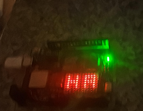

# sesion-01b

## apuntes sesión
OR:
El OR siempre es igual a 1 a menos que haya dos 0. Es como una suma.
AND:
El AND siempre es igual a 0 a menos que haya dos 1. Es como una multiplicación.

Los tipos de variables son muy importantes ya que no todas las  variables el ordenador las va a leer igual, hay algunas variables que pesan más que otras por ejemplo, por eso es importante separarlas en diferentes tipos.

Char:
Char es una variable que solo es un carácter.

String:
Una string fue creada a partir de los chars, contiene palabras.

Int:
Son variables que solo son números sin decimales.

Arduino:

Comentarios, se escriben primero y describen con palabras humanas todo lo que tiene que ocurrir, está prohibido escribir alguna línea para programar si no hay un comentario, lo importante no es la línea de código es saber lo que se quiere hacer. Esto se llama pseudocódigo.
Básicamente es un microcontrolador en una placa, microcontroladores se pueden encontrar en cualquier tipo de objeto que tenga computación. El resto de cosas en la placa son puertos para comunicar al microcontrolador.

void setup()
Como ya sabemos cuando hay paréntesis es una función, el void setup es como una función que se hace al principio de configuración así como un hábito para comenzar, que se hace solo una vez. Pone void porque no va a contestar, es decir que ocurre sin dar un resultado, solo tiene que hacer algo.


void loop()
Ocurre después del setup y se repite hasta que no se pueda.

Con 24 bits tengo más de 10 millones de valores posibles.
8 bits son un byte.
1 byte tiene 2 nibbles, 2 pedacitos.

eL HEXADECIMAL:

Con una casilla se puede contar hasta 15: 0,1,2,3,4,5,6,7,8,9,A,B,C,D,E,F

El punto y coma al final de una función sirve para decir que aquí se acaba la función.

Para hacer comentarios se escribe //

int sirve para decalrar una variable, declarar una variable es algo que solo se puede hacer una vez.

```
void setup(){

}

void loop(){

}


```

## encargos

encargo01b:

1. tratar de correr un código en el microcontrolador asignado a cada dupla, incluir referentes, citas, comentarios, imágenes, descripciones textuales, y en caso de éxito o fracaso incluir aciertos, preguntas, dramas, atados. recordatorio que estos apuntes son personales, cada persona sube su versión.
2. proponer una función con nombre, tipo, argumentos y uso, que modele algún área de su interés, por ejemplo subirCerro(enBicicleta), tomarMetro(conPaseEscolar), etc. escribir en pseudocódigo los pasos que necesita esa función internamente para que literalmente funcione.


```cpp
//Queremos hacer algún símbolo con la matriz de led que tiene el Arduino
//Primero vamos a incluir una librería hecha para la matriz de este arduino, después de investigar aprendimos que una librería es un conjunto de funciones de código ya programadas
//que sirven para acortar muchas más líneas de código, con solo una función.
//La almohadilla lo que hace es decirle al compilador que antes de que compile, incluya la librería.
#include "Arduino_LED_Matrix.h"
ArduinoLEDMatrix matrix;

//Ahora en el void setup, encendemos la matriz.
void setup() {
   Serial.begin(115200);   //Esto lo que hace es iniciar la comunicación entre la placa y el ordenador
   matrix.begin();         //Encendemos la matriz
}
// Esto le dice al ordenador la posición de cada led del 0-11 12x8
uint8_t frame[8][12] = {
  { 0, 0, 0, 0, 0, 0, 0, 0, 0, 0, 0, 0 },
  { 0, 0, 0, 0, 0, 0, 0, 0, 0, 0, 0, 0 },
  { 0, 0, 0, 0, 0, 0, 0, 0, 0, 0, 0, 0 },
  { 0, 0, 0, 0, 0, 0, 0, 0, 0, 0, 0, 0 },
  { 0, 0, 0, 0, 0, 0, 0, 0, 0, 0, 0, 0 },
  { 0, 0, 0, 0, 0, 0, 0, 0, 0, 0, 0, 0 },
  { 0, 0, 0, 0, 0, 0, 0, 0, 0, 0, 0, 0 },
  { 0, 0, 0, 0, 0, 0, 0, 0, 0, 0, 0, 0 }
};
//Usamos el void para decirle al arduino que leds queremos que se enciendan ponemos frame, indicamos la posición y el 1 es led encendido y 0 es apagado
void H(){
  //frame para indicar que led, y luego entre [] el primer número indica la fila y el segundo la colmna en la que se encuentra el led que queremos encender
  frame[1][1] = 1;
  frame[2][1] = 1;
  frame[3][1] = 1;
  frame[4][1] = 1;
  frame[5][1] = 1;
  frame[3][2] = 1;
  frame[3][3] = 1;
  frame[3][4] = 1;
  frame[1][4] = 1;
  frame[2][4] = 1;
  frame[4][4] = 1;
  frame[5][4] = 1;
}

void A(){
  //Letra inicial A
  frame[1][7] = 1;
  frame[2][7] = 1;
  frame[3][7] = 1;
  frame[4][7] = 1;
  frame[5][7] = 1;
  frame[1][8] = 1;
  frame[1][9] = 1;
  frame[1][10] = 1;
  frame[3][8] = 1;
  frame[3][9] = 1;
  frame[3][10] = 1;
  frame[2][10] = 1;
  frame[4][10] = 1;
  frame[5][10] = 1;

}
//Aquí indicamos que se repita constante mente que se encienda la letra H y A.
void loop(){

H();
A();
//Esto nos ha dado problemas, sirve para dar la orden de que se encienda lo que le hemos dicho que se encienda, es de la libreria de la matriz.
matrix.renderBitmap(frame, 8, 12);

H();
A();


}
```cpp

Estas son las referencias usadas:
https://docs.arduino.cc/tutorials/uno-r4-wifi/led-matrix/
https://copilot.microsoft.com/shares/aKGLnQpftu12JvMAQ3TbX

```cpp

PARTE 2 ENCARGO
//Cocinar pollo a la plancha
//Primero es conseguir los materiales e ingredientes
int sartén
int cocina
int pollo
int aceite

void setup(preparativos)
//Luego pongo los materiales e ingredientes en la mesa.
PrepararMateriales(sartén,cocina)
PrepararIngredientes(pollo,aceite)

if
pollo = congelado
Descongelarpollo();
}

void cocinar(){
EncenderGas();
PonerAceite();
PonerPolloenSarten();

}




## lectura
   Coding democracy: capítulo 1:
De pequeños pensamos que hay dos tipos de personas, los buenos y los malos pero luego cuando creemos nos damos cuenta que en realidad
hay también dos tipos de personas, los que creen que hay malos y buenos y los que creen que las personas no son buenas o malas si no que
actuan dependiendo de las circunstancias y que las personas son una mezcla de virtudes y "malas características".

"tech had become a dominant political force in the world"
Las aplicaciones de hoy en dia que conectan personas como redes sociales, son experimentos para juntar a las personas que buscan mejorar aquellas conductas que a los creadores o controladores les parecen bien e intentar frenar esas que les parecen mal.
Muchas veces la respuesta a preguntas que hacen los activistas tecnológicos sobre incoherencias técnicas como: "¿Por qué no hacen un algoritmo en redes sociales para quitar el odio?" es: "eso no es posible" cuando en realidad esos problemas se pueden solucionar con esfuerzo.

"Hacker politics are anti-authoritarian because hackers know that authorities are just as damaged as they are."
Mientras se escribía este libro salió a la luz que Ito que era el fundador de MIT Media Lab, aceptó dinero por parte de Jeffey Epstein para uso personal a cambió de borrar los registros que tenía Jeffrey Epstein de acusaciones. Los estudiantes se manifestaron al saber esto y muchas personas involucradas tuvieron que dimitir, también Julian Assange que publicó cosas confidenciales de los gobiernos de Estados Unidos y Reino Unido estaba en prisión preventiva y lo iban a juzgar por abuso sexual. Estuvo escondido durante mucho tiempo en la embajada de Ecuador en Reino Unido.
