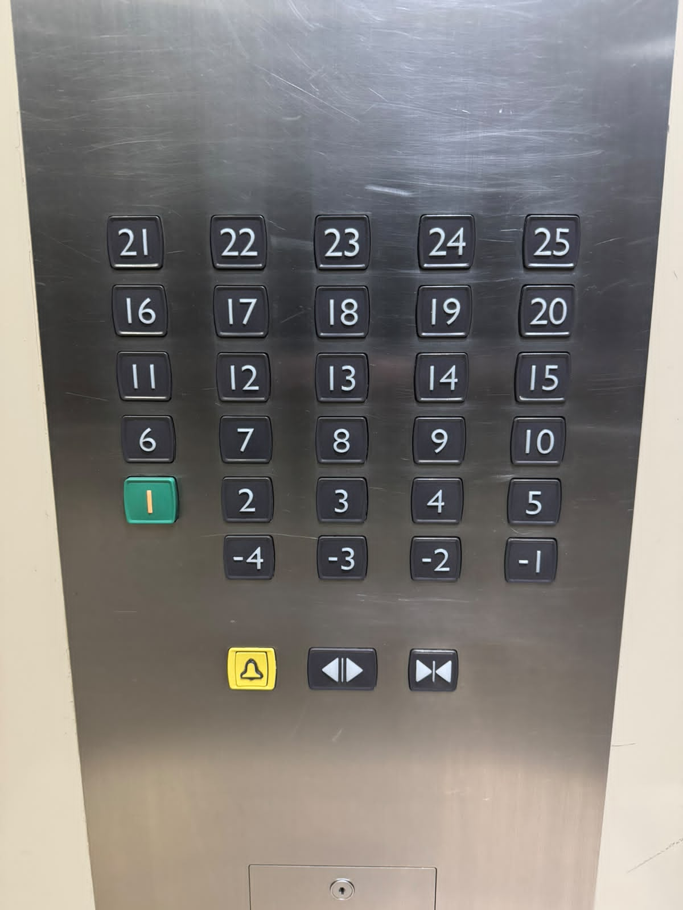

# sesion-00b
viernes 07 de agosto

## apuntes sesión
este día nos llevaron a ver una charla de Heidi Jalkh, luego en la clase estuvimos presentándonos y conociéndonos :)

## encargos
### apuntes y reflexiones charla
#### bioinspirado

proyecto inspirada en el movimiento de una flor, construyendo una estructura cuya variación de formas determina su movimiento

- se puede modificar el comportamiento de una estructura según su forma
- la estructura celular de la planta se expandía y generaba una reacción celular fuera del plano
- ¿cómo seguir explorando estas morfologías?
- ver si el material puede ser bioestable
- siempre seguir explorando las posibilidades del material, no quedarse con el primer resultado

#### bioconstruido

estructura teñida en base a hongos, explorando las distintas posibilidades del mundo fungi como biomaterial

- investigar las propiedades que pueden aportar distintas especies
- los micelios de los hongos de color son territoriales y no se mezclan
- procesos artesanales ¿cuáles son las industrias y procesos, y cómo vamos a transformarlos?
- la variabilidad como elemento de diseño
- trabajar en base a la naturaleza y no tratar de controlarla
- explorar futuros alternativos

#### biobasados

proyecto pensado para la arquitectura con la realización de un material para la construcción hecho en base de moluscos

#### reflexión

hay un propósito muy lindo que va de la mano con observar y adecuarse a las posibilidades del material, dejando atrás procesos relacionados con el extractivismo donde la naturaleza deba adaptarse a las necesidades humanas. esta idea me resuena con la frase que dijo Heidi Jalkh, sobre explorar futuros alternativos, y si bien lo más ético siempre sería evitar intervenir de cualquier manera en la naturaleza, esta es una posibilidad utópica, por lo que nos queda por hacer es cambiar las narrativas y formas que tenemos de relacionarnos con ella, y creo que este tipo de proyectos son los que hacen que se pueda dar forma a estos nuevos futuros.

leí un texto que tiene relación con estas ideas:

https://atmos.earth/ecological-wisdom/what-gives-putting-symbiosis-and-life-in-context/

“Como escribió Sophie Pavelle en un artículo reciente para Atmos, casi la mitad de toda la vida animal es parasitaria, y prácticamente todos los animales salvajes albergan parásitos. "Solo los parásitos tontos matan a su huésped; los inteligentes los mantienen cerca", escribió. "¿Y si los humanos pudieran aprender de eso? **¿Y si reflejáramos la moderación, la reciprocidad y la sostenibilidad** de los explotadores más exitosos de la Tierra? **¿Podría este nuevo tipo de relación parasitaria ofrecer a nuestro planeta huésped la oportunidad de sobrevivir—quizás prosperar—en equilibrio?"**

### encargo ascensor

- los botones de pisos y acciones están separados

- **botón uno:** va a hacer sonar algo, pero parece ser muy sutil con esa campanita
- **botón dos:** para abrir puertas, demuestra la acción a través de una separación al medio y que con las flechas se abre hacia los lados
- **botón tres:** para cerrar puertas, bajo la misma lógica anterior, las puertas deberían realizar la acción de las flechas y juntarse

_hice el encargo cómo lo había entendido, analizando la visualidad y funcionamiento de tres botones de un ascensor, pero al conversar con compañeros ví que algunos lo abordaron de distintas formas, a pesar de eso y no saber si lo abordé de manera correcta, en la siguiente clase pude reflexionar con mayor profundidad de este análisis_

### revisión encargo

trabajamos en clase y profundizamos el ejercicio de observación del funcionamiento de ascensores, trabajando y conversando con nuestro equipo llegamos a esto:

"El funcionamiento de un ascensor parte desde la experiencia fuera de él, estando frente a sus puertas, donde se suele encontrar al costado botones para subir o bajar, dependiendo en qué piso uno se encuentre, por ejemplo, al estar en el último piso sólo hay botón para bajar. Al llamar al ascensor, se debe presionar el botón con la flecha de la dirección a la que uno se dirigirá. Al entrar, podemos ver distintas variables de botones, divididas en pisos, funcionamiento de las puertas y botones para casos de emergencia. Los botones de los pisos al ser apretados, hay una programación detrás que genera el movimiento del mecanismo para ser llevado a tal piso, al cerrarse las puertas, ya sea de manera automática luego de un tiempo determinado, o al apretar el botón para realizar esta acción."

### conversación en clases

**¿qué se necesita para un ascensor (datos)?**

- puertas
- botones pisos: números enteros positivos y negativos, no hay 0
- botones auxiliares: abrir y cerrar puertas
- botón de emergencia
- movimiento en eje z
- espejos opcionales
- poleas
- motores
- contrapeso
- carril
- electricidad

**funciones básicas**

- subir
- bajar
- mantenerse
- hacer sonar una alarma
- mecanismo de falla

_estos apuntes los tomamos juntas con marcela zuñiga :)_
