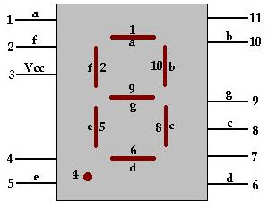
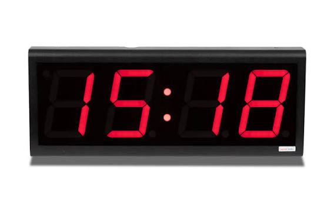

# sesion-01a
martes 11 de agosto

## apuntes sesión

### sobre lenguajes y programación
_cómo programar un ascensor_

if(estoyEnUnPiso){

abrirPuerta();

if(esSeguro){

abrirPuerta();

- para programar, las acciones son con paréntesis y si no tienen son datos
- variables / funciones
- entender los comportamientos de las funciones como absolutos o relativos
__________________________________________________________________

## encargos
1. autorretrato: describir variables y funciones de ustedes
2. investigar pantallas de segmentos, tomar fotos, documentar contexto, lugar, ubicación, alfabetos posibles, usos, comparar entre resultados encontrados, al menos 3 ejemplos distintos. https://en.wikipedia.org/wiki/Segment_display

primero busqué información respecto a los conceptos

### definiciones
#### variables
"Una variable es un contenedor que almacena un valor o conjunto de valores en la memoria de un ordenador y les asigna un nombre único." / "Una variable representa un contenedor o un espacio en la memoria física o virtual de una computadora, donde se almacenan distintos tipos de datos (valores) durante la ejecución de un programa. A cada variable se le asigna un nombre descriptivo o un identificador que se refiere al valor guardado. Los datos almacenados pueden cambiar de valor o ser constantes." / "En algunos lenguajes de programación de alto nivel, una variable es un almacenamiento abstracto o una ubicación de indirección asociada con un nombre simbólico, que contiene una cantidad conocida o desconocida de datos u objetos a los que se hace referencia como un valor; o en términos más simples, una variable es un contenedor nombrado para un conjunto particular de bits o tipo de datos (como integer, float, string, etc...) o indefinido".

tipos de datos:
- interger: números enteros sin decimales.
- float: números con decimales.
- string: texto o secuencia de caracteres.

#### funciones
"Una función es un bloque de código al que ponemos un nombre que realiza una tarea específica. Son una herramienta fundamental para estructurar y reutilizar el código en la programación moderna." / "Para explicar qué es una función se suele decir como ejemplo que es una “máquina” donde “entran cosas” y “salen cosas”. _(Una función es una “máquina” que transforma inputs en outputs)._"

#### segmentos
"Una pantalla de segmentos es un dispositivo de visualización que consta de varios segmentos, los cuales se encienden y apagan para dar la apariencia de dígitos o caracteres alfanuméricos. Los segmentos suelen ser LED individuales o cristales líquidos. Las pantallas de segmentos se utilizan a menudo en relojes digitales y calculadoras de bolsillo. Los tipos comunes incluyen pantallas de siete segmentos (que se usan solo para números) y pantallas alfanuméricas de catorce y dieciséis segmentos (que pueden mostrar números y letras del alfabeto latino)."

**fuentes:**

- https://www.domestika.org/es/blog/12614-que-es-una-variable-en-programacion
- https://ebac.mx/blog/variable-en-programacion
- https://en.wikipedia.org/wiki/Variable_%28high-level_programming_language%29
- https://www.luisllamas.es/programacion-que-es-una-funcion/

### parte uno encargo

**mis variables**

contenedores que almacenan distintos tipos de datos

_físicas_

- `color de ojos`: #8a7246
- `largo de pelo`: 48cm
- `color de pelo`: café, rubio
- `color usual ropa`: azul, negro, café, verde
- `estatura`: 1.54cm
- `edad`: 22 años
- `tatuajes`: 7
- `accesorios`: dos anillos, una pulsera

**mis funciones**

mis "máquinas" que transforman inputs en outputs

- `manos`: están configuradas para que al recibir una idea, ya sea a través de inspiración, investigación o el encargo de una tarea, puedan diseñar, dibujar o escribir, para dar vida a lo que está en la mente.
- `piernas`: al tener la necesidad de ir a un lugar, tienen la función de transportarme ahí con su movimiento.
- `nariz`: respirar oxígeno, para no morir.
- `músculos faciales`: al recibir cualquier tipo de información, ya sea genere felicidad, enojo, tristeza, disgusto, sorpresa o confusión, hacer una expresión inmediatamente, sin importar si es apropiado o no. _esta función debe mejorarse._

### partes dos encargo
**pantallas de segmentos**

tipos: 
- siete segmentos: para números
- pantallas alfanuméricas de catorce y dieciséis segmentos: números y letras del alfabeto.

#### 01. pantalla de siete segmentos
es el dispositivo de visualización más común utilizado en aparatos como relojes, hornos, microondas, estufas.

**funcionamiento:** constan de siete segmentos de leds dispuestos en forma de ocho, e incluso algunas llegan a tener ocho segmentos, utilizando uno de ellos como punto para mostrar números no enteros.

el circuito está diseñado para que se le pueda aplicar voltaje a diferentes pines de manera simultanea para obtener las distintas combinaciones que generan los números de 0 a 9. si bien puede mostrar algunas letras que suelen ser de a la A a la G, hay otras que van más allá de la capacidad del sistema como la K, X, M, N, R, etc.

deben estar controladas por microcontroladores, y generalmente estas pantallas incluyen varios dígitos para poder representar números mayores, y para esa posible gran cantidad de cables, se utilizan algunos trucos para reducir el número de pines.

existen dos tipos de conexión de pines: cátodo común (CC) y ánodo común (CA). como su nombre indica, un display CC tiene todos los cátodos de los 7 LEDs conectados, mientras que un display CA tiene todos los ánodos de los 7 segmentos conectados.

_descripciones de vista de ia:_

**ánodo común (CA)**

-  se conecta al polo positivo de la energía (VCC o 5V).
-  encendido: cada segmento (A-G) prende al mandar una señal negativa (0 lógico o GND) a su pin individual mediante una resistencia.
-  control: se usa con placas como Arduino u otros circuitos digitales para crear relojes y contadores

**cátodo común (CC)**

- pin común: se conecta al polo negativo de la fuente (tierra, GND o 0V).
- encendido: cada segmento (A-G) se ilumina al recibir una señal positiva (1 lógico o 5V) en su pin individual.
- resistencias: requiere una resistencia en cada pin de segmento para no quemar los LEDs.

**fuentes:**
- https://digilent.com/blog/what-is-a-7-segment-display-and-how-does-it-work/
- https://docs.sunfounder.com/projects/vincent-kit/es/latest/components/component_7_segment.html

## lectura
elegí llevarme el libro Conversations de Ai Weiwei porque me llamó la atención que sean conversaciones sobre arte principalmente, sin conocer al artista, por lo que hoy investigué más de él y su obra, y leí las primeras páginas donde pude entender la importancia del artista por lo reconocido que es y también su relación con el activismo político.

**citas sobre él y el libro:**

"Nombrado la persona más influyente del mundo del arte en 2011 por la revista ArtReview, Ai Weiwei es uno de los artistas contemporáneos chinos más importantes, una figura única de la escena internacional y claro disidente del régimen comunista de su país. [...] Mediante su trabajo ha explorado los temas de opresión y desplazamiento. Autodenominándose ‘refugiado’, ha desarrollado una empatía por los refugiados y migrantes, convirtiéndolo en el contenido central de su obra."

"Las conversaciones con el comisario Hans Ulrich Obrist están reunidas en Ai Weiwei. Conversaciones, donde el pensamiento del artista se despliega de forma continua a lo largo de varios años. El formato de entrevista permite seguir su evolución casi en tiempo real, atravesando tanto su práctica artística como su experiencia personal. A lo largo de los diálogos aparecen cuestiones muy diversas —desde la cerámica, la arquitectura o el blogging hasta la filosofía, la naturaleza y las influencias de su entorno familiar—, configurando el retrato de un creador que entiende el arte como una extensión inseparable de la vida. Especialmente relevantes son sus reflexiones sobre la infancia en el exilio, la figura de su padre y su posición crítica frente al Estado chino, elementos que atraviesan de forma constante su obra y su concepción de la libertad artística."

me interesó harto por lo que leí así que tengo muchas ganas de seguir leyendo el libro!

**fuentes**
- https://corpartes.cl/blog/ai-weiwei-artista-activista/
- https://artstatementmagazine.com/ai-weiwei-cinco-libros-para-entender-su-universo/

## revisión encargo

- las variables pueden ser extremas, pueden valer sí o no. es un idea completamente computacional de que las cosas son o no son.
- variable boolean: george boole, aritmética booleana, compuertas AND y OR.
- La aritmética y el álgebra booleana es un sistema matemático que usa solo dos valores: 0 (falso) y 1 (verdadero). Se usa en computadoras y circuitos electrónicos para tomar decisiones lógicas. Funciona con tres operaciones básicas: suma (OR), multiplicación (AND) y negación (NOT).
- hay variables constantes y otras que puedan cambiar, ej: rut: constante.
- en la programación se aproximan los datos.
- char: variable que adjunta una sola palabra, string: una serie de caracteres
- bool: variable verdadero o falso
- tipo de sintaxis
- ` bool desayuno=true; `
- en computación se parte contando desde 0
- con 3 bits se llegan a 8 combinaciones ¿ no entendí mucho, ampliaremos...
- u, no considera el signo. ejemplo: con la edad se usaría un uint, ya que va de 0 a un número entero.

https://www.w3schools.com/cpp/cpp_variables.asp

- **int** - stores integers (whole numbers), without decimals, such as 123 or -123
- **double** - stores floating point numbers, with decimals, such as 19.99 or -19.99
- **char** - stores single characters, such as 'a' or 'B'. Char values are surrounded by single quotes
- **string** - stores text, such as "Hello World". String values are surrounded by double quotes
- **bool** - stores values with two states: true or false

https://www.allaboutcircuits.com/textbook/digital/chpt-7/boolean-arithmetic/

  

