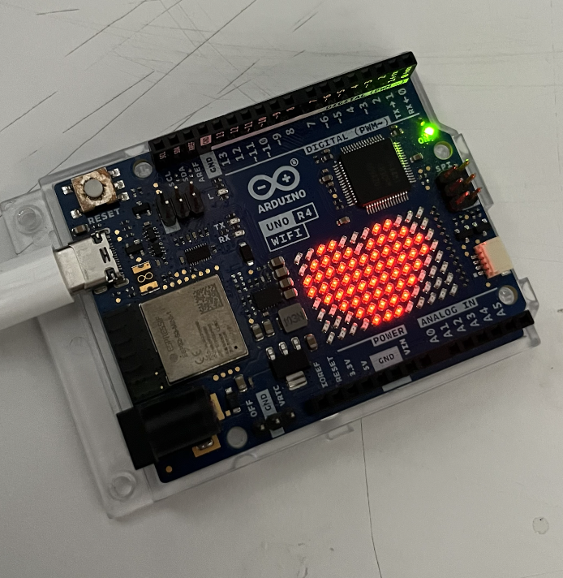

# sesion-01b
viernes 14 de agosto

## apuntes sesión
revisamos el encargo y comenzamos a conversar sobre variables y detalles del lenguaje en la programación.

**¿qué vamos a usar?**

arduino IDE: entorno de desarrollo integrado

- el botón con click sirve para verificar si el código está bien hecho, considerando el tipo de arduino que se va a utilizar.
- segunda carpeta de abajo a arriba.
- arduino UNO R4 son las que están en el lid, buscar e instalar.
- existe el minima y wifi.
- microcontroladores que son capaces de hacer lo que hace un computador.
- arduino fue inventado por hernardo barragan. https://arduinohistory.github.io

cursos gratis:
- https://github.com/ITPNYU/physcomp
- https://itp.nyu.edu/physcomp/

vamos a usar arduino UNO R4

- grabar archivo en una carpeta que queda con el mismo nombre, lo que indica que es el archivo principal, pero esta puede tener más cosas dentro. **en la entrega subir con carpeta.**
- set up: configurar para empezar.
- void: es un tipo de función, significa vacío
- {: desde acá, no puede ir solo. se declara la función.
- (): las funcionen tienen un entre paréntesis.
- //: comentario para humanos. **toda línea de código va estar comentada en este curso.**
- ==: para comparar.
- if: solo si es sí, se ejecuta el código, si es no, lo salta.
- &: conectar
- hexadecimal: 0-9; 10: a, 11: b, hasta la f. _modos de contar_
  
```cpp
void setup() {
  // aquí va setup (), ocurre una vez, al principio
  }

void setup() {
  // aquí va loop ()
  // ocurre despues de setup ()
  // se repite hasta que no se pueda
  }

```
### ejemplo kristel

```cpp
// ejemplo con kristel
// bools
bool kistelEstudianteUDP = true;
bool kristelChilena = true;
bool kristelCoreana = false;
bool kristelDientes = true;

//intergers
int kristelEdad = 22;
int kristelNacimientoAnho = 2003;
int kristelNacimientoMes = 11;
int kristelNacimientoDia = 5;
//azul
int kristelColorFavorito = "0000ff";

// scope esta dentro de {}
// scope es un contexto

// if (mesActual == kristelNacimientoMes) {
// estoy en el mes de interes
//}

// if (diaActual) == kristelNacimientoDia) {
  // decirle feliz cumple
cumplirAnhosKristel();
//}

if (mesActual == kristelNacimientoMes &&
   (diaActual == kristelNacimientoDia);

}

// 10 millones de colores
// 24 bits tengo mas de 10 millones de valores posibles
// 3 receptores rojizo, verdoso, azuloso
// demosle 8 bits a cada canal de color
// entonces R de rojo tiene 8 bits, G de verde, B de azul
// entonces 0 es apagado, 255 es prendido
// 8 bits se llaman 1 byte
// disco duro 2MB, pero de 2Mb y esos son 2 mega bit

// 1 byte tiene 2 nibnles, 2 pedacitos

0010 1100
0101 0101
1011 1010

// en 1 nibble, o 4 bits tengo 2^4 valores posibles
// del 0 al 15

}

//la vamos a correr cuando
//sea el cumple de kristel
void cumplirAnhosKristel() {
  // actualizar edad de Kristel
  // edad es la que es mas uno
  kristelEdad = kristelEdad + 1;
  // manera abreviada
  // kristelEdad+=1;
  // kristelEdad++;
}

```
### ejemplo sumar
```cpp
int valorPancito = 2000;
int valorCafecito = 5000;

void setup() {

  // aquí va setup (), ocurre una vez, al principio
}

void setup() {

  // aquí va loop ()

  // ocurre despues de setup ()

  // se repite hasta que no se pueda
}

void loop (){

  int valorDesayuno = sumar (valorPancito, valorCafecito);

  if (valorDesayuno < 5000) {
    // nao nao
  } else {

    // yam

    }

// sumar enteros
int sumarEnteros(int x, int y) {
  // declarar un resultado
  int resultado = 0;
  // es una abreviacion de dos pasos
  // declarar   int resultado;
  // asignar valor    resultado = 0;

  // declarar solo lo puedo hacer una vez
  
  //hacer la suma de x e y
  // y reemplazar valor resultado
  // por ese valor
  resultado = x+y;
  
  //
  return resultado

}
```

### cómo conectar arduino a compu

- asegurarse de que sea la máquina correcta seleccionada
- en setup se escriben todo lo importante y base para los código
- ej: int
- no irse altiro a la ia, buscar en foros, códigos de ejemplo

## encargos

encargo01b:

1. tratar de correr un código en el microcontrolador asignado a cada dupla, incluir referentes, citas, comentarios, imágenes, descripciones textuales, y en caso de éxito o fracaso incluir aciertos, preguntas, dramas, atados. recordatorio que estos apuntes son personales, cada persona sube su versión.
2. proponer una función con nombre, tipo, argumentos y uso, que modele algún área de su interés, por ejemplo subirCerro(enBicicleta), tomarMetro(conPaseEscolar), etc. escribir en pseudocódigo los pasos que necesita esa función internamente para que literalmente funcione.

### realización encargo
#### parte uno: correr código
estamos trabajando juntas con yaira ruiz y estamos utilizando una placa arduino UNO R4 WIFI. ninguna de nosotras ha tenido una experiencia previa con este tipo de placas, por lo que le hemos estado pidiendo ayuda a nuestras compañeras magdalena balart y marcela zuñiga, quienes tomaron el curso de interacciones inalámbricas y tienen más experiencia, nos dieron de ejemplo un ejercicio que realizaron en clases con el uso de la matriz led respecto a la parte uno del encargo, para intentar correr un código.

https://github.com/marcezm/dis9079-2026-1/blob/main/00-docentes/sesion-02/ejemplo01/ejemplo01.ino

intenté copiar y pegar el código, pero sólo logré instalar una librería ``<ArduinoGraphics.h>`` pero no ``Arduino_LED_Matrix.h``, por lo que al intentar correrlo no funcionó, y estoy con la duda si este código es para que funcione solo la matriz led o va conectada con otra pantalla, porque parte del código habla de pantalla.

desde el link que se encontraba en ese código revisé un tutorial que venía con un ejemplo listo y que funcionó.

https://docs.arduino.cc/tutorials/uno-r4-wifi/r4-wifi-getting-started/

#### código 01

```cpp
#include "Arduino_LED_Matrix.h"
#include <stdint.h>

ArduinoLEDMatrix matrix;

const uint32_t frames[][4] = {
  {
    0xe0000000,
    0x0,
    0x0,
    66
  },
  {
    0x400e0000,
    0x0,
    0x0,
    66
  },
  {
    0x400e0,
    0x0,
    0x0,
    66
  },
  {
    0x40,
    0xe000000,
    0x0,
    66
  },
  {
    0x3000000,
    0x400e000,
    0x0,
    66
  },
  {
    0x3003000,
    0x400e,
    0x0,
    66
  },
  {
    0x3003,
    0x4,
    0xe00000,
    66
  },
  {
    0x3,
    0x300000,
    0x400e00,
    66
  },
  {
    0x0,
    0x300300,
    0x400e00,
    66
  },
  {
    0x1c000000,
    0x300,
    0x30400e00,
    66
  },
  {
    0x401c000,
    0x0,
    0x30430e00,
    66
  },
  {
    0x401c,
    0x0,
    0x430e30,
    66
  },
  {
    0x4,
    0x1c00000,
    0x430e30,
    66
  },
  {
    0x0,
    0x401c00,
    0x430e30,
    66
  },
  {
    0x800000,
    0x401,
    0xc0430e30,
    66
  },
  {
    0x800800,
    0x0,
    0x405f0e30,
    66
  },
  {
    0x800800,
    0x80000000,
    0x470ff0,
    66
  },
  {
    0x800800,
    0x80080000,
    0x470ff0,
    66
  },
  {
    0x800,
    0x80080080,
    0x470ff0,
    66
  },
  {
    0x38000000,
    0x80080080,
    0x8470ff0,
    66
  },
  {
    0x10038000,
    0x80080,
    0x8478ff0,
    66
  },
  {
    0x10038,
    0x80,
    0x8478ff8,
    66
  },
  {
    0x700010,
    0x3800080,
    0x8478ff8,
    66
  },
  {
    0x400700,
    0x1003880,
    0x8478ff8,
    66
  },
  {
    0x400,
    0x70001083,
    0x88478ff8,
    66
  },
  {
    0xf000000,
    0x40070081,
    0x87f8ff8,
    66
  },
  {
    0xf000,
    0x400f1,
    0x87f8ff8,
    66
  },
  {
    0x8000000f,
    0xc1,
    0xf7f8ff8,
    66
  },
  {
    0xc0080000,
    0xf00081,
    0xc7ffff8,
    66
  },
  {
    0x400c0080,
    0xf81,
    0x87fcfff,
    66
  },
  {
    0x3400c0,
    0x8000081,
    0xf87fcfff,
    66
  },
  {
    0x20200340,
    0xc008081,
    0xf87fcfff,
    66
  },
  {
    0x38220200,
    0x3400c089,
    0xf87fcfff,
    66
  },
  {
    0x38220,
    0x2003408d,
    0xf8ffcfff,
    66
  },
  {
    0x86100038,
    0x220240bd,
    0xf8ffcfff,
    66
  },
  {
    0xec186100,
    0x38260ad,
    0xfbffcfff,
    66
  },
  {
    0x3ec186,
    0x100078af,
    0xfaffffff,
    66
  },
  {
    0x114003ec,
    0x186178af,
    0xfaffffff,
    66
  },
  {
    0x3b411400,
    0x3ec1febf,
    0xfaffffff,
    66
  },
  {
    0x143b411,
    0x4ec3febf,
    0xfbffffff,
    66
  },
  {
    0xc040143b,
    0x4fd7febf,
    0xfbffffff,
    66
  },
  {
    0xc60c0439,
    0x4ff7ffff,
    0xfbffffff,
    66
  },
  {
    0x33c60f9,
    0x4ff7ffff,
    0xffffffff,
    66
  },
  {
    0x3cbc33ff,
    0x4ff7ffff,
    0xffffffff,
    66
  },
  {
    0x8ffbff,
    0x7ff7ffff,
    0xffffffff,
    66
  },
  {
    0xf0cffbff,
    0xfff7ffff,
    0xffffffff,
    66
  },
  {
    0xfe1fffff,
    0xffffffff,
    0xffffffff,
    66
  },
  {
    0xffffffff,
    0xffffffff,
    0xffffffff,
    66
  },
  {
    0x7fffffff,
    0xffffffff,
    0xfffff7ff,
    66
  },
  {
    0x3fe7ffff,
    0xffffffff,
    0xff7ff3fe,
    66
  },
  {
    0x1fc3fe7f,
    0xfffffff7,
    0xff3fe1fc,
    66
  },
  {
    0xf81fc3f,
    0xe7ff7ff3,
    0xfe1fc0f8,
    66
  },
  {
    0x500f81f,
    0xc3fe3fe1,
    0xfc0f8070,
    66
  },
  {
    0x500f,
    0x81fc1fc0,
    0xf8070020,
    66
  },
  {
    0x5,
    0xf80f80,
    0x70020000,
    66
  },
  {
    0x5,
    0xa80880,
    0x50020000,
    600
  },
  {
    0xd812,
    0x41040880,
    0x50020000,
    200
  },
  {
    0x5,
    0xa80880,
    0x50020000,
    0xFFFFFFFF
  }
};

void setup() {
  Serial.begin(115200);
  // you can also load frames at runtime, without stopping the refresh
  matrix.loadSequence(frames);
  matrix.begin();
  // turn on autoscroll to avoid calling next() to show the next frame; the parameter is in milliseconds
  // matrix.autoscroll(300);
  matrix.play(true);
  pinMode(LED_BUILTIN, OUTPUT);
}

void loop() {
  digitalWrite(LED_BUILTIN, HIGH);
  delay(1000);
  digitalWrite(LED_BUILTIN, LOW);
  delay(1000);
}
```

**resultado:**

https://youtube.com/shorts/QHDVUR6-lg0?feature=share

ya que no inventamos este código, le pedí ayuda a claude para poder entenderlo y saber cómo nosotras podríamos crear uno y esto dijo:

```cpp
const uint32_t frames[][4] = { ... };
```
"Cada fila del array es un frame (cuadro de animación) con 4 números de 32 bits:

- Los primeros 3 números (0xe0000000, 0x0, 0x0, etc.) son una representación en bits de la matriz de 12x8 = 96 LEDs. Cada bit "1" significa "este LED está encendido", cada "0" significa "apagado". Como 96 bits no caben en un solo ```uint32_t``` (que tiene 32 bits), se necesitan 3 enteros para cubrir toda la matriz (3 × 32 = 96 bits).
- El cuarto número es la duración en milisegundos que ese frame se muestra antes de pasar al siguiente (la mayoría son 66, es decir, ```~15 fps;``` el último es ```0xFFFFFFFF```, que indica "quedarse en este frame para siempre", es decir, fin de la animación).

```cpp
matrix.loadSequence(frames);  // carga la animación completa
matrix.begin();               // inicializa la matriz
matrix.play(true);            // empieza a reproducir en bucle (true = loop)
```
- El loop() no tiene nada que ver con la animación — solo hace parpadear el LED integrado ```(LED_BUILTIN)``` cada segundo, de forma independiente. La animación sigue corriendo sola gracias a una interrupción interna de la librería.

- El propio Arduino IDE trae un "LED Matrix Editor" (en algunas versiones, como parte de los ejemplos de la librería ```Arduino_LED_Matrix```) donde dibujas con el mouse y te genera el código automáticamente.
- Puedes buscar en la web "Arduino UNO R4 LED matrix animation editor" — hay editores online no oficiales que hacen exactamente esto: dibujas, clic por clic, y te devuelven el array en C++.
- Arma la fila del array: ```{ hex1, hex2, hex3, duración_ms }.```"

no logro entender del todo por la terminología pero me dio una idea general de cómo funcionaría hacer un código para la matriz led.

_______________________________________________


por otra parte, yai logró hacer correr un código con la ayuda de magdalena balart y santiago cifuentes, y este funcionó y mostró un corazón:



#### código 2

```cpp
#include "Arduino_LED_Matrix.h"

ArduinoLEDMatrix matrix;

byte corazon[8][12] = {
  {0,0,1,1,0,0,0,1,1,0,0,0},
  {0,1,1,1,1,0,1,1,1,1,0,0},
  {1,1,1,1,1,1,1,1,1,1,1,0},
  {1,1,1,1,1,1,1,1,1,1,1,0},
  {0,1,1,1,1,1,1,1,1,1,0,0},
  {0,0,1,1,1,1,1,1,1,0,0,0},
  {0,0,0,1,1,1,1,1,0,0,0,0},
  {0,0,0,0,1,1,1,0,0,0,0,0}
};

void setup() {
  matrix.begin();
  matrix.renderBitmap(corazon, 8, 12);
}

void loop() {
}
```

**enseñanzas**

a partir de este ejercicio logré entender un poco mejor cómo funciona la matriz led, y la diferencia entre su funcionamiento fijo y cómo hacerlo como una animación, con el primero el código es más corto y simple, los números representan los leds: 0 apagado; 1 prendido, y así se genera la forma. por otra parte, al querer hacer una animación, se vuelve más complejo, aún no logro entender lo de los hexadecimales pero sí que por cada frame hay una estructura de distinta de números y que estas van siempre dentro de los murciélagos {}, ya que por lo que entendí en clases, es cuando empieza y termina una acción.

**aciertos**

ambas logramos hacer funcionar la placa y obtener los resultados que queríamos

**dudas/atados**

- al estar recién familiarizándonos con el lenguaje no entendemos cómo organizar el código para la matriz led ni qué palabras usar, pero imaginamos que con el tiempo lo iremos dominando y podremos generar uno desde 0.
- yo no supe cómo instalar una librería porque no me aparecía, y no sé si tendrá que ver con las versiones, si la librería ya no existe, o si yo estoy haciendo algo mal.

### parte dos: funciones

función cotidiana: leer libro

ejemplo de la función:

- _string nombreLibro: dato de caracteres del nombre del libro_
- _int tiempoLibre: número entero en minutos_
- _int nivelEnergia: número entero del 1-5_
- _bool lugarApropiado: verdadero o falso si es que en el lugar puedo leer_

```cpp
void leerLibro(string nombreLibro, int tiempoLibre, int nivelEnergia, bool lugarApropiado) {
  
  // evaluar si es que hay:
  // tiempo libre (mas de 10 min)
  // la energía suficiente (de 1-5, suficiente desde 3)
  // el lugar es apropiado (ej: no en clases, sí en la casa o metro)

  if (tiempoLibre >= 10 && nivelEnergia >= 3 && lugarApropiado == true) {
    
    sacar(nombreLibro);
    = leerPagina();
    procesarIdea;
    
    guardar(nombreLibro);
    
  } 
  else {
    // si falta tiempo, energía o el lugar no corresponde
    noLeer();
  }
```

## lectura
