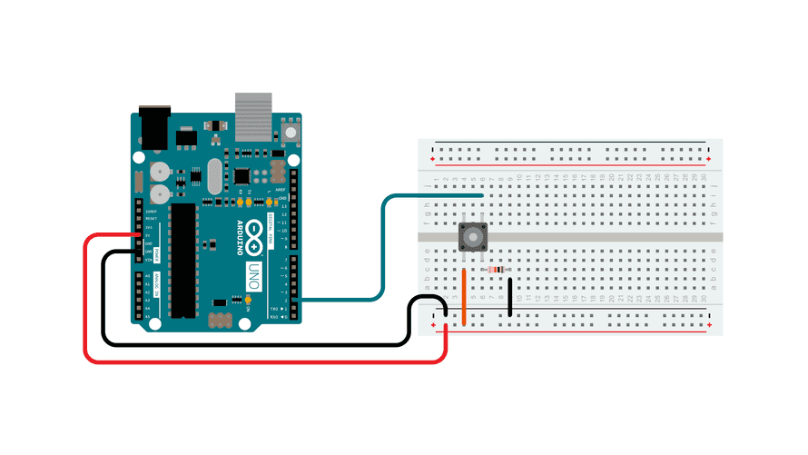
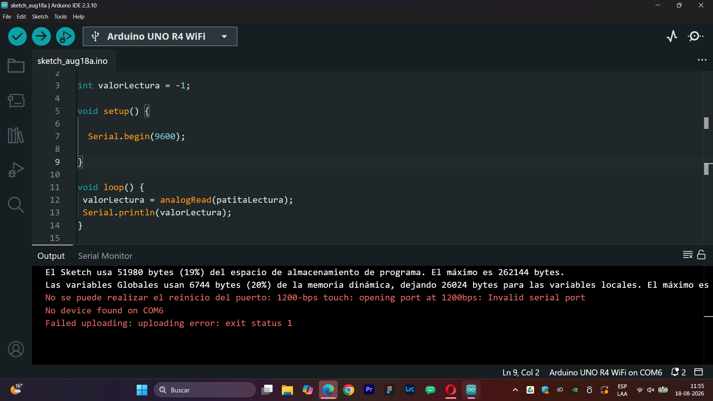

# sesion-02a
martes 18 de agosto

## apuntes sesión
### potenciómetros y botones
**potenciómetro:**

- resistencia variable
- potencia = energía/tiempo
- en electricidad la potencia = voltaje x corriente (acá tiene que haber escondido energía y tiempo)
- el voltaje tiene que ver con energía
- y dentro de corriente hay tiempo
- por lo tanto son comparables
- los potenciómetros nos dejan regular potencias, permitiéndonos variar una propiedad eléctrica que es la resistencia.
- el resistor lo que hace es resistir a que el electrón pase.
- corriente = número de electrones
- voltaje = maneras de medir energía
- la parte variable del potenciómetro es la patita 2, lo que permite mover cualquier valor a una constante

**botón:**

- botones (pulsadores)
- pushbutton: temporales
- toggles: el impulso permanece
- normally open (N.O): el electrón no puede transitar
- normally connected (N.C): siempre conectados, al hacer una acción de presionar se desconecta
- no conectar vcc directamente a gnd, poner un resistor entre ellos para no provocar cortocircuito
- **pulldown:** VCC - BOTÓN - R - LECTURA - GND = 0: no toi, 1: toi
- **pullup:** VCC - R - LECTURA - BOTÓN - GND = 1: no toi, 0: toi

### pushbutton ejemplo


### recomendaciones conexiones arduino / ¿cómo conectar potenciómetros?
- conectar a 5V
- no usar VIN
- lado análogo, solo permite leerlo
- lado digital, es mutante por lo que se puede decidir
- las salidas que tienen Ñ sirven para las salidas de audio
- los potenciómetros se conectan al lado análogo
- conectar 5V y GND a orejas de potenciómetros, y A0 a la nariz de este
- la entrada tiene 10 bits: 2 elevado a 10 = rango [0, 1023]
  
### código para conectar a potenciómetro

```cpp
const int patitaLectura = A0;

int valorLectura = -1;

void setup() {

  Serial.begin(9600);

}

void loop() {
 valorLectura = analogRead(patitaLectura);
 Serial.println(valorLectura);
}
```

al correr el código y mover la perilla al máximo, tuvimos un error que aparece a continuación, no entendemos por qué pasó, pero al cerrar y volver abrir el archivo, e intentarlo nuevamente, volvió a funcionar.




## encargos


## lectura
he podido avanzar harto con el libro, voy en la página 62, ya que al ser conversaciones se hace ligero de leer, aunque sus temáticas sean un poco densas. son una serie de entrevistas hechas por distintas personas al artista ai weiwei, donde más allá de su obra he aprendido de las problemáticas que ha abordado principalmente en su vida y luego en su arte, sus problemas con el gobierno chino, la importancia y su lucha por lo derechos humanos y la libertad de expresión.

no tenía idea de que hasta el día de hoy había tanto control sobre las redes sociales, hasta el punto de borrar de todas partes las palabras o personas que estén en contra del régimen, como lo hicieron con ai weiwei y que por eso razón las nuevas generaciones de su país no lo conocen.

respecto a esto tengo una cita, las cuales dejaré traducidas:
 
"evan osnos: es una cosa si el estado censura tu trabajo, pero es otra cosa completamente si la gente empieza a censurar nuestro trabajo

ai weiwei: creo que este argumento es profundo. **el arte es el área en la que uno tiene el derecho de explorar, no necesariamente la idea del bien y del mal, sino plantear preguntas y presentar diferentes posibilidades.** el arte no debería haber sido retirado del espectáculo."

dejaré una recopilación de las citas que he ido encontrando interesantes hasta el punto que he leído:

> solo me quedo en el lado soleado de las redes sociales. ahí hay mucha luz y cosas hermosas y positivas. claro, hay una zona oscura y sombría, pero puedes elegir quedarte en la parte soleada. en la época de los medios tradicionales, no tenías esa opción, así que sigo agradeciendo vivir en esta época.

he tenido siempre una lejanía y una crítica a las redes por el nivel de adicción que causan y cómo fácilmente sin autocontrol me pueden llegar a hacer perder un día con su dinámica de recompensa inmediata, por lo que me chocó escuchar esta opinión desde una perspectiva de alguien que ha vivido la censura y el no poder acceder con libertad a ciertas plataformas, por lo que quizás sea mejor reconocer lo bueno, siempre y cuando sea con control, dejando de demonizarlas tanto.

> creo que si se vuelve perfecto, se volverá peligroso. es mejor que no sea perfecto.

> mi vida no sirve a ningún propósito. trato de valorar todas las oportunidades que se me presentan. además, quiero ver hasta dónde puedo llegar o dejar huella. sin embargo, sé que el tiempo es corto. en un par de minutos nos bajaremos de este escenario y estaré pensando en algo más.

> _(respecto a una pregunta sobre redes sociales)_ este es un problema real. la gente joven suele tomar rápidamente toda la información sin darse el tiempo de digerirla. todo este conocimiento o información puede no tener ninguna emoción o experiencia ligada a ella. esta nueva generación o este nuevo ser humano ofrecerá una perspectiva profundamente diferente a la forma de pensar de la generación anterior. no sé si esto será bueno o malo, pero tendrá un nuevo carácter. si ves a los universitarios hoy en día, rara vez ves a alguien trabajando duro o escribiendo o leyendo como antes. es muy fácil para la gente obtener cualquier tipo de información que deseen sin tener que desarrollar ningún tipo de pensamientos profundos.

**extra - recomendación de libro:** https://martingubbins.cl/wp-content/uploads/2018/06/Fuentes-del-Derecho.pdf

