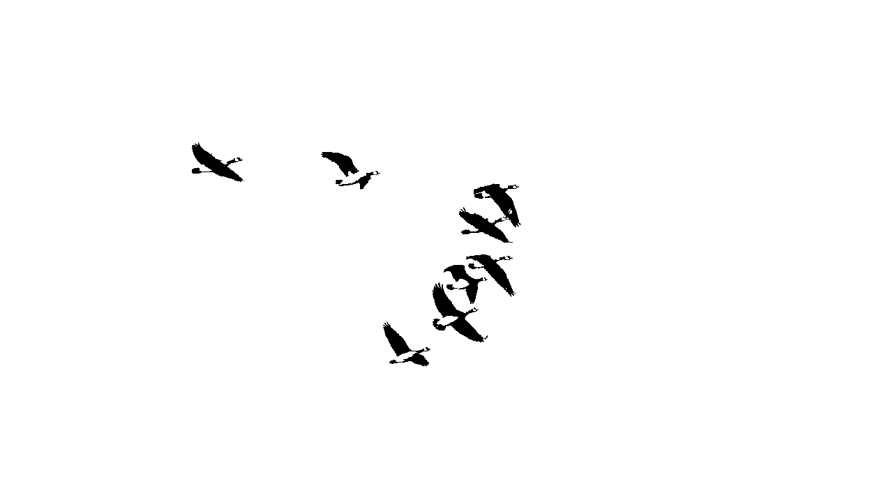

# sesion-03b
viernes 28 de agosto

**conversación pre-clase**
- tomarse con importancia las licencias de derechos de autor
- revisar fundación derechos digitales
- licencia creative commons: permite usar cualquier tipo de cosa/archivo siempre y cuando se mencione quien lo hizo, busca promover la visibilidad y la reputación, es un conjunto de tipos de licencia y sus diversos tipos tienen distintas reglas
- licencia anticapitalista: de uso libre para individuos sin fines de lucro.
- los libros de la mujer rota
- busqué la licencia del poema que estamos usando: wild geese/gansos salvajes de mary oliver, ya que falleció el 2019 y su obra aún no prescribe al dominio público.
    - **titularidad:** los derechos de la obra pertenecen legalmente a la herencia (estate) de mary oliver o a sus editores oficiales (como beacon press).
    - **uso no autorizado:** no se puede reproducir, republicar comercialmente ni utilizar el poema completo sin el consentimiento por escrito de los titulares de los derechos.
    - **uso educativo o personal:** citar fragmentos cortos para fines educativos, reseñas o análisis suele considerarse uso justo (fair use), pero copiar el poema entero en sitios web, libros o antologías requiere un permiso formal.
- artful design libro
- pablo irarrázaval
  
## apuntes sesión
### string
- seguidilla de mostacillas (caracteres)
- en C no existían los `string`, en C++ es menos latero
- recomendación: hacer el código en C++ más general, no tan específico de arduino
- cuando algo tiene mayúscula es una clase: `String`
- profundizar en el lenguaje acá: https://docs.arduino.cc/language-reference/en/variables/data-types/int/

#### ¿cómo hacer `strings` en arduino?
  
- poner comillas dobles para palabras.
- con comillas simples, si es solo un carácter.
- por lo tanto más de un carácter se convierte en un string (conjunto de caracteres).
  
```cpp
String thisString = String (13);
```

    
- primero va el tipo de dato, luego el nombre que le coloquemos, "en ese lugar hazme un `string` donde quepan 13 caracteres".
- hay que decirle cuánto va a medir, o decir es igual a "sopaipilla" y leerá cuántos caracteres.
- ejemplos de cómo se puede usar:
  
```cpp
String stringOne = "Hello String";                    // using a constant String
String stringOne = String('a');                       // converting a constant char into a String
String stringTwo = String("This is a string");        // converting a constant string into a String object
String stringOne = String(stringTwo + " with more");  // concatenating two strings
String stringOne = String(13);                        // using a constant integer
String stringOne = String(analogRead(0), DEC);        // using an int and a base
String stringOne = String(45, HEX);                   // using an int and a base (hexadecimal)
String stringOne = String(255, BIN);                  // using an int and a base (binary)
String stringOne = String(millis(), DEC);             // using a long and a base
String stringOne = String(5.698, 3);                  // using a float and the decimal places
```

- arreglo de caracteres

```cpp
char Str4[8] = "arduino";
```
- corchete implica un arreglo, acá significa que van a haber varios caracteres.

#### ejemplo con edades
```cpp
int edadAaron = 37;
int edadSeba = 22;
int edadEmi = 24;
```
- mal hecho!! se hace así

```cpp
//declarar
int edades [36];

edad = {
  21,
  21,
  22
}
```
o
```cpp
// declaracion de arreglo de enteros
// que se llama edades
int edades[3] = { 37, 22, 24 };

void setup() {
  Serial.begin(9600);
}

void loop() {
  Serial.print(edades[0]);
  Serial.print(", ");
  Serial.print(edades[1]);
  Serial.print(", ");
  Serial.println(edades[2]);
}

```

#### ejemplo nombres

```cpp
// bah que raro
// con 5 no funciono
char nombre[6] = "aaron";

void setup() {
  Serial.begin(9600);
}

void loop() {
  Serial.print(nombre[0]);
  Serial.print(nombre[1]);
  Serial.print(nombre[2]);
  Serial.print(nombre[3]);
  Serial.println(nombre[4]);
}
```
```cpp
// un poemario
// es un arreglo de paginas
// una pagina es un arreglo de lineas
// una linea es un arreglo de caracteres
```

#### ejemplo versos

```cpp
// un poemario
// es un arreglo de paginas
// una pagina es un arreglo de lineas
// una linea es un arreglo de caracteres

char *misVersos[] = {
  "Mami, no te haga' de rogar",
  "No me gustaría perder el tiempo",
  "Que tenemo' pa' poderte tocar",
  "Y estás con otro, esa mierda no lo entiendo, yeah",
  "Que te lo juro, no eres nada pa' mí, te lo juro, ah",};

// bah que raro
// con 5 no funciono
char nombre[6] = "aaron";

void setup() {
  Serial.begin(9600);
}

void loop() {
  Serial.println(misVersos[0]);
}
```
*: pointer o puntero

## trabajo en clases
este día avanzamos todas en paralelo. por una parte, magda y yai definieron el diagrama de flujo para desarrollar nuestra idea de mejor manera; marcela siguió avanzando con el código y yo empecé a ver cómo llevar una animación a código. 

### avance animación
- partí por elegir un video para convertirlo en animación, el cual no tuviera copyright
- se rige bajo la siguiente tipo de licencia de pixabay
    - sujeto a los usos prohibidos (ver abajo), la licencia de contenido permite a los usuarios:
    - ✓ usar el contenido gratis
    - ✓ usar el contenido sin tener que dar crédito al autor (¡aunque dar crédito siempre es apreciado por nuestra comunidad!)
    - ✓ modificar o adaptar el contenido en obras nuevas
- https://pixabay.com/es/videos/ganso-salvaje-aterrizaje-de-gansos-342468/
- luego, en adobe premiere pro edité el video para que quedara muy contrastado en blanco y negro, y seleccioné los frames

- a partir de ese frame, intenté pasarlo a esta página, donde lo convierte a código https://javl.github.io/image2cpp/, pero no funcionaba ya que al tener tan baja la resolución de salida (128x32 px) no se podía distinguir bien la imagen.
- gracias a la ayuda de nuestro ayudante seba, entendí que debía adaptarme a los píxeles de la pantalla y me los dejó delimitados en el programa que estaba usando para editar la imagen (affinity), por lo que ahora debo por lo menos usar solo un ganso volando, que ocupe más espacio, para que en la pantalla se pueda visualizar mejor.

## encargos

encargo-03b:

1. apuntes personales de String, string, array, con bibliografia y con pantallazos de resultados, y dudas textuales.
2. subir código a su bitácora ordenado con el formato de backticks a continuación, del proyecto hasta ahora.
3. definir y escribir el corpus a usar: autora, poemas, licencias, poblarlo en la carpeta 00-proyecto-1

### apuntes extra
#### String
construye una instancia de la clase String. existen múltiples versiones que construyen strings a partir de diferentes tipos de datos (es decir, los formatean como secuencias de caracteres), incluyendo:
- una cadena constante de caracteres, entre comillas dobles (es decir, un arreglo de `char`)
- un único carácter constante, entre comillas simples
- otra instancia del objeto String
- un entero o entero largo constante
- un entero o entero largo constante, usando una base especificada
- una variable de tipo entero o entero largo
- una variable de tipo entero o entero largo, usando una base especificada
- un float o double, usando una cantidad especificada de lugares decimales

#### sintaxis
`String(val)`

`String(val, base)`

`String(val, decimalPlaces)`

### parametros 
- `val`: una variable para formatear como String. tipos de datos permitidos: string char, byte, int, long, unsigned int, unsigned long, float, double.
- `base`: (opcional) la base en la que se formateará un valor entero.
- `decimalPlaces`: solo si `val` es float o double. la cantidad deseada de lugares decimales.

### string
las cadenas de texto se pueden representar de dos maneras. puedes usar el tipo de dato string, o puedes crear una cadena a partir de un arreglo de tipo char y finalizarlo con un carácter nulo.

#### posibilidades para declarar cadenas:

- declarar un arreglo de caracteres sin inicializarlo
- declarar un arreglo de caracteres (con un carácter extra) y el compilador agregará el carácter nulo requerido
- agregar explícitamente el carácter nulo
- inicializar con una cadena constante entre comillas; el compilador ajustará el tamaño del arreglo para que quepa la cadena constante y un carácter nulo de finalización
- inicializar el arreglo con un tamaño explícito y una cadena constante
- inicializar el arreglo, dejando espacio extra para una cadena más grande

#### array de strings

a menudo es conveniente, al trabajar con grandes cantidades de texto, como en un proyecto con una pantalla lcd, configurar un arreglo de cadenas. debido a que las cadenas en sí son arreglos, este es en realidad un ejemplo de un arreglo bidimensional.

en el código a continuación, el asterisco después del tipo de dato char "char*" indica que este es un arreglo de "punteros". todos los nombres de arreglos son en realidad punteros, por lo que esto es necesario para crear un arreglo de arreglos.

#### ejemplo
```cpp
char *myStrings[] = {"This is string 1", "This is string 2", "This is string 3",
                         "This is string 4", "This is string 5", "This is string 6"
                        };

    void setup() {
      Serial.begin(9600);
    }

    void loop() {
      for (int i = 0; i < 6; i++) {
        Serial.println(myStrings[i]);
        delay(500);
      }
    }
```

_fuente: https://docs.arduino.cc/language-reference/en/variables/data-types/stringObject/_

### código

```cpp
#include <SPI.h>
#include <Wire.h>
#include <Adafruit_GFX.h>
#include <Adafruit_SSD1306.h>

#define SCREEN_WIDTH 128 // OLED display width, in pixels
#define SCREEN_HEIGHT 32 // OLED display height, in pixels

// Declaration for an SSD1306 display connected to I2C (SDA, SCL pins)
// The pins for I2C are defined by the Wire-library. 
// On an arduino UNO:       A4(SDA), A5(SCL)
// On an arduino MEGA 2560: 20(SDA), 21(SCL)
// On an arduino LEONARDO:   2(SDA),  3(SCL), ...
#define OLED_RESET     -1 // Reset pin # (or -1 if sharing Arduino reset pin)
#define SCREEN_ADDRESS 0x3C ///< See datasheet for Address; 0x3D for 128x64, 0x3C for 128x32
Adafruit_SSD1306 display(SCREEN_WIDTH, SCREEN_HEIGHT, &Wire, OLED_RESET);

#define NUMFLAKES     10 // Number of snowflakes in the animation example

#define LOGO_HEIGHT   16
#define LOGO_WIDTH    16
static const unsigned char PROGMEM logo_bmp[] =
{ 0b00000000, 0b11000000,
  0b00000001, 0b11000000,
  0b00000001, 0b11000000,
  0b00000011, 0b11100000,
  0b11110011, 0b11100000,
  0b11111110, 0b11111000,
  0b01111110, 0b11111111,
  0b00110011, 0b10011111,
  0b00011111, 0b11111100,
  0b00001101, 0b01110000,
  0b00011011, 0b10100000,
  0b00111111, 0b11100000,
  0b00111111, 0b11110000,
  0b01111100, 0b11110000,
  0b01110000, 0b01110000,
  0b00000000, 0b00110000 };

void setup() {
  Serial.begin(9600);

  // Wait for display
  delay(500);

  // SSD1306_SWITCHCAPVCC = generate display voltage from 3.3V internally
  if(!display.begin(SSD1306_SWITCHCAPVCC, SCREEN_ADDRESS)) {
    Serial.println(F("SSD1306 allocation failed"));
    for(;;); // Don't proceed, loop forever
  }

  // Show initial display buffer contents on the screen --
  // the library initializes this with an Adafruit splash screen.
  display.display();
  delay(2000); // Pause for 2 seconds

  // Clear the buffer
  display.clearDisplay();

  // Draw a single pixel in white
  display.drawPixel(10, 10, SSD1306_WHITE);

  // Show the display buffer on the screen. You MUST call display() after
  // drawing commands to make them visible on screen!
  display.display();
  delay(2000);
  // display.display() is NOT necessary after every single drawing command,
  // unless that's what you want...rather, you can batch up a bunch of
  // drawing operations and then update the screen all at once by calling
  // display.display(). These examples demonstrate both approaches...

  testscrolltext();    // Draw scrolling text
}

void loop() {
}

void testdrawline() {
  int16_t i;

  display.clearDisplay(); // Clear display buffer

  for(i=0; i<display.width(); i+=4) {
    display.drawLine(0, 0, i, display.height()-1, SSD1306_WHITE);
    display.display(); // Update screen with each newly-drawn line
    delay(1);
  }
  for(i=0; i<display.height(); i+=4) {
    display.drawLine(0, 0, display.width()-1, i, SSD1306_WHITE);
    display.display();
    delay(1);
  }
  delay(250);

  display.clearDisplay();

  for(i=0; i<display.width(); i+=4) {
    display.drawLine(0, display.height()-1, i, 0, SSD1306_WHITE);
    display.display();
    delay(1);
  }
  for(i=display.height()-1; i>=0; i-=4) {
    display.drawLine(0, display.height()-1, display.width()-1, i, SSD1306_WHITE);
    display.display();
    delay(1);
  }
  delay(250);

  display.clearDisplay();

  for(i=display.width()-1; i>=0; i-=4) {
    display.drawLine(display.width()-1, display.height()-1, i, 0, SSD1306_WHITE);
    display.display();
    delay(1);
  }
  for(i=display.height()-1; i>=0; i-=4) {
    display.drawLine(display.width()-1, display.height()-1, 0, i, SSD1306_WHITE);
    display.display();
    delay(1);
  }
  delay(250);

  display.clearDisplay();

  for(i=0; i<display.height(); i+=4) {
    display.drawLine(display.width()-1, 0, 0, i, SSD1306_WHITE);
    display.display();
    delay(1);
  }
  for(i=0; i<display.width(); i+=4) {
    display.drawLine(display.width()-1, 0, i, display.height()-1, SSD1306_WHITE);
    display.display();
    delay(1);
  }

  delay(2000); // Pause for 2 seconds
}

void testdrawrect(void) {
  display.clearDisplay();

  for(int16_t i=0; i<display.height()/2; i+=2) {
    display.drawRect(i, i, display.width()-2*i, display.height()-2*i, SSD1306_WHITE);
    display.display(); // Update screen with each newly-drawn rectangle
    delay(1);
  }

  delay(2000);
}

void testfillrect(void) {
  display.clearDisplay();

  for(int16_t i=0; i<display.height()/2; i+=3) {
    // The INVERSE color is used so rectangles alternate white/black
    display.fillRect(i, i, display.width()-i*2, display.height()-i*2, SSD1306_INVERSE);
    display.display(); // Update screen with each newly-drawn rectangle
    delay(1);
  }

  delay(2000);
}

void testdrawcircle(void) {
  display.clearDisplay();

  for(int16_t i=0; i<max(display.width(),display.height())/2; i+=2) {
    display.drawCircle(display.width()/2, display.height()/2, i, SSD1306_WHITE);
    display.display();
    delay(1);
  }

  delay(2000);
}

void testfillcircle(void) {
  display.clearDisplay();

  for(int16_t i=max(display.width(),display.height())/2; i>0; i-=3) {
    // The INVERSE color is used so circles alternate white/black
    display.fillCircle(display.width() / 2, display.height() / 2, i, SSD1306_INVERSE);
    display.display(); // Update screen with each newly-drawn circle
    delay(1);
  }

  delay(2000);
}

void testdrawroundrect(void) {
  display.clearDisplay();

  for(int16_t i=0; i<display.height()/2-2; i+=2) {
    display.drawRoundRect(i, i, display.width()-2*i, display.height()-2*i,
      display.height()/4, SSD1306_WHITE);
    display.display();
    delay(1);
  }

  delay(2000);
}

void testfillroundrect(void) {
  display.clearDisplay();

  for(int16_t i=0; i<display.height()/2-2; i+=2) {
    // The INVERSE color is used so round-rects alternate white/black
    display.fillRoundRect(i, i, display.width()-2*i, display.height()-2*i,
      display.height()/4, SSD1306_INVERSE);
    display.display();
    delay(1);
  }

  delay(2000);
}

void testdrawtriangle(void) {
  display.clearDisplay();

  for(int16_t i=0; i<max(display.width(),display.height())/2; i+=5) {
    display.drawTriangle(
      display.width()/2  , display.height()/2-i,
      display.width()/2-i, display.height()/2+i,
      display.width()/2+i, display.height()/2+i, SSD1306_WHITE);
    display.display();
    delay(1);
  }

  delay(2000);
}

void testfilltriangle(void) {
  display.clearDisplay();

  for(int16_t i=max(display.width(),display.height())/2; i>0; i-=5) {
    // The INVERSE color is used so triangles alternate white/black
    display.fillTriangle(
      display.width()/2  , display.height()/2-i,
      display.width()/2-i, display.height()/2+i,
      display.width()/2+i, display.height()/2+i, SSD1306_INVERSE);
    display.display();
    delay(1);
  }

  delay(2000);
}

void testdrawchar(void) {
  display.clearDisplay();

  display.setTextSize(1);      // Normal 1:1 pixel scale
  display.setTextColor(SSD1306_WHITE); // Draw white text
  display.setCursor(0, 0);     // Start at top-left corner
  display.cp437(true);         // Use full 256 char 'Code Page 437' font

  // Not all the characters will fit on the display. This is normal.
  // Library will draw what it can and the rest will be clipped.
  for(int16_t i=0; i<256; i++) {
    if(i == '\n') display.write(' ');
    else          display.write(i);
  }

  display.display();
  delay(2000);
}

void testdrawstyles(void) {
  display.clearDisplay();

  display.setTextSize(1);             // Normal 1:1 pixel scale
  display.setTextColor(SSD1306_WHITE);        // Draw white text
  display.setCursor(0,0);             // Start at top-left corner
  display.println(F("Hello, world!"));

  display.setTextColor(SSD1306_BLACK, SSD1306_WHITE); // Draw 'inverse' text
  display.println(3.141592);

  display.setTextSize(2);             // Draw 2X-scale text
  display.setTextColor(SSD1306_WHITE);
  display.print(F("0x")); display.println(0xDEADBEEF, HEX);

  display.display();
  delay(2000);
}

void testscrolltext(void) {
  
 display.setTextSize(1); // Draw 2X-scale text
  display.setTextColor(SSD1306_WHITE);

  // primer verso 
  display.setCursor(10, 0);
  display.println(F("No tienes")); // primera linea de texto
  display.setCursor(0, 10);
  display.println(F("que ser buena.")); // segunda linea de texto
 
  display.display();      // Show initial text
  delay(2500);

  // borrar primer verso
  display.clearDisplay();

  // segundo verso parte 1
  display.setCursor(0, 0);
  display.println(F("No tienes que"));
  display.setCursor(0, 10);
  display.println(F("recorrer el"));
  display.setCursor(0, 20);
  display.println(F("desierto de"));

  display.display();
  delay(2500);

  // borrar el segundo verso parte 1
  display.clearDisplay();

  // segundo verso parte 2
  display.setCursor(0, 0);
  display.println(F("rodillas,"));
  display.setCursor(0, 10);
  display.println(F("arrepitiendote."));

  display.display();
  delay(2500);

  // borrar el segundo verso
  display.clearDisplay();

  // tercer verso parte 1
  display.setCursor(0, 0);
  display.println(F("Solo deja que"));
  display.setCursor(0, 10);
  display.println(F("el suave animal"));
  
  display.display();
  delay(2500);

  // borrar tercer verso parte 1
  display.clearDisplay();

  // tercer verso parte 2
  display.setCursor(0, 0);
  display.println(F("de tu cuerpo"));
  display.setCursor(0, 10);
  display.println(F("ame lo que ama."));

  display.display();
  delay(2500);

  // borrar cuarto verso
  display.clearDisplay();

  // cuarto verso parte 1
  display.setCursor(0, 0);
  display.println(F("Hablame del dolor,"));
  display.setCursor(0, 10);
  display.println(F("del tuyo,"));
  display.setCursor(0, 20);
  display.println(F("yo te hablare del mio."));
  
  display.display();
  delay(2500);

  // borrar el cuarto verso
  display.clearDisplay();

  // quiento verso 
  display.setCursor(0, 0);
  display.println(F("Mientras tanto,"));
  display.setCursor(0, 10);
  display.println(F("el mundo sigue."));

  display.display();
  delay(2500);

}

#define XPOS   0 // Indexes into the 'icons' array in function below
#define YPOS   1
#define DELTAY 2

void testanimate(const uint8_t *bitmap, uint8_t w, uint8_t h) {
  int8_t f, icons[NUMFLAKES][3];

  // Initialize 'snowflake' positions
  for(f=0; f< NUMFLAKES; f++) {
    icons[f][XPOS]   = random(1 - LOGO_WIDTH, display.width());
    icons[f][YPOS]   = -LOGO_HEIGHT;
    icons[f][DELTAY] = random(1, 6);
    Serial.print(F("x: "));
    Serial.print(icons[f][XPOS], DEC);
    Serial.print(F(" y: "));
    Serial.print(icons[f][YPOS], DEC);
    Serial.print(F(" dy: "));
    Serial.println(icons[f][DELTAY], DEC);
  }

  for(;;) { // Loop forever...
    display.clearDisplay(); // Clear the display buffer

    // Draw each snowflake:
    for(f=0; f< NUMFLAKES; f++) {
      display.drawBitmap(icons[f][XPOS], icons[f][YPOS], bitmap, w, h, SSD1306_WHITE);
    }

    display.display(); // Show the display buffer on the screen
    delay(200);        // Pause for 1/10 second

    // Then update coordinates of each flake...
    for(f=0; f< NUMFLAKES; f++) {
      icons[f][YPOS] += icons[f][DELTAY];
      // If snowflake is off the bottom of the screen...
      if (icons[f][YPOS] >= display.height()) {
        // Reinitialize to a random position, just off the top
        icons[f][XPOS]   = random(1 - LOGO_WIDTH, display.width());
        icons[f][YPOS]   = -LOGO_HEIGHT;
        icons[f][DELTAY] = random(1, 6);
      }
    }
  }
}
```

## lectura

