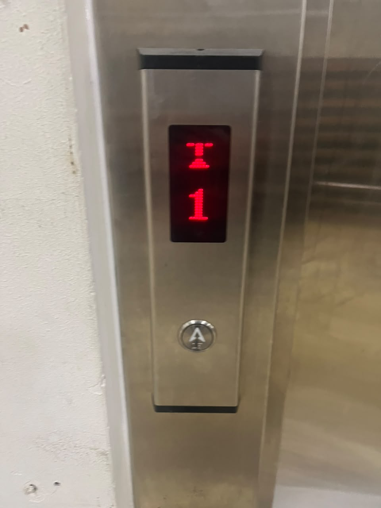
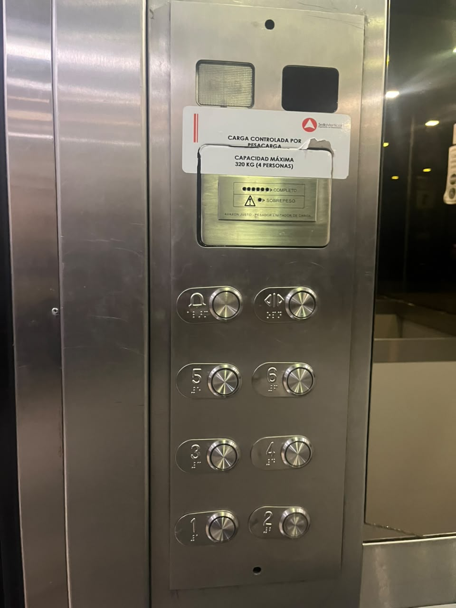
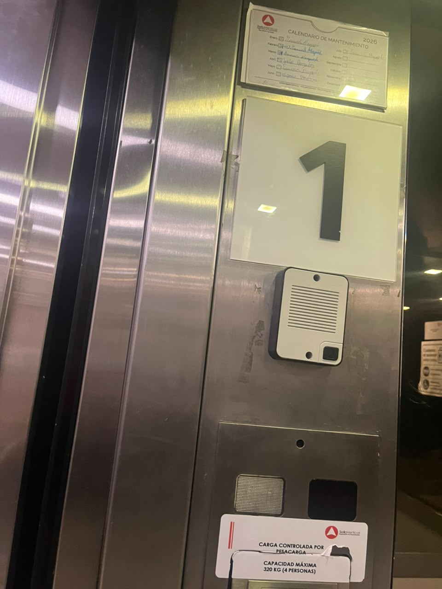
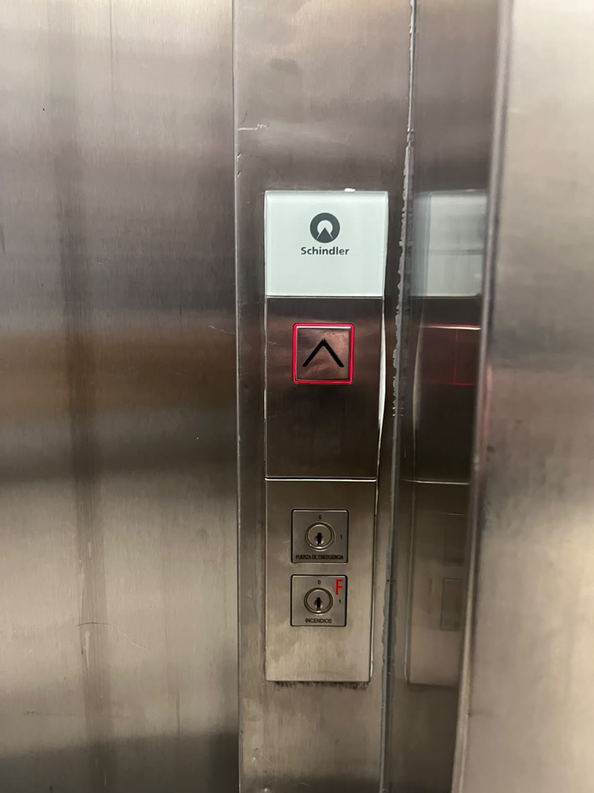
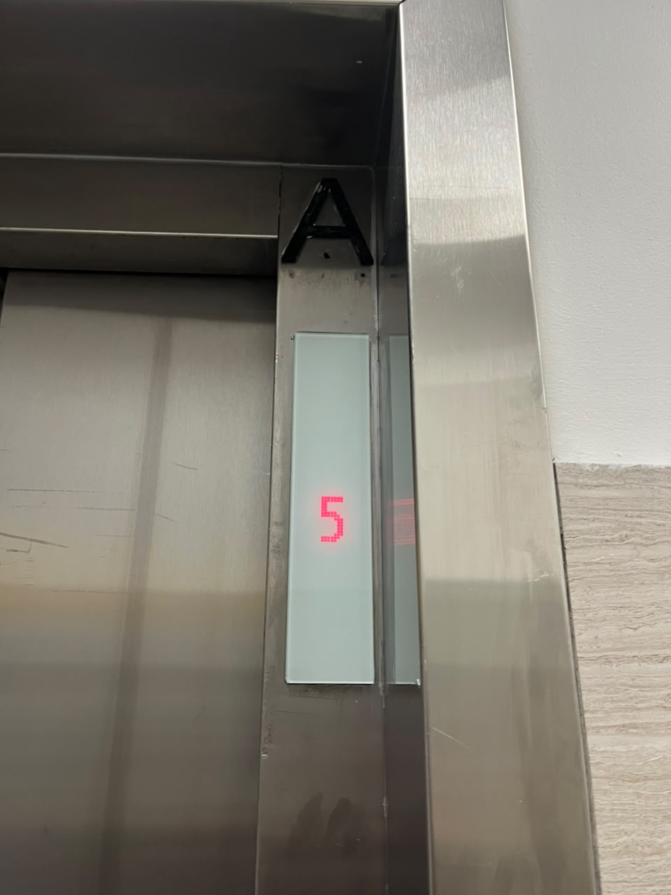
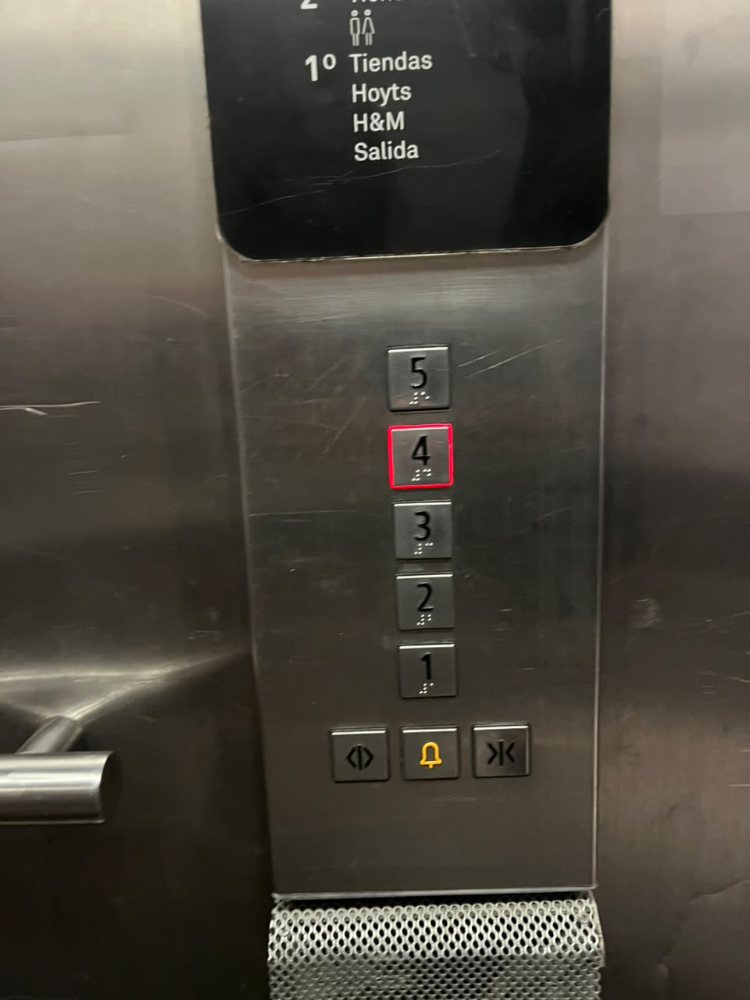
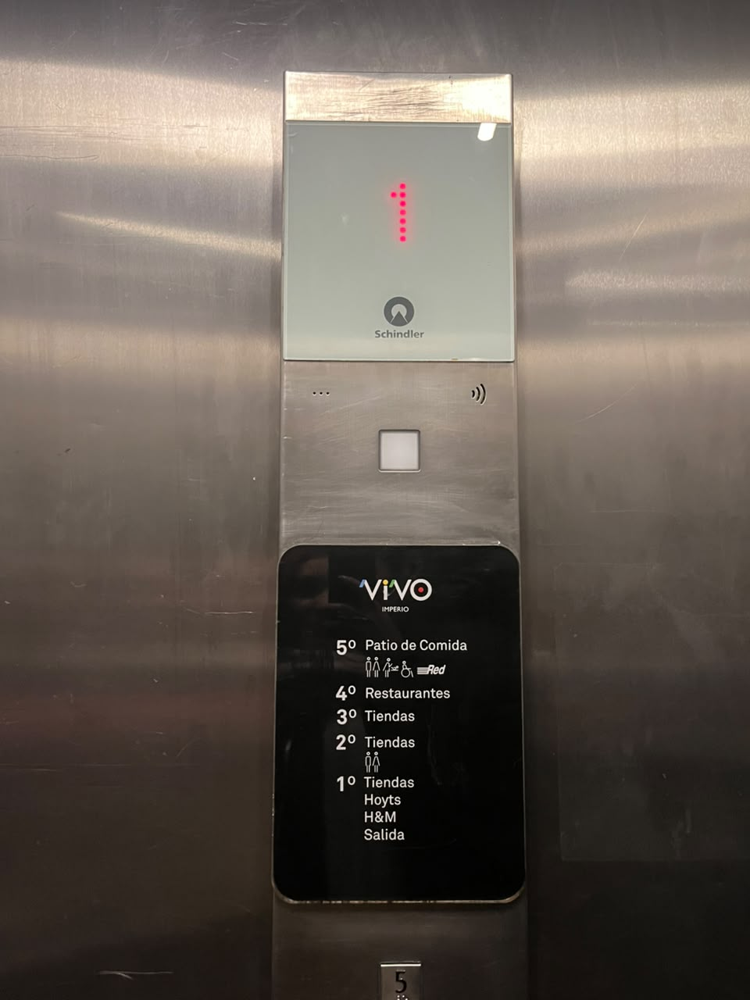
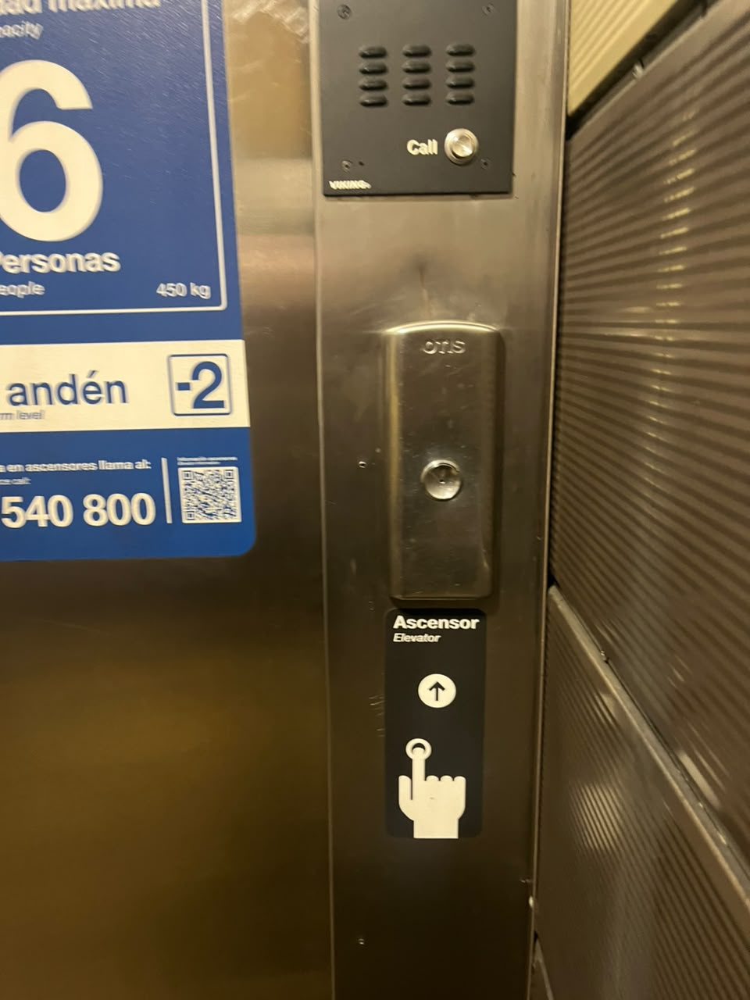
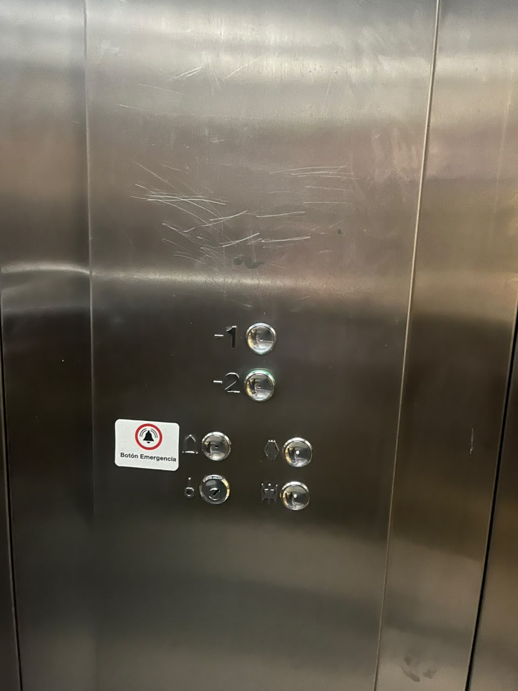
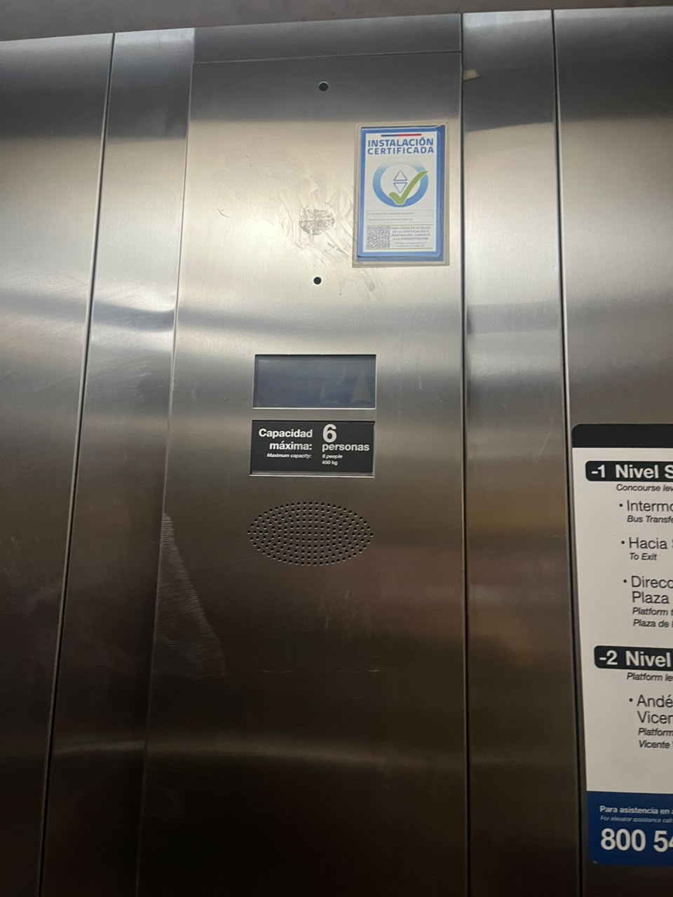

# sesion-00b

## apuntes sesión

En esta sesión Aarón hizo una introducción al ramo, se presentaron los profesores y alumnos.

## encargos

### Ascensores

Ascensor ubicado en la Facultad de Salud y Odontología de la Universidad Diego Portales, Manuel Rodríguez 253. Utilizado para subir 6 pisos. 

En la botonera sobresaliente de la puerta exterior del piso 1 tiene un único botón con una flecha en dirección hacia arriba y bajo está en braille la palabra “subir”, en la pantalla ubicada arriba del botón hay una animación de una flecha subiendo porque ese es el movimiento que hará el ascensor y un número que indica el piso en el que se encuentra este mismo.

En el interior del ascensor hay un panel con una  botonera con 8 botones en la parte inferior, arriba de esto hay una placa que indica el no sobrecargar el ascensor, para eso hay pequeñas luces que indican la capacidad actual del ascensor, sobre esto a la izquierda hay una luz de emergencia y ala derecha una pantalla que indica el piso en el que está el ascensor. La botonera inferior enumera los pisos en dos columnas de abajo hacia arriba de izquierda a derecha, cada piso tiene su botón y al lado izquierdo el número correspondiente más la traducción en braille, los otros dos botones restantes en la parte superior son el botón de emergencia y el botón de abrir o cerrar puertas.

---

Ascensor ubicado en el Mall Imperio Vivo, Santiago Centro, ascensor para 5 pisos.

En la botonera exterior, tiene en la parte superior un botón con una flecha que indica subir con un marco cuadrado de luz roja cuando está marcado el botón. En la parte inferior hay dos cerraduras una arriba de otra. Arriba de esta botonera hay una pantalla blanca con un número en luz roja que e indica el piso en donde se encuentra el ascensor.

En el interior del ascensor hay un panel que en la parte superior tiene una pantalla blanca que indica con un número en luz roja donde en que piso se encuentra el ascensor, debajo de esto hay un botón de emergencia que no tiene ninguna indicación, bajo a esto hay un indicador de los pisos y qué tiendas hay en ese piso, bajo a esto está la botonera de los pisos, dispuestos en una fila desde el 5 al 1 con su respectivo braille, con un marco cuadrado de luz roja cuando el botón está seleccionado, bajo a esto hay tres botones uno a l lado del otro para abrir puertas, emergencia y cerrar puertas.

Este ascensor tiene un diseño simple y claro de entender, gracias a el uso de luz roja que destaca la información importante.

---

Ascensor ubicado en el metro Del Sol, Maipú, para dos pisos subterráneos.

En la botonera exterior tiene un único botón redondo para llamar el ascensor, y tiene un diagrama con la traducción de ascensor y un icono que indica apretar el botón para subir. A pesar de ser un ascensor para transporte público, no tiene braille.

En la botonera interior tiene de arriba hacia abajo 
tiene primero el botón para el piso -1 y bajo a este el botón del piso -2, bajo a esto hay dos columnas de botones, en la primera columna está el botón de emergencia, en la otra columna el botón para abrir y cerrar puertas.

