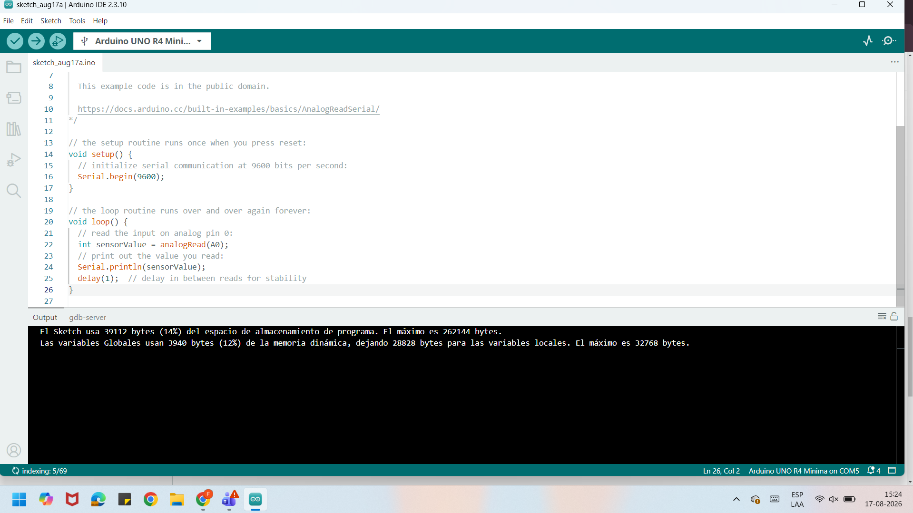
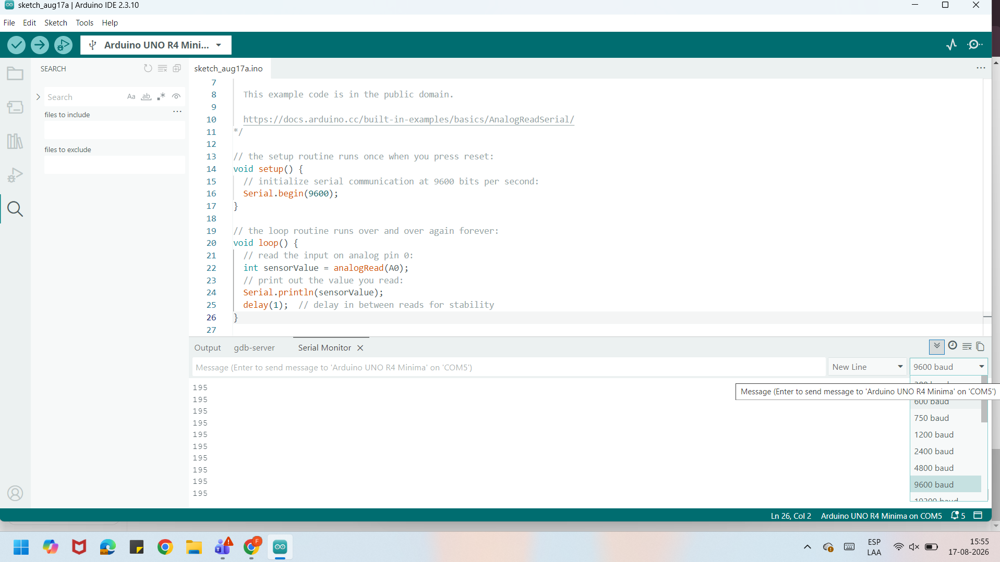

# sesion-01b

## apuntes sesión

variable de color favorito
wolframalpha pow(2,24) de bits para aproximadamente 10 millones de valores posibles
8 bits son 1 byte MB de bytes, Mb de bits
1 bytes tiene 2 nibbles , 2 pedacitos
0101 1101 rojo
1010 1001 verde
1011 0011 azul
en 1 nibble 
El hexadecimal es una manera de contar del 1 al 15 en una casilla: informacion de 0 a f (1-9)=1-9, (10-15)= (A-F)

color favorito de kristel: azul 00/00/ff cada dos números son 4 bit, nada rojo, nada verde, todo azul

formatear para entregar con factura “auto formateo”
; significa que terminé

cuando falta un murciélago se corre y no queda pegado el texto al borde

funciones

void cumplirAnhosKristel() {

función para sumar números enteros
int sumarEnteros(int x, int y) {
hay que darle dos parámetros para que funcione, primero hay que declara un resultado, solo se puede hacer una vez, “int” se usa para declarar 

cómo usar arduino
asegurarse que la placa seleccionada es la que vamos a usar
pagina: docs.arduino.cc/built-in-examples para buscar ejemplos 

declarar los conceptos y códigos que usaremos más adelante

## encargos

encargo01b:

1. tratar de correr un código en el microcontrolador asignado a cada dupla, incluir referentes, citas, comentarios, imágenes, descripciones textuales, y en caso de éxito o fracaso incluir aciertos, preguntas, dramas, atados. recordatorio que estos apuntes son personales, cada persona sube su versión.

prueba de codigos

El primer código que usé pensé que no habia funcionado por el texto que aparecía abajo, pensé que el arduino r4 no procesaba la información, entonces decidí probar con otro código.

Luego probamos con otro, pasó exactamente lo mismo, entonces decidimos usar la ayuda de la inteligencia artificial y ahí nos dimos cuenta de que en realidad estaba funcionando bien el código pero no estaba entendiendo como usar el arduino.

Para el arduino r4 minima usamos dos códigos, uno que enviá numeros desde el A0 al computador y otro codigo que enciende y apaga el led del arduino.

Codigo de numeros desde el A0:

/*
  AnalogReadSerial

  Reads an analog input on pin 0, prints the result to the Serial Monitor.
  Graphical representation is available using Serial Plotter (Tools > Serial Plotter menu).
  Attach the center pin of a potentiometer to pin A0, and the outside pins to +5V and ground.

  This example code is in the public domain.

  https://docs.arduino.cc/built-in-examples/basics/AnalogReadSerial/
*/

// the setup routine runs once when you press reset:
void setup() {
  // initialize serial communication at 9600 bits per second:
  Serial.begin(9600);
}

// the loop routine runs over and over again forever:
void loop() {
  // read the input on analog pin 0:
  int sensorValue = analogRead(A0);
  // print out the value you read:
  Serial.println(sensorValue);
  delay(1);  // delay in between reads for stability
}

 
Funcionó bien y no hubo mayor dificultad más que en encontrar el panel donde se veía la secuencia de los números. 
En el otro código lo elegimos porque queríamos ver algo que fuera visible físicamente. El problema que tuvimos con este fue que al principio no andaba el código porque la página no reconocía el dispositivo, tuvimos que desconectar, esperar y volver a conectar y seleccionar el arduino. Luego de eso funcionó bien y fue interesante ver que a través de un código respondiera en el arduino.

Código luz led:

void setup() {
  pinMode(LED_BUILTIN, OUTPUT);
}

void loop() {
  digitalWrite(LED_BUILTIN, HIGH);
  delay(1000);
  digitalWrite(LED_BUILTIN, LOW);
  delay(1000);
}

2. proponer una función con nombre, tipo, argumentos y uso, que modele algún área de su interés, por ejemplo subirCerro(enBicicleta), tomarMetro(conPaseEscolar), etc. escribir en pseudocódigo los pasos que necesita esa función internamente para que literalmente funcione.

FUNCIÓN irAEntrenamiento(día, hora, lugar)

    revisar el día del entrenamiento
    revisar la hora del entrenamiento
    preparar ropa deportiva
    preparar botella de agua
    preparar mochila
    calcular cuánto demora el viaje
    salir de la casa
    tomar transporte
    llegar al lugar
    cambiarse de ropa
    comenzar entrenamiento

FIN FUNCIÓN

## lectura being digital, Nicholas Negroponte

En las primeras páginas de este libro, Negroponte habla de los átomos y bits, explicando que los átomos son todos los objetos físicos que requieren de transporte o algun costo, y los bits son mas instantáneos y económicos. Menciona que la economía de la sociedad se está volviendo cada vez más digital. La digitalización esta cambiando muchos aspectos de nuestra vida como la educación, las relaciones sociales, los medios de comunicación, etc. Y plantea que la mayor diferencia es entre quienes crecieron con tecnología y quienes se tuvieron que adaptar a esta. Luego habla de que los bits son la unidad básica de información digital porque pueden ser imagenes, sonidos, videos, etc.

Cita 1: "The change from atoms to bits is irrevocable and unstoppable. Why now? Because the change is also exponential--small differences of yesterday can have suddenly shockink consequences tomorrow."

La palabra irrevocable es lo que destaco de esta frase, ya que la digitalización cada vez avanza más, esto cambia significativamente nuestro estilo de vida, y una vez se implementan estos cambios, rara vez se vuelve atrás.

Cita 2: "Both are being taken for granted by children uy adults don't think about air (until it is missing).
Computing is not about computers any more. It is about living."

La tecnología está tan incorporada a nuestras vidas que la damos por sentada, las nuevas generaciones están acostumbradas a esto porque no saben lo que es vivir sin la tecnología pero las generaciones mayores pueden notar el avance tecnológico que ha tenido la sociedad. Y esto habla de la brecha generacional que existe en base a quienes crecieron considerando la tecnología como parte natural de su vida.
