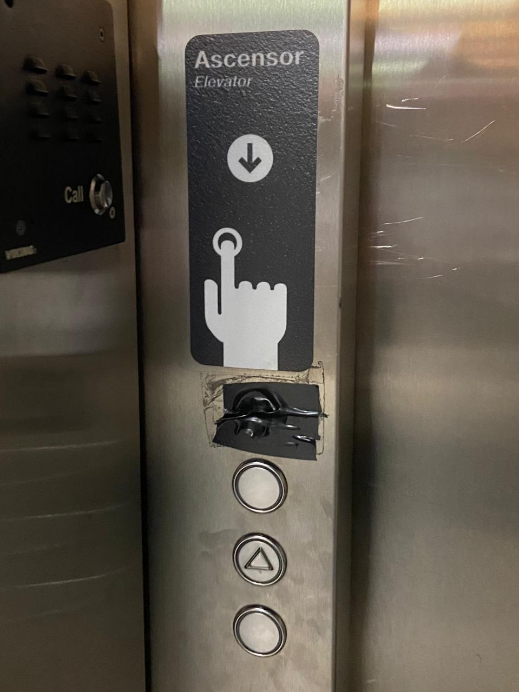
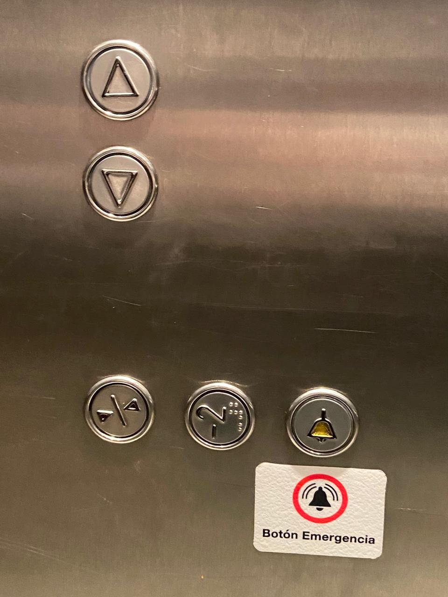
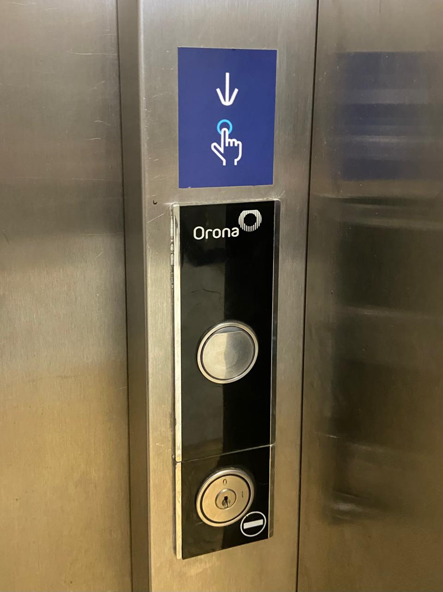
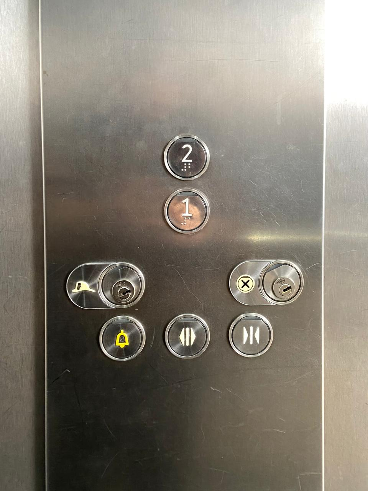
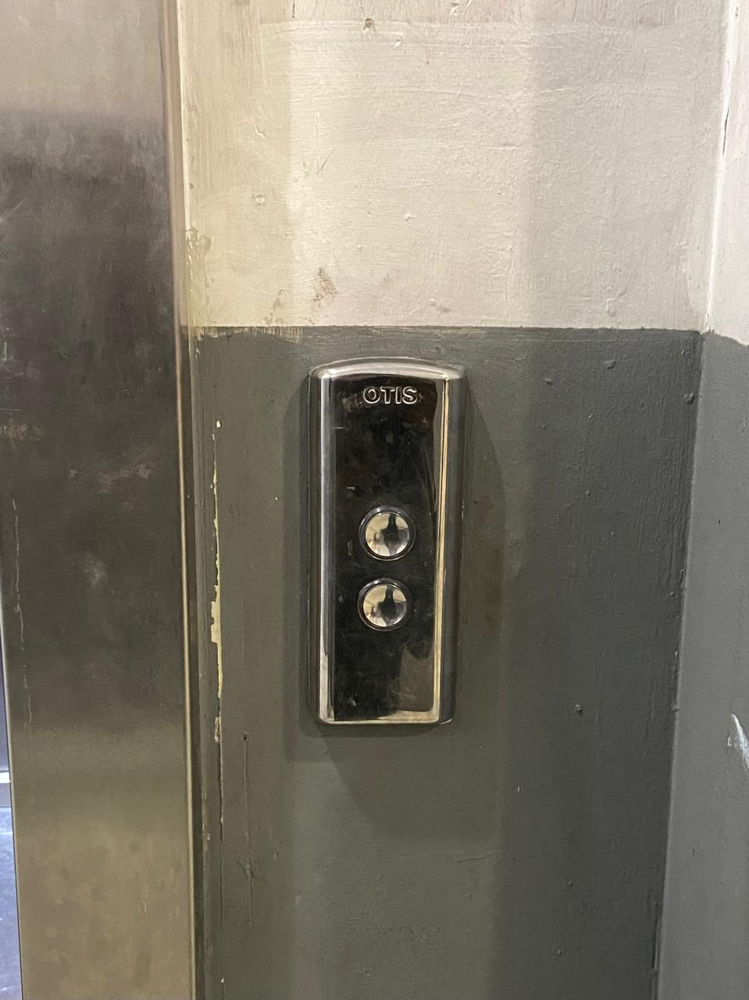

# sesion-00b

## apuntes sesión

## encargos

Analizar y sacar fotos a 3 botoneras de ascensores.

Para este encargo tomé fotos de los ascensores de los lugares que recorro todos los días:

1. ascensor del metro república
2. ascensor del metrotren estación san bernardo
3. ascensor de arauco estación

Ascensor 1

En la botonera exterior se logran ver 3 botones disponibles y al parecer hay un cuarto que está tapado con cinta aislante. El botón del medio de los disponibles tiene un símbolo con una flecha que apunta hacia arriba para que el ascensor suba y los otros 2 no entiendo para que sirven.

En cuanto a la botonera interior se encuentran 5 botones: 2 que indican en que dirección quieres ir, este ascensor tiene 2 niveles principales por lo que por cada nivel solo existe una opción, o bajar o subir. Y los otros tres indican: cierre de puertas en el botón de la izquierda, el botón siguiente del medio indica un nivel -2, que deduzco que claramente no es el principal sino que alguno para el personal quizás, y por último el botón ubicado a la derecha es para emergencias.

Ascensor 2 

Esta botonera exterior presenta tan solo 1 botón, que es para llamar al ascensor, así de simple.

La botonera interior indica los dos niveles, además de un botón de emergencia, y otros 2 para abrir y cerrar puertas.

Ascensor 3

Este ascensor contiene una botonera exterior con 2 botones, ninguno indica cual es la función de cada uno, pero se usa por deducción que el de arriba es para subir y el de abajo para bajar

La botonera interior tiene 4 botones de los niveles, un botón de emergencia, y dos botones para abrir y cerrar puertas.

## lectura
