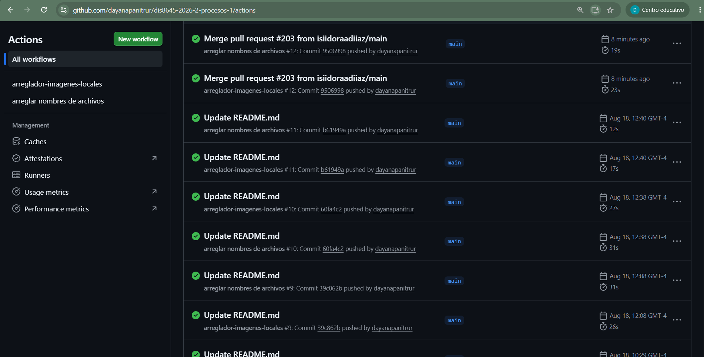
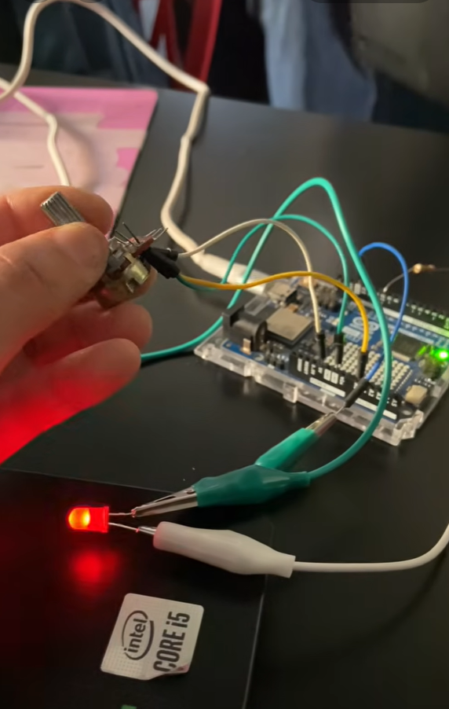

# sesion-02a

## apuntes sesión

* Manuela Infante (teatro chileno)

* Trabajar en destruir la superficiallidad

la primera mitad de la clase se hablará de:

- teoria/pizarra potenciometros y botones

- visual studio code

- dramas github

y en la segunda mitad:

programar potenciómetros y botones

Aprenderemos a como controlar ciertos parámetros de estos componentes: 

¿qué es un potenciómetro?
algo que regula la potencia

¿qué es la potencia? rapidez con la que se usa o se transfiere la energía a lo largo del tiempo

una ecuación:

P = E / t

* no nos va a importar tanto el tiempo, sino la energía

-un circuito es un camino en el que transita corriente y la corriente es un flujo de electrones

El potenciómtro es una interfaz que si abstraemos es capaz de varear un valor de resistencia entre una constante.

Hay cierto tipo de perillas: encoders, pero no son potenciómetros.

En caso de potenciómetros de tipo A o B:

En el caso de los potenciómetros tipo A:

*Son logarítmicos

*Nuestro oído es logarítmico

*A (de audio) es una exponente, entonces:

*Para que algo suene el doble, tiene que ser 10 veces el original

*B son lineales

*Significa que en un punto u otro la resistencia varía en la misma medida.

Este semestre usaremos potenciómetros lineales.

Botones:

existen botones pulsadores (pushbutton) y temporales

-dentro de los pushbutton nos podemos encontrar con 2 tipos:

N.O. = normalmente abierto

N.C = normalmente cerrado

Para que no quemar el circuito los 5v nunca van conectados dierectamente a tierra. Para eso se utiliza una resistencia.

La lectura debe estar en un lugar variable.

Esa resistencia que está ubicada abajo del switch llegando a tierra se llama resistor "pulldown".

Y también existe el pullup, que en este caso la resistencia va hacia los 5v.

Entonces:

Pulldown: 

0: no estoy

1: estoy

Pullup:

0: estoy

1: no estoy

¿Y si se me quedó la resitencia en la casa? Existe la forma de pedirle al arduino que nos coloque la resistencia por nosotros. Gracias por evitar un incendio.

Toda esta parte electrónica es lo que entra en el primer encargo, ahora pasaremos a lo computacional:

*Voltajes de entrada análogo.

En el arduino R4

-El espacio del ANALOG IN: solo puede leer (aquí se pueden conectar los potenciómetros)

-El lado digital: puede leer y controlar

-Hay que hacernos cargo de todo lo malo que pudiese pasar. Entonces el A0 que es una variable la haremos una constante.

-Las análogas son entradas.

-El setup puede estar vacío.

-Serial.begin(); significa

-Lo que lee Serial.begin se llaman Baudios.

-La lupita que aparece en el extremo superior derecho es el serial monitor: para revisar que es lo que hace en el puerto serial. 

-Serial.print > imprime

-Serial.printlm  > iprime y salta una linea

Ahora conectando el potenciómetro:

El pin del medio se conecta al A0 para ser leído.

Un pin de un extremo va a GND

Y el otro pin del otro extremo va a los 5V

## encargos

encargo02a:

en tu fork, ir a actions, y aceptar que corran github worfklows. subir pantallazo con demostración de que han corrido actions exitosas en tu repo. esto es crucial, si no lo haces, no agregaremos tus apuntes al repo, y las tareas se tomarán como no entregadas. si en tu fork las actions no son exitosas, no serán tampoco agregadas al repo común ni evaluadas: 

Prueba: 



conformar grupos de 3 a 4 personas para la realización del proyecto-1. compartir 2 placas de desarrollo por grupo, documentar estudio conjunto de C++, microcontroladores, botones, potenciómetros.

hemos conformado grupo de 3 con Bianka Vilchez, Camila Ramirez y yo

a Cami le prestaron un arduino distinto para que investigue, así que con Bianka estamos compartiendo el arduino.

ya revisamos el primer ejemplo de código con potenciómetro:

Este es el que trabajamos en clase

```javascript

// lectura de potenciometro
// en arduino uno r4 minima

// por montoyamoraga
// para dis8645-2026-2

// materiales
// arduino uno r4 minima
// potenciometro b20k
// cualquier otro b (lineal) ok

// conexiones
// orejas de potenciometro a VCC y GND
// nariz de potenciometro a entrada A0

// constante entera para tasa
// de comunicacion serial
// 9600 baudios
const int tasa = 9600;

// variable entera
// para almacenar lectura
// de potenciometro
int poteLectura = -1;

// constante entera para lectura
// de potenciometro
// conectado a entrada analoga A0
// A0 es reemplazado por compilador
// en un numero entero
const int potePatita = A0;

void setup()
{

  // iniciar comunicacion serial
  Serial.begin(tasa);

  // mientras puerto serial
  // no este listo
  // no avanzar
  while (!Serial)
  {
  }

  // imprimir saludo
  Serial.println("hola!");
}

void loop()
{
  // leer valor analogo en potePatita
  // asignar valor a poteLectura
  poteLectura = analogRead(potePatita);

  // imprimir poteLectura en serial
  Serial.print("valor actual: ");
  Serial.println(poteLectura);
}
```

Los siguientes 2 códigos se dejaron como encargo revisarlos

pote filtrado

```javascript

// lectura de potenciometro
// y filtrado por division
// en arduino uno r4 minima

// por montoyamoraga
// para dis8645-2026-2

// materiales
// arduino uno r4 minima
// potenciometro b20k
// cualquier otro b (lineal) ok

// conexiones
// orejas de potenciometro a VCC y GND
// nariz de potenciometro a entrada A0

// constante entera para tasa
// de comunicacion serial
// 9600 baudios
const int tasa = 9600;

// variables y constantes
// para lectura potenciometro
const int potePatita = A0;
int poteLectura = -1;
int poteFiltrado = -1;

void setup()
{

  // iniciar comunicacion serial
  Serial.begin(tasa);

  // mientras puerto serial
  // no este listo
  // no avanzar
  while (!Serial)
  {
  }

  // imprimir saludo
  Serial.println("hola!");
}

void loop()
{
  // leer valor analogo en potePatita
  // asignar valor a poteLectura
  // poteLectura va de 0 a 1023
  poteLectura = analogRead(potePatita);

  // filtrado con division entera por 4
  // poteFiltrado va entre 0 y 255
  poteFiltrado = filtrarConDivision(poteLectura, 4);

  // imprimir poteFiltrado en serial
  Serial.print("valor filtrado: ");
  Serial.println(poteFiltrado);
}

// funcion entera
// para tomar una variable entera original
// y dividirla por otro entero para perder resolucion
int filtrarConDivision(int valor, int divisor) {
  int resultado = valor / divisor;
  return resultado;
}
```

pote promedio

```javascript

// lectura de potenciometro
// y promediado
// en arduino uno r4 minima

// por montoyamoraga
// para dis8645-2026-2

// materiales
// arduino uno r4 minima
// potenciometro b20k
// cualquier otro b (lineal) ok

// conexiones
// orejas de potenciometro a VCC y GND
// nariz de potenciometro a entrada A0

// constante entera para tasa
// de comunicacion serial
// 9600 baudios
const int tasa = 9600;

// variables y constantes
// para lectura potenciometro
const int potePatita = A0;
int poteLectura = -1;

// variables y arreglos
// para promediado potenciometro
const int numeroLecturas = 15;
int poteHistoria[numeroLecturas];
int potePromediado = -1;

void setup() {

  // iniciar comunicacion serial
  Serial.begin(tasa);

  // mientras puerto serial
  // no este listo
  // no avanzar
  while (!Serial) {
  }

  // primera lectura
  poteLectura = analogRead(potePatita);

  // iniciar el arreglo con primera lectura
  for (int i = 0; i < numeroLecturas; i++) {
    poteHistoria[i] = poteLectura;
  }

  // imprimir saludo
  Serial.println("hola!");
}

void loop() {
  // leer valor analogo en potePatita
  // asignar valor a poteLectura
  // poteLectura va de 0 a 1023
  poteLectura = analogRead(potePatita);

  // dividir por 4 para menor resolucion
  poteLectura = poteLectura / 4;

  // actualizar historia
  actualizarHistoria();

  // calcular promedio de historia
  potePromediado = promediarHistoria();

  // imprimir potePromediado
  Serial.print("valor promediado: ");
  Serial.println(potePromediado);
  delay(10);
}


void actualizarHistoria() {
  // recorrer toda la historia de (largo - 1) a (1)
  // shift hacia derecha
  for (int i = 1; i < numeroLecturas; i++) {
    // valor i-1 es grabado en posicion i
    poteHistoria[i] = poteHistoria[i - 1];
  }
  // actualizar valor 0 con valor actual
  poteHistoria[0] = poteLectura;
}

int promediarHistoria() {
  // inicializar resultado
  int promedio = 0;

  // sumarle a promedio cada valor
  for (int i = 0; i < numeroLecturas; i++) {
    promedio = promedio + poteHistoria[i];
  }

  // despues de sumar todos los valores
  // dividir por el numero de lecturas
  promedio = promedio / numeroLecturas;

  // retornar promedio
  return promedio;
}
```

Ambos códigos por lo que me explicó Seba, es que estabilizaban más los números al momento de regularlos con el potenciómetro, es decir, con la versión de pote promedio se tomaban 4 valores constantes y estos se promedian, si no me equivoco.

Y en la versión del pote filtrado se toma una cantidad de los últimos números dados y se asigna un valor.

- Otro código que utilizamos fuera de los que subió Aaron, pero solo con la intención de probar más cosas con el arduino, fue uno para regular la intensidad de un LED con un pote.
  
  Alteraciones que hicimos:
- Pote b5k en vez de 10k
- La entrada analógica inicial era A1, en el código colocamos A0 porque ahí teníamos conectado el lector del potenciómetro.

```javascript

- // código que hicimos de prueba para controlar un led con un potenciómetro.

/* InputMakers 
Programa para el control del brillo o intensidad de luz que
emite un led mediante un potenciómetro.*/

int led10 = 10;    // Variable asociada a el led. (pin pwm 10)
int brillo;    // Variables donde guardamos la intensidad de brillo.
int pot = 0;    // Variable donde guardamos la lectura del potenciómetro.
int potpin = A0; // Pin del potenciómetro conectado a la entrada analógica A0.

void setup() {
  pinMode (led10, OUTPUT);   // Definimos el pin que va conectado al led como salida.
}

void loop() {
  
  pot = analogRead(potpin);   // Lectura del valor del potenciómetro con analogRead.
  
/* A continuación escalamos los valores del potenciómetro (que van de 0 a 1023 para la entrada analógica) al led (que van de 0 a 255 para la salida PWM).*/
  brillo = map (pot, 0, 1023, 0, 255); // Escalar valores del potenciómetro (entrada analógica) al led (salida digital).

/* Por último asignamos el valor de la variable de brillo al led con analogWrite.*/ 
  analogWrite (led10, brillo);
   
}

```

[](https://img.youtube.com/vi/BasltcPW82U/hqdefault.jpg)](https://youtube.com/shorts/BasltcPW82U)

El código lo sacamos de aquí:

https://inputmakers.com/componentes/como-controlar-la-intensidad-de-luz-brillo-de-un-led-con-arduino/

## lectura

**Capítulo 2** "Una vista histórica de la tecnología de la música computacional" Por Douglas Keislar.

Este capítulo discute principalmente la terminología de la "música de computador", que tiende a coincidir constantemente con los términos de música electrónica y música electroacústica. Uno de estos términos la define como un género o categoría musical. Otra definición es: una disciplina técnica análoga a los gráficos por computadora, que abarca distintos aspectos de los usos del computador en la música.

En este capitulo también se especula que el desarrollo del computador le ha dado términos como instrumento musical, o incluso definiendo al computador como un músico en si mismo, ya sea como compositor o como intérprete en sí.

### - 2 citas

### - preguntas - referentes - material
