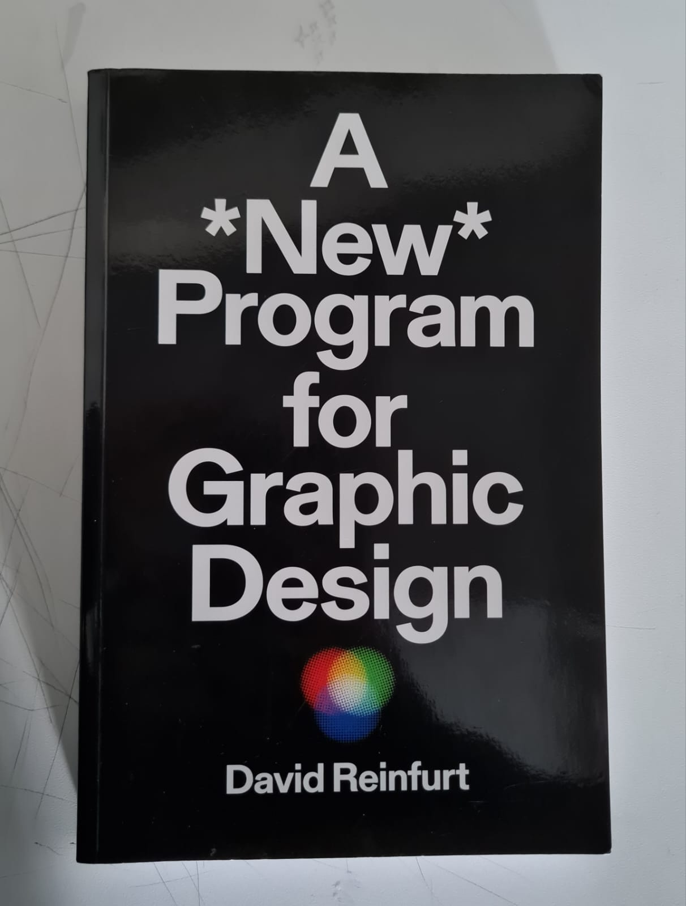
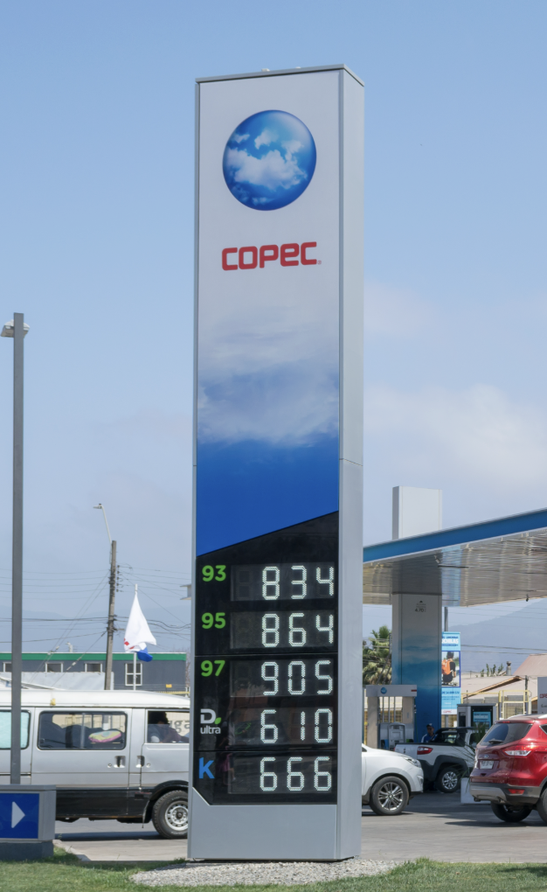
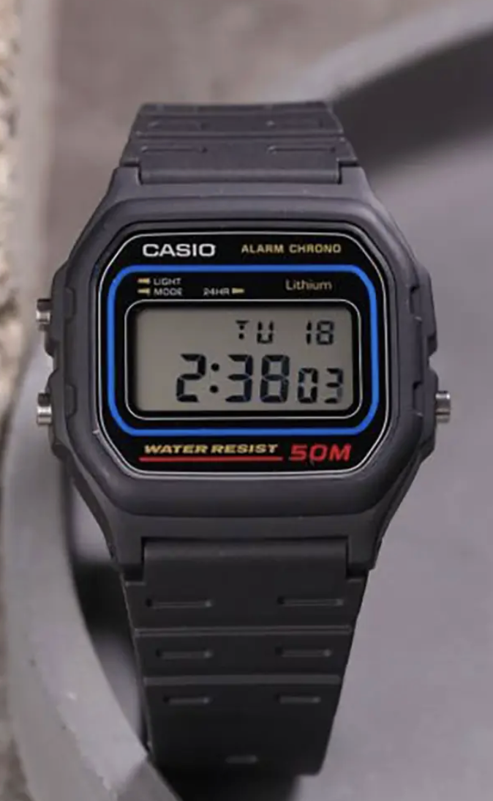
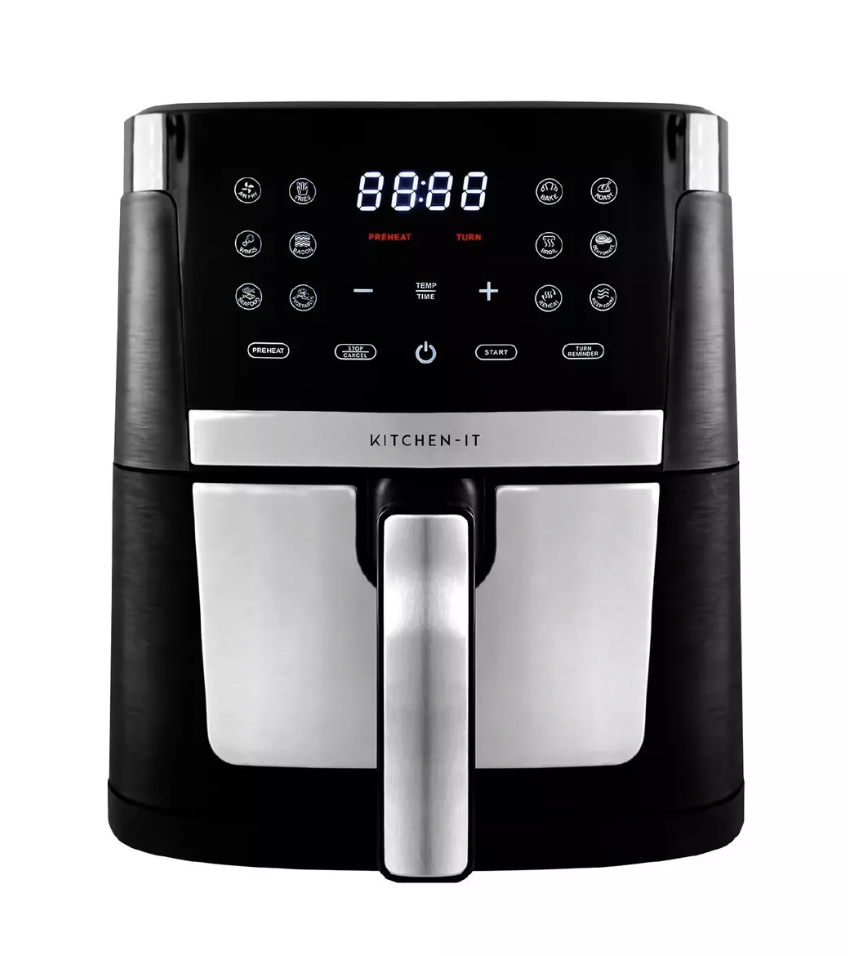

# sesion-01a

## Apuntes sesión

Me lleve este libro

## Encargos

Encargo 01-a: Martes 11/08

Autorretrato: describir variables y funciones de ustedes.
investigar pantallas de segmentos, tomar fotos, documentar contexto, lugar, ubicación, alfabetos posibles, usos, comparar entre resultados encontrados, al menos 3 ejemplos distintos. https://en.wikipedia.org/wiki/Segment_display.

### Autorretrato: escribir variables y funciones mias.

En programación o sistemas, una variable es un contenedor que almacena información que puede cambiar o mantenerse constante. 
En tu autorretrato, son los datos estáticos o dinámicos que me definen.

| Variable | Tipo o Rango | Descripción |
| :--- | :--- | :--- |
| **Ritmo de Energía** | Nocturno | Rindo y me activo mucho más durante la noche; en las mañanas me cuesta más hacer las cosas. |
| **Necesidad de Sueño** | Estricto | Necesito dormir bien obligatoriamente; si descanso mal, amanezco de mal humor. |
| **Rutina de Mañana** | Hábito fijo | Empiezo el día tomando agua y té verde, haciendo ayuno. |
| **Preparación Nocturna** | Hábito fijo | Cada noche dejo todo listo para el día siguiente (ropa, maquillaje, mochila y cosas de la universidad) para optimizar las mañanas según el contexto. |
| **Almuerzo y Vitaminas** | Hábito fijo | Tomo mis vitaminas a la hora de almuerzo. |
| **Consumo de Música** | Constante | Necesito escuchar música como compañía para casi todo: leer, escribir, caminar o analizar. |
| **Traslado con Audífonos** | Indispensable | Uso audífonos obligatoriamente en los viajes largos para aislarme del ruido y regular mi entorno. |
| **Anotaciones en Papel** | Físico / Analógico | Anoto todo lo importante en mi libreta para no olvidarlo y tenerlo siempre a mano. |
| **Organización de Tareas** | Dinámico (Tachado) | Escribo mis pendientes para presionarme a terminar las cosas y sentir la satisfacción de tacharlas. |
| **Uso del Celular** | Digital | Uso el teléfono principalmente para conectarme con mis amigos y mi familia. |
| **Salidas a Solas** | Autonomía propia | Disfruto salir a caminar o moverme al aire libre de manera independiente. |
| **Actividad Física** | Hábito fijo | Ando en bicicleta una vez por semana. |
| **Actividad Física** | Periódico | Hago boxeo dos veces por semana, lo dejé pausado porque me chocan los horarios con la universidad. |
| **Batería Social** | Variable con límite | Me gusta estar sola, pero también compartir con amigos. Eso sí, después de un rato se me agota la energía y necesito volver a estar sola. |
| **Enfoque Proyectual** | Conceptual / Investigativo | Al iniciar cualquier encargo (universitario o externo), mi base es investigar a fondo lo que se pide y conectar cada hallazgo con conceptos claros para guiar el diseño. |

## ¿Qué es una pantalla de segmentos?

Una pantalla de segmentos (o segment display) es un dispositivo de visualización compuesto por varios elementos individuales —llamados segmentos (habitualmente luces LED, cristales líquidos LCD o placas electromecánicas)— que se encienden o apagan en combinaciones específicas para formar números, letras o símbolos.

Dependiendo de su complejidad, existen distintos tipos:

- 7 segmentos: Diseñado principalmente para mostrar números (del 0 al 9) y algunos caracteres básicos.

- 14 y 16 segmentos: Incorporan trazos diagonales y adicionales, lo que permite visualizar letras del alfabeto latino y crear mensajes alfanuméricos completos.

## ¿Dónde los podemos encontrar?
Las pantallas de segmentos están integradas en numerosos objetos de la vida cotidiana donde se requiere información numérica clara y de bajo costo:

- Electrodomésticos: Paneles de microondas, hornos y lavadoras que muestran el tiempo restante o la temperatura.

- Dispositivos de medición y cálculo: Relojes digitales, cronómetros de cocina y calculadoras de bolsillo.

- Señalización comercial: Paneles de precios en tótems de gasolineras (a menudo con tecnología electromecánica de placas giratorias).

- Entretenimiento: Displays frontales de equipos de audio antiguos (como reproductores de CD o sintonizadores de radio).

- Transporte público: Letreros electrónicos en autobuses o estaciones que indican el número de ruta o línea.

Información sacada de → https://en.wikipedia.org/wiki/Segment_display

<h3>Registro fotográfico</h3>

<table>
  <tr>
    <th>Tótem de gasolinera Copec</th>
    <th>Reloj digital Casio</th>
    <th>Freidora de aire</th>
  </tr>
  <tr>
    <td align="center">

      <b>Imagen sacada de: https://es.wikipedia.org/wiki/Copec
    </td>
    <td align="center">

        <b>Imagen sacada de: https://www.sgintention.com/?h=11306747001860
    </td>
    <td align="center">

        <b>Imagen sacada de: https://www.paris.cl/freidora-de-aire-family-edition-7l-kitchen-it-MKMQZ2L4OR.html
    </td>
  </tr>
</table>

## Conclusión de la Comparativa

Cada una de estas pantallas demuestra que la tecnología del segmento se adapta estrictamente a su función y contexto de uso:

- El reloj prioriza la visibilidad constante en interiores y oscuridad.

- La freidora de aire prioriza la interacción cercana y el cambio de estados operativos.

- El tótem prioriza la lectura a larga distancia bajo la luz del sol y el ahorro de energía mediante elementos mecánicos.

## Lectura

Libro: A *New* Program for Graphic Design
Autor: David Reinfurt

