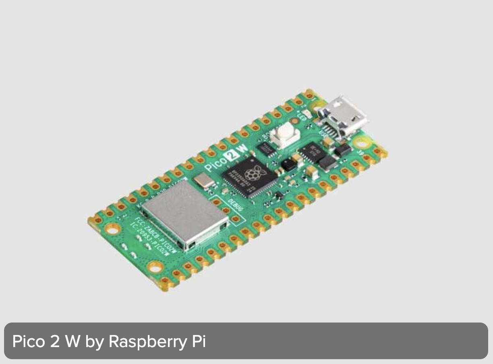

# sesion-01b

## Apuntes sesión

### 1. Tipos de Datos y Variables en C++

En la programación (especialmente en entornos de hardware como Arduino), las variables son contenedores que almacenan datos en la memoria. Cada variable debe declararse con un tipo de dato específico que define qué clase de información puede guardar y cuánto espacio ocupa.

→ Tengo que pasar la tabla de variables del autorretrato a c++

- bool (Booleano): Variables extremistas de dos estados (true / false o 1 / 0) o (Sí/No).
  
Un booleano es un tipo de dato lógico que solo puede tener dos valores.


**¿Qué es y para qué sirve?**

- Representa un estado de sí o no, encendido o apagado.
- Sirve para tomar decisiones en un programa de computadora con condiciones como "si esto es verdad, haz aquello".
- Controla el flujo del código mediante preguntas lógicas.


**Operadores lógicos**

- AND (Y): Da verdadero solo si ambas partes son verdaderas.
- OR (O): Da verdadero si al menos una parte es verdadera.
- NOT (NO): Cambia el valor de verdadero a falso y al revés.

- int (Enteros): Almacenan números enteros sin decimales. Se utilizan para datos exactos como la edad, el día del mes, o la cantidad de objetos. (Ej. int edad = 23;). Se usan enteros para facilitar la lectura.

- float o double (Punto flotante / Decimales): Almacenan números con fracciones decimales (ej. temperatura, voltajes precisos).

- char (Carácter): Almacenan un único carácter alfanumérico usando comillas simples (ej. char letra = 'A';).

- string (Cadenas de texto): Almacenan textos o secuencias de caracteres (ej. nombres).

- const (constantes): Variables cuyos valores no pueden cambiar durante la ejecución del programa.


### 2. Operadores en C++

= (operador de Asignación): Asigna el valor del lado derecho al contenedor del lado izquierdo. (Ej. int dia = 27;).

== (operador de Comparación): Compara si dos elementos son estrictamente iguales, devolviendo un valor booleano (true o false).

AND / OR (operadores Lógicos): Sirven para evaluar y juntar múltiples condiciones.

&& (AND / Y): Ambas condiciones deben cumplirse para que el resultado sea verdadero.

|| (OR / O): Con que al menos una de las condiciones se cumpla, el resultado es verdadero.

; (punto y coma): Funciona como el punto final de una oración; le indica al compilador que la línea de código ha terminado.

// (comentarios): Líneas de texto ignoradas por la máquina, utilizadas para escribir pseudocódigo, explicar la lógica o planificar ideas antes de programar.


### 3. Estructura de Control y Funciones en Arduino

En Arduino, la estructura de un programa se divide principalmente en dos bloques fundamentales llamados "murciélagos" { }

- void setup(): Se ejecuta una única vez al encender o reiniciar la placa. Sirve para configurar los estados iniciales. El uso de void indica que la función no devuelve ningún valor (es un proceso vacío de retorno).

- void loop(): Es la función cíclica por excelencia. Se ejecuta de manera infinita e ininterrumpida justo después del setup(), repitiéndose hasta que la placa se apague o falle. Es ideal para procesos que deben monitorearse constantemente (como sensores o condiciones de tiempo).


### 4. Autorretrato en C++

```cpp

// Variables booleanas (estados de dos opciones: true/false)
bool necesidadSueño = true;           
// si descanso mal, amanezco de mal humor
bool preparacionNocturna = true;       
// dejo todo listo la noche anterior para el dia siguiente (ropa, maquillaje, mochila)
bool ayunoEnLaManhana = true;          
// en las mañanas lo primero que hago es tomarme un té verde en ayuno
bool vitaminasAlmuerzo = true;        
// tomo vitaminas fijas a la hora de almorzar
bool monseCasada = false;
// mi estado civil es soltera
bool ritmoNocturno = true;             
// tengo mayor rendimiento en la noche que en la manhana
bool consumoMusicaConstante = true;     
// necesito musica obligatoria para leer, escribir, caminar, analizar, para mayor concentracion 
bool audifonosEnTrayecto = true;       
// indispensable en viajes largos para regular el entorno
bool libretaFisicaActiva = true;       
// anoto todo lo importante en mi libreta para no olvidarlo y tenerlo siempre a mano
bool organizacionPorTachado = true;    
// escribo mis pendientes para presionarme a terminar las cosas y sentir la satisfacción de tacharlas
bool celularSocialActivo = true;       
// ocupo el teléfono principalmente para conectarme con mis amigos y mi familia
bool autonomiaSolitaria = true;        
// disfruto salir a caminar o moverme al aire libre de manera independiente
bool boxeoPausado = true;              
// lamentablemente lo deje pausado porque me choca con los horarios de la u y de la practica
bool estudianteDisenho = true;

// Variables de números enteros (int) para datos exactos
int frecuenciaBicicletaSemanal = 1;    
// Ando en bicicleta una vez por semana
int frecuenciaBoxeoSemanal = 0;        
// En 0 debido a pausa temporal por choque de horarios
int bateriaSocial = 50;                
// me gusta salir con amigos pero tengo un limite social y ya necesito mi soledad
int edadActual = 23;
int diaNacimiento = 27;                
int mesNacimiento = 9;                 
int anhoNacimiento = 2002;
int DiasUniversidad = 3;               
// Voy 3 veces a la semana a la universidad

void setup() {
  // Aquí va setup(), ocurre una vez al principio
}

void loop() {
// Ocurre después de setup() y se repite infinitamente hasta que no se pueda
  
// Simulamos la fecha actual (en un proyecto real vendría de un sensor de tiempo o RTC)
int diaActual = 27; 
int mesActual = 9;

// ejemplo de loop para decir feliz cumpleaños si la fecha coincide
if (diaActual == diaNacimiento && mesActual == mesNacimiento) {
// Acción repetitiva del loop cada 27 de septiembre: enviar mensaje de cumpleaños
// Serial.println("¡Feliz cumpleaños, Monserrat! Hoy es 27 de septiembre.");
    
// Ejemplo de actualización de edad (se ejecutaría al cumplirse la condición)
// edadActual = edadActual + 1;
// edadActual += 1;
// edadActual++;
  }
}
```


### Link enviados en clase

- https://www.w3schools.com/cpp/cpp_variables.asp

- https://arduino.cl/products/arduino-uno-r4-wifi?srsltid=AfmBOoqlJSHtZKl0w6h-kiJIo28N6S1SOkGJQ_FIpxp-Jf6ZdUc_OuuJ

- https://arduinohistory.github.io

- https://github.com/ITPNYU/physcomp

- https://itp.nyu.edu/physcomp/


### Bibliografía

- https://www.electrogeekshop.com/estructuras-de-control-en-arduino/?srsltid=AfmBOoohNwZMxEsydAlQfXtN4ovv21NBdHGlTOiBmzMwGmTAIy2hwtDu
  
- https://www.reddit.com/r/FreeCAD/comments/1l7wxb5/what_does_boolean_mean/?tl=es-419
  
- https://en.wikipedia.org/wiki/Boolean_data_type
  
- https://aprendiendoarduino.wordpress.com/2017/06/20/estructuras-de-control-3/

- https://circuitpython.org/board/raspberry_pi_pico2_w/

- https://raspberrypi.cl/products/raspberry-pi-pico-2

- 


## Encargos

encargo01b:

1. tratar de correr un código en el microcontrolador asignado a cada dupla, incluir referentes, citas, comentarios, imágenes, descripciones textuales, y en caso de éxito o fracaso incluir aciertos, preguntas, dramas, atados. recordatorio que estos apuntes son personales, cada persona sube su versión.
2. proponer una función con nombre, tipo, argumentos y uso, que modele algún área de su interés, por ejemplo subirCerro(enBicicleta), tomarMetro(conPaseEscolar), etc. escribir en pseudocódigo los pasos que necesita esa función internamente para que literalmente funcione.


### 1. código en el microcontrolador

Raspberry Pi Pico 2W → es una potente placa de microcontrolador de bajo costo basada en el chip RP2350.




Imagen sacada de → https://circuitpython.org/board/raspberry_pi_pico2_w/


### Descripción de los pines


Imagen sacada de → https://www.geekfactory.mx/tutoriales-raspberry-pi-pico/pinout-raspberry-pi-pico-y-variante-w-con-wifi/?srsltid=AfmBOopCyzbNBJG0WhAkgeqxowWhNpjsMwi8srIBDL6kDMQINhzE_ObP 


### Paso a paso de como conectar y configurar la Raspberry Pi Pico 2 en el Arduino IDE

1. Instalación del paquete de placas

- Instalar y abrir Arduino IDE.

- Agregar URL del gestor de tarjetas:
  
  File/Archivo o logo arduino > Preferences/Preferencias, se agrega la siguiente URL en Additional Boards Manager URLs / URLs Adicionales de Gestor de Tarjetas.
  
  URL: https://github.com/earlephilhower/arduino-pico/releases/download/global/package_rp2040_index.json

Es lo que la Raspberry necesita para funcionar, ya que el programa Arduino IDE solo viene preparado para placas oficiales de Arduino y ayuda a traducir el código de C++ al lenguaje que entiende ese microcontrolador.

- En el menú lateral izquierdo, haz clic en el icono de Gestor de Tarjetas (Boards Manager, representado con libros).

- Escribe Raspberry en la barra de búsqueda superior.

- Localiza el paquete "Raspberry Pi Pico/RP2040/RP2350..." (compatible con los chips RP2350 de la Pico 2) y haz clic en INSTALL.


2. Selección de la placa correcta
  
- Despliega la categoría Raspberry Pi Pico/RP2040/RP2350 y selecciona Raspberry Pi Pico 2 (o la variante específica de tu modelo).


3. Preparación de la placa (Modo Bootloader)
   
- Desconecta el cable USB de tu Raspberry Pi Pico 2.

- Mantén presionado el botón blanco BOOTSEL ubicado sobre la placa.

- Sin soltar el botón, conecta el cable USB a la computadora.

- Suelta el botón BOOTSEL después de un par de segundos. Esto forzará a la placa a montarse como una unidad de almacenamiento externa en tu sistema (NO NAME o RPI-RP2).


4. Selección del puerto de transferencia

- En el IDE de Arduino, ve a Herramientas (Tools) > Puerto (Port).

- Selecciona la opción UF2 Board (o el puerto serie USB correspondiente). Esto le indicará al entorno de desarrollo dónde volcar el archivo compilado.

  Tools/Herramientas > Port/Puerto > UF2 Board (mientras está en modo BOOTSEL).


5. Primera carga de prueba (Blink)

Esto es un ejemplo básico y predeterminado que viene integrado en el programa Arduino. Su única función es hacer que un LED encienda y se apague de manera intermitente, tambien ayuda a saber si el cable es para datos y no solo cargar, que el microcontrolador se comunica correctamente y que el proceso de compilación y subida del archivo no tenga errores.

- Para verificar que toda la configuración es correcta, se cargó el ejemplo estándar "Blink" (File/Archivo > Examples/Ejemplos > 01.Basics > Blink).
  
- Haz clic en el botón de Cargar (la flecha hacia la derecha ubicada en la esquina superior izquierda).

- El IDE compilará el código en un archivo .uf2 y lo transferirá automáticamente a la memoria de la Raspberry Pi Pico 2 para iniciar su funcionamiento físico.

Recordar: Al conectar el cable USB no se enciende ninguna luz de forma automática; la Rasberry Pico 2W no tiene un LED dedicado de encendido,


6. Materiales utilizados

- Raspberry Pi Pico 2W1.
- cable USB con transmisión de datos (no solo de carga).
- computador con el programa Arduino IDE instalado.
- protoboard.
- 1 LED.
- 1 resistencia.
- 1 botón pulsador (4 patas).
- Cables jumper macho-macho.


7. Pines utilizados y conexión fisica

| Elemento | Pin físico | Función |
| :--- | :--- | :--- |
| GND de la Pico -> riel negativo de la protoboard | Pin 38 | GND |
| 3V3 -> riel positivo de la protoboard | Pin 36 | 3V3 (OUT) |
| Botón | Pin 27 | GP21 |
| LED (a través de resistencia) | Pin 26 | GP20 |


8. Código en Arduino

```cpp
juju
```


9. Fotos del proceso 


## lectura

