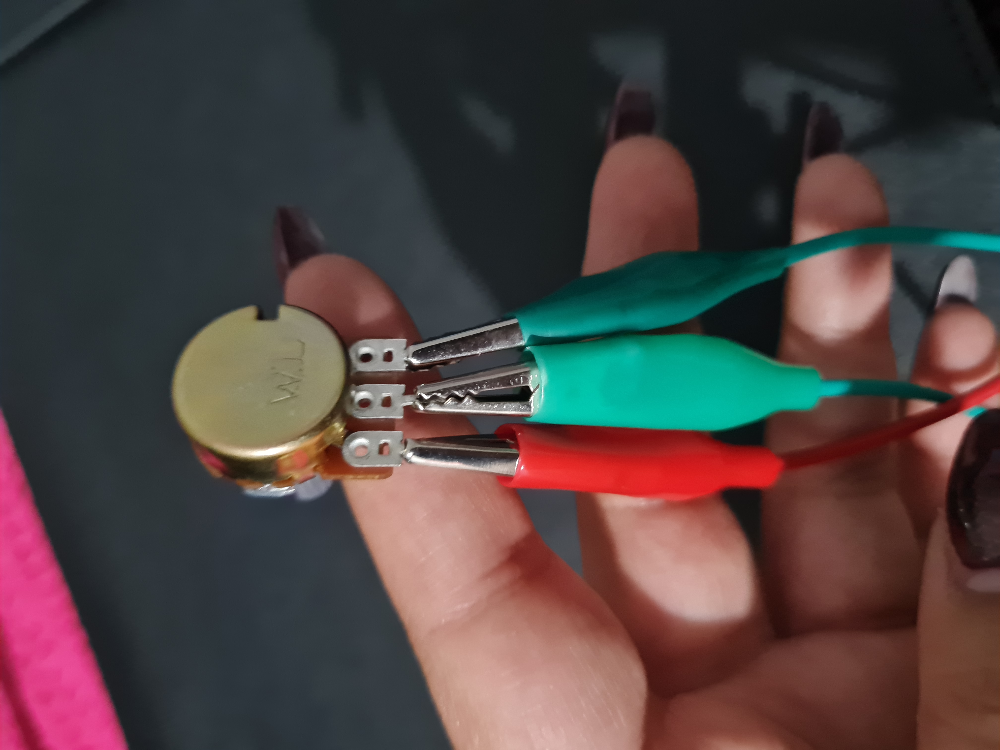
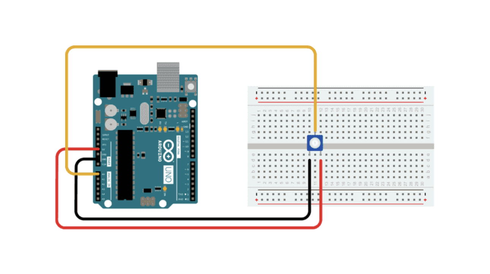
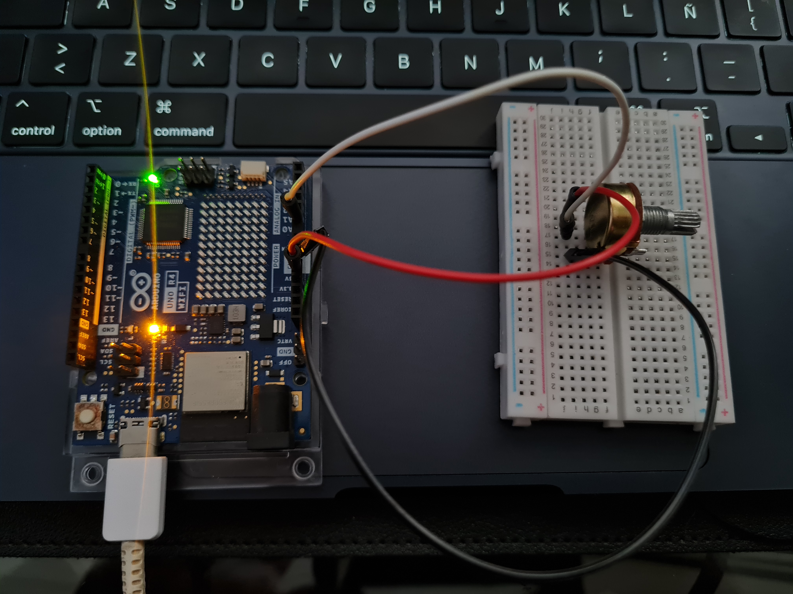
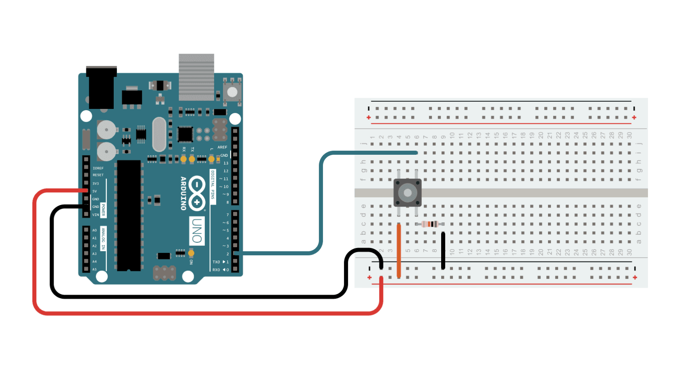
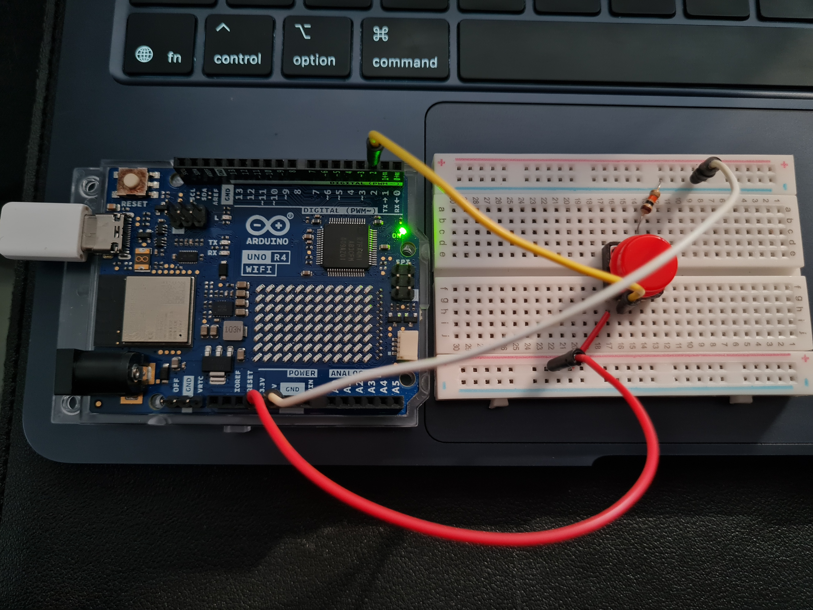
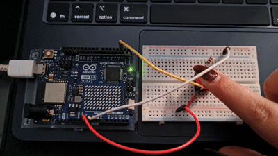

# sesion-02a → 18/08/26

## Apuntes sesión

Primer proyecto

potenciometro (resistor variable) → regula la potencia → voltaje (energia) + corriente tiempo).

- Permite cambiar la cantidad de corriente o voltaje en un circuito de forma manual al girar una perilla o mover un deslizador.

- la corriente es un flijo de electrones

- potenciometro A: AUDIO
- potenciometro B: LINEALES 

botones pulsadores (pushbuttons)

- elementos temporales  → no guardan nada en la memoria

- resistor (pull down)  →  permite que la lectura sea siempre 0 hasta que al presionarlo es 1

  boton presionado: 1

  boton no presionado: 0

-resistor (pull up)  → 

presencia: 0

no presencia: 1

se eligen según cómo quiero que se comporte el circuito en reposo.

GND  → tierra  → 0 voltaje  →  usar cables cafe, negro  → riel negativo

Vcc  → 3v3  → 5v  →  usar cable rojo  → riel positivo 

protoboard  →  todas las filas son el mismo lugar


---


## Linkn vistos en clases

- https://www.raspberrypi.com/documentation/microcontrollers/pico-series.html#layout_non-wireless

- https://docs.arduino.cc/built-in-examples/digital/Button/

- https://docs.arduino.cc/built-in-examples/basics/AnalogReadSerial/


## conexiones potenciometro

3 patitas del potenciometro

derecha → voltaje/tierra

izquierda → voltaje/ tierra

al medio → A0 → patita de lectura (int) → entero





## codigo visto en clases para arduino R4 wifi:

```cpp

const int patitaLectura = A0;
// numero de enteros
// arduino lee el A0 como si lo fuera
// const es algo que no se puede cambiar porque es constante 


int valorLectura = ;
// numero de enteros
// declarar valor

void septum () {
// solo 1 vez
// nada que configurar porwue es entrada

Serial.begin(9600);
// prohibido ponerlo en loop
// Serial es una clase por eso esta en mayuscula 
// Serial = un mensaje, uno a la vez en orden
// funciona en velocidad 9600 (mensajes por segundo)
// este numero es moderado, no es rapido ni lento
// al abrir este puerto significa que puedo escribir mensajes 
}
void loop (){
  Serial.println("holaa");
valorLectura = anologRead (patitaLectura);
//monitor serial, muestra lo que mandaste al codigo
// solo mostrara el "holaa"
}

```

Potenciometro:

minimo: 0
maximo: 1023


while  →  mientras que 

si el no puede recibir mensajes, se perderan los que mandaste 
tratar de no usar porque es complejo, usar cuando sea necesario 


0, 1, 2, 3 →  vale 0

4, 5, 6, 7 →  vale 1

- a la hora de programar se empieza de lo mas macro a lo mas micro


## Encargos

- Hacer grupos de 3 o 4 personas

1. en tu fork, ir a actions, y aceptar que corran github worfklows. subir pantallazo con demostración de que han corrido actions exitosas en tu repo. esto es crucial, si no lo haces, no agregaremos tus apuntes al repo, y las tareas se tomarán como no entregadas. si en tu fork las actions no son exitosas, no serán tampoco agregadas al repo común ni evaluadas.

2. conformar grupos de 3 a 4 personas para la realización del proyecto-1. compartir 2 placas de desarrollo por grupo, documentar estudio conjunto de C++, microcontroladores, botones, potenciómetros.


primera mitad:

- teoria/pizarra potenciometros y botones
- visual studio code
- dramas github

segunda mitad:

- programar potenciometros y botones


---

# Proyecto-1

## codigo enviado para hacer funcionar el potenciometro

```cpp

const int patitaLectura = A0;

int valorLectura = -1;

void setup() {

  Serial.begin(9600);

}

void loop() {
 valorLectura = analogRead(patitaLectura); 
 Serial.println(valorLectura);
}

```

## Materiales utilizados 

- Arduino R4 WIFI.
- cable USB con transmisión de datos (no solo de carga).
- computador con el programa Arduino IDE instalado.
- protoboard.
- 1 resistencia.
- 1 Potenciometro.
- Cables jumper macho-macho.


## Circuito



Imagen sacada de → https://docs.arduino.cc/built-in-examples/basics/AnalogReadSerial/


## Paso a paso de conexión 

- Arduino 5V → Patita lateral del potenciómetro → cable rojo.
  
- Arduino GND → Patita lateral opuesta del potenciómetro → cable negro.

- Arduino Pin A0 → Patita del medio del potenciómetro → cable amarillo.


## Registro conexión física





---


## codigo enviado para hacer funcionar el botón pulsador

```cpp
/*
  Button

  Turns on and off a light emitting diode(LED) connected to digital pin 13,
  when pressing a pushbutton attached to pin 2.

  The circuit:
  - LED attached from pin 13 to ground through 220 ohm resistor
  - pushbutton attached to pin 2 from +5V
  - 10K resistor attached to pin 2 from ground

  - Note: on most Arduinos there is already an LED on the board
    attached to pin 13.

  created 2005
  by DojoDave <http://www.0j0.org>
  modified 30 Aug 2011
  by Tom Igoe

  This example code is in the public domain.

  https://docs.arduino.cc/built-in-examples/digital/Button/
*/

// constants won't change. They're used here to set pin numbers:
const int buttonPin = 2;  // the number of the pushbutton pin
const int ledPin = 13;    // the number of the LED pin

// variables will change:
int buttonState = 0;  // variable for reading the pushbutton status

void setup() {
  // initialize the LED pin as an output:
  pinMode(ledPin, OUTPUT);
  // initialize the pushbutton pin as an input:
  pinMode(buttonPin, INPUT);
}

void loop() {
  // read the state of the pushbutton value:
  buttonState = digitalRead(buttonPin);

  // check if the pushbutton is pressed. If it is, the buttonState is HIGH:
  if (buttonState == HIGH) {
    // turn LED on:
    digitalWrite(ledPin, HIGH);
  } else {
    // turn LED off:
    digitalWrite(ledPin, LOW);
  }
}
```

## Materiales utilizados

- Arduino R4 WIFI.
- cable USB con transmisión de datos (no solo de carga).
- computador con el programa Arduino IDE instalado.
- protoboard.
- 1 resistencia.
- 1 botón pulsador (4 patas).
- Cables jumper macho-macho.


## Circuito



Imagen sacada de → https://docs.arduino.cc/built-in-examples/digital/Button/


## Paso a paso de conexión

- Arduino 5V → Riel + de la protoboard → cable rojp.

- Arduino GND → Riel - de la protoboard → cable blanco.

- Arduino Pin 2 → Una pata del botón → cable amarillo.

- Riel + → Misma pata del botón donde pusiste el Pin 2.

- Pata diagonal del botón → Resistencia de 10k → Riel -.

- Resultado: LED encendido mientras mantienes el botón presionado; apagado al soltar.


## Registro conexión física







---


## Lectura

Libro: A New Program for Graphic Design

Autor: David Reinfurt

El libro está dividido en 3 grandes capítulos.

I. T--Y-P-O-G-R-A-P-H-Y

II. G-E-S-T-A-L-T

III. I-N-T-E-R-F-A-C-E

Intentare leer por capítulo o dos temas por clase, depende del tiempo que tenga.

