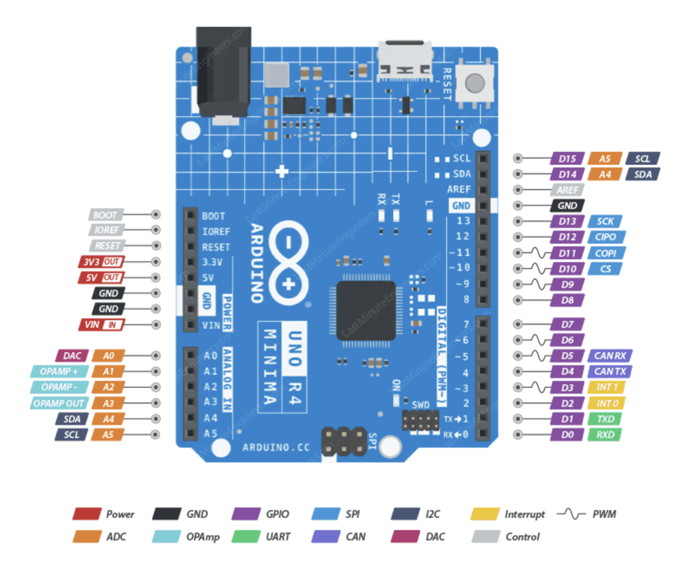
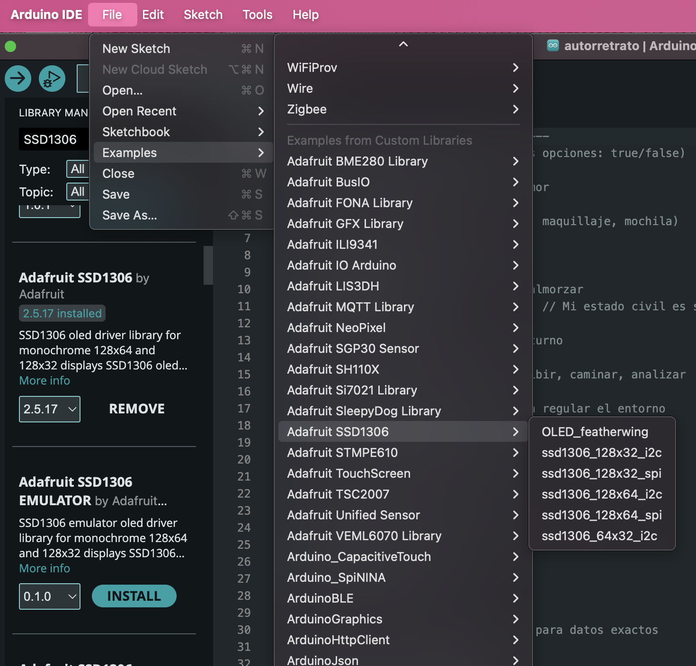
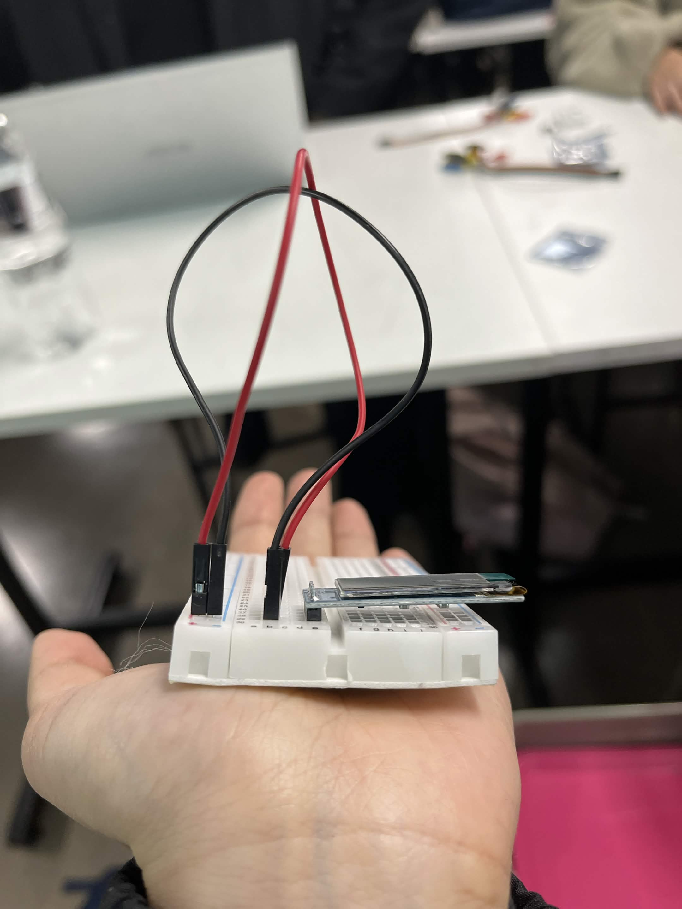
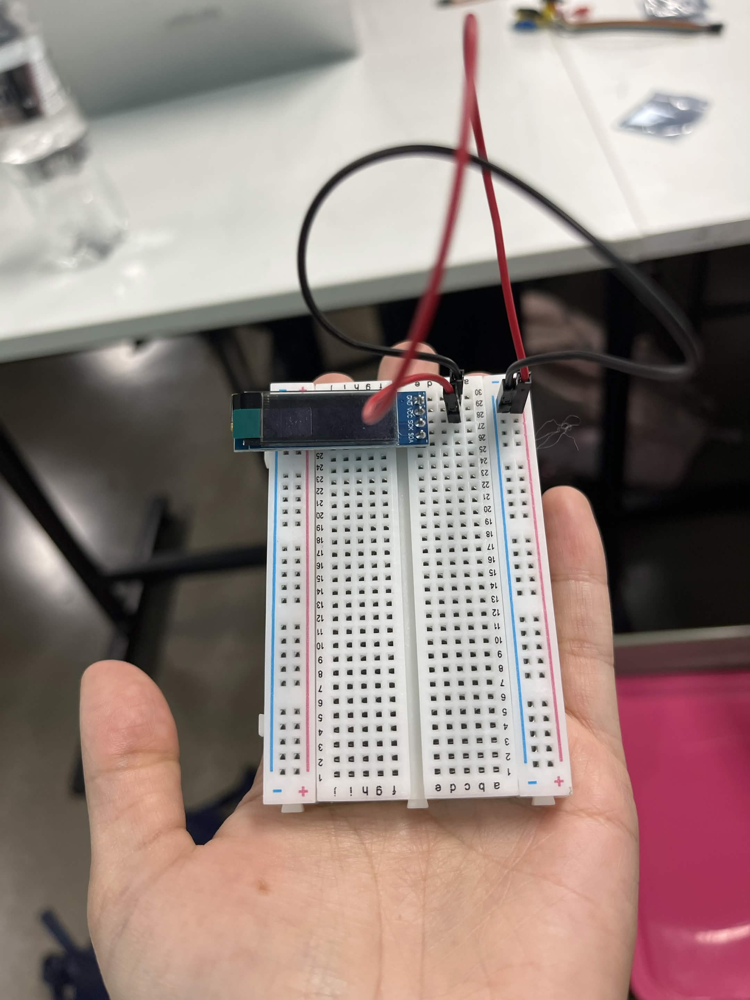
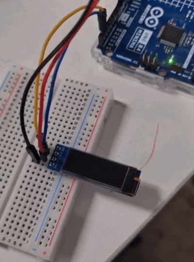

# sesion-03a → 25/08/26

## apuntes sesión

Decir y escribir biblioteca y no librería 


### Materiales entregados 

- Protoboard

- Pantalla LCD Oled 0,91" I2C

- Kit 10 Cables Caiman a Dupont Hembra

- Kit 10 Cables Caiman a Dupont macho

- Lector Micro SD

- Botones

Instalar biblioteca de Adafruit en Arduino → Adafruit SSD1306

Archivios .h/.hpp → promesas de capaña 

Cpp en c++ → se hace cargo de la promesas 

los # en código anda a ese archivo traelo y pegalo aqui (lo veremos mas adelante)

Display → pantalla

Las patitas de la pantalla tienen que estar conectadas en diferentes filas, de manera vertical

SCK/SCL → reloj → cable azul → A5

SDA → datios → cable amarillo → A4

GND → tierra 

VCC → voltaje 


### Arduino UNO R4 Minima Pinout




Imagen sacada de → https://lastminuteengineers.com/arduino-uno-r4-minima-pinout/


### Ejemplo de Arduino




### Fotos del proceso en clases

SDA Y SCL conectados → visualizar pantalla con codigo de ejemplo


<table>
  <tr>
    <th>Conexiones analógicas</th>
    <th>Conexiones GND y VCC</th>
  </tr>
  <tr>
    <td align="center">

    </td>
    <td align="center">

    </td>
  </tr>
</table>


### Código de ejemplo arduino

```cpp
/**************************************************************************
 This is an example for our Monochrome OLEDs based on SSD1306 drivers

 Pick one up today in the adafruit shop!
 ------> http://www.adafruit.com/category/63_98

 This example is for a 128x32 pixel display using SPI to communicate
 4 or 5 pins are required to interface.

 Adafruit invests time and resources providing this open
 source code, please support Adafruit and open-source
 hardware by purchasing products from Adafruit!

 Written by Limor Fried/Ladyada for Adafruit Industries,
 with contributions from the open source community.
 BSD license, check license.txt for more information
 All text above, and the splash screen below must be
 included in any redistribution.
 **************************************************************************/

#include <SPI.h>
#include <Wire.h>
#include <Adafruit_GFX.h>
#include <Adafruit_SSD1306.h>

#define SCREEN_WIDTH 128 // OLED display width, in pixels
#define SCREEN_HEIGHT 32 // OLED display height, in pixels

// Declaration for SSD1306 display connected using software SPI (default case):
#define OLED_MOSI   9
#define OLED_CLK   10
#define OLED_DC    11
#define OLED_CS    12
#define OLED_RESET 13
Adafruit_SSD1306 display(SCREEN_WIDTH, SCREEN_HEIGHT,
  OLED_MOSI, OLED_CLK, OLED_DC, OLED_RESET, OLED_CS);

/* Comment out above, uncomment this block to use hardware SPI
#define OLED_DC     6
#define OLED_CS     7
#define OLED_RESET  8
Adafruit_SSD1306 display(SCREEN_WIDTH, SCREEN_HEIGHT,
  &SPI, OLED_DC, OLED_RESET, OLED_CS);
*/

#define NUMFLAKES     10 // Number of snowflakes in the animation example

#define LOGO_HEIGHT   16
#define LOGO_WIDTH    16
static const unsigned char PROGMEM logo_bmp[] =
{ 0b00000000, 0b11000000,
  0b00000001, 0b11000000,
  0b00000001, 0b11000000,
  0b00000011, 0b11100000,
  0b11110011, 0b11100000,
  0b11111110, 0b11111000,
  0b01111110, 0b11111111,
  0b00110011, 0b10011111,
  0b00011111, 0b11111100,
  0b00001101, 0b01110000,
  0b00011011, 0b10100000,
  0b00111111, 0b11100000,
  0b00111111, 0b11110000,
  0b01111100, 0b11110000,
  0b01110000, 0b01110000,
  0b00000000, 0b00110000 };

void setup() {
  Serial.begin(9600);

  // SSD1306_SWITCHCAPVCC = generate display voltage from 3.3V internally
  if(!display.begin(SSD1306_SWITCHCAPVCC)) {
    Serial.println(F("SSD1306 allocation failed"));
    for(;;); // Don't proceed, loop forever
  }

  // Show initial display buffer contents on the screen --
  // the library initializes this with an Adafruit splash screen.
  display.display();
  delay(2000); // Pause for 2 seconds

  // Clear the buffer
  display.clearDisplay();

  // Draw a single pixel in white
  display.drawPixel(10, 10, SSD1306_WHITE);

  // Show the display buffer on the screen. You MUST call display() after
  // drawing commands to make them visible on screen!
  display.display();
  delay(2000);
  // display.display() is NOT necessary after every single drawing command,
  // unless that's what you want...rather, you can batch up a bunch of
  // drawing operations and then update the screen all at once by calling
  // display.display(). These examples demonstrate both approaches...

  testdrawline();      // Draw many lines

  testdrawrect();      // Draw rectangles (outlines)

  testfillrect();      // Draw rectangles (filled)

  testdrawcircle();    // Draw circles (outlines)

  testfillcircle();    // Draw circles (filled)

  testdrawroundrect(); // Draw rounded rectangles (outlines)

  testfillroundrect(); // Draw rounded rectangles (filled)

  testdrawtriangle();  // Draw triangles (outlines)

  testfilltriangle();  // Draw triangles (filled)

  testdrawchar();      // Draw characters of the default font

  testdrawstyles();    // Draw 'stylized' characters

  testscrolltext();    // Draw scrolling text

  testdrawbitmap();    // Draw a small bitmap image

  // Invert and restore display, pausing in-between
  display.invertDisplay(true);
  delay(1000);
  display.invertDisplay(false);
  delay(1000);

  testanimate(logo_bmp, LOGO_WIDTH, LOGO_HEIGHT); // Animate bitmaps
}

void loop() {
}

void testdrawline() {
  int16_t i;

  display.clearDisplay(); // Clear display buffer

  for(i=0; i<display.width(); i+=4) {
    display.drawLine(0, 0, i, display.height()-1, SSD1306_WHITE);
    display.display(); // Update screen with each newly-drawn line
    delay(1);
  }
  for(i=0; i<display.height(); i+=4) {
    display.drawLine(0, 0, display.width()-1, i, SSD1306_WHITE);
    display.display();
    delay(1);
  }
  delay(250);

  display.clearDisplay();

  for(i=0; i<display.width(); i+=4) {
    display.drawLine(0, display.height()-1, i, 0, SSD1306_WHITE);
    display.display();
    delay(1);
  }
  for(i=display.height()-1; i>=0; i-=4) {
    display.drawLine(0, display.height()-1, display.width()-1, i, SSD1306_WHITE);
    display.display();
    delay(1);
  }
  delay(250);

  display.clearDisplay();

  for(i=display.width()-1; i>=0; i-=4) {
    display.drawLine(display.width()-1, display.height()-1, i, 0, SSD1306_WHITE);
    display.display();
    delay(1);
  }
  for(i=display.height()-1; i>=0; i-=4) {
    display.drawLine(display.width()-1, display.height()-1, 0, i, SSD1306_WHITE);
    display.display();
    delay(1);
  }
  delay(250);

  display.clearDisplay();

  for(i=0; i<display.height(); i+=4) {
    display.drawLine(display.width()-1, 0, 0, i, SSD1306_WHITE);
    display.display();
    delay(1);
  }
  for(i=0; i<display.width(); i+=4) {
    display.drawLine(display.width()-1, 0, i, display.height()-1, SSD1306_WHITE);
    display.display();
    delay(1);
  }

  delay(2000); // Pause for 2 seconds
}

void testdrawrect(void) {
  display.clearDisplay();

  for(int16_t i=0; i<display.height()/2; i+=2) {
    display.drawRect(i, i, display.width()-2*i, display.height()-2*i, SSD1306_WHITE);
    display.display(); // Update screen with each newly-drawn rectangle
    delay(1);
  }

  delay(2000);
}

void testfillrect(void) {
  display.clearDisplay();

  for(int16_t i=0; i<display.height()/2; i+=3) {
    // The INVERSE color is used so rectangles alternate white/black
    display.fillRect(i, i, display.width()-i*2, display.height()-i*2, SSD1306_INVERSE);
    display.display(); // Update screen with each newly-drawn rectangle
    delay(1);
  }

  delay(2000);
}

void testdrawcircle(void) {
  display.clearDisplay();

  for(int16_t i=0; i<max(display.width(),display.height())/2; i+=2) {
    display.drawCircle(display.width()/2, display.height()/2, i, SSD1306_WHITE);
    display.display();
    delay(1);
  }

  delay(2000);
}

void testfillcircle(void) {
  display.clearDisplay();

  for(int16_t i=max(display.width(),display.height())/2; i>0; i-=3) {
    // The INVERSE color is used so circles alternate white/black
    display.fillCircle(display.width() / 2, display.height() / 2, i, SSD1306_INVERSE);
    display.display(); // Update screen with each newly-drawn circle
    delay(1);
  }

  delay(2000);
}

void testdrawroundrect(void) {
  display.clearDisplay();

  for(int16_t i=0; i<display.height()/2-2; i+=2) {
    display.drawRoundRect(i, i, display.width()-2*i, display.height()-2*i,
      display.height()/4, SSD1306_WHITE);
    display.display();
    delay(1);
  }

  delay(2000);
}

void testfillroundrect(void) {
  display.clearDisplay();

  for(int16_t i=0; i<display.height()/2-2; i+=2) {
    // The INVERSE color is used so round-rects alternate white/black
    display.fillRoundRect(i, i, display.width()-2*i, display.height()-2*i,
      display.height()/4, SSD1306_INVERSE);
    display.display();
    delay(1);
  }

  delay(2000);
}

void testdrawtriangle(void) {
  display.clearDisplay();

  for(int16_t i=0; i<max(display.width(),display.height())/2; i+=5) {
    display.drawTriangle(
      display.width()/2  , display.height()/2-i,
      display.width()/2-i, display.height()/2+i,
      display.width()/2+i, display.height()/2+i, SSD1306_WHITE);
    display.display();
    delay(1);
  }

  delay(2000);
}

void testfilltriangle(void) {
  display.clearDisplay();

  for(int16_t i=max(display.width(),display.height())/2; i>0; i-=5) {
    // The INVERSE color is used so triangles alternate white/black
    display.fillTriangle(
      display.width()/2  , display.height()/2-i,
      display.width()/2-i, display.height()/2+i,
      display.width()/2+i, display.height()/2+i, SSD1306_INVERSE);
    display.display();
    delay(1);
  }

  delay(2000);
}

void testdrawchar(void) {
  display.clearDisplay();

  display.setTextSize(1);      // Normal 1:1 pixel scale
  display.setTextColor(SSD1306_WHITE); // Draw white text
  display.setCursor(0, 0);     // Start at top-left corner
  display.cp437(true);         // Use full 256 char 'Code Page 437' font

  // Not all the characters will fit on the display. This is normal.
  // Library will draw what it can and the rest will be clipped.
  for(int16_t i=0; i<256; i++) {
    if(i == '\n') display.write(' ');
    else          display.write(i);
  }

  display.display();
  delay(2000);
}

void testdrawstyles(void) {
  display.clearDisplay();

  display.setTextSize(1);             // Normal 1:1 pixel scale
  display.setTextColor(SSD1306_WHITE);        // Draw white text
  display.setCursor(0,0);             // Start at top-left corner
  display.println(F("Hello, world!"));

  display.setTextColor(SSD1306_BLACK, SSD1306_WHITE); // Draw 'inverse' text
  display.println(3.141592);

  display.setTextSize(2);             // Draw 2X-scale text
  display.setTextColor(SSD1306_WHITE);
  display.print(F("0x")); display.println(0xDEADBEEF, HEX);

  display.display();
  delay(2000);
}

void testscrolltext(void) {
  display.clearDisplay();

  display.setTextSize(2); // Draw 2X-scale text
  display.setTextColor(SSD1306_WHITE);
  display.setCursor(10, 0);
  display.println(F("scroll"));
  display.display();      // Show initial text
  delay(100);

  // Scroll in various directions, pausing in-between:
  display.startscrollright(0x00, 0x0F);
  delay(2000);
  display.stopscroll();
  delay(1000);
  display.startscrollleft(0x00, 0x0F);
  delay(2000);
  display.stopscroll();
  delay(1000);
  display.startscrolldiagright(0x00, 0x07);
  delay(2000);
  display.startscrolldiagleft(0x00, 0x07);
  delay(2000);
  display.stopscroll();
  delay(1000);
}

void testdrawbitmap(void) {
  display.clearDisplay();

  display.drawBitmap(
    (display.width()  - LOGO_WIDTH ) / 2,
    (display.height() - LOGO_HEIGHT) / 2,
    logo_bmp, LOGO_WIDTH, LOGO_HEIGHT, 1);
  display.display();
  delay(1000);
}

#define XPOS   0 // Indexes into the 'icons' array in function below
#define YPOS   1
#define DELTAY 2

void testanimate(const uint8_t *bitmap, uint8_t w, uint8_t h) {
  int8_t f, icons[NUMFLAKES][3];

  // Initialize 'snowflake' positions
  for(f=0; f< NUMFLAKES; f++) {
    icons[f][XPOS]   = random(1 - LOGO_WIDTH, display.width());
    icons[f][YPOS]   = -LOGO_HEIGHT;
    icons[f][DELTAY] = random(1, 6);
    Serial.print(F("x: "));
    Serial.print(icons[f][XPOS], DEC);
    Serial.print(F(" y: "));
    Serial.print(icons[f][YPOS], DEC);
    Serial.print(F(" dy: "));
    Serial.println(icons[f][DELTAY], DEC);
  }

  for(;;) { // Loop forever...
    display.clearDisplay(); // Clear the display buffer

    // Draw each snowflake:
    for(f=0; f< NUMFLAKES; f++) {
      display.drawBitmap(icons[f][XPOS], icons[f][YPOS], bitmap, w, h, SSD1306_WHITE);
    }

    display.display(); // Show the display buffer on the screen
    delay(200);        // Pause for 1/10 second

    // Then update coordinates of each flake...
    for(f=0; f< NUMFLAKES; f++) {
      icons[f][YPOS] += icons[f][DELTAY];
      // If snowflake is off the bottom of the screen...
      if (icons[f][YPOS] >= display.height()) {
        // Reinitialize to a random position, just off the top
        icons[f][XPOS]   = random(1 - LOGO_WIDTH, display.width());
        icons[f][YPOS]   = -LOGO_HEIGHT;
        icons[f][DELTAY] = random(1, 6);
      }
    }
  }
}
```

### Código arduino arreglado 

```cpp
#include <SPI.h>
#include <Wire.h>
#include <Adafruit_GFX.h>
#include <Adafruit_SSD1306.h>

#define SCREEN_WIDTH 128 // OLED display width, in pixels
#define SCREEN_HEIGHT 32 // OLED display height, in pixels

#define OLED_RESET     -1 // Reset pin # (or -1 if sharing Arduino reset pin)
#define SCREEN_ADDRESS 0x3C ///< See datasheet for Address; 0x3D for 128x64, 0x3C for 128x32
Adafruit_SSD1306 display(SCREEN_WIDTH, SCREEN_HEIGHT, &Wire, OLED_RESET);

#define NUMFLAKES     10 // Number of snowflakes in the animation example

#define LOGO_HEIGHT   16
#define LOGO_WIDTH    16

void setup() {
  Serial.begin(9600);

  // Wait for display
  delay(500);

  // SSD1306_SWITCHCAPVCC = generate display voltage from 3.3V internally
  if(!display.begin(SSD1306_SWITCHCAPVCC, SCREEN_ADDRESS)) {
    Serial.println(F("SSD1306 allocation failed"));
    for(;;); // Don't proceed, loop forever
  }

  // Show initial display buffer contents on the screen --
  // the library initializes this with an Adafruit splash screen.
  display.display();
  delay(2000); // Pause for 2 seconds

  // Clear the buffer
  display.clearDisplay();

  // Draw a single pixel in white
  display.drawPixel(10, 10, SSD1306_WHITE);

  // Show the display buffer on the screen. You MUST call display() after
  // drawing commands to make them visible on screen!
  display.display();
  delay(2000);
  // display.display() is NOT necessary after every single drawing command,
  // unless that's what you want...rather, you can batch up a bunch of
  // drawing operations and then update the screen all at once by calling
  // display.display(). These examples demonstrate both approaches...

  testdrawchar();      // Draw characters of the default font

  testdrawstyles();    // Draw 'stylized' characters

  testscrolltext();    // Draw scrolling text
  // Invert and restore display, pausing in-between
  display.invertDisplay(true);
  delay(1000);
  display.invertDisplay(false);
  delay(1000);

  
}

void loop() {
}

void testdrawchar(void) {
  display.clearDisplay();

  display.setTextSize(1);      // Normal 1:1 pixel scale
  display.setTextColor(SSD1306_WHITE); // Draw white text
  display.setCursor(0, 0);     // Start at top-left corner
  display.cp437(true);         // Use full 256 char 'Code Page 437' font

  // Not all the characters will fit on the display. This is normal.
  // Library will draw what it can and the rest will be clipped.
  for(int16_t i=0; i<256; i++) {
    if(i == '\n') display.write(' ');
    else          display.write(i);
  }

  display.display();
  delay(2000);
}

void testdrawstyles(void) {
  display.clearDisplay();

  display.setTextSize(1);             // Normal 1:1 pixel scale
  display.setTextColor(SSD1306_WHITE);        // Draw white text
  display.setCursor(0,0);             // Start at top-left corner
  display.println(F("Hello, world!"));

  display.setTextColor(SSD1306_BLACK, SSD1306_WHITE); // Draw 'inverse' text
  display.println(3.141592);

  display.setTextSize(2);             // Draw 2X-scale text
  display.setTextColor(SSD1306_WHITE);
  display.print(F("0x")); display.println(0xDEADBEEF, HEX);

  display.display();
  delay(2000);
}

void testscrolltext(void) {
  display.clearDisplay();

  display.setTextSize(2); // Draw 2X-scale text
  display.setTextColor(SSD1306_WHITE);
  display.setCursor(10, 0);
  display.println(F("scroll"));
  display.display();      // Show initial text
  delay(100);

  // Scroll in various directions, pausing in-between:
  display.startscrollright(0x00, 0x0F);
  delay(2000);
  display.stopscroll();
  delay(1000);
  display.startscrollleft(0x00, 0x0F);
  delay(2000);
  display.stopscroll();
  delay(1000);
  display.startscrolldiagright(0x00, 0x07);
  delay(2000);
  display.startscrolldiagleft(0x00, 0x07);
  delay(2000);
  display.stopscroll();
  delay(1000);
}

#define XPOS   0 // Indexes into the 'icons' array in function below
#define YPOS   1
#define DELTAY 2

void testanimate(const uint8_t *bitmap, uint8_t w, uint8_t h) {
  int8_t f, icons[NUMFLAKES][3];

  // Initialize 'snowflake' positions
  for(f=0; f< NUMFLAKES; f++) {
    icons[f][XPOS]   = random(1 - LOGO_WIDTH, display.width());
    icons[f][YPOS]   = -LOGO_HEIGHT;
    icons[f][DELTAY] = random(1, 6);
    Serial.print(F("x: "));
    Serial.print(icons[f][XPOS], DEC);
    Serial.print(F(" y: "));
    Serial.print(icons[f][YPOS], DEC);
    Serial.print(F(" dy: "));
    Serial.println(icons[f][DELTAY], DEC);
  }

  for(;;) { // Loop forever...
    display.clearDisplay(); // Clear the display buffer

    // Draw each snowflake:
    for(f=0; f< NUMFLAKES; f++) {
      display.drawBitmap(icons[f][XPOS], icons[f][YPOS], bitmap, w, h, SSD1306_WHITE);
    }

    display.display(); // Show the display buffer on the screen
    delay(200);        // Pause for 1/10 second

    // Then update coordinates of each flake...
    for(f=0; f< NUMFLAKES; f++) {
      icons[f][YPOS] += icons[f][DELTAY];
      // If snowflake is off the bottom of the screen...
      if (icons[f][YPOS] >= display.height()) {
        // Reinitialize to a random position, just off the top
        icons[f][XPOS]   = random(1 - LOGO_WIDTH, display.width());
        icons[f][YPOS]   = -LOGO_HEIGHT;
        icons[f][DELTAY] = random(1, 6);
      }
    }
  }
}
```


### Video con pantalla funcionando 




### Recordar (pensados en el poema)

const → arriba de todo, en las constantes (pines, tamaños, tiempos).

int → en las variables de números enteros (posiciones, cantidad de versos).

float → en posicionHorizontal y velocidad, donde se necesitan decimales.

char → en modoActual, que guarda 'V' o 'H'.

String → en los versos y el poema completo.

AND (&&) → en la validación del botón (debe estar presionado y haber pasado el tiempo de rebote).

OR (||) → al decidir cuándo redibujar (cambió el modo o ya toca mover el texto).

NOT (!) → al invertir el modo (!esHorizontal) y al revisar si la pantalla no encendió.

loop() → tiene su propio comentario arriba explicando que se repite sin parar mientras el Arduino tenga energía.


## Encargos

- elegir poema

¿Qué diría? → Alfonsina Storni

¿Qué diría la gente, recortada y vacía, 

Si en un día fortuito, por ultrafantasía,

Me tiñera el cabello de plateado y violeta,

Usara peplo griego, cambiara la peineta

Por cintillo de flores: miosotis o jazmines,

Cantara por las calles al compás de violines,

O dijera mis versos recorriendo las plazas,

Libertado mi gusto de vulgares mordazas?

¿Irían a mirarme cubriendo las aceras?

¿Me quemarían como quemaron hechiceras?

¿Campanas tocarían para llamar a misa?

En verdad que pensarlo me da un poco de risa.


Queja

Señor, mi queja es ésta,

Tú me comprenderás;

De amor me estoy muriendo,

Pero no puedo amar.

Persigo lo perfecto

En mí y en los demás,

Persigo lo perfecto

Para poder amar.

Me consumo en mi fuego,

¡Señor, piedad, piedad!

De amor me estoy muriendo,

¡Pero no puedo amar.

Poemas sacados de  →  https://www.cultura.gob.ar/9-poemas-imprescindibles-de-alfonsina-storni-8463/


Análisis:

"¿Qué diría?" → habla de romper el molde, del miedo al juicio ajeno, de la libertad de expresarse aunque "se rían" o "la quemen como hechicera". Es un poema de movimiento, riesgo, exposición.

"Queja" → habla de perfeccionismo que impide amar, de consumirse en el propio fuego por exigir perfección. Es un poema de contención, control, tensión interna.


- describir en texto lo que queremos hacer

¿Qué queremos que pase?

Lo que queremos es que lo que se proyecte en la pantalla represente el poema, por ende, puede ser que solo se proyecten ciertas palabras y no todo el texto.

1. Que la velocidad del texto cambie según la perilla del potenciómetro.

2. A través de un botón, tener la posibilidad de detenerlo y/o cambiar la dirección del poema.

3. Que a ciertas palabras del poema se les pueda bajar o subir la opacidad con el potenciómetro.

  
- describir como queremos hacerlo

perfeccionismo = control = pausar/reanudar (botón)

cambio = velocidad de reproducción (potenciómetro)

cambio = dirección del texto (botón)

dirección inicial del texto: arriba hacia abajo

cambio de dirección 1: de izquierda a derecha

cambio de dirección 2: de derecha a izquierda


- Dubujar (diagrama de flujo)


  
- programar en c++

  

## lectura

Libro: A New Program for Graphic Design

Autor: David Reinfurt

El libro está dividido en 3 grandes capítulos.

I. T--Y-P-O-G-R-A-P-H-Y

II. G-E-S-T-A-L-T

III. I-N-T-E-R-F-A-C-E


Bloque 1: Introducción (páginas 15-17) 

El autor plantea las bases de lo que significa enseñar diseño gráfico hoy. Introduce la idea de que el diseño no se trata de "estilo" o decoración, sino de sistemas, reglas y tecnología aplicadas a la comunicación.


1. Tema central

Reinfurt explica que el libro es la transcripción de tres días de clases dictadas en Princeton (Typography, Gestalt, Interface). Aclara que no es un manual de reglas, sino una colección personal de modelos y referencias. Cuenta el origen del curso y defiende el diseño gráfico como "liberal art", no como simple oficio técnico.


2. Análisis

El libro no fue escrito primero, fue hablado (clase → video → transcripción → libro). El conocimiento de diseño acá no nace como texto fijo, sino como proceso oral en vivo. Es diseño de contenido pensado como flujo, no como objeto terminado.
Reinfurt prefiere "modelar" antes que "instruir". No da reglas fijas, da ejemplos para que el estudiante arme su propio sistema. Es la misma lógica que después aplica a tipografía e interfaces: no hay una solución correcta, hay restricciones dentro de las cuales cada uno construye su lógica.

El diseño gráfico "no tiene materia propia", siempre trabaja sobre contenido ajeno (texto, imágenes, datos de otros). Esto lo convierte en un método o protocolo, no en una disciplina con objeto propio como la pintura. Es diseño como capa intermedia entre sistemas de conocimiento, no como fin en sí mismo.

La estructura de los tres cursos no es azarosa: va de lo simple a lo complejo (letra → forma visual → sistema computacional). Es una arquitectura curricular en capas, como un software que escala de lo atómico a lo modular.


3. Glosario

| Término (Inglés) | Traducción (Español) | Explicación |
| :--- | :--- | :--- |
| Liberal art | Arte liberal | Disciplina de estudio libre, no atada a un oficio. |
| Subject matter | Materia de estudio | Contenido propio de una disciplina. |
| Unmoored | Desanclado | Libre, sin objeto fijo que lo ate. |
| Slide lecture | Clase con diapositivas | Clase expositiva con proyección de imágenes. |
| Ballast | Lastre | Estabilidad interna frente a presiones externas. |
| Idiosyncratic | Idiosincrático | Particular de una visión individual. |
| Ad hoc | Ad hoc | Hecho para una ocasión específica. |
| Discursive ramble | Divagación discursiva | Texto libre, sin estructura rígida. |


4.  Citas
   
Cita 1 (p. 15)

Inglés: "This is an experiment—that's the first thing to know. And everybody here is part of it. It's maybe a harebrained idea to perform a book rather than write one, but here it is."

Español: "Esto es un experimento —eso es lo primero que hay que saber. Y todos aquí forman parte de él. Quizás sea una idea disparatada actuar un libro en vez de escribirlo, pero aquí está."

Análisis: Reinfurt no oculta el proceso de producción del libro, lo expone. El texto conserva las marcas de su origen oral. Es transparencia de método, no autoridad de texto terminado.

Cita 2 (pp. 15-16)

Inglés: "Instead, graphic design can be treated as a liberal art, by which I mean a subject to study, a body of knowledge that, when mastered, informs everything else you think about. Perhaps it's the most liberal of arts—it has no real subject matter of its own, and graphic design is always working with outside content."

Español: "En cambio, el diseño gráfico puede tratarse como un arte liberal, con lo que quiero decir un objeto de estudio, un cuerpo de conocimiento que, al dominarse, informa todo lo demás que pensás. Quizás sea el más liberal de los artes —no tiene una materia propia real, y siempre está trabajando con contenido ajeno."

Análisis: Define el diseño gráfico como sistema que procesa contenido externo, no contenido propio. Es la misma lógica de una interfaz: no genera datos, los organiza.


