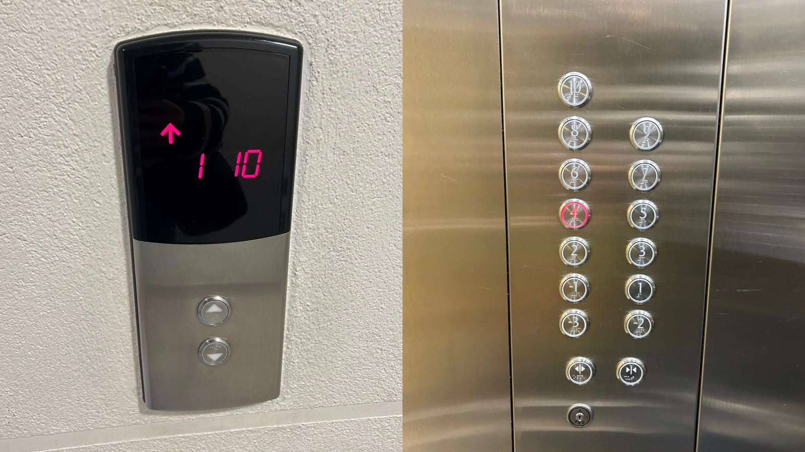
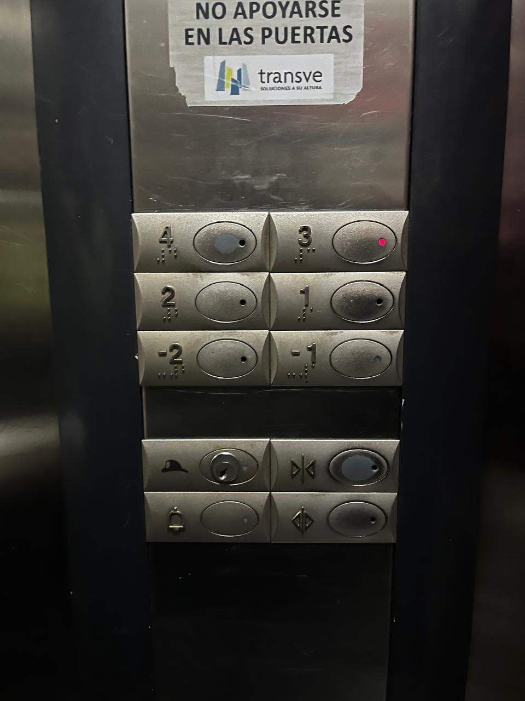
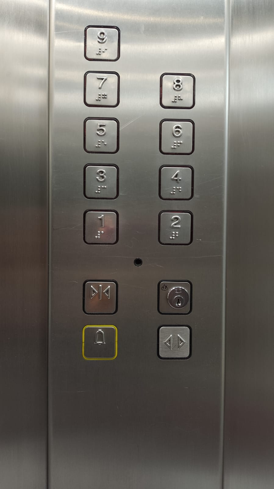

# sesion-00b

## apuntes sesión
- Introducción a GitHub, herramienta que utilizaremos este semestre (nuestra bitácora).
- No estuve esta primera clase, ya que recién me pude inscribir en la sesión-01a, pero lo que más me llama la atención del taller y por qué quería estar es porque quiero aprender sobre programación, ya que anteriormente tomé interacciones inalámbricas y me gustaría seguir profundizando sobre el tema.
  
## encargos
- Sacar fotos de botoneras de ascensor y realizar textos que los describan.

**¿Qué es un ascensor?**
- Aparato el cual sirve para transportar personas y/o cargas entre los diferentes pisos de un edificio de manera vertical. Se destacan por facilitar el desplazamiento entre pisos.
  
**1. Ascensor 1: edificio vane**

- Este ascensor en la pantalla que se encuentra en cada piso del edificio cuenta con los números, los cuales indican piso actual de ambos ascensores, además una flecha hacia arriba o abajo indicando la dirección a la cual se dirige este, además con dos botones los cuales indican dirección, con el fin de presionarlos para que el ascensor sepa tu dirección, también al presionar el botón se enciende una luz roja, indicando un tipo de micro interacción y diseño intuitivo, finalizando así la descripción del botón con incluir sistema braille en grabado, para las personas con discapacidad visual. 

- Al interior de este ascensor encontramos la cantidad de pisos del edificio, cada uno encerrado en un botón de forma circular e incluyendo también sistema braille, además de dos botones que no indican número, si no que indican cierre o apertura de puertas con señalización en triángulos. Por último tenemos en la parte inferior una cerradura, la cual necesita de una llave. Lo más probable es que sea para poder abrir el recuadro que componen los número y el funcionamiento general del ascensor.

**2. Ascensor 2: república 180**

- Este ascensor cuenta con 6 pisos en total (2 subterráneos). En los botones nos podemos fijar que los número son son parte del botón, si no que van al costado, el botón al presionarlo enciende una luz roja, no todo el botón se enciende dejando un margen de color, además cuenta con sistema braille y 4 botones adicionales a los de los pisos, como son: para abrir y cerrar puertas, botón de emergencia y botón para bomberos o en caso de incendio.

**3. Ascensor 3: ministerio de transportes**

- Este ascensor cuanta con 9 pisos. Los números de los pisos se encasillan en botones cuadrados con un borde semi circular, con sistema braille y al presionarlo se enciende el botón, además de contar con 4 botones adicionales que son para abrir y cerrar las puertas del ascensor, uno con un ícono de campana (en caso de emergencia) y uno que cuenta con un tipo de cerradura. Los números se leen de izquierda a derecha y de abajo hacia arriba, también en zig zag.  

