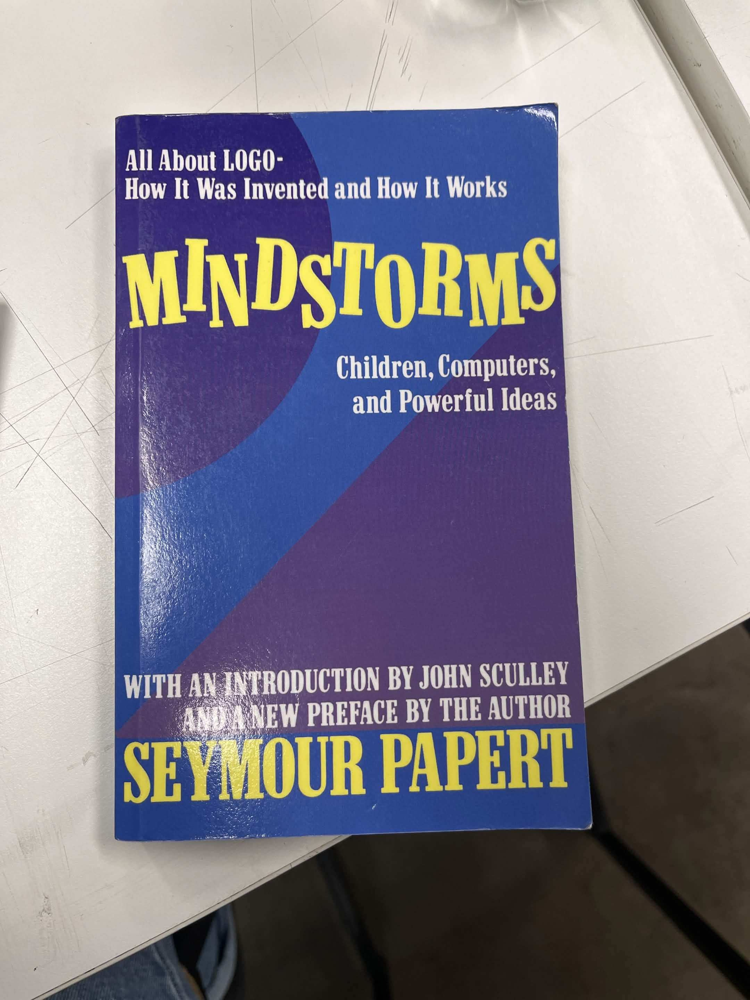
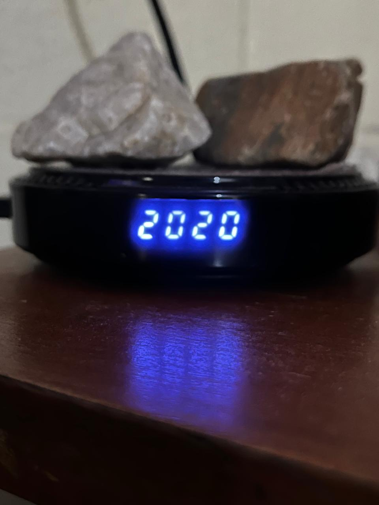
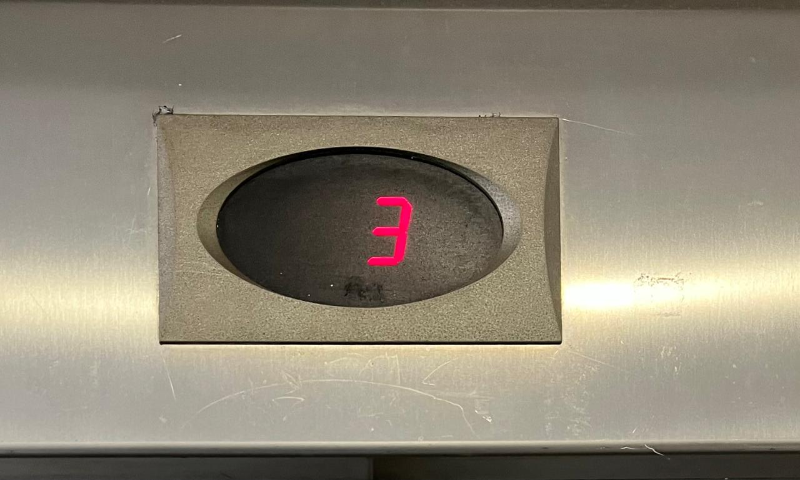
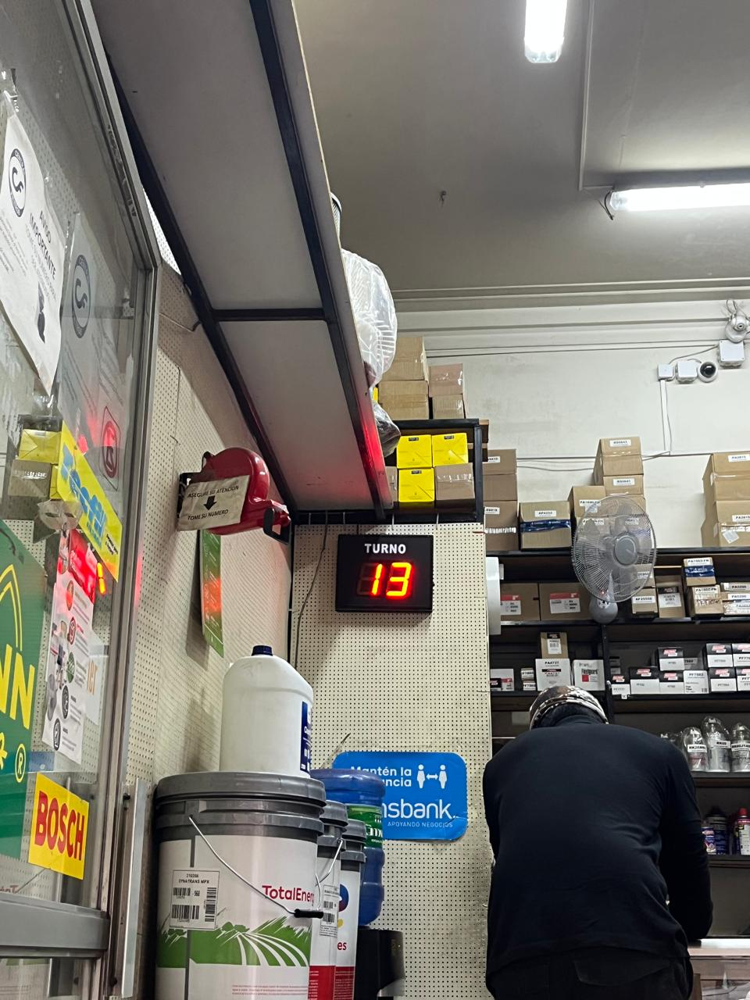
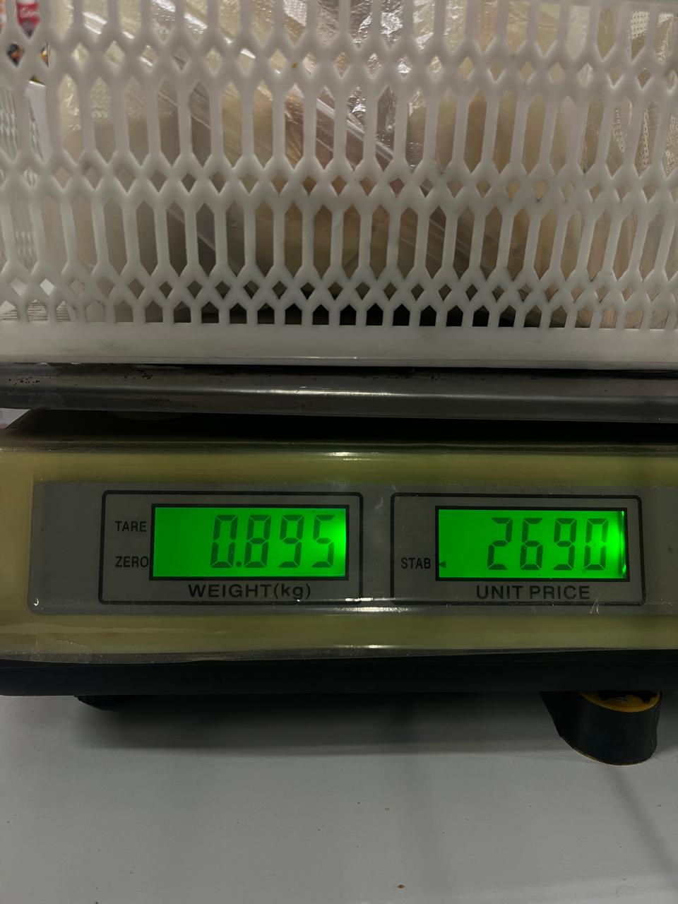

# sesion-01a

## apuntes sesión
- realizamos una breve introducción a GitHub, aprendiendo lo básico de la plataforma. Además de introducirnos a los repositorios que utilizaremos este semestre. 
- algunos hacks que no sabía:
  - copiar: utilizar doble click (mejor forma en programación) -- más exacta y precisa.
  - software git: poder visualizar el historial del documento.
  - terminal: es una interfaz, la cual permite la comunicación directa con un sistema operativo escribiendo comandos (texto).
  - nunca usar mayúsculas.
  - no espacios ni mayúsculas en los nombres de los archivos.
  - espacio como cosas distintas, así lo entiende el computador.
  - git – tonto (chiste taller). 
  - “.” significa aquí.
  - si no hay paréntesis es un dato.
  - if (estoy en un piso), abrir puerta(); sonar alarma();

- Linus Torvalds
  - ingeniero de software.
  - creador Linux -- gratuito y fuente abierta, componentes de software más importantes del mundo.
  - creador Git -- sistema control de versiones, la cual permite que los desarrolladores puedan trabajar con diferentes versiones del código y combinar sus cambios.

- en esta clase además volvimos a retomar y charlar sobre los datos del ascensor (encargo 00)
- *punteo datos ascensor:*
  - el ascensor para en los pisos que está programado para parar.
  - eje de coordenadas eje z.
  - sistema: poleas, motores, cables.
  - uso del contra peso.
  - electricidad (actualidad).
  - bien público acceso a la electricidad (hace 100 años).
  - precio ascensor.
  - trabajar en datos duros.
  - uso de los números (japón no hay 4 :0).
  - subsuelos, estacionamientos, nivel manzana.
  - botones auxiliares: emergencia, bomberos, prender apagar luz-aire.
  - sticker mantención.
  - tiempo puerta abierta.
  - subir y bajar.
  - mantenerse en el piso.

- también nos juntamos en grupo para poder comparar nuestras fotos de ascensores y ver sus variables y funciones
  - El ascensor cuenta con una puerta, en donde se llama a este, al presionar el botón del exterior. Generalmente cuentan con similitudes de materialidad (los más actuales), acero inoxidable y hierro. Los botones que indican el número de pisos, la luz que se obtiene al presionar el botón e indica el piso al que se dirige. Algunos de estos incluyen el uso del sistema braille en los botones para personas con discapacidad visual.
  Según nuestros ascensores analizados encontramos ciertas similitudes tales como: peso límite, es decir que todos indican un peso máximo pero varía según tamaño del ascensor, mecanismo de cierre y apertura de puertas, el cual incluye sensor el cual detecta movimiento. En su mayoría se cuenta con pantalla digital la cual se indica número de piso actual.
  > texto realizado en clases

## libro semestre
- cada persona en la clase se tuvo que acercar a la mesa de enfrente, donde se encontraban libros de Aarón, los cuales cada uno fue escogiendo libremente un libro que debemos leer durante todo el semestre y cada martes llevar un resumen con 2 citas rescatadas de lo que leímos, ideal leer una página al día, como meta 100 páginas terminando el semestre o terminar el libro.



## encargos

- autorretrato: describir variables y funciones de ustedes.
- investigar pantallas de segmentos, tomar fotos, documentar contexto, lugar, ubicación, alfabetos posibles, usos, comparar entre resultados encontrados, al menos 3 ejemplos distintos. https://en.wikipedia.org/wiki/Segment_display
  
¿Qué es un autoretrato? -- representación que una persona realiza de sí misma.
- Variables -- características que pueden cambiar o te describen.
- Funciones -- aquello que realizas, aportas o cómo actúas según el contexto y entorno.

**autoretrato**
- Variables: Soy Isidora, tengo actualmente 20 años, mido 1,56. Mis características físicas más evidentes es que tengo el pelo liso y largo, actualmente uso frenillos, tengo los ojos color café y cuando tengo sueño se me vuelven un poco más claros. Tengo un poco de pecas alrededor de los ojos pero muy pocas (me gustaría tener más). Personalmente siento que me destaco por ser una persona al comienzo introvertida, luego de que entro en confianza no me cuesta desenvolverme. Siempre trato de ir con la verdad por delante, me considero una persona bastante sincera, tratar de ser honesta pero manejando mis palabras, también no tengo mucha paciencia (algo que he ido trabajando con el tiempo y que esta carrera me ha enseñado aprender a manejarlo). En estos momentos de mi vida soy scout, algo que me ha enseñado mucho a lo largo de los años (llevo 13 años). Tengo habilidades para tejer, matemáticas, baile, sudoku. Finalmente creo que una de mis características que más destaco es que soy una persona bastante expresiva y sensible, particularmente en mi mirada, la gente sabe automáticamente si me pasa algo solo viéndome a la cara y además lo sensible es que nunca a lo largo de mi vida me han prohibido expresar mis emociones ante el resto, haciéndome así una persona transparente y clara al comunicar lo que siente.

- Funciones: Soy estudiante de 3er año en la carrera de diseño en la universidad Diego Portales. También trabajo en Jumbo, algo que no hago con recurrencia ya que puedo tomar turnos según mi conveniencia y horario. Como mencioné soy scout y mi rol es estar a cargo de adolescentes entre los 11-15 años. Trato de cumplir un rol fundamental en su crecimiento, a ser mujeres empoderas y que se hagan valer por sí mismas. Me destaco por ser una persona ordenada y organizada, capaz de poder llevar proyectos, eventos u cosas mínimas a cabo. 

**pantallas de segmentos**
- dispositivo de visualización que se compone de varios segmentos, los cuales se encienden o apagan para mostrar números o letras.
- suelen ser LEDS individuales o cristales líquidos.
- la pantalla más utilizada es la de 7 segmentos, que sirve para dígitos y ALGUNAS letras. 

**otras pantallas**
- 7 segmentos: modelo más común.
- 8 segmentos: similar a las de 7 segmentos, solo que se le añade un punto al lado del dígito.
- 9 segmentos: se le agregan diagonales, las cuales hacen que los números se vean mejor representados.
- 14 segmentos: se le agregan cuatro diagonales y dos verticales, mostrando números y letras de manera más clara.
- 16 segmentos: divide trazos horizontales por la mitad y añade diagonales.
- 22 segmentos: variante avanzada, la cual permite visualizar letras minúsculas con trazos descendentes.

ejemplos investigados:
 
1. pantalla reloj de mi casa
- para empezar el encargo, decidí por buscar pantallas en mi casa las cuales me sirvieran para la tarea, encontré esta, la cual es la del reloj que tiene como el "roku" de mi televisión del living. Decidí sacarle foto en una hora espejo (TOC).
  
 

2. pantalla ascensor república 180
- mientras estaba en la universidad (República 180) me recordé de la tarea, ya que necesitaba más ejemplos, al momento de salir de la biblioteca me percaté del ascensor y los números, los cuales me servían como pantalla de segmentos.
  
 

3. pantalla tótem número
- en la tarde del jueves tuve cfg por la calle Vergara (Facultad de Psicología), iba de camino al metro Los Héroes y mientras caminaba vi esta tienda (no recuerdo que vendían, pero eran como tipo repuestos) y me devolví a sacarle foto, ya que iba caminando rápido jaja.
  
 

4. pantalla balanza negocio donde compro pan
- de camino a mi casa, tenía pensado en otras pantallas que tuviera en mi rutina, la mayoría de veces me toca comprar pan a mi porque llego de las primeras a la casa, entonces recordé la pesa del negocio y decidí fotografiarla para el encargo.
  

   
## lectura

### Mindstorms: Children, Computers and Powerful Ideas - Seymour Papert

realicé la lectura del prólogo y del primer capítulo llamado "Los engranajes de mi infancia". en donde el libro en estas primeras páginas se me hace muy liviano de leer (no soy una persona que lee) y además siento que se asimila mucho a la ideología del taller y los ramos que realiza Aarón, en el sentido de que es todo muy poético y tenemos que tener pasión por lo que realizamos.

```
"At the time, there were 200.000 personal computers in the wordl, and if people wanted to use them, most had to go through some kind of basic and usually paintasking--instruction. Today, over 200.000 personal computers are manufactured in a single week. More important, personal computers play a central role in our lives and have become indispensable in the educational environment."

"En ese momento, había 200.000 ordenadores personales en el mundo, y si la gente quería usarlos la mayoría tenía que pasar por algún tipo de instrucción básica, y generalmente minuciosa. Hoy en día, se fabrican más de 200.000 ordenadores personales en una sola semana. Más importante aún, las computadoras personales juegan un papel central en nuestras vidas y se han vuelto indispensables en el entorno educativo." 
```
- esta cita me hace pensar en cómo las tecnologías a lo largo del tiempo han ido evolucionando y también haciéndonos el trabajo más fácil o menos tedioso.
  
```
"When finished, I could capture most of these and felt excitement upon realizing I could name the procedure anything I wanted and later saw the same excitement in my students when they called their shapes by their own names or by a combination of letters meaning something to only them."

"Cuando terminé, pude capturar la mayoría de estos y sentí emoción al darme cuenta de que podía nombrar el procedimiento como quisiera y más tarde vi esa misma emoción en mis estudiantes cuando llamaban sus formas por sus propios nombres o por una combinación de letras que significaba algo solo para ellos."
```
- acá me hizo pensar en la dinámica de Aarón, en el sentido de que siempre menciona la emoción, el sentimiento de lo que hacemos o de la gente al momento de preguntar o tener interés por lo que hacemos en clases, ya que es algo en lo que no estamos obligados a estar y algo que en unos años será nuestro trabajo.
  
```
"Most important of all, in many schools students were now able to use programming as an expressive medium to study other topics rather than as a skill to be learnec for the sake of learning it."

"Lo más importante de todo, en muchas escuelas los estudiantes ahora podían usar la programación como un medio expresivo para poder estudiar otros temas en lugar de como una habilidad que se aprende para aprenderla."
```
- siento que esta cita refleja nuestra carrera, en cómo nadie nos obligó a estudiar Diseño y que estamos en un ambiente en el cual no serás cuestionado, si no que entre todos nos apoyamos. Usando como medios de expresión la programación y cómo a través de este podemos dar a conocer nuestra visión de la vida.
  
```
"Slowly I began to formulate what I still consider the fundamental fact about learning: Anything is easy, if you can assimilate it ti your collection of models. If you cant, anything can be painfully difficult."

"Poco a poco comencé a formular lo que todavía considero el hecho fundamental sobre el aprendizaje: cualquier cosa es fácil si puedes asimilarla a tu colección de modelos, Si no puedes, cualquier cosa puede ser dolorosamente difícil."
```
- lo que sentí con esta cita es el hecho de sentir pasión por lo que hacemos e interés, hace que las cosas sean un poco menos difíciles al fin y al cabo, en donde si somos capaces de tener interés y autonomía, seremos capaces de poder afrontar los obstáculos.

