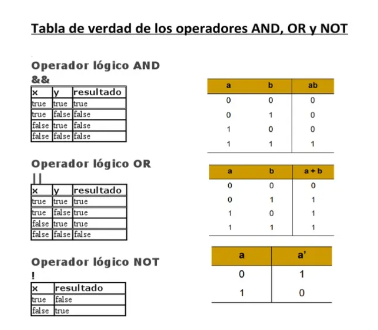

# sesion-01b

## apuntes sesión
### - George Boole
  - padre de la ciencia de la computación, creó álgebra de boole.
    
### - álgebra booleana
  - trabaja con dos valores binarios 0 (falso/apagado) 1 (verdadero/encendido), usadas para analizar y simplificar operaciones. lógicas.
    
### - operaciones básicas
  - OR / O (+) -- da como resultado 1, si al menos una de las entradas es 1.
  - AND / Y (*) -- da como resultado 1, si todas las entradas son 1.
  - NOT / NO -- invierte valor variable.



### - conteo en binario
  - cada posición representa una potencia de 2. (0-9)

### tabla equivalencias 4 bits
| binario | cálculo | decimal |
|---|---|---|
| 0000 | — | 0 |
| 0001 | 2⁰ | 1 |
| 0010 | 2¹ | 2 |
| 0011 | 2¹+2⁰ | 3 |
| 0100 | 2² | 4 |
| 0101 | 2²+2⁰ | 5 |
| 0110 | 2²+2¹ | 6 |
| 0111 | 2²+2¹+2⁰ | 7 |
| 1000 | 2³ | 8 |
| 1001 | 2³+2⁰ | 9 |
| 1010 | 2³+2¹ | 10 |
| 1111 | 2³+2²+2¹+2⁰ | 15 |

El bit de la derecha cambia en cada paso (0, 1, 0, 1...), el segundo cambia cada dos pasos, el tercero cada cuatro y el cuarto cada ocho.

### - historia y contexto bug
  - bicho o insecto en inglés.
  - se encontró una polilla atrapada dentro de un relé de la computadora Harvard Mark II, causando una falla en el sistema.


### - variables
  - contenedores para almacenar valores de datos, que pueden cambiar o tomar distintos valores.

```
int: almacena enteros (números enteros), sin decimales, como 123 o -123.
double: almacena números de coma flotante, con decimales, como 19,99 o -19,99.
char: almacena caracteres individuales, como 'a' o 'B'. Los valores de tipo char están rodeados de comillas simples.
string: almacena texto, como "Hola Mundo". Los valores de las cadenas están rodeados de comillas dobles.
bool: almacena valores con dos estados: verdadero o falso / si o no.
if: permite ejecutar el código solo si cumple una condición.
```
> información sacada de https://www.w3schools.com/cpp/cpp_variables.asp

### Arduino IDE 2.3.10
- este software es el que utilizaremos en este taller.
- IDE: entorno desarrollo integrado.
- Hernando Barragán -- tesis de magíster -- wiring "Arduino es un fork" (copia de un proyecto de código abierto para crear un programa nuevo e independiente) 
> yo ya había utilizado este software, ya que lo utilizamos en interacciones inalámbricas el semestre pasado. de igual forma la clase me ayudó a refrescar la memoria sobre el software.

### estuctura principal 
```cpp
void setup() {
  // aqui va setup(), ocurre una vez, al principio

}

void loop() {
  // aqui va loop()
  // ocurre despues de setup()
  // se repite hasta que no se pueda
}
```
### notación camello
- forma de escribir palabras compuestas o frases sin espacios ni guiones, uniendo todo y usando una letra mayúscula para iniciar cada palabra nueva a partir de la segunda.
  
### datos importantes
- setup: configuración para que empiece (función: secuencia de instrucciones) partes importantes, valores numerales, letras, palabras, imágenes, declarar datos). no responder, solo ocurrir.
- void: vacío, "esta función ocurre...", no expulsa valor, tipo.
- (): indica que tiene una función.
- ; aquí termina. como punto final.
- // comentario, describe todo lo que va a pasar, toda línea de código tiene que estar comentada.
- pseudocódigo
- { }: tiene que abrir y cerrar; estas llaves declaran la función.
- == comparar
- ctrl d formatear
está prohibido escribir una línea de código sin describir lo que tiene que pasar.
- loop: se repite hasta que no se pueda. va después de setup.
- backtick: carácter para renderizar códigos + indicar lenguaje cpp. ```

## encargos

encargo01b:

1. tratar de correr un código en el microcontrolador asignado a cada dupla, incluir referentes, citas, comentarios, imágenes, descripciones textuales, y en caso de éxito o fracaso incluir aciertos, preguntas, dramas, atados. recordatorio que estos apuntes son personales, cada persona sube su versión.
2. proponer una función con nombre, tipo, argumentos y uso, que modele algún área de su interés, por ejemplo subirCerro(enBicicleta), tomarMetro(conPaseEscolar), etc. escribir en pseudocódigo los pasos que necesita esa función internamente para que literalmente funcione.

## lectura
