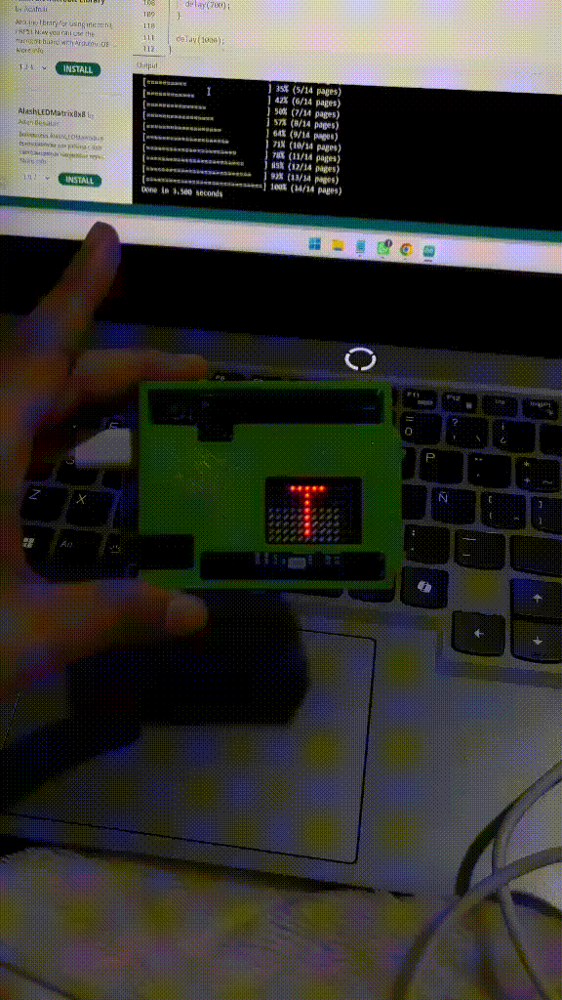
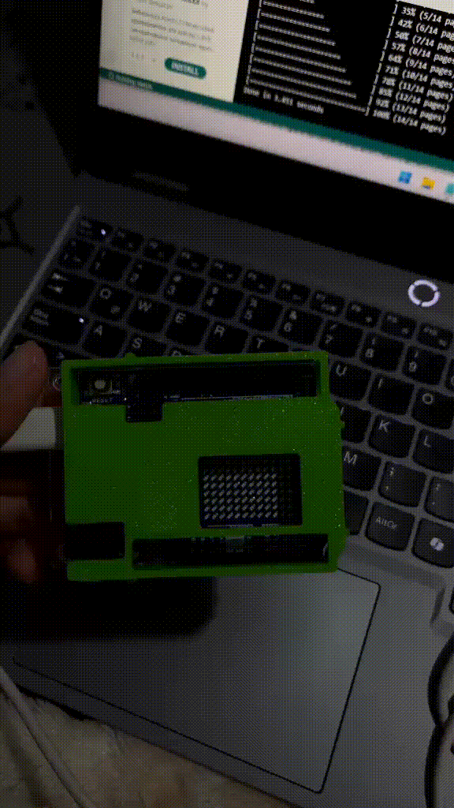

# sesion-01b

## apuntes sesión
### - George Boole
  - padre de la ciencia de la computación, creó álgebra de boole.
    
### - álgebra booleana
  - trabaja con dos valores binarios 0 (falso/apagado) 1 (verdadero/encendido), usadas para analizar y simplificar operaciones. lógicas.
    
### - operaciones básicas
  - OR / O (+) -- da como resultado 1, si al menos una de las entradas es 1.
  - AND / Y (*) -- da como resultado 1, si todas las entradas son 1.
  - NOT / NO -- invierte valor variable.


### - conteo en binario
  - cada posición representa una potencia de 2. (0-9)

### tabla equivalencias 4 bits
| binario | cálculo | decimal |
|---|---|---|
| 0000 | — | 0 |
| 0001 | 2⁰ | 1 |
| 0010 | 2¹ | 2 |
| 0011 | 2¹+2⁰ | 3 |
| 0100 | 2² | 4 |
| 0101 | 2²+2⁰ | 5 |
| 0110 | 2²+2¹ | 6 |
| 0111 | 2²+2¹+2⁰ | 7 |
| 1000 | 2³ | 8 |
| 1001 | 2³+2⁰ | 9 |
| 1010 | 2³+2¹ | 10 |
| 1111 | 2³+2²+2¹+2⁰ | 15 |

El bit de la derecha cambia en cada paso (0, 1, 0, 1...), el segundo cambia cada dos pasos, el tercero cada cuatro y el cuarto cada ocho.

grupo de 4 bits = 8 4 2 1

ejemplo 12 = c = 1100

8 4 2 1

1 1 0 0 

| Binario | Decimal | Hexadecimal |
|---|---:|---|
| `0000` | 0 | `0` |
| `0001` | 1 | `1` |
| `0010` | 2 | `2` |
| `0011` | 3 | `3` |
| `0100` | 4 | `4` |
| `0101` | 5 | `5` |
| `0110` | 6 | `6` |
| `0111` | 7 | `7` |
| `1000` | 8 | `8` |
| `1001` | 9 | `9` |
| `1010` | 10 | `A` |
| `1011` | 11 | `B` |
| `1100` | 12 | `C` |
| `1101` | 13 | `D` |
| `1110` | 14 | `E` |
| `1111` | 15 | `F` |

1 byte = 8 bits

### - historia y contexto bug
  - bicho o insecto en inglés.
  - se encontró una polilla atrapada dentro de un relé de la computadora Harvard Mark II, causando una falla en el sistema.


### - variables
  - contenedores para almacenar valores de datos, que pueden cambiar o tomar distintos valores.

```
int: almacena enteros (números enteros), sin decimales, como 123 o -123.
double: almacena números de coma flotante, con decimales, como 19,99 o -19,99.
char: almacena caracteres individuales, como 'a' o 'B'. Los valores de tipo char están rodeados de comillas simples.
string: almacena texto, como "Hola Mundo". Los valores de las cadenas están rodeados de comillas dobles.
bool: almacena valores con dos estados: verdadero o falso / si o no.
if: permite ejecutar el código solo si cumple una condición.
```
> información sacada de https://www.w3schools.com/cpp/cpp_variables.asp

### Arduino IDE 2.3.10
- este software es el que utilizaremos en este taller.
- IDE: entorno desarrollo integrado.
- Hernando Barragán -- tesis de magíster -- wiring "Arduino es un fork" (copia de un proyecto de código abierto para crear un programa nuevo e independiente) 
> yo ya había utilizado este software, ya que lo utilizamos en interacciones inalámbricas el semestre pasado. de igual forma la clase me ayudó a refrescar la memoria sobre el software.

### estuctura principal 
```cpp
void setup() {
  // aqui va setup(), ocurre una vez, al principio

}

void loop() {
  // aqui va loop()
  // ocurre despues de setup()
  // se repite hasta que no se pueda
}
```
### notación camello
- forma de escribir palabras compuestas o frases sin espacios ni guiones, uniendo todo y usando una letra mayúscula para iniciar cada palabra nueva a partir de la segunda.
  
### datos importantes
- setup: configuración para que empiece (función: secuencia de instrucciones) partes importantes, valores numerales, letras, palabras, imágenes, declarar datos). no responder, solo ocurrir.
- void: vacío, "esta función ocurre...", no expulsa valor, tipo.
- (): indica que tiene una función.
- ; aquí termina. como punto final.
- // comentario, describe todo lo que va a pasar, toda línea de código tiene que estar comentada.
- pseudocódigo
- { }: tiene que abrir y cerrar; estas llaves declaran la función.
- == comparar
- ctrl d formatear
está prohibido escribir una línea de código sin describir lo que tiene que pasar.
- loop: se repite hasta que no se pueda. va después de setup.
- backtick: carácter para renderizar códigos + indicar lenguaje cpp. ```
- bool: almacena dos valores (verdadero/falso).
- string: manejar cadenas de texto.

## encargos

encargo01b:

1. tratar de correr un código en el microcontrolador asignado a cada dupla, incluir referentes, citas, comentarios, imágenes, descripciones textuales, y en caso de éxito o fracaso incluir aciertos, preguntas, dramas, atados. recordatorio que estos apuntes son personales, cada persona sube su versión.
2. proponer una función con nombre, tipo, argumentos y uso, que modele algún área de su interés, por ejemplo subirCerro(enBicicleta), tomarMetro(conPaseEscolar), etc. escribir en pseudocódigo los pasos que necesita esa función internamente para que literalmente funcione.

### código
- al principio le pedí a chatgpt que me realizara códigos de frases o letras sueltas, para interiorizarme solo con la pantalla del Arduino UNO R4 WIFI.

*códigos de prueba realizados con chatgpt*

```cpp
#include "Arduino_LED_Matrix.h"

ArduinoLEDMatrix matrix;

// Letras para "TE AMO"
// Cada letra ocupa 5 columnas y 7 filas

const uint8_t mensaje[][8][5] = {

  // T
  {
    {1,1,1,1,1},
    {0,0,1,0,0},
    {0,0,1,0,0},
    {0,0,1,0,0},
    {0,0,1,0,0},
    {0,0,1,0,0},
    {0,0,1,0,0},
    {0,0,0,0,0}
  },

  // E
  {
    {1,1,1,1,1},
    {1,0,0,0,0},
    {1,0,0,0,0},
    {1,1,1,1,0},
    {1,0,0,0,0},
    {1,0,0,0,0},
    {1,1,1,1,1},
    {0,0,0,0,0}
  },

  // Espacio
  {
    {0,0,0,0,0},
    {0,0,0,0,0},
    {0,0,0,0,0},
    {0,0,0,0,0},
    {0,0,0,0,0},
    {0,0,0,0,0},
    {0,0,0,0,0},
    {0,0,0,0,0}
  },

  // A
  {
    {0,1,1,1,0},
    {1,0,0,0,1},
    {1,0,0,0,1},
    {1,1,1,1,1},
    {1,0,0,0,1},
    {1,0,0,0,1},
    {1,0,0,0,1},
    {0,0,0,0,0}
  },

  // M
  {
    {1,0,0,0,1},
    {1,1,0,1,1},
    {1,0,1,0,1},
    {1,0,0,0,1},
    {1,0,0,0,1},
    {1,0,0,0,1},
    {1,0,0,0,1},
    {0,0,0,0,0}
  },

  // O
  {
    {0,1,1,1,0},
    {1,0,0,0,1},
    {1,0,0,0,1},
    {1,0,0,0,1},
    {1,0,0,0,1},
    {1,0,0,0,1},
    {0,1,1,1,0},
    {0,0,0,0,0}
  }
};

void setup() {
  matrix.begin();
}

void loop() {

  // Recorremos las letras
  for (int letra = 0; letra < 6; letra++) {

    uint8_t pantalla[8][12] = {};

    // Copiar la letra al centro de la pantalla
    for (int fila = 0; fila < 8; fila++) {
      for (int columna = 0; columna < 5; columna++) {

        if (columna + 3 < 12) {
          pantalla[fila][columna + 3] =
            mensaje[letra][fila][columna];
        }

      }
    }

    matrix.renderBitmap(pantalla, 8, 12);

    delay(700);
  }

  delay(1000);
}
```



```cpp
#include "Arduino_LED_Matrix.h"

ArduinoLEDMatrix matrix;

// Letras de 5x7
const byte letras[27][7][5] = {

  // A
  {{0,1,1,1,0},{1,0,0,0,1},{1,0,0,0,1},{1,1,1,1,1},{1,0,0,0,1},{1,0,0,0,1},{1,0,0,0,1}},

  // B
  {{1,1,1,1,0},{1,0,0,0,1},{1,0,0,0,1},{1,1,1,1,0},{1,0,0,0,1},{1,0,0,0,1},{1,1,1,1,0}},

  // C
  {{0,1,1,1,1},{1,0,0,0,0},{1,0,0,0,0},{1,0,0,0,0},{1,0,0,0,0},{1,0,0,0,0},{0,1,1,1,1}},

  // D
  {{1,1,1,1,0},{1,0,0,0,1},{1,0,0,0,1},{1,0,0,0,1},{1,0,0,0,1},{1,0,0,0,1},{1,1,1,1,0}},

  // E
  {{1,1,1,1,1},{1,0,0,0,0},{1,0,0,0,0},{1,1,1,1,0},{1,0,0,0,0},{1,0,0,0,0},{1,1,1,1,1}},

  // F
  {{1,1,1,1,1},{1,0,0,0,0},{1,0,0,0,0},{1,1,1,1,0},{1,0,0,0,0},{1,0,0,0,0},{1,0,0,0,0}},

  // G
  {{0,1,1,1,1},{1,0,0,0,0},{1,0,0,0,0},{1,0,1,1,1},{1,0,0,0,1},{1,0,0,0,1},{0,1,1,1,1}},

  // H
  {{1,0,0,0,1},{1,0,0,0,1},{1,0,0,0,1},{1,1,1,1,1},{1,0,0,0,1},{1,0,0,0,1},{1,0,0,0,1}},

  // I
  {{1,1,1,1,1},{0,0,1,0,0},{0,0,1,0,0},{0,0,1,0,0},{0,0,1,0,0},{0,0,1,0,0},{1,1,1,1,1}},

  // J
  {{0,0,0,0,1},{0,0,0,0,1},{0,0,0,0,1},{0,0,0,0,1},{1,0,0,0,1},{1,0,0,0,1},{0,1,1,1,0}},

  // K
  {{1,0,0,0,1},{1,0,0,1,0},{1,0,1,0,0},{1,1,0,0,0},{1,0,1,0,0},{1,0,0,1,0},{1,0,0,0,1}},

  // L
  {{1,0,0,0,0},{1,0,0,0,0},{1,0,0,0,0},{1,0,0,0,0},{1,0,0,0,0},{1,0,0,0,0},{1,1,1,1,1}},

  // M
  {{1,0,0,0,1},{1,1,0,1,1},{1,0,1,0,1},{1,0,0,0,1},{1,0,0,0,1},{1,0,0,0,1},{1,0,0,0,1}},

  // N
  {{1,0,0,0,1},{1,1,0,0,1},{1,0,1,0,1},{1,0,0,1,1},{1,0,0,0,1},{1,0,0,0,1},{1,0,0,0,1}},

  // O
  {{0,1,1,1,0},{1,0,0,0,1},{1,0,0,0,1},{1,0,0,0,1},{1,0,0,0,1},{1,0,0,0,1},{0,1,1,1,0}},

  // P
  {{1,1,1,1,0},{1,0,0,0,1},{1,0,0,0,1},{1,1,1,1,0},{1,0,0,0,0},{1,0,0,0,0},{1,0,0,0,0}},

  // Q
  {{0,1,1,1,0},{1,0,0,0,1},{1,0,0,0,1},{1,0,0,0,1},{1,0,1,0,1},{1,0,0,1,0},{0,1,1,0,1}},

  // R
  {{1,1,1,1,0},{1,0,0,0,1},{1,0,0,0,1},{1,1,1,1,0},{1,0,1,0,0},{1,0,0,1,0},{1,0,0,0,1}},

  // S
  {{0,1,1,1,1},{1,0,0,0,0},{1,0,0,0,0},{0,1,1,1,0},{0,0,0,0,1},{0,0,0,0,1},{1,1,1,1,0}},

  // T
  {{1,1,1,1,1},{0,0,1,0,0},{0,0,1,0,0},{0,0,1,0,0},{0,0,1,0,0},{0,0,1,0,0},{0,0,1,0,0}},

  // U
  {{1,0,0,0,1},{1,0,0,0,1},{1,0,0,0,1},{1,0,0,0,1},{1,0,0,0,1},{1,0,0,0,1},{0,1,1,1,0}},

  // V
  {{1,0,0,0,1},{1,0,0,0,1},{1,0,0,0,1},{1,0,0,0,1},{1,0,0,0,1},{0,1,0,1,0},{0,0,1,0,0}},

  // W
  {{1,0,0,0,1},{1,0,0,0,1},{1,0,0,0,1},{1,0,1,0,1},{1,0,1,0,1},{1,1,0,1,1},{1,0,0,0,1}},

  // X
  {{1,0,0,0,1},{1,0,0,0,1},{0,1,0,1,0},{0,0,1,0,0},{0,1,0,1,0},{1,0,0,0,1},{1,0,0,0,1}},

  // Y
  {{1,0,0,0,1},{1,0,0,0,1},{0,1,0,1,0},{0,0,1,0,0},{0,0,1,0,0},{0,0,1,0,0},{0,0,1,0,0}},

  // Z
  {{1,1,1,1,1},{0,0,0,0,1},{0,0,0,1,0},{0,0,1,0,0},{0,1,0,0,0},{1,0,0,0,0},{1,1,1,1,1}},

  // ESPACIO
  {{0,0,0,0,0},{0,0,0,0,0},{0,0,0,0,0},{0,0,0,0,0},{0,0,0,0,0},{0,0,0,0,0},{0,0,0,0,0}}
};


// Texto
const char texto[] = "TE AMO DIEGO";

void setup() {
  matrix.begin();
}

void loop() {

  // Recorremos cada carácter del mensaje
  for (int posicion = 0; posicion < strlen(texto); posicion++) {

    char caracter = texto[posicion];

    int indice;

    if (caracter >= 'A' && caracter <= 'Z') {
      indice = caracter - 'A';
    } 
    else {
      indice = 26;  // espacio
    }

    // Mostrar letra
    byte pantalla[8][12] = {};

    for (int fila = 0; fila < 7; fila++) {
      for (int columna = 0; columna < 5; columna++) {

        if (letras[indice][fila][columna]) {
          pantalla[fila][columna + 3] = 1;
        }

      }
    }

    matrix.renderBitmap(pantalla, 8, 12);

    delay(700);
  }

  // Pausa al terminar
  delay(1000);
}
```



- solo realicé códigos de prueba con ayuda de chat gpt para hacer correr un código en el Arduino, de igual forma en el curso de interacciones inalámbricas realizamos cosas similares, solo que quise hacer algo más simple corriendo un código por la pantalla de Arduino.
  
### función
- nombre: `deberiaIrABaile`
- tipo: `void`
- argumentos: `tengoGanas` `tengoTiempo` `macaVaABaile` `climaActual` 
- uso: decidir si ir o no dependiendo las ganas que tenga, el clima actual y si maca asiste o no (ella me lleva jej)

posibilidades
- quiero ir a baile -- si/no -- tengo ganas Y tengo tiempo Y maca va a baile  -- si/no -- ir a baile/quedarme en la casa haciendo trabajos pipipi
  
### pseudocódigo
```
deberiaIrABaile(tengoGanas - tengoTiempo - macaVaABaile - climaActual)

SI tengoGanas Y macaVaABaile

   ENTONCES

irABaile

SI NO tengoTiempo

 ENTONCES

quedarmeEnLaCasa 
```
