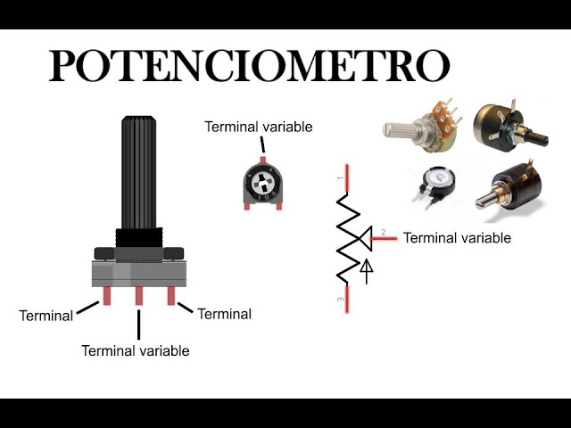
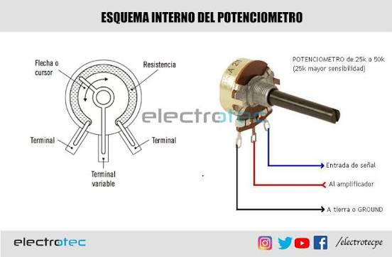
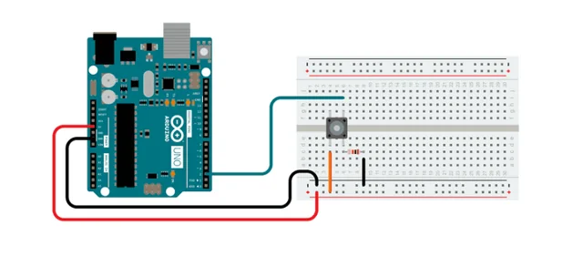
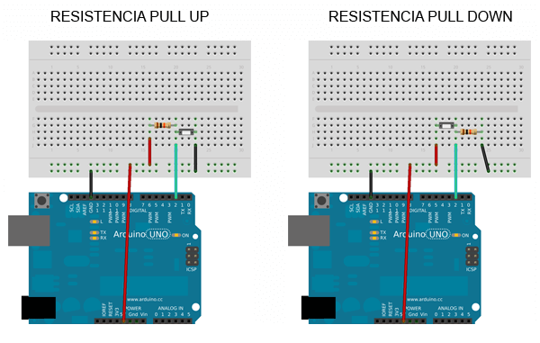
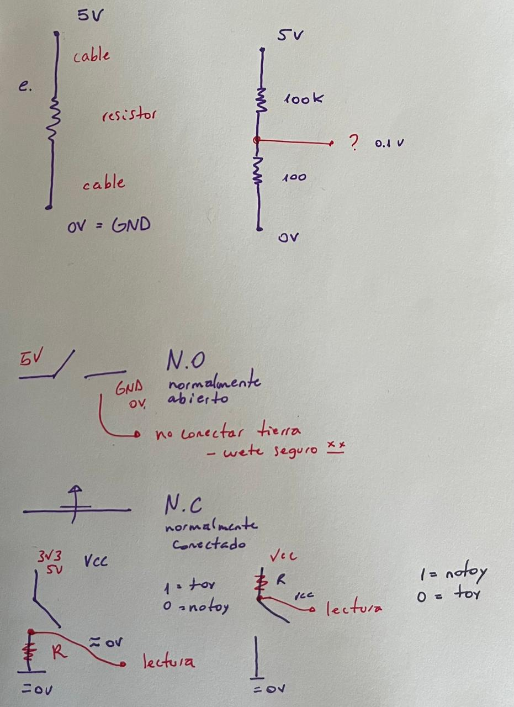
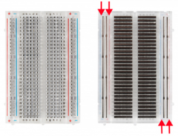

# sesion-02a

## apuntes sesión

### varios
- bau -- construir
- bauhaus -- construir casas omg!

- hoy revisamos contenidos tales como el potenciómetro, botones, cables, algunos artistas/autores.
  
### Jacques Derrida 
- filósofo francés, el cual cuestiona estructuras del lenguaje, creador de la deconstrucción. "el significado del lenguaje nunca es absoluto ni total, sino que está en constante cambio".
  
### Manuela Infante 
- directora teatral y dramaturga, su trabajo es conocido por ofrecer creaciones escénicas que re articulan asuntos teóricos y filosóficos de contingencia.
  
### Martín Gubbins 
- figura destacada de la escena literaria de vanguardia en Latinoamérica, publicando libros de poesía y poesía visual, además participando en exposiciones individuales y colectivas, instalaciones, lecturas, conciertos, performances y festivales.
  
#### https://martingubbins.cl/obra/
---

### potenciómetro
- nos permiten **regular** potencia.
- se destaca por tener extremos, teniendo un rango en el cual se mueve.
- resistor = resistir a que el electrón pase, deja que transite electrón
- flujo electrón = corriente = número electrones.
- midiendo cantidad de corriente.
- el electrón cuando pasa por el resistor se "cansa".
- funciona como interfaz -- forma de encapsular 2 resistores.
- R1 + R2 = constante
- patita 2: manipular voltaje -- tener una variable
- encoders -- codificadores -- giran infinitos
- potencia -- energía/tiempo (potencia suba = subir energía o bajar tiempo)
- eléctrica = voltaje * corriente (otra forma de calcular potencia) -- tiene que de igual forma haber energía y tiempo
- voltaje = energía tiempo = corriente
- lo que se emite es el voltaje/energía
- cuando quiero que suene el doble es 10 veces más fuerte -- logaritmo/exponencial.


-**clasificación potenciómetros**
  
`  A -- audio, uso para cosas digitales
B -- lineales` 

### conexiones
- tener en cuenta las conexiones principales del potenciómetro:
- terminal -- GND (cable negro, café y verde se consideran colores "lechugescos" -- lechuga proviene de la tierra xd)
- terminal -- 5V/VCC/0V (cable rojo, alimentación)
- terminal variable
  




### botones (pulsadores)
- pushbuttons -- elementos temporales -- pasan cosas
- toggtes -- el cambio permanece
- Normaling Open -- el electrón no puede transitar -- si no hay nadie presionándolo es un circuito abierto
- Normalmente Conectado -- siempre conectados -- desconectarlos cuando haces un gesto (presionar)
- no poner GND
- VCC voltaje corriente continua
- utilizar resistor para que no se conecte directamente 5V/3V3/VCC con GND -- ese espacio lo denominaremos lectura - - - (0V), lugar de cambio
- pulldown: permite que la lectura sea 0 a menos que 0 = no estoy 1 = estoy
- pullup 0 = estoy 1 = no estoy


- este primer ejemplo se representa como pulldown, debido a que la resistencia se encuentra conectada directamente a GND
- estoy =1 no estoy = 0.
  





https://docs.arduino.cc/built-in-examples/digital/Button/

https://docs.arduino.cc/built-in-examples/basics/AnalogReadSerial/
cable

### sobre Arduino + breadboard
- breadboard -- tabla pan lol -- acá en Chile se dice protoboard 
- cable rojo: voltaje alimentación
- cable negro: GND
- - = GND
- + = 5V/VCC
- patita media = lectura
- botones lado digital
- potenciómetro lado análogo
- lado análogo = todas entradas
- serial -- uno a la vez en orden
- 9600 baudios x segundo -- moderado
- valores 0 - 1023 = 1024 valores entrada = resolución 10bits 2elevado10


- este es el interior de una protoboard, el cual podemos ver que tanto -/+ son lo mismo hacia abajo, mientras que las letras son lo mismo hacia los lados.


### código prueba Arduino

```cpp

const int patitaLectura = A0;


int valorLectura = -1; 


void setup() {

&#x20;

&#x20;Serial.beign(9600);


}


void loop() {

&#x20; Serial.println ("":)"");

valorLectura = analogRead (patitaLectura);

}

```

### código prueba potenciómetro

```cpp

const int patitaLectura = A0;


int valorLectura = -1;


void setup() {


&#x20; Serial.begin(9600);


}


void loop() {

&#x20;valorLectura = analogRead(patitaLectura); 

&#x20;Serial.println(valorLectura);

}

```

## encargos

encargo02a:

en tu fork, ir a actions, y aceptar que corran github worfklows. subir pantallazo con demostración de que han corrido actions exitosas en tu repo. esto es crucial, si no lo haces, no agregaremos tus apuntes al repo, y las tareas se tomarán como no entregadas. si en tu fork las actions no son exitosas, no serán tampoco agregadas al repo común ni evaluadas.


conformar grupos de 3 a 4 personas para la realización del proyecto-1. 

compartir 2 placas de desarrollo por grupo, documentar estudio conjunto de C++, microcontroladores, botones, potenciómetros.

## lectura

### Mindstorms: Children, Computers and Powerful Ideas - Seymour Papert
- lo que rescato de lo que leí en esta lectura es usar la computadora como extensión de nosotros mismos. me recordé a un tema que estamos viendo en mi cfg, en donde el autor aquí habla sobre lo que se aprende sin que te enseñen, asociándolo a que nosotros nacemos con ciertas capacidades que nadie nos enseña, acá el autor se refiere a los idiomas, por lo cual el uso de los computadores "en un futuro" agilizaría a los niños poder hablar más idiomas que el nativo, usando así la computadora como una herramienta a temprana edad.
- bloqueo de materiales y contenidos según contexto cultural
- matefobia: miedo o ansiedad fuerte que sienten ciertas personas hacia las matemáticas
- utópico educativo
- el uso de la tecnología computacional pueden proporcionar a los niños nuevas posibilidades para apredner, pensar y desarrollar emociones
- un computador para cada estudiante (5% gasto)
- futuro rico en computadoras
  
```
"Ways in wich the computer presence could contribute to mental processes not only instrumentally but in more essential, conceptual ways, influencing how people think even when they are far removed from physical cantact with a computer."

"La presencia de la computadora podría contribuir a los procesos mentales no solo instrumentalmente, si no de maneras más esenciales y conceptuales, influyendo en cómo las personas piensan incluso cuando están lejos del contacto físico con una computadora."
```
- rescaté esta cita, ya que me hace sentido lo que dice a cerca de que las computadoras AYUDAN, es decir, son un apoyo en nuestros procesos.

```
"This book is about how computers can be carriers of powerful ideas and of the seeds of cultural change."

"Este libro trata sobre cómo las computadoras pueden ser portadoras de ideas poderosas y de las escenas del cambio cultural."
```
- me gusta la idea que plantea esta cita, ya que nos muestra a las computadoras no cómo algo que nos reemplazará o asumirá nuestros roles como ser humano, si no que son un ayuda o agentes de cambio de forma positiva hacia el ser humano.

```
"In my vision, the childs programs the computer and, in doing so, both acquires a sence of mastery over a piece of the most modern and powerful technology and establishes an intimate contact..."

"En mi visión, el niño programa la computadora y, al hacerlo, ambos adquieren un sentido de dominio sobre una pieza de la tecnología más moderna y poderosa y establece un contacto íntimo..."
```
```
"Us all to define ourselves as bundles of aptitudes and ineptitudes"

"Nos lleva a todos a definirnos a nosotros mismos como paquetes de aptitudes e ineptitudes"
```

```
"Thus deficiency becomes identity and learning is tranformed from the early childs free exploration of the wordl to a chore beset by insecurities and self-imposed restrictions."

"Así, la deficiencia se convierte en identidad y el aprendizaje se transforma de la libre exploración del mundo del niño temprano a una tarea asustada de inseguridades y restricciones autoimpuestas"
```

```
"If we can grasp the essence of one persons experiences, we may be able to replicate ist consequences in other ways, and in particular this consequence of finding beaty in abstract things"

"Si podemos captar la esencia de las experiencias de una persona, podemos replicar sus consecuencias de otras maneras, y en particular las consecuencias de encontrar belleza en las cosas abstractas."
```
  
