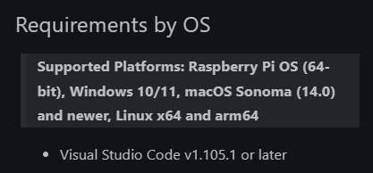
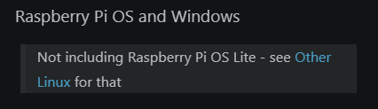
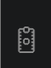
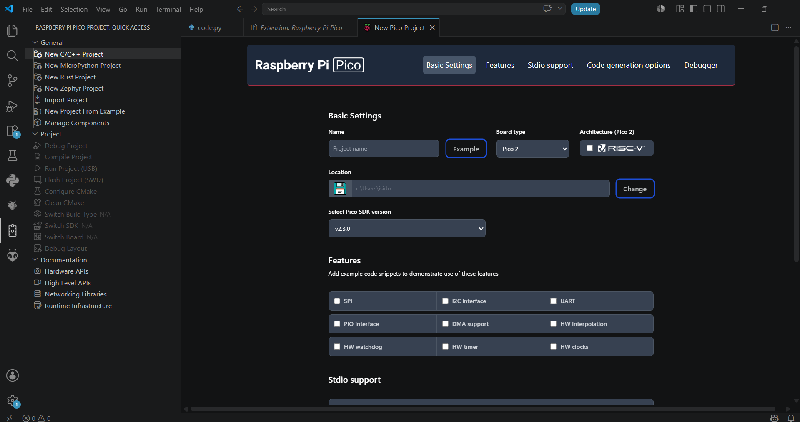

# sesion-02b

clase cancelada por cierre de udp

## apuntes sesión

## encargos

encargo02b:

subimos videos en canvas de hoy, son 3 videos.

1: instalar visual studio code, cami está regrabando el video parte 1 porque tuvimos un problema ténico, les avisará por discord cuando esté listo
2: ver los videos parte 2 y parte 3, aunque no tengan una placa raspberry pi, anotar dudas, tratar de subir código a sus placas si es que las piden.

## apuntes videos

**video 1**
- el primer video sobre la instalación de visual studio code aún no está subido, sin embargo yo ya lo tengo instalado, porque lo utilizamos el semestre pasado en interacciones inalámbricas.

**video raspi parte 2**
- extensión raspberry pi pico -- mini software -- interfaz colección de muchos otros software -- propio tono de programación
- leer y configurar

 

  - requerimientos sistema operativo: se puede usar en un computador raspberry
  - placas raspberry pi pico -- microcontrolador (más chico aún)
  - Raspberry Pi -- empresa
  - Raspberry Pi Pico -- microcontrolador
  - Raspberry Pi Pico proyect -- New C/C++ Proyect: aquí se carga una interfaz, la cual nos permite configurar un proyecto
  - New MicroPython Proyect -- subconjunto Python
  - CircuitPython -- Adafruit

  
    
    

- aquí ya sabemos que tenemos la extensión instalada

 

- acá terminó la parte 1 del video, el cual realizaremos un proyecto en Raspberry Pi Pico proyect -- New C/C++ Proyect
  
**video raspi parte 3**
