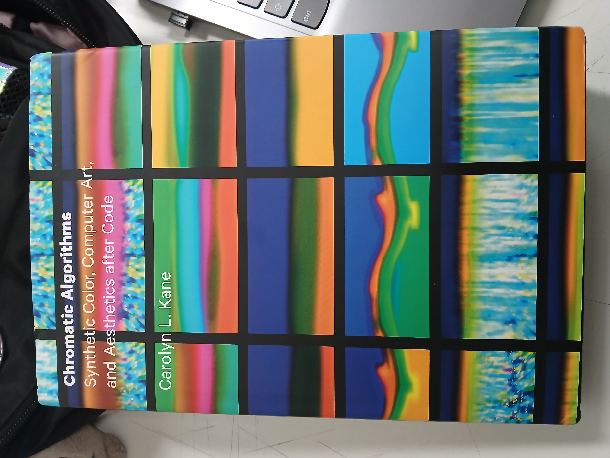

# sesion-01a

2026.08.11

## apuntes sesión

### Bloque 9:00 - 10:30

Aarón nos hizo elegir un libro para leer a lo largo del semestre, elegí **Chromatic Algorithms de Carolyn L. Kane**

Luego hizo un tutorial of sorts de cómo usar el repo del curso y mostró parte de su proceso propio al manejar? administrar el repo eg. pull requests, creación de carpetas, su uso del code terminal

Hubo un momento en el que tuve una duda, y casi inmediatamente fue respondida lol (¿Qué hago como alumno si estoy *behind Y ahead* en mi repo?)

### Bloque 11:00 - 12:50

Nos separamos en grupos basados en cómo estábamos sentados y hablamos de las fotos que tomamos a los ascensores. Mi grupo comparó las imágenes, notando las similitudes y diferencias; además de describir las interacciones arraigadas a cada botón en los ascensores. 

Al comenzar el sharing de lo conversado entre cada grupo, la "discusión" partió con establecer los datos ie. qué es un ascensor, cómo funciona, qué tiene un ascensor. Se habló de las poleas que los manejan, el numering convention para los subsuelos/estacionamientos. Hay botones de emergencia, citófono, para cada piso, abrir/cerrar puertas, encender/apagar las luces en el ascensor. El sticker? que muestra la mantención del ascensor.

When it comes to what an elevator can actually do, funciona en base a variables eg. SI estoy en un piso, puedo abrir la puerta (si no, no lol)

**! En este semestre trabajaremos variables, funciones y pov !**

Aarón habló del código? *sudo rm rf* (what does it do? no idea honestly, spaced out and wasn't paying attention when the topic started). Solo entendí que es un NO lo uses, it **WILL** brick tu pc.

(self task: breakdown said code string to understand it properly)

## encargos

## lectura
