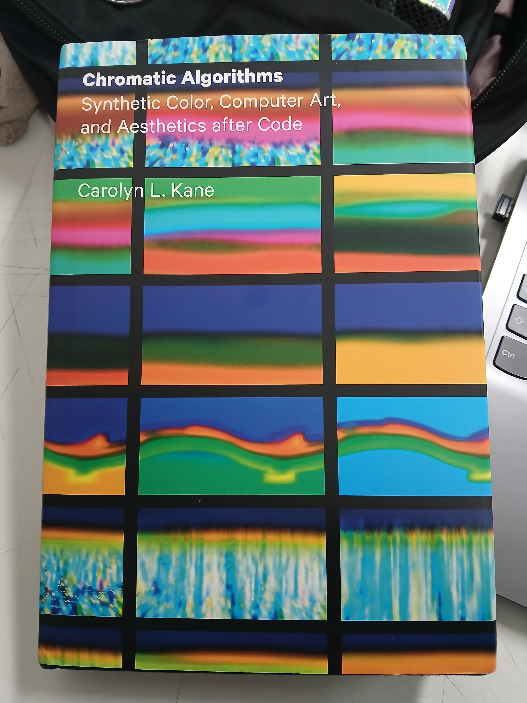
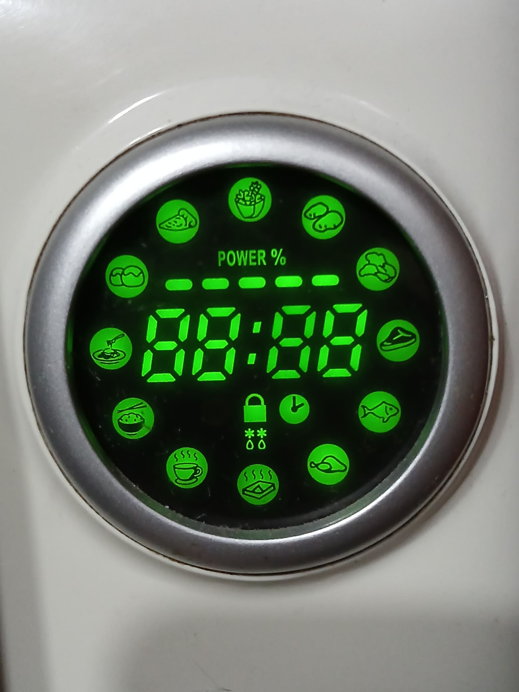
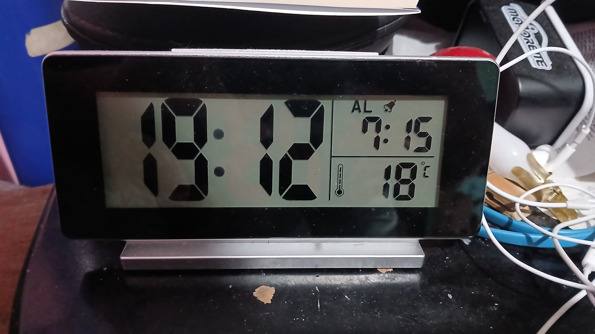
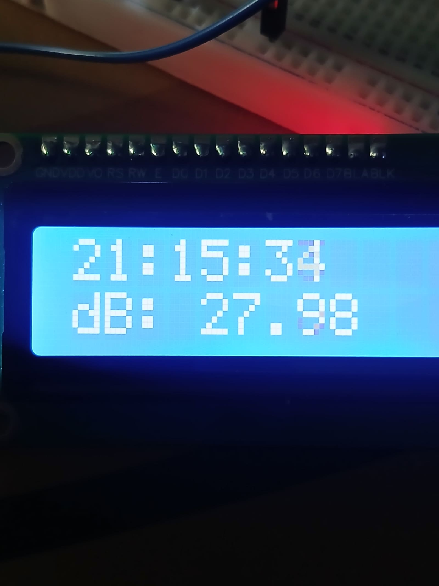

# sesion-01a

2026.08.11

## apuntes sesión

### Bloque 9:00 - 10:30

Aarón nos hizo elegir un libro para leer a lo largo del semestre, elegí **Chromatic Algorithms de Carolyn L. Kane**. Lo ideal es leer mínimo 100 páginas a lo largo del semestre. Cada martes, como encargo, hay que destacar dos citas y/o dar una descripción/resumen de las páginas leídas.



Luego hizo un tutorial of sorts de cómo usar el repo del curso y mostró parte de su proceso propio al manejar? administrar el repo eg. pull requests, creación de carpetas, su uso del code terminal

Hubo un momento en el que tuve una duda, y casi inmediatamente fue respondida lol (¿Qué hago como alumno si estoy *behind Y ahead* en mi repo?)

### Bloque 11:00 - 12:50

Nos separamos en grupos basados en cómo estábamos sentados y hablamos de las fotos que tomamos a los ascensores. Mi grupo comparó las imágenes, notando las similitudes y diferencias; además de describir las interacciones arraigadas a cada botón en los ascensores.

Al comenzar el sharing de lo conversado entre cada grupo, la "discusión" partió con establecer los datos ie. qué es un ascensor, cómo funciona, qué tiene un ascensor. Se habló de las poleas que los manejan, el numering convention para los subsuelos/estacionamientos. Hay botones de emergencia, citófono, para cada piso, abrir/cerrar puertas, encender/apagar las luces en el ascensor. El sticker? que muestra la mantención del ascensor.

When it comes to what an elevator can actually do, funciona en base a variables eg. SI estoy en un piso, puedo abrir la puerta (si no, no lol)

**! En este semestre trabajaremos variables, funciones y pov !**

Aarón habló del comando *sudo rm -rf* (what does it do? no idea honestly, spaced out and wasn't paying attention when the topic started). Solo entendí que es un NO lo uses, it **WILL** brick tu pc.

**(self task: breakdown said command to understand it properly)**

Follow-up al self task: *su* es super-user (admin privilege basically) and *do* es do lol; da permiso para modificar cualquier archivo en el computador. *rm* es el comando "remover". *-r* es un comando recursivo que le dice al computador que aplique el comando previo (en este caso, rm) a una carpeta específica con sus contenidos y todas sus subcarpetas. Finalmente *f* es forzar; self-explanatory.

## encargos

encargo01a:

1. autorretrato: describir variables y funciones de ustedes.

Para empezar, una variable es una pieza de información que puede tener un valor que pueda cambiar (hence: variable).

Hay 6 tipos de basic data para definir estos valores, los cuales son:

- int = números enteros (positivos, negativos, o cero)
- float = números decimales
- double = números decimales más precisos que *float*
- char = un (1) solo carácter
- bool = dato binario con valores opuestos (true o false)
- void = sin valor, vacío

Si me tratase a mí mismo como un programa, mis variables serían cosas como

```cpp
int edad = 25;
float altura = 1.54;
char inicialApellido = 'P';
bool esEstudianteDiseno = true;
```

Las funciones serían algo que haces, una acción o un proceso que se puede describir.

```cpp
escucharMusica()
verSeries()
dormir()
```

---

2. investigar pantallas de segmentos, tomar fotos, documentar contexto, lugar, ubicación, alfabetos posibles, usos, comparar entre resultados encontrados, al menos 3 ejemplos distintos. <https://en.wikipedia.org/wiki/Segment_display>

### Microondas



Esta imagen es la pantalla de un microondas al ser encendido/enchufado. El 7-segment display es exclusivamente para mostrar números, a pesar de que en la pantalla en sí se pueden observar distintos íconos y una tipografía distinta para mostrar texto.

---

### Reloj alarma



La pantalla de este reloj se divide en tres secciones distintas: la hora actual, la hora de la alarma, y la temperatura actual. Al igual que con el microondas, la pantalla tiene partes? que no se rigen con el 7-segment, como lo es el ícono del termómetro y el texto de la alarma (junto a su propio ícono). Sin embargo, en la temperatura en sí, el indicador de la unidad (celsius o fahrenheit) funciona con su propio, más pequeño 7-segment. Mencionaré que me parece curioso que el separador de la hora son círculos perfectos, en lugar de algún tipo de rombo que uno se esperaría se asemejaría más al lenguaje visual de los números.

---

### Pantalla LCD



Esta es la pantalla LCD de un proyecto del semestre pasado. Cada carácter está en un grid de 5x8, así que el alfabeto posible automáticamente es alfanumérico. Ya que se puede modificar cada carácter por medio de código, la pantalla también es capaz de mostrar distintos patrones, siempre y cuando se limite a los 16 carácteres en dos líneas.

## lectura
