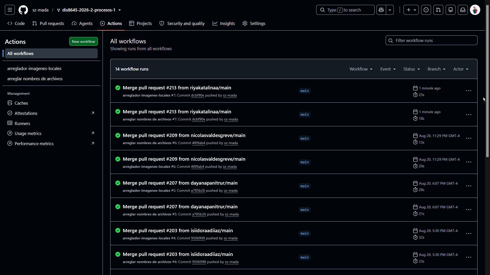

# sesion-02a

2026.08.18

## apuntes sesión

No asistí a esta clase, así que estos "apuntes" son basados en lo que entendí según los apuntes de mis compañeros.

---

## encargos

encargo02a:

1. en tu fork, ir a actions, y aceptar que corran github worfklows. subir pantallazo con demostración de que han corrido actions exitosas en tu repo. esto es crucial, si no lo haces, no agregaremos tus apuntes al repo, y las tareas se tomarán como no entregadas. si en tu fork las actions no son exitosas, no serán tampoco agregadas al repo común ni evaluadas.

2. conformar grupos de 3 a 4 personas para la realización del proyecto-1. compartir 2 placas de desarrollo por grupo, documentar estudio conjunto de C++, microcontroladores, botones, potenciómetros.

## lectura
