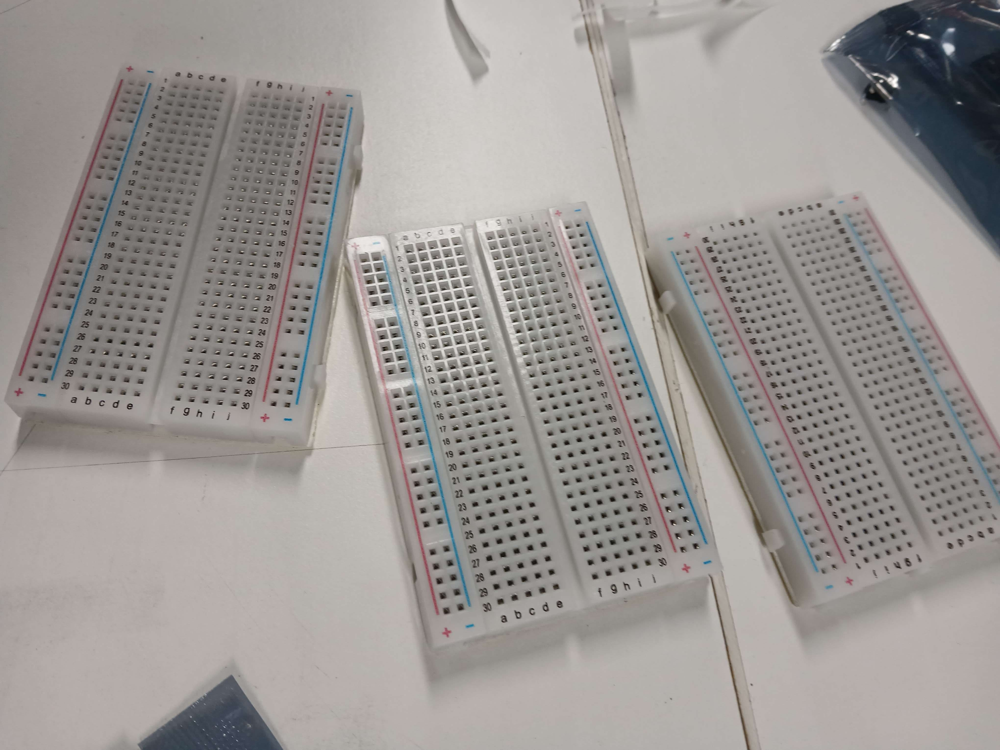
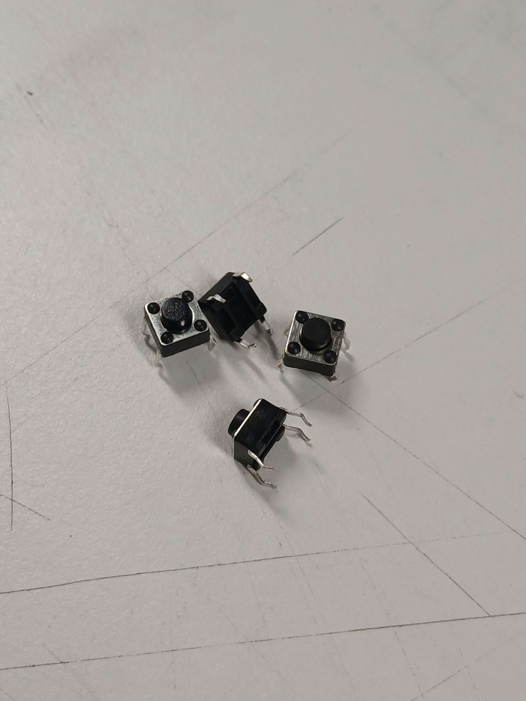
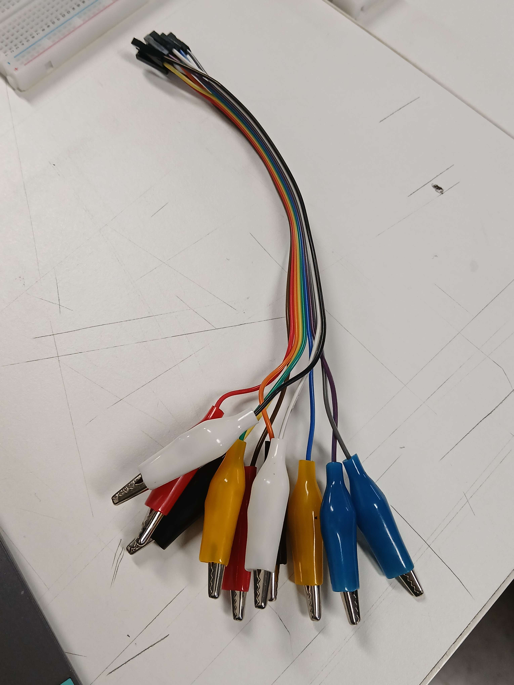
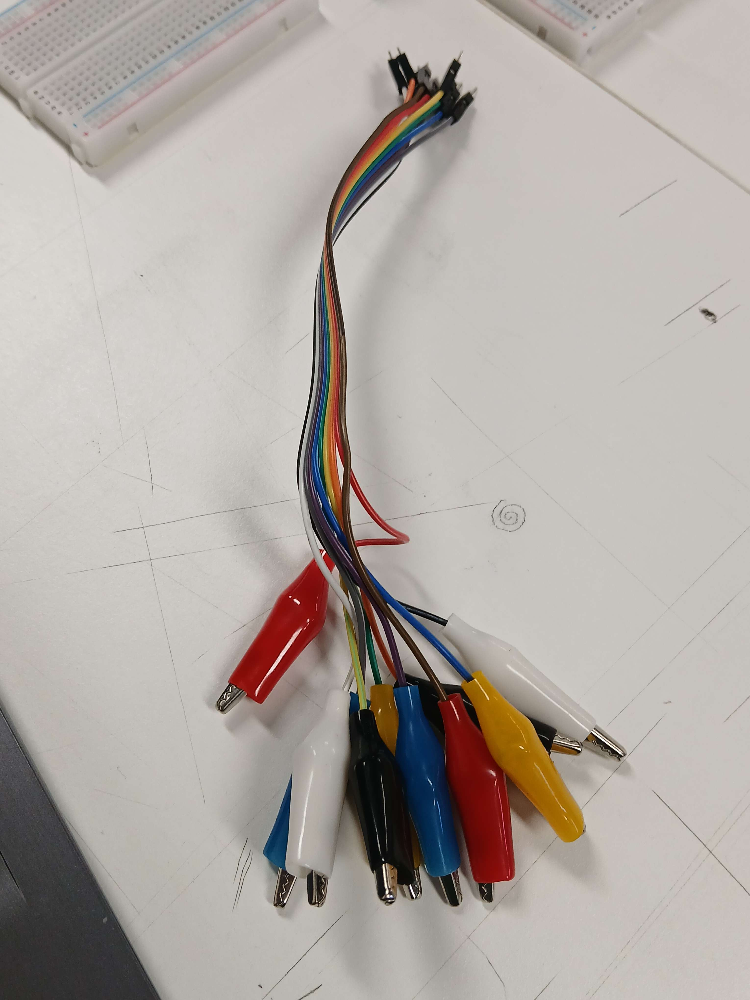
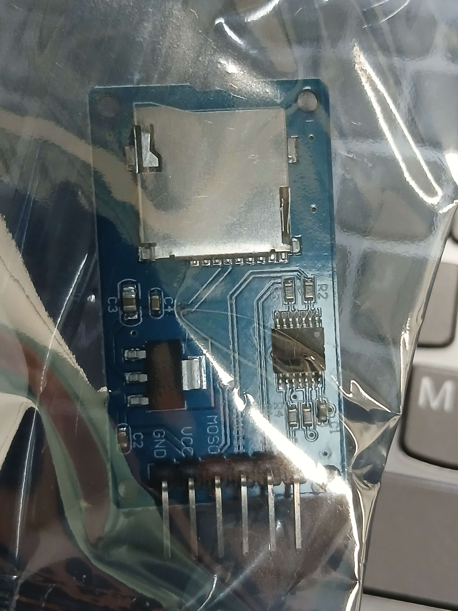
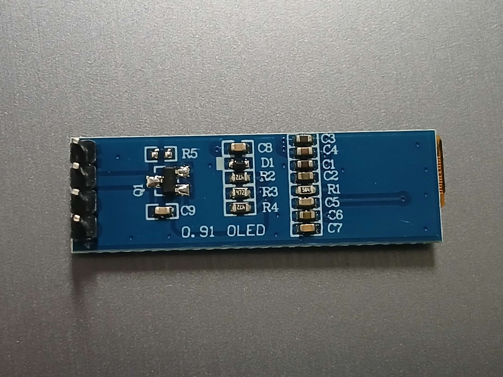
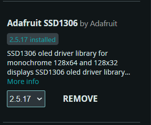

# sesion-03a

2026.08.25

## apuntes sesión

misaaaa vuelve la próxima semana yipee

---

Aarón nos entregó protoboards de 400 puntos, una por cada integrante del grupo (en nuestro caso, 3 protoboards). También recibimos cuatro? botones táctiles, cables, un lector? adaptador? microSD, y una pantalla OLED de 0.91in

SDA = señal de datos

SCK = señal de clock

---

En Arduino IDE instalamos la biblioteca de SSD1306 de Adafruit

## encargos

## lectura
