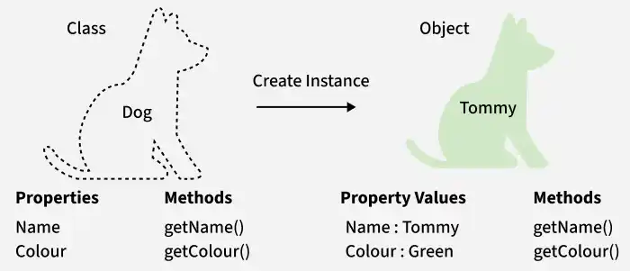
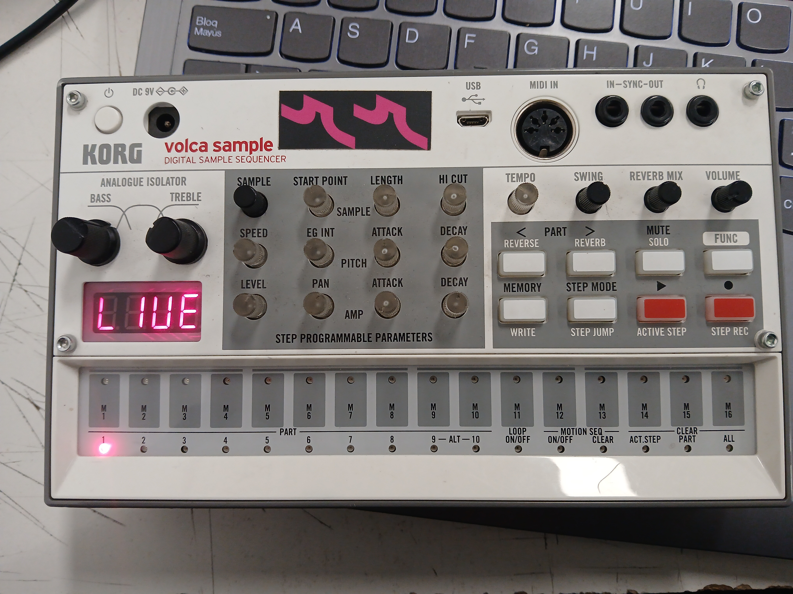
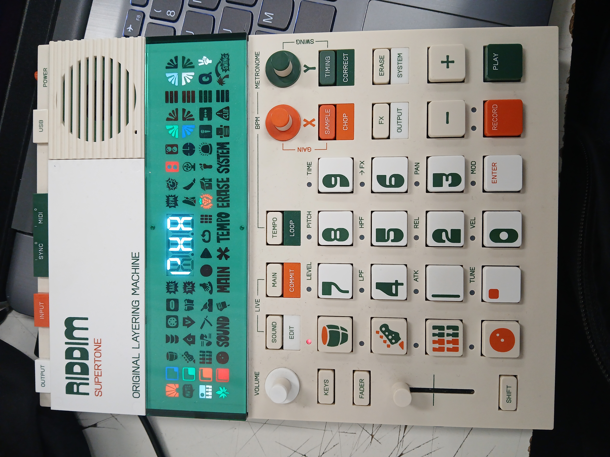
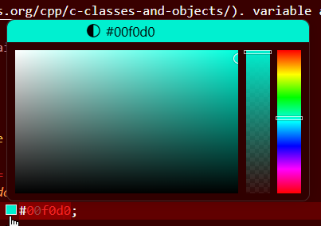

# sesion-06a

2026.09.22

## apuntes sesión

### Pre-clase

Aarón habló con Kristel sobre su práctica?, recomendó **NO** hacer titulación por práctica

### 9:00 - ??:??

¿Qué fue lo más difícil del proyecto anterior? En mi caso, antes del merge, fue decidir qué poema usar basado en cómo podríamos animar(?) los versos lol

`bool` es 1 o 0, `uint` es SOLO números positivos + el cero. `int` is ]-32,0[ & ]0,32[. En el `boolean` "cabe algo, o nada" pero en `int` "caben muchas cosas". la u de uint means "unsigned"

`class` [is a template to create objects having similar properties and behavior](https://www.geeksforgeeks.org/cpp/c-classes-and-objects/). variable always? starts with caps



eg.

```cpp
class Perrite {

bool hambre = true;
bool durmiendo = true;
int pelaje = #000000;

comer();
dormir();
}
```

. . . &rarr; datos, variables (atributos)

. . . ( . . . ) &rarr; acciones, funciones (métodos)

### samplers de Aarón



&uarr; [KORG volca sample](https://www.korg.com/us/products/dj/volca_sample/)



&uarr; [RIDDIM supertone EP-40](https://www.korg.com/us/products/dj/volca_sample/)

---

TIL en VSCode, si escribo un color en hex code, me da un preview!



## encargos

PLAN Z hagamos un asado (????????????)

## lectura
