# sesion-00b

## apuntes sesión

## encargos

 ### 01

Para el siguiente encargo debemos analizar las botoneras de los ascensores

1. -33.421762, -70.653657

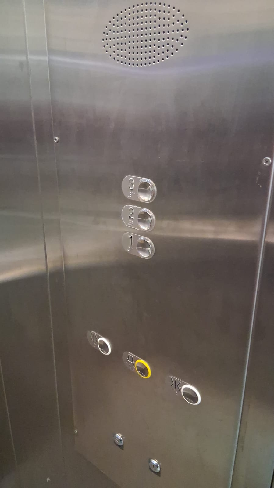

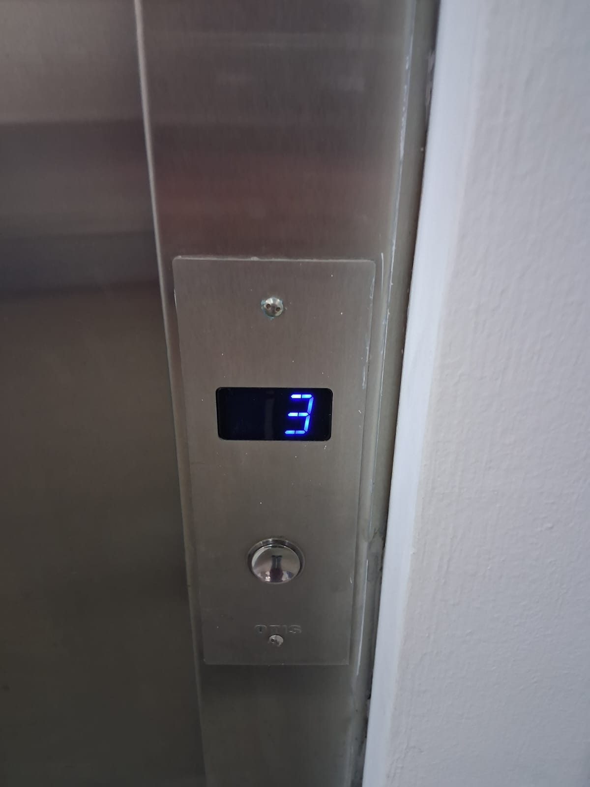

Este ascensor cuenta en el interior con una sola columna de botones, que inician con el piso 1 desde abajo hacia arriba y continúan en forma ascendente hasta llegar al piso 3 en la parte superior de la columna 

En cambio, en el exterior del ascensor se encuentra un único botón para indicar a que nivel se debe desplazar el elevador

> 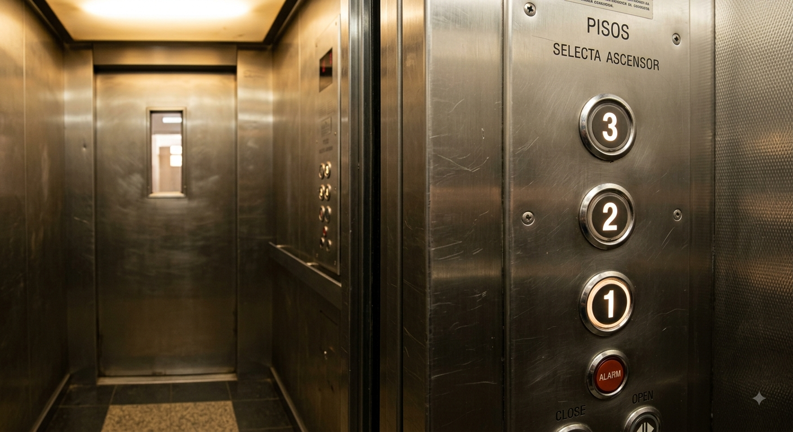
>
> Imagen creada con IA para corroborar la fidelidad de la descripción

 

2. 33°27'10.6"S 70°39'56.2"W

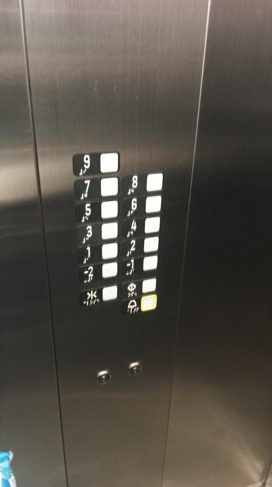

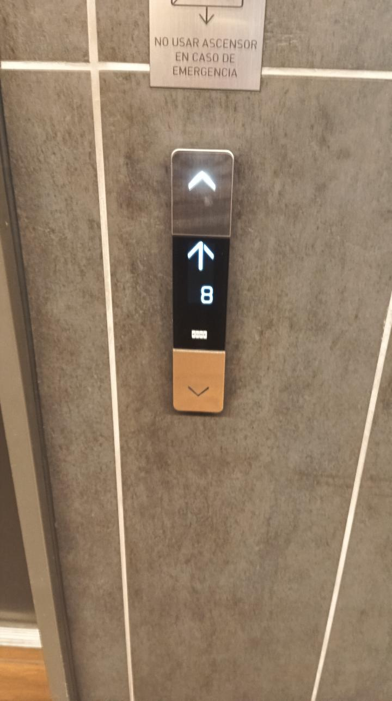

En el siguiente caso tenemos una botonera que posee 2 columnas, que inicia con el -2 en el lado izquierdo y a su derecha el -1 para subir a la siguiente fila en el lado izquierdo con el siguiente y asi consecutivamente hasta el número 9. Quedando con dos columnas, una de 5 elementos (que inicia en con el -2 en el extremo inferior) y otra con 4, iniciando todas al mismo nivel.

Por fuera posee 2 flechas en un marco cuadrado, donde la superior indica arriba y la inferior abajo, en el medio de ambas se encuentra un display led que sirve para visualizar el nivel del elevador

> 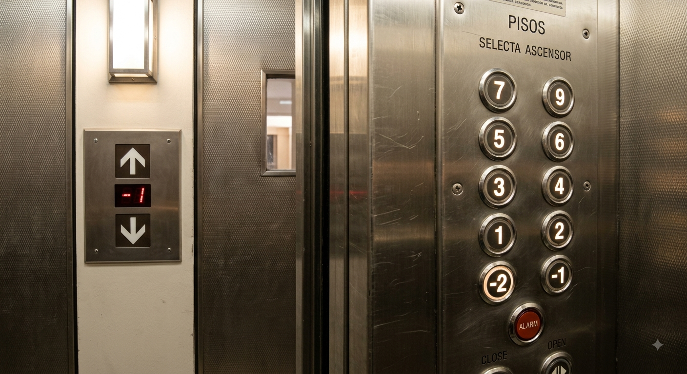
>
> Imagen creada con IA para corroborar la fidelidad de la descripción

 

3. 33°26'08.3"S 70°38'54.4"W

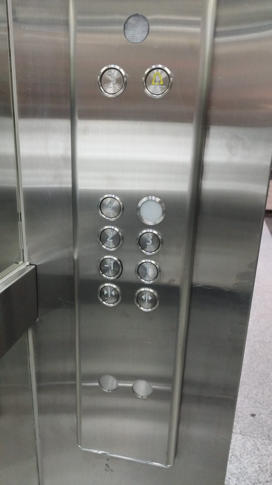

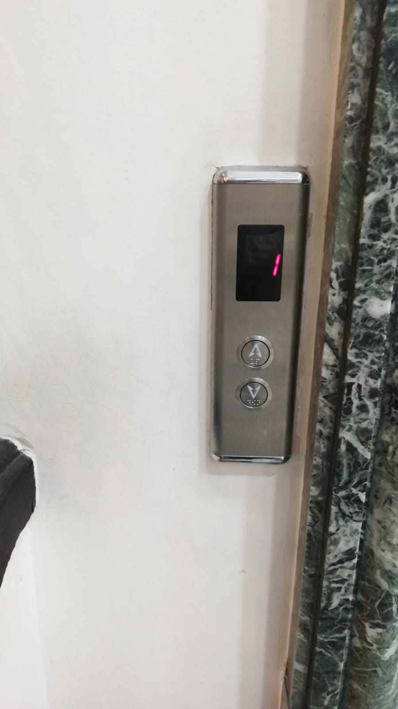

En esta botonera tenemos 6 botones, divididos en 2 columnas de 3 filas. Los cuales inician desde el -1 y finalizan con el 4, siendo el botón faltante, uno en blanco sin marca. Estos se ordenan en el lado izquierdo el menor y que van de manera creciente desde abajo hacia arriba.

Por fuera tenemos 2 flechas que indican arriba y abajo con su respectivo display led en el extremo superior

 

4. 33°26'46.2"S 70°39'38.0"W

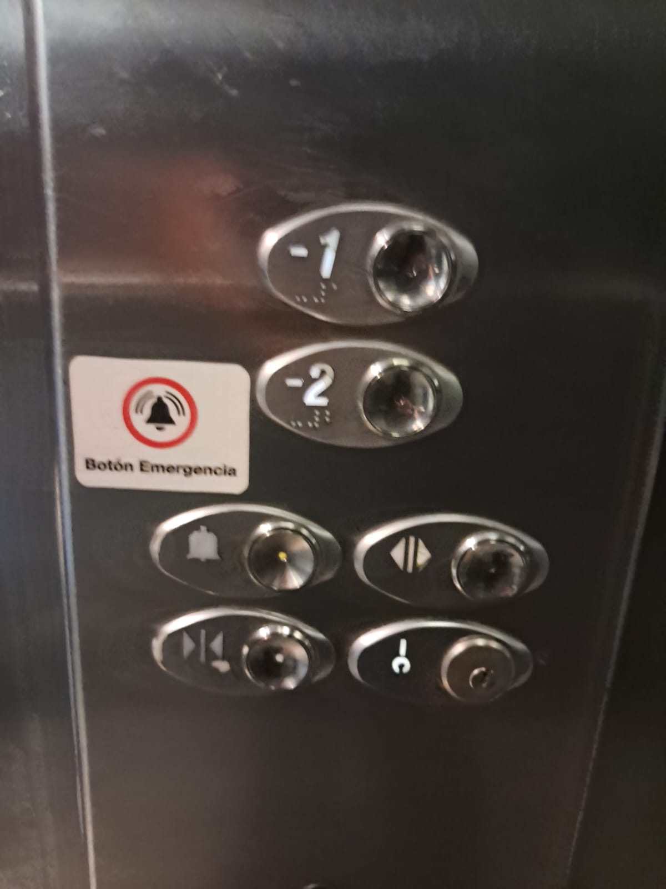

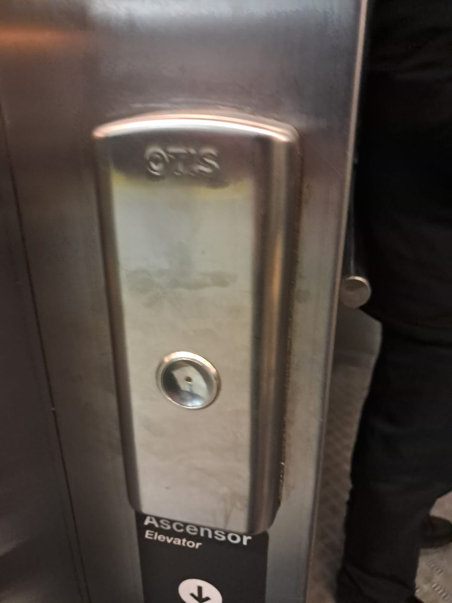

Tenemos 2 botones, donde el inicial es el -2 y termina con el -1 en el extremo superior. Por lo mismo en el exterior cuenta con un solo botón

 

5. N -33° 27' 2.4984 E -70° 40' 3.1404

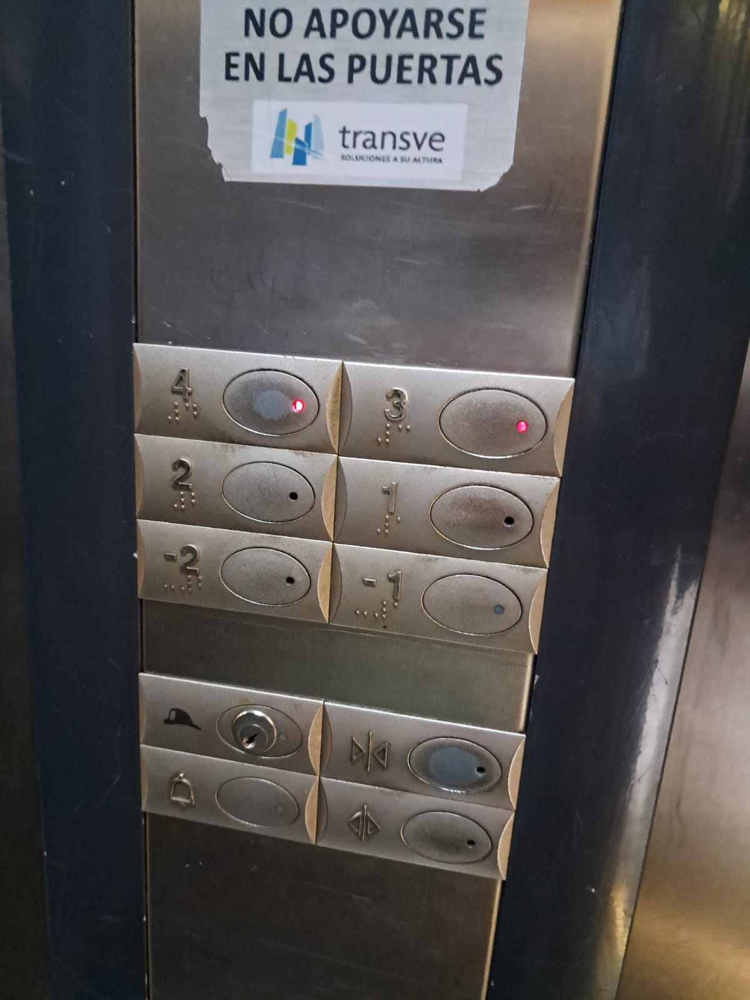

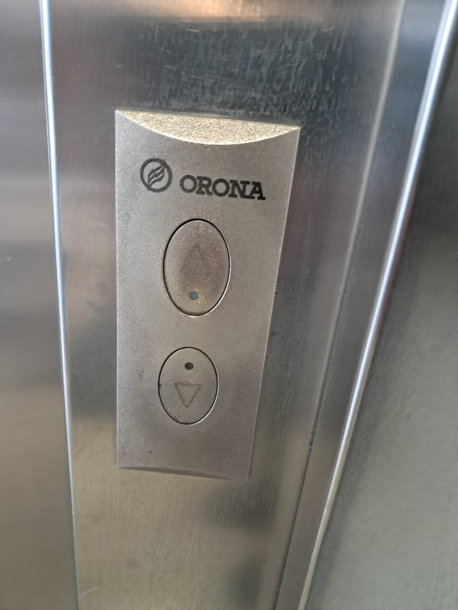

Este caso es el más curioso, ya que mantiene la lógica del caso 2, pero acá se rompe. Al pasar del 2 al 3, ya que el número 3 debería estar en el extremo superior izquierdo y el 4 en el derecho, en cambio están invertidos, dejando así una secuencia desorganizada

 

#### Resumen

Ya que en clases vimos la importancia de las instrucciones, me enfoque en generar instrucciones de la manera más precisa, pero buscando que se complementen entre cada caso, evitando redundancias. Además de esto pude analizar elementos claves, el como se interactúa con patrones repetitivos, pero no estandarizados, muchos ascensores contaban con 2 columnas, pero la distribución variaba, generando problemas de interpretación con la interfaz de este elemento.

Esto se puede extrapolar al código, entendiendo que al ser un lenguaje que funciona con bloques interconectados de manera repetitiva se pueden generar confusiones, poniéndonos en la situación de contar con 2 software que realicen los mismos procesos en el mismo orden, estos pueden no tener la misma estructura de código, llegando a generar problemas en el estudio del código para personas ajenas a el

Por ende, algo que puede parecer sencillo también esconde su dificultad, ya que el mismo ejercicio de describir las botoneras me percaté de que muchas instrucciones quedaron ambiguas al intentar generar imágenes con una IA interpretando dicho texto.

 

## lectura
