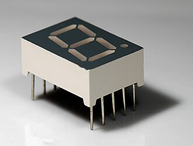
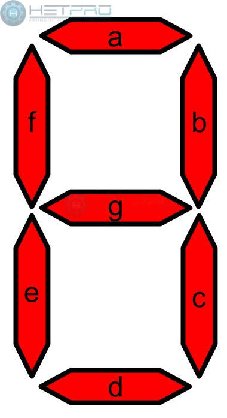
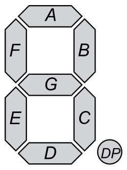
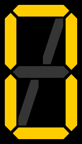
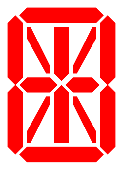
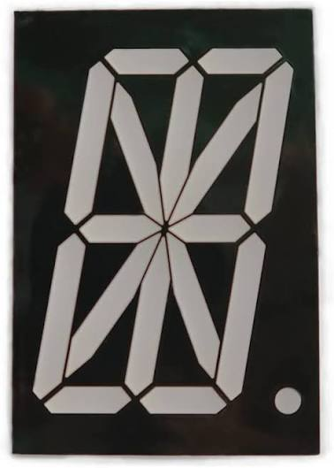
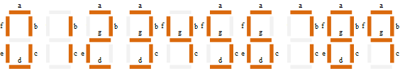
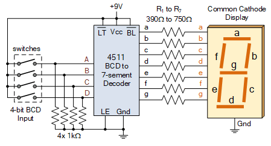
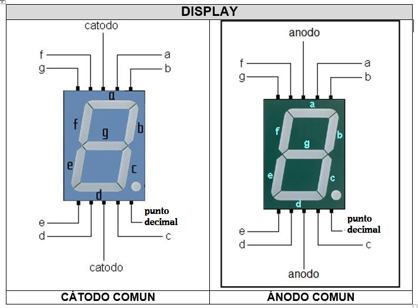
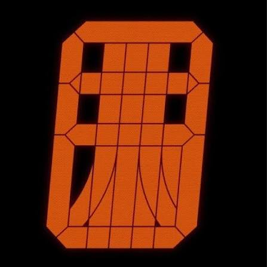

# sesion-01a

## apuntes sesión

En esta clase se nos mencionó el libro: "Erase una vez un algoritmo - Martin Erwig". Se consideró como bibliografía relevante para el curso de pensamiento computacional, el que se va a enfocar en código, por lo que es relevante echarle un vistazo.

Además, se nos mencionó la importancia de responder todo correo con la opción _Responder a todos_

- Investigar que hizo Glenn Greenwald 

<br>

Dentro del semestre se nos entregó un libro, el cual debemos desglosar 2 citas semanalmente. En mi caso elegí: _the computers that made the world_

### Definición de Ascensor

Lo primero es entender que elementos componen un ascensor, es decir, cuáles son las **constantes**

1. Posee puertas

2. Posee botones con números arábicos 

3. Se desplaza en el eje Z

4. Se ingresa por el eje X o Y

5. Posee sensores

   <br>

Luego debemos comprender cuales son las **variables**

1. Distribución de los botones

2. Rango numérico de los botones

3. Que botones auxiliares posee

4. Limites de peso

   <br>

Luego estas **variables** hacen operar acciones o **funciones**

1. (subirAscensor)

2. (abrirPuerta)

3. (cerrarPuerta)

4. (MantenerAscensor)

   <br>

## encargos

### Autorretrato:

> Sobre las variables. Pensaba si definirlas en este ejercicio como las cosas que cambian entre todas las personas y cuáles serían las definiciones en mi caso, por ejemplo, el color de pelo, altura, etc. Luego de pensarlo llegue a la conclusión de considerarlas como los elementos que alternan solo en mi persona, como el estado anímico, que ropa utilizo, etc

1. Variables:
   
```cpp
  - string proyectoActual = "sin_te";  // Hace referencia a que tipo de proyecto me encuentro realizando actualmente, ya que siempre busco en que trabajar e investigar 

  - string ultimaCancion = "Los Tres - La Torre De Babel"; // Debido a la cantidad de horas anuales dedicadas a escuchar música (cercana a las 800 horas anuales, según spotify)

  - bool desayuno = false; // Enfocada en si desayune o no. frecuentemente es false xd

  - bool lid = false; // Me encuentro o no en el LID

  - int sueño = 6; // Cuantas horas dormí
```

2. funciones

```cpp
  void trabajarProyecto() {
// Función relacionada para trabajar en un proyecto
if lid
   trabajar en proyectoActual
else  
   ir a LID
   }
``` 
```cpp
   void dormirLuego () {
// Define que debo hacer si dormí poco
if (sueño <= 4){
irADormirLoAntesPosible
}}
```
```cpp
void break () {
// Función para tener un break
 if (!desayuno) {
 else if (ultimaCancion == Jamiroquai - Virtual Insanity)}
 else {
salirComerAlgoYDescansar
}
}
```
> se intentó seguir la sintaxis del código de programación C++
 
### Pantallas de segmentos: 

#### Contextualización

Es un tipo de pantalla compuesta por módulos, en la que alternando estos se pueden configurar distintos símbolos, en su mayoría se utiliza para representar números arábicos.



Estas pantallas fueron la norma por muchos años, debido a su facilidad de uso gracias a su sistema reticular y modular, además de los bajos costos. Todo esto empezó a cambiar con la masificación de las pantallas LCD, LED, etc. Por lo que verlas hoy en día es normal dentro de máquinas que no posean tanta complejidad de interacción en sus interfaces

<br>

##### Tipología 

| Cantidad de segmentos | Imagen de ref. |
| --------------------- | -------------- |
| 7                     |  |
| 8                     |  |
| 9                     |  |
| 14                    |  |
| 16                    |  |

##### Tabla de verdad

Lo más común es utilizar pantallas de 7 segmentos (según mi observación) y para poder activarlos se utiliza la siguiente tabla de referencia



| N° | a | b | c | d | e | f | g |
| -- | - | - | - | - | - | - | - |
| 0  | x | x | x | x | x | x |   |
| 1  |   | x | x |   |   |   |   |
| 2  | x | x |   | x | x |   | x |
| 3  | x | x | x | x |   |   | x |
| 4  |   | x | x |   |   | x | x |
| 5  | x |   | x | x |   | x | x |  
| 6  | x |   | x | x | x | x | x |
| 7  | x | x | x |   |   |   |   |
| 8  | x | x | x | x | x | x | x |
| 9  | x | x | x |   |   | x | x |

> Cada ***x*** representa un segmento encendido

##### Circuito

Adjunto una prueba de circuito en el que hacer funcionar el display



##### Cátodo común / Ánodo Común

Existe un aspecto técnico de estos displays que es importante tener en cuenta, como se configuran sus _positivos_ y _negativos_. En el de cátodo común, todos los negativos van unidos a un pin _negativo_ (GND) y se encienden con voltaje positivo y en el de ánodo común, todos los positivos van unidos a _positivo_ (VCC) y se encienden enviando tierra



##### Otros idiomas 

Existen displays adaptados a diferentes alfabetos, por ejemplo en la siguiente imagen se ve uno adaptado a japones 



<br>

#### Busqueda

  1. Equipo de sonido SONY

Este dispositivo contaba con una pantalla donde no solo se iluminaban los segmentos, ya que cuenta con retroiluminación. Esto significa que detrás de la pantalla existe una fuente lumínica que acentúa el display.

Es necesario mencionar que esta pantalla además cuenta con íconos que complementan la interfaz con el usuario, además de poseer 16 segmentos que permiten la visualización alfanumérica. Todo esto es necesario, ya que al tener cerca de 16 botones, distintos menús y ajustes se debe tener una experiencia con el usuario lo más cómoda posible y para ello se le debe mostrar la información de manera adecuada, algo dificil de lograr con una pantalla menos compleja 

> Se debe tener en cuenta que este modelo es cercano a los años 2000


<br>

2. Microondas

Ubicado en el comedor de Republica 180, este display a diferencia del anterior posee 7 segmentos, cuenta con menos símbolos y sin retroiluminación. Esta elección de elementos está considerando que un microondas no excede de los 2 minutos aproximados de uso en promedio


<br>

3. Ascensor

A pocos metros del microondas encontramos un indicador de piso en el ascensor, el cual contaba con una pantalla de 7 segmentos. La más sencilla de las demás, ya que su uso no pasa de los pocos segundos y no hay necesidad de añadir tantos elementos, sumado a la poca información que se debe presentar.


<br>
  
## lectura - the computers that made the world


