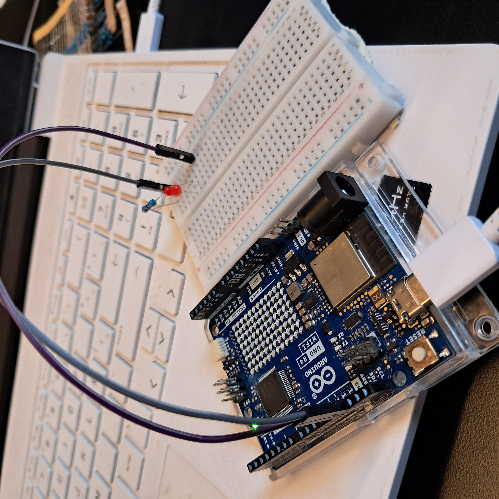
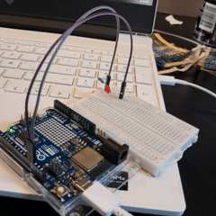
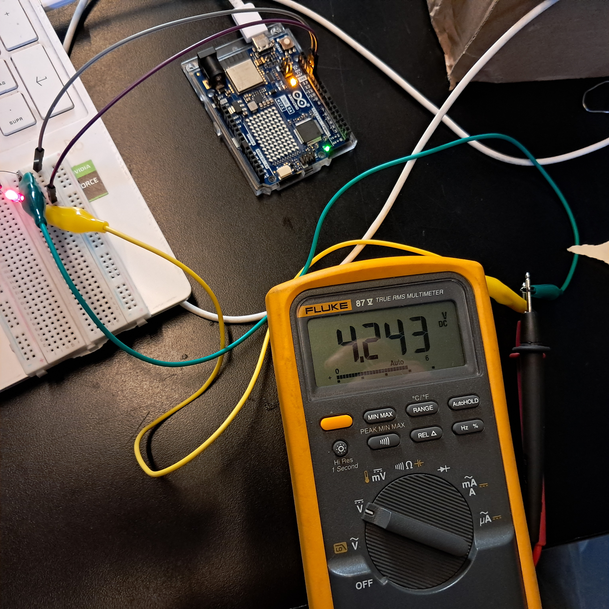
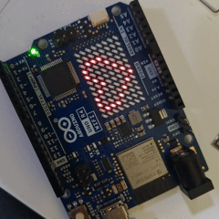
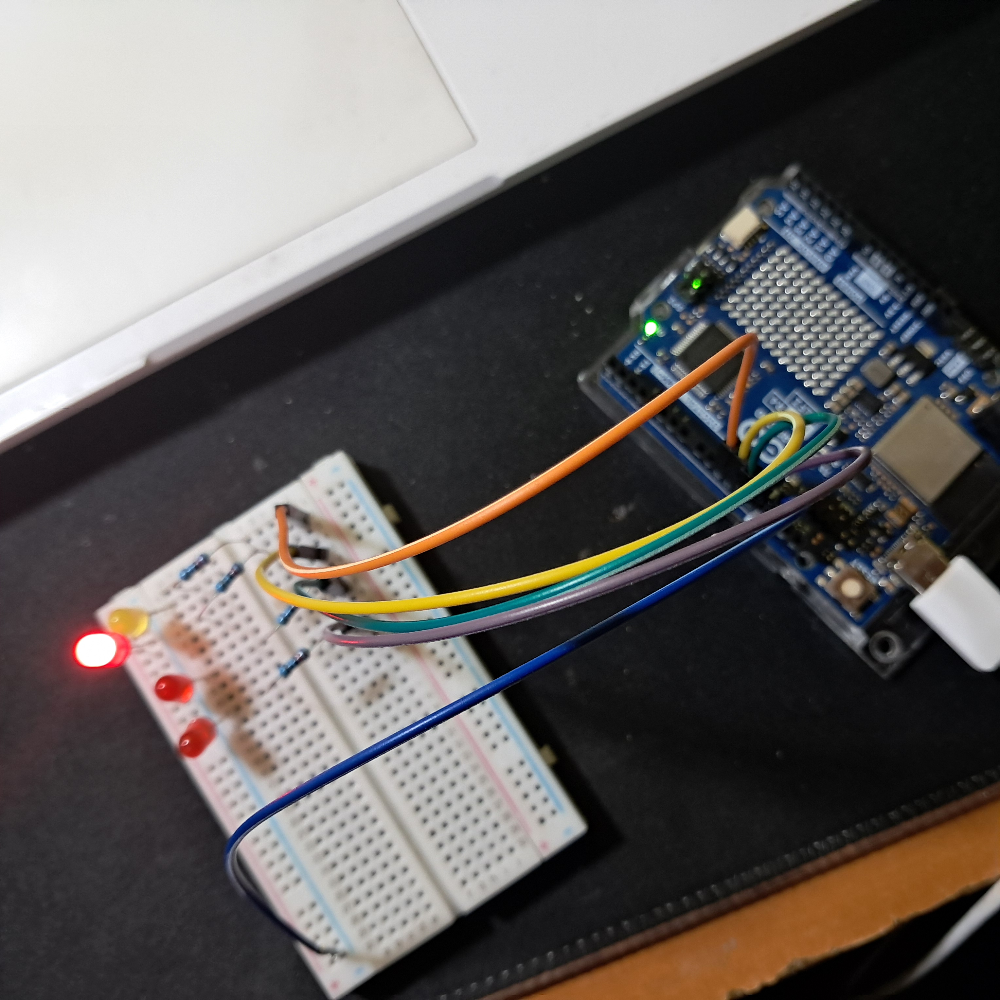
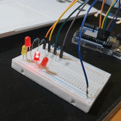

# sesion-01b

## apuntes sesión

[Actualizar durante el día]

## encargos

encargo01b:

1. tratar de correr un código en el microcontrolador asignado a cada dupla, incluir referentes, citas, comentarios, imágenes, descripciones textuales, y en caso de éxito o fracaso incluir aciertos, preguntas, dramas, atados. recordatorio que estos apuntes son personales, cada persona sube su versión.
2. proponer una función con nombre, tipo, argumentos y uso, que modele algún área de su interés, por ejemplo subirCerro(enBicicleta), tomarMetro(conPaseEscolar), etc. escribir en pseudocódigo los pasos que necesita esa función internamente para que literalmente funcione.


### 1. Código Arduino

- [Blink](https://discord.com/channels/1412203484971008033/1493065097038266530/1539097033279938732)

```cpp
/*
  Blink

  Turns an LED on for one second, then off for one second, repeatedly.

  Most Arduinos have an on-board LED you can control. On the UNO, MEGA and ZERO
  it is attached to digital pin 13, on MKR1000 on pin 6. LED_BUILTIN is set to
  the correct LED pin independent of which board is used.
  If you want to know what pin the on-board LED is connected to on your Arduino
  model, check the Technical Specs of your board at:
  https://docs.arduino.cc/hardware/

  modified 8 May 2014
  by Scott Fitzgerald
  modified 2 Sep 2016
  by Arturo Guadalupi
  modified 8 Sep 2016
  by Colby Newman

  This example code is in the public domain.

  https://docs.arduino.cc/built-in-examples/basics/Blink/
*/

// the setup function runs once when you press reset or power the board
void setup() {
  // initialize digital pin LED_BUILTIN as an output.
  pinMode(LED_BUILTIN, OUTPUT);
}

// the loop function runs over and over again forever
void loop() {
  digitalWrite(LED_BUILTIN, HIGH);  // change state of the LED by setting the pin to the HIGH voltage level
  delay(1000);                      // wait for a second
  digitalWrite(LED_BUILTIN, LOW);   // change state of the LED by setting the pin to the LOW voltage level
  delay(1000);                      // wait for a second
}

```
Este es un ejemplo funciona encendiendo una luz de manera constante, exactamente en el ***pin 13*** del Arduino UNO R4 WIFI (de ahora en adelante R4). 

Durante la realización de este ejercicio presenté problemas para poder cargar el código de Arduino IDE en el R4, esto se solucione buscando la documentación de la misma empresa desarrolladora (https://docs.arduino.cc/software/ide-v2/tutorials/getting-started/ide-v2-uploading-a-sketch/)

Además, pude identificar elementos importantes que configuran a el R4:

a. El **_pin 13_** en este modelo sirve como _terminal_ (desconozco si es un término adecuado para referirse a un pin de un microcontrolador) predeterminada, por lo que _LED_BUILTIN_ hace referencia a este

b. Se debe definir si un pin será ocupado como _OUTPUT_ o _INPUT_, con esto nos referimos si va a recibir una señal o enviarla (en este caso, la enviamos para encender el led)

c. _delay()_ sirve para definir tiempo de duración de una función

d. _HIGH_ y _LOW_ se consideran _encendido_ y _apagado_





> 
>
>> En este momento estaba midiendo el voltaje que me entregaba el _pin 13_ del R4 para entender de mejor manera como funciona

---

- [Matrix](https://docs.arduino.cc/tutorials/uno-r4-wifi/led-matrix/)

```cpp

#include "Arduino_LED_Matrix.h"

ArduinoLEDMatrix matrix;

void setup() {
  Serial.begin(115200);
  matrix.begin();
}

const uint32_t happy[] = {
    0x19819,
    0x80000001,
    0x81f8000
};
const uint32_t heart[] = {
    0x3184a444,
    0x44042081,
    0x100a0040
};

void loop(){
  matrix.loadFrame(happy);
  delay(500);

  matrix.loadFrame(heart);
  delay(500);
}

```
En este caso seguimos utilizando documentación propia de Arduino. Se experimentó con una función propia del modelo UNO R4 WIFI, es decir su display de leds incorporados

Cosas relevantes:

- Se Puede escribir el funcionamiento mediante una matriz

```cpp

byte frame[8][12] = {
  { 0, 0, 1, 1, 0, 0, 0, 1, 1, 0, 0, 0 },
  { 0, 1, 0, 0, 1, 0, 1, 0, 0, 1, 0, 0 },
  { 0, 1, 0, 0, 0, 1, 0, 0, 0, 1, 0, 0 },
  { 0, 0, 1, 0, 0, 0, 0, 0, 1, 0, 0, 0 },
  { 0, 0, 0, 1, 0, 0, 0, 1, 0, 0, 0, 0 },
  { 0, 0, 0, 0, 1, 0, 1, 0, 0, 0, 0, 0 },
  { 0, 0, 0, 0, 0, 1, 0, 0, 0, 0, 0, 0 },
  { 0, 0, 0, 0, 0, 0, 0, 0, 0, 0, 0, 0 }
};

```
> Esto tiende a ocupar más memoria y es un ejemplo similar al que se vio con el color en la clase, por lo mismo se utiliza en formato HEX
>
> > Desconozco él porqué del _0x_previo al código HEX
> >
> > >     const uint32_t heart[] = {
>>>       0x3184a444,
>>>       0x44042081,
>>>       0x100a0040

-  Se usa _#include_ al inicio para añadir una librería



  > La verdad no quise profundizar mucho en este código, por lo que experimenté más con el siguiente  

<br>

---

> [!IMPORTANT]
> Ideas que me gustaría experimentar en un futuro cercano
>
> > https://www.youtube.com/watch?v=J9twJ3PbdLQ
> >
> > > Sintetizador hecho con un Arduino UNO R4
> >
> > https://www.youtube.com/watch?v=81M-2NQkQME&t=106s
> >
> > > Sintetizador de 3 pasos hecho con Arduino UNO R4

---

<br>

- Secuenciador

```cpp

  //Definir pasos
  const int pinPaso1 = 13;
  const int pinPaso2 = 12;
  const int pinPaso3 = 11;
  const int pinPaso4 = 10;


void setup() {

// Definir los pinPaso como salidas de señal
  pinMode(pinPaso1, OUTPUT);
  pinMode(pinPaso2, OUTPUT);
  pinMode(pinPaso3, OUTPUT);
  pinMode(pinPaso4, OUTPUT);
}

// Secuencia en loop
void loop() {
  digitalWrite(pinPaso1, HIGH);  // Encender paso 1
  delay(1000);                   // Esperar 1 seg
  digitalWrite(pinPaso1, LOW);   // Apagar paso 1
  delay(500);                    // Esperar medio segundo
  digitalWrite(pinPaso2, HIGH);  // Encender paso 2
  delay(1000);                   // Esperar 1 seg
  digitalWrite(pinPaso2, LOW);   // Apagar paso 2
  delay(500);                    // Esperar medio segundo
  digitalWrite(pinPaso3, HIGH);  // Encender paso 3
  delay(1000);                   // Esperar 1 seg
  digitalWrite(pinPaso3, LOW);   // Apagar paso 3
  delay(500);                    // Esperar medio segundo
  digitalWrite(pinPaso4, HIGH);  // Encender paso 4
  delay(1000);                   // Esperar 1 seg
  digitalWrite(pinPaso4, LOW);   // Apagar paso 4
  delay(500);                    // Esperar medio segundo
}

```

Para este último intento de practica, se recreó un secuenciador. Este ya ha sido realizado con anterioridad, solo que, de manera análoga utilizando IC como el CD4017

Se tomó como referencia el ejercicio **BLINK** en su estructura general, sumado a los apuntes de clases

Esto me motiva a querer profundizar en los posibles usos, ya que algo que me llegó a tomar cerca de 1 día y múltiples componentes electrónicos, ahora lo logré en tan solo 10 minutos y en el primer intento 





<br>

### 2. Función

Para este ejercicio voy a proponer la función _**beberAlgo(energetica)**_

```cpp

// beberAlgo(energetica)

// definir variables

// tengo sed en este momento
bool camiSed = false;
// he bebido minimo un litro de agua 
// desde que inicie el dia
bool camiAgua = true;
// quiero beber energetica
bool beberEnergetica = true;
// tengo una energetica 
bool camiEnergetica = true;

// donde estoy
string camiUbicacion = "enLID";

// cuanto dinero tengo
int camiDinero = 1850;


void setup() {
  
}

void loop() {
// accion que se repite

// si tengo sed
// ademas si bebi minimo un litro de agua
// y quiero una energetica
// y tengo una 
// bebo una

// si no tengo una energetica
// y tengo mas de 1200 pesos 
// salir de donde estoy a comprar


}

```
<br>

## lectura / The computers that made the world - Tim Danton


1. "There are indeed two, but they aren´t death and taxes: they´re that humans have an innate need to count and that we all make mistakes"

Traducido sería: "En efecto hay 2, pero no son la muerte ni los impuestos: esos serían las personas tienen una necesidad innata de contar y cometer errores. Esto viene a raíz de Groucho Marx, quien nos menciona 2 cosas que son siempre ciertas, la muerte y los impuestos.

Esta cita aparece al mencionar el origen de las primeras computadoras, que no eran más que máquinas de contar

2. "the goverment said enough: no more funds"

Me hace pensar mucho en la situación actual del país, donde se recortan gastos en investigación solo porque "_no genera empleo_". 

En este caso a Charles Babbage se le quitaron los fondos con los que se destinaba crear la primera calculadora compleja, que llegaría a 20 dígitos. Obviamente todo funcionaba de manera mecanica y el gobierno queria que esto fuera lo más pequeño posible, algo imposible de lograr en aquellos años (1820 aproximadamente) 

