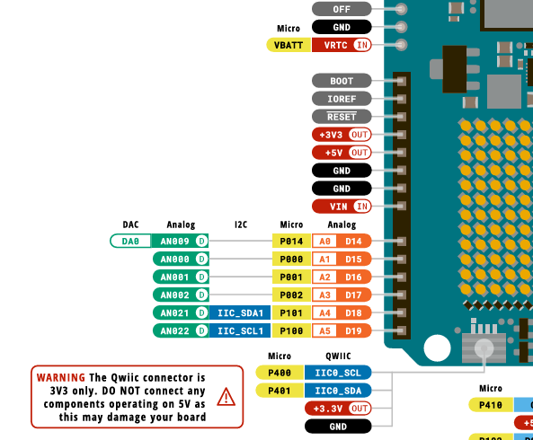

# sesion-02a

## apuntes sesión

### Potenciómetro

En esta sesión nos enfocamos en como poder medir el voltaje resultante al pasar por una resistencia variable, aka _potenciómetro_.


<br>

Es pertinente mencionar que existen 3 tipos de potenciómetros, estos se diferencian por la letra que aparece antes del valor


<br>

- A: Logarítmico / Aumenta en base a potencias de 19, es decir que inicialmente su crecimiento es lento, para luego aumentar de manera 

- B: Lineal / No importa en que parte del recorrido se encuentre, su aumento o disminución ocurre en valores constantes

- C: Logarítmico inverso


<br>

---

#### Encoder

Durante la clase se mencionó que las _perillas_ que pueden rotar de manera constante se llaman **encoders**

> A diferencia de los potenciómetros, que poseen inicio y fin en su recorrido


---

<br>

### Botones / Pushbutton / pulsadores

Tenemos 2 tipos de botones

1. Normally Open (NO) / Normalmente Abierto

Son los más comunes, al presionar se cierra el circuito.

2. Normally Close (NC) / Normalmente cerrado

El circuito se mantiene cerrado hasta que se presione el botón, lo que deja el circuito abierto.

<br>

Para que nuestro Arduino pueda detectar y leer nuestro arduino debemos conectar una resistencia llamada _"Pulldown resistor"_ 

> 

[Tutorial Boton Arduino](https://docs.arduino.cc/built-in-examples/digital/Debounce/)

---

### Ejercicio en Clase / _lectura de pote_

Lo primero que debemos es identificar la sección _análoga_ de nuestra placa de desarrollo, para ello debemos buscar el [Pinout](https://docs.arduino.cc/resources/pinouts/ABX00087-full-pinout.pdf) correspondiente al modelo de Arduino que estemos utilizando, en este caso Arduino UNO R4 WIFI

> 
>
> > ~ Cada vez que veamos ese símbolo es utilizado comúnmente como salida para **audio** 👁️

<br>

Debemos conectar el potenciómetro de la siguiente manera


- pin 1 > VCC

- pin 2 > Lectura análoga / A0

- pin 3 > GND

---

Ahora si analizamos el código utilizado en [_"ej_arduino_pote"_](../../00-docentes/sesion-02a/ej_arduino_pote/) observaremos una metodología de trabajo llamada _"programación defensiva"_, esta busca ser lo más entendible posible, ya sea por la estructura del código, como sus anotaciones 
  
1. Observamos que se define una variable bajo el nombre _"tasa"_

```cpp

const int tasa = 9600;

```
Este significa a qué velocidad se van a transmitir los datos entre el Arduino y la computadora. Se mide en Baudios

> 115200 es la tasa de Baudios ideal para audio y es la utilizada en el protocolo MIDI

2. Se define un valor inicial a la lectura del pote, siendo -1. Esto ocurre para poder saber si nuestro potenciómetro está siendo leído, ya que los valores que nos entrega van de 0 a 1023 (10 bits)

```cpp

int poteLectura = -1;

```

3. Al definir el pin A0 se utiliza _int_, ya que Arduino IDE, sabe que corresponde a su pin correspondiente

 ```cpp  

const int potePatita = A0;

```

4. While corresponde a una condición _"Mientras que"_

```cpp

  // mientras puerto serial
  // no este listo
  // no avanzar
  while (!Serial)

```
> !: Es utilizado como una negación


## encargos

Se profundizó en el código para leer un potenciómetro, tal como se vio en la clase. Hice las pruebas con los ejemplos adjuntados en _00_docentes_ 

>[Ejemplo 1/filtrado](../../00-docentes/sesion-02a/ej_arduino_pote_filtrado/)
>
>[Ejemplo 2/promedio](../../00-docentes/sesion-02a/ej_arduino_pote_promedio/) 

<br>

### Potenciómetro Filtrado


<br>

### Potenciómetro Promedio


## lectura / The computers that made the world - Tim Danton

He tenido múltiples complejidades para lograr entender y comprender todo lo que se habla, ya que el libro está en inglés, por lo que he vuelto a leer todo del inicio y comenzaré a agregar un glosario de las palabras nuevas que voy aprendiendo.

**1. indeed**: en efecto

**2. relied**: dependió

**3. attempting**: intentando

**4. poverty**: pobreza

**5. inheritance**: inheritance 

**6. enfant**: niño/a

**7. scorned**: despreciado/a

**8. rolled around**: llegó el momento

**9. steam**: vapor / Science, Technology, Engineering, Arts, Mathematics 

**10. thereabouts**: aproximadamente

**11. slide rule**: regla de cálculo

**12. whilst**: mientras que 

**13. unaware**: inconsciente 

<br>

### ABC (Atanasoff-Berry Computer)

En este capítulo se nos narra la historia de la primera computadora que funcionaba en sistema binario, a diferencia de los modelos ENIAC y Mark I. Además de no utilizar sistemas mecánicos, priorizando el uso de tubos de vacío (predecesores de los transistores). Lamentablemente no pudo seguir su desarrollo, ya que la 1era guerra mundial llegó y muchos ingenieros debieron dedicarse a la industria bélica, obviamente sus desarrolladores no fueron la excepción, John Atanasoff y Clifford Berry

Antes de llegar al prototipo de computadora, Atanasoff estuvo durante variaos años escribiendo a IBM sobre sus ideas. En este lugar circulaba un memo donde se informaba (Aléjenlo de la tabuladora [máquina desarrollada por IBM como calculadora electromecánica]).

<br>

_"I called this ´memory´"_ 

>  Quien diría que en aquellos años (30´s) el concepto de la memoria RAM fue creado, algo que a dia de hoy es la base fundamental de toda la computación (y de los centros IA, quienes generaron un desabastecimiento de este componente, haciendo más difícil su acceso)

<br>

"_that war intervened before they could find a permanent solution to the out problem_"

> No importa de que año estemos hablando, la guerra siempre ha frenado las investigaciones, ya sea de manera directa o indirecta. Hoy en día en nuestro país, a pesar de no estar en guerra, se han reducido los presupuestos a las ciencias y la investigación, todo por querer priorizar los fondos a las instituciones armadas, total ¿_que empleo genera un libro bonito de 500 millones_?
