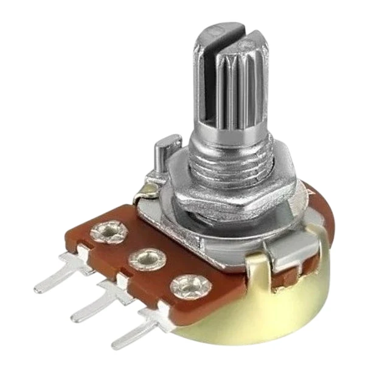
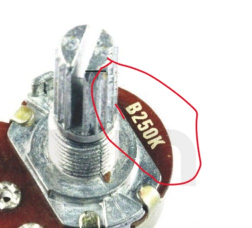
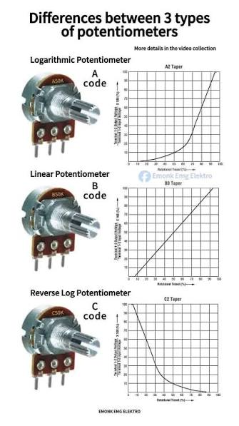
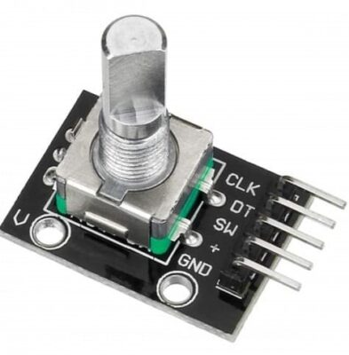
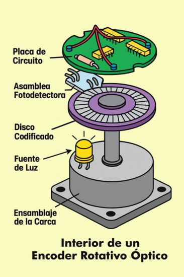
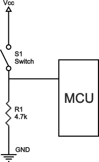
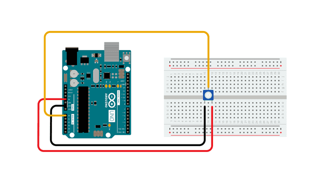
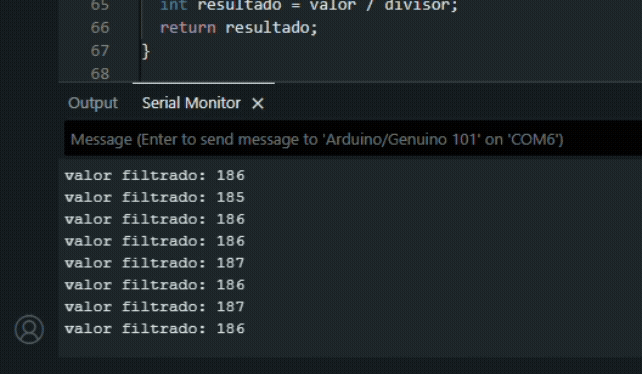
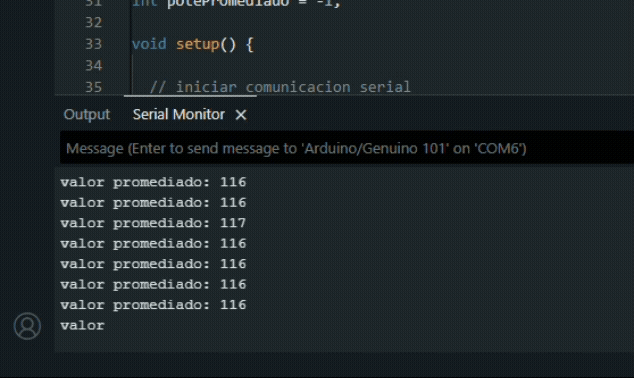

# sesion-02a

## apuntes sesión

### Potenciómetro

En esta sesión nos enfocamos en como poder medir el voltaje resultante al pasar por una resistencia variable, aka _potenciómetro_.

 

Es pertinente mencionar que existen 3 tipos de potenciómetros, estos se diferencian por la letra que aparece antes del valor

 

- A: Logarítmico / Aumenta en base a potencias de 19, es decir que inicialmente su crecimiento es lento, para luego aumentar de manera 

- B: Lineal / No importa en que parte del recorrido se encuentre, su aumento o disminución ocurre en valores constantes

- C: Logarítmico inverso

 

---

#### Encoder

Durante la clase se mencionó que las _perillas_ que pueden rotar de manera constante se llaman **encoders**

> A diferencia de los potenciómetros, que poseen inicio y fin en su recorrido

---

 

### Botones / Pushbutton / pulsadores

Tenemos 2 tipos de botones

1. Normally Open (NO) / Normalmente Abierto

Son los más comunes, al presionar se cierra el circuito.

2. Normally Close (NC) / Normalmente cerrado

El circuito se mantiene cerrado hasta que se presione el botón, lo que deja el circuito abierto.

 

Para que nuestro Arduino pueda detectar y leer nuestro arduino debemos conectar una resistencia llamada _"Pulldown resistor"_ 

> 

[Tutorial Boton Arduino](https://docs.arduino.cc/built-in-examples/digital/Debounce/)

---

### Ejercicio en Clase / _lectura de pote_

Lo primero que debemos es identificar la sección _análoga_ de nuestra placa de desarrollo, para ello debemos buscar el [Pinout](https://docs.arduino.cc/resources/pinouts/ABX00087-full-pinout.pdf) correspondiente al modelo de Arduino que estemos utilizando, en este caso Arduino UNO R4 WIFI

> 
>
> > ~ Cada vez que veamos ese símbolo es utilizado comúnmente como salida para **audio** 👁️

 

Debemos conectar el potenciómetro de la siguiente manera

- pin 1 > VCC

- pin 2 > Lectura análoga / A0

- pin 3 > GND

---

  Programación defensiva > aprueba de

  Objetos >Serial

  Baudios

  105200 > audio >midi

  IN 10 bits

  0 > 0
  1 > 1023

  While > Mientras que > puede quedarse pegado

  ! > lo contrario

## encargos

Se profundizó en el código para leer un potenciómetro, tal como se vio en la clase. Hice las pruebas con los ejemplos adjuntados en _00_docentes_ 

>[Ejemplo 1/filtrado](../../00-docentes/sesion-02a/ej_arduino_pote_filtrado/)
>
>[Ejemplo 2/promedio](../../00-docentes/sesion-02a/ej_arduino_pote_promedio/) 

 

### Potenciómetro Filtrado

## lectura / The computers that made the world - Tim Danton

He tenido múltiples complejidades para lograr entender y comprender todo lo que se habla, ya que el libro está en inglés, por lo que he vuelto a leer todo del inicio y comenzaré a agregar un glosario de las palabras nuevas que voy aprendiendo

