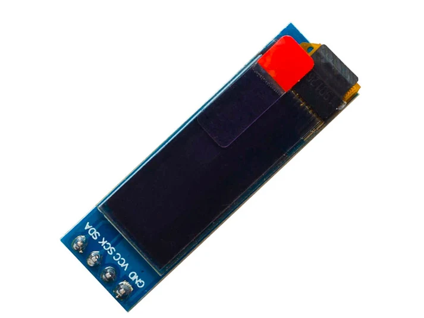
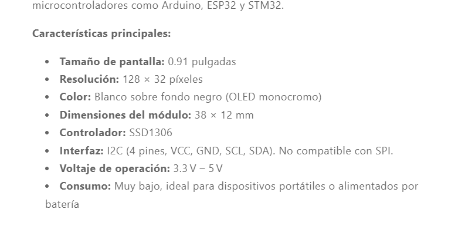
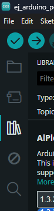
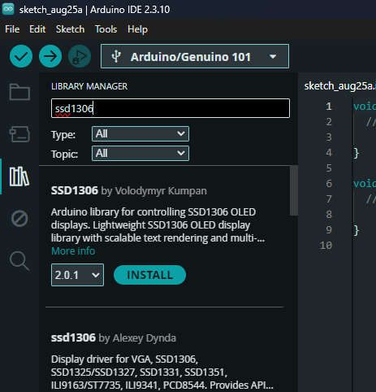
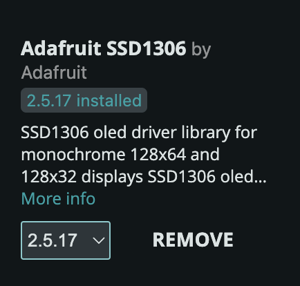
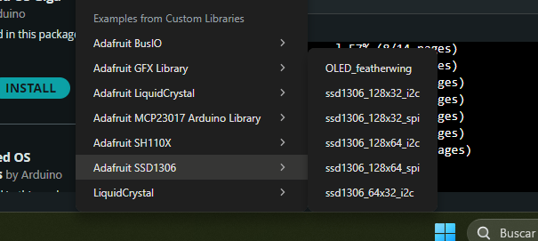
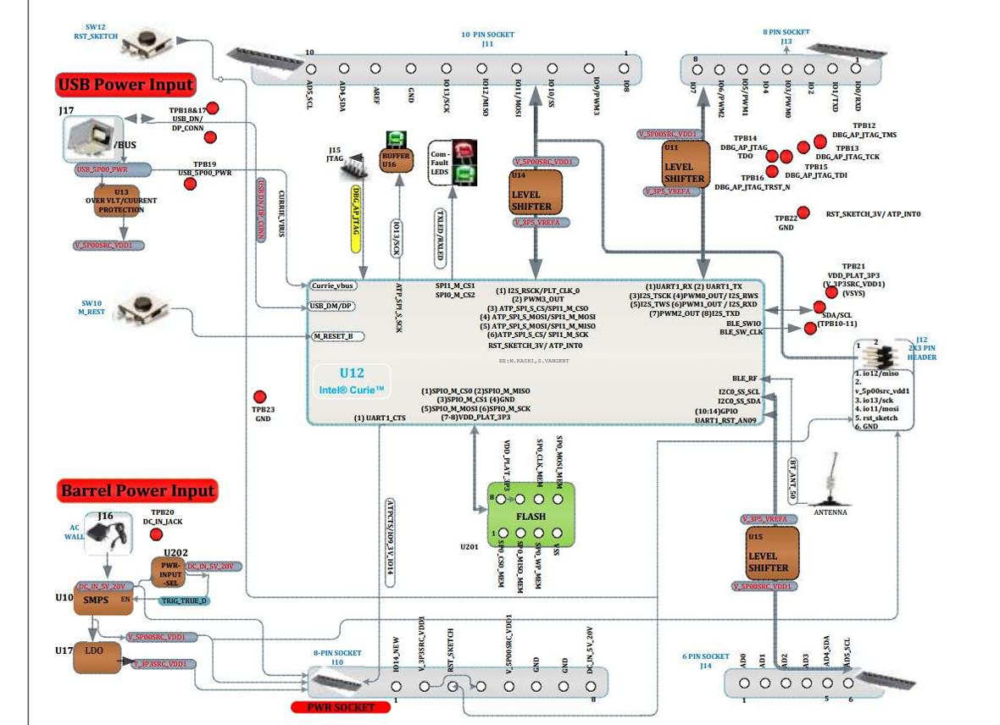
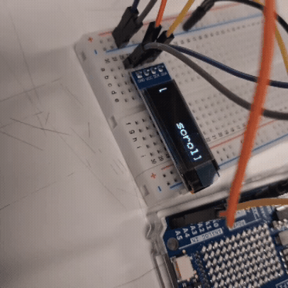

# sesion-03a

Antes de iniciar a escribir (otra vez), me hago un recordatorio importante, demasiado importante

**Revisar al momento de hacer commit** 

Ya que se borró todo lo que había escrito...

<br>

## apuntes sesión

### Pantalla LCD OLED 0,91" I2C 

Iniciamos la clase revisando la nueva adquisición, una pantalla led 



> Directamente desde [AFEL](https://afel.cl/products/pantalla-lcd-oled-0-91)

<br>

Vamos a desglosar el nombre para entender algunos puntos relevantes:

1. Pantalla: También conocido como _display_.

2. LCD OLED / (Diodo Orgánico Emisor de Luz): Tipo de pantalla. En este caso cada pixel se puede iluminar de manera independiente y generar mayores contrastes al no necesitar retroiluminación

3.  0,91": Es la resolución en pulgadas (acá somos hater del sistema imperial), esta se mide en diagonal. Para este caso es de 128px x 32px

4.  I2C / IIC: Quiza de los puntos más relevantes, ya que consta del protocolo de comunicación que existe entre la pantalla y nuestro microcontrolador. Se recomienda en este nivek, utilizar este protocolo, ya que solo consta de 4 pines

  - VCC > Es la alimentación de la pantalla, esta puede ser 3V3 o 5V

  - GND > Es la puesta a tierra, es importante que comparta la misma con el microcontrolador 

  - SCL / SCK > Serial Clock 

  - SDA > Serial Data

<br>

### Arduino IDE

Para lograr que nuestro Arduino UNO R4 WIFI / Arduino 101 logre comunicarse con la pantalla, al escribir el código debemos añadir o crear una biblioteca que nos ayude a comunicarnos mediante el protocolo de cada pantalla.

- Biblioteca / Library: Conjunto de código ya escrito y reutilizable que puedes incorporar a tus proyectos para realizar tareas comunes sin tener que programarlas desde cero

En el caso de la pantalla que estamos trabajando (Pantalla LCD OLED 0,91" I2C) utiliza el controlador **SSD1306**



<br>

En este caso vamos a utilizar una biblioteca de [**Adafruit**](https://www.adafruit.com/), quien además de vender productos, genera las bibliotecas de código abierto. 

Para instalar es sencillo, dentro de _Arduino IDE_, en la barra lateral izquierda debemos dirigirnos a **Library**



<br>

Una vez que tengamos identificado esta ventana, buscaremos "_Adafruit SSD1306_" 





<br>

Ahora que tenemos instalado la biblioteca, haremos un ejemplo para probar la pantalla. Por lo que seguiremos: _/File > Example > Adafruit SSD1306 > ssd1306_128x32_i2c_

> _/ssd1306_128x32_12c_ corresponde al tamaño de la pantalla, es decir 128 pixeles x 32 pixeles




<br>

#### codigo de prueba

<details>
<summary><b> example_adafruit </b></summary>
  
```cpp

/**************************************************************************
 This is an example for our Monochrome OLEDs based on SSD1306 drivers

 Pick one up today in the adafruit shop!
 ------> http://www.adafruit.com/category/63_98

 This example is for a 128x32 pixel display using I2C to communicate
 3 pins are required to interface (two I2C and one reset).

 Adafruit invests time and resources providing this open
 source code, please support Adafruit and open-source
 hardware by purchasing products from Adafruit!

 Written by Limor Fried/Ladyada for Adafruit Industries,
 with contributions from the open source community.
 BSD license, check license.txt for more information
 All text above, and the splash screen below must be
 included in any redistribution.
 **************************************************************************/

#include <SPI.h>
#include <Wire.h>
#include <Adafruit_GFX.h>
#include <Adafruit_SSD1306.h>

#define SCREEN_WIDTH 128 // OLED display width, in pixels
#define SCREEN_HEIGHT 32 // OLED display height, in pixels

// Declaration for an SSD1306 display connected to I2C (SDA, SCL pins)
// The pins for I2C are defined by the Wire-library. 
// On an arduino UNO:       A4(SDA), A5(SCL)
// On an arduino MEGA 2560: 20(SDA), 21(SCL)
// On an arduino LEONARDO:   2(SDA),  3(SCL), ...
#define OLED_RESET     -1 // Reset pin # (or -1 if sharing Arduino reset pin)
#define SCREEN_ADDRESS 0x3C ///< See datasheet for Address; 0x3D for 128x64, 0x3C for 128x32
Adafruit_SSD1306 display(SCREEN_WIDTH, SCREEN_HEIGHT, &Wire, OLED_RESET);

#define NUMFLAKES     10 // Number of snowflakes in the animation example

#define LOGO_HEIGHT   16
#define LOGO_WIDTH    16
static const unsigned char PROGMEM logo_bmp[] =
{ 0b00000000, 0b11000000,
  0b00000001, 0b11000000,
  0b00000001, 0b11000000,
  0b00000011, 0b11100000,
  0b11110011, 0b11100000,
  0b11111110, 0b11111000,
  0b01111110, 0b11111111,
  0b00110011, 0b10011111,
  0b00011111, 0b11111100,
  0b00001101, 0b01110000,
  0b00011011, 0b10100000,
  0b00111111, 0b11100000,
  0b00111111, 0b11110000,
  0b01111100, 0b11110000,
  0b01110000, 0b01110000,
  0b00000000, 0b00110000 };

void setup() {
  Serial.begin(9600);

  // Wait for display
  delay(500);

  // SSD1306_SWITCHCAPVCC = generate display voltage from 3.3V internally
  if(!display.begin(SSD1306_SWITCHCAPVCC, SCREEN_ADDRESS)) {
    Serial.println(F("SSD1306 allocation failed"));
    for(;;); // Don't proceed, loop forever
  }

  // Show initial display buffer contents on the screen --
  // the library initializes this with an Adafruit splash screen.
  display.display();
  delay(2000); // Pause for 2 seconds

  // Clear the buffer
  display.clearDisplay();

  // Draw a single pixel in white
  display.drawPixel(10, 10, SSD1306_WHITE);

  // Show the display buffer on the screen. You MUST call display() after
  // drawing commands to make them visible on screen!
  display.display();
  delay(2000);
  // display.display() is NOT necessary after every single drawing command,
  // unless that's what you want...rather, you can batch up a bunch of
  // drawing operations and then update the screen all at once by calling
  // display.display(). These examples demonstrate both approaches...

  testdrawline();      // Draw many lines

  testdrawrect();      // Draw rectangles (outlines)

  testfillrect();      // Draw rectangles (filled)

  testdrawcircle();    // Draw circles (outlines)

  testfillcircle();    // Draw circles (filled)

  testdrawroundrect(); // Draw rounded rectangles (outlines)

  testfillroundrect(); // Draw rounded rectangles (filled)

  testdrawtriangle();  // Draw triangles (outlines)

  testfilltriangle();  // Draw triangles (filled)

  testdrawchar();      // Draw characters of the default font

  testdrawstyles();    // Draw 'stylized' characters

  testscrolltext();    // Draw scrolling text

  testdrawbitmap();    // Draw a small bitmap image

  // Invert and restore display, pausing in-between
  display.invertDisplay(true);
  delay(1000);
  display.invertDisplay(false);
  delay(1000);

  testanimate(logo_bmp, LOGO_WIDTH, LOGO_HEIGHT); // Animate bitmaps
}

void loop() {
}

void testdrawline() {
  int16_t i;

  display.clearDisplay(); // Clear display buffer

  for(i=0; i<display.width(); i+=4) {
    display.drawLine(0, 0, i, display.height()-1, SSD1306_WHITE);
    display.display(); // Update screen with each newly-drawn line
    delay(1);
  }
  for(i=0; i<display.height(); i+=4) {
    display.drawLine(0, 0, display.width()-1, i, SSD1306_WHITE);
    display.display();
    delay(1);
  }
  delay(250);

  display.clearDisplay();

  for(i=0; i<display.width(); i+=4) {
    display.drawLine(0, display.height()-1, i, 0, SSD1306_WHITE);
    display.display();
    delay(1);
  }
  for(i=display.height()-1; i>=0; i-=4) {
    display.drawLine(0, display.height()-1, display.width()-1, i, SSD1306_WHITE);
    display.display();
    delay(1);
  }
  delay(250);

  display.clearDisplay();

  for(i=display.width()-1; i>=0; i-=4) {
    display.drawLine(display.width()-1, display.height()-1, i, 0, SSD1306_WHITE);
    display.display();
    delay(1);
  }
  for(i=display.height()-1; i>=0; i-=4) {
    display.drawLine(display.width()-1, display.height()-1, 0, i, SSD1306_WHITE);
    display.display();
    delay(1);
  }
  delay(250);

  display.clearDisplay();

  for(i=0; i<display.height(); i+=4) {
    display.drawLine(display.width()-1, 0, 0, i, SSD1306_WHITE);
    display.display();
    delay(1);
  }
  for(i=0; i<display.width(); i+=4) {
    display.drawLine(display.width()-1, 0, i, display.height()-1, SSD1306_WHITE);
    display.display();
    delay(1);
  }

  delay(2000); // Pause for 2 seconds
}

void testdrawrect(void) {
  display.clearDisplay();

  for(int16_t i=0; i<display.height()/2; i+=2) {
    display.drawRect(i, i, display.width()-2*i, display.height()-2*i, SSD1306_WHITE);
    display.display(); // Update screen with each newly-drawn rectangle
    delay(1);
  }

  delay(2000);
}

void testfillrect(void) {
  display.clearDisplay();

  for(int16_t i=0; i<display.height()/2; i+=3) {
    // The INVERSE color is used so rectangles alternate white/black
    display.fillRect(i, i, display.width()-i*2, display.height()-i*2, SSD1306_INVERSE);
    display.display(); // Update screen with each newly-drawn rectangle
    delay(1);
  }

  delay(2000);
}

void testdrawcircle(void) {
  display.clearDisplay();

  for(int16_t i=0; i<max(display.width(),display.height())/2; i+=2) {
    display.drawCircle(display.width()/2, display.height()/2, i, SSD1306_WHITE);
    display.display();
    delay(1);
  }

  delay(2000);
}

void testfillcircle(void) {
  display.clearDisplay();

  for(int16_t i=max(display.width(),display.height())/2; i>0; i-=3) {
    // The INVERSE color is used so circles alternate white/black
    display.fillCircle(display.width() / 2, display.height() / 2, i, SSD1306_INVERSE);
    display.display(); // Update screen with each newly-drawn circle
    delay(1);
  }

  delay(2000);
}

void testdrawroundrect(void) {
  display.clearDisplay();

  for(int16_t i=0; i<display.height()/2-2; i+=2) {
    display.drawRoundRect(i, i, display.width()-2*i, display.height()-2*i,
      display.height()/4, SSD1306_WHITE);
    display.display();
    delay(1);
  }

  delay(2000);
}

void testfillroundrect(void) {
  display.clearDisplay();

  for(int16_t i=0; i<display.height()/2-2; i+=2) {
    // The INVERSE color is used so round-rects alternate white/black
    display.fillRoundRect(i, i, display.width()-2*i, display.height()-2*i,
      display.height()/4, SSD1306_INVERSE);
    display.display();
    delay(1);
  }

  delay(2000);
}

void testdrawtriangle(void) {
  display.clearDisplay();

  for(int16_t i=0; i<max(display.width(),display.height())/2; i+=5) {
    display.drawTriangle(
      display.width()/2  , display.height()/2-i,
      display.width()/2-i, display.height()/2+i,
      display.width()/2+i, display.height()/2+i, SSD1306_WHITE);
    display.display();
    delay(1);
  }

  delay(2000);
}

void testfilltriangle(void) {
  display.clearDisplay();

  for(int16_t i=max(display.width(),display.height())/2; i>0; i-=5) {
    // The INVERSE color is used so triangles alternate white/black
    display.fillTriangle(
      display.width()/2  , display.height()/2-i,
      display.width()/2-i, display.height()/2+i,
      display.width()/2+i, display.height()/2+i, SSD1306_INVERSE);
    display.display();
    delay(1);
  }

  delay(2000);
}

void testdrawchar(void) {
  display.clearDisplay();

  display.setTextSize(1);      // Normal 1:1 pixel scale
  display.setTextColor(SSD1306_WHITE); // Draw white text
  display.setCursor(0, 0);     // Start at top-left corner
  display.cp437(true);         // Use full 256 char 'Code Page 437' font

  // Not all the characters will fit on the display. This is normal.
  // Library will draw what it can and the rest will be clipped.
  for(int16_t i=0; i<256; i++) {
    if(i == '\n') display.write(' ');
    else          display.write(i);
  }

  display.display();
  delay(2000);
}

void testdrawstyles(void) {
  display.clearDisplay();

  display.setTextSize(1);             // Normal 1:1 pixel scale
  display.setTextColor(SSD1306_WHITE);        // Draw white text
  display.setCursor(0,0);             // Start at top-left corner
  display.println(F("Hello, world!"));

  display.setTextColor(SSD1306_BLACK, SSD1306_WHITE); // Draw 'inverse' text
  display.println(3.141592);

  display.setTextSize(2);             // Draw 2X-scale text
  display.setTextColor(SSD1306_WHITE);
  display.print(F("0x")); display.println(0xDEADBEEF, HEX);

  display.display();
  delay(2000);
}

void testscrolltext(void) {
  display.clearDisplay();

  display.setTextSize(2); // Draw 2X-scale text
  display.setTextColor(SSD1306_WHITE);
  display.setCursor(10, 0);
  display.println(F("scroll"));
  display.display();      // Show initial text
  delay(100);

  // Scroll in various directions, pausing in-between:
  display.startscrollright(0x00, 0x0F);
  delay(2000);
  display.stopscroll();
  delay(1000);
  display.startscrollleft(0x00, 0x0F);
  delay(2000);
  display.stopscroll();
  delay(1000);
  display.startscrolldiagright(0x00, 0x07);
  delay(2000);
  display.startscrolldiagleft(0x00, 0x07);
  delay(2000);
  display.stopscroll();
  delay(1000);
}

void testdrawbitmap(void) {
  display.clearDisplay();

  display.drawBitmap(
    (display.width()  - LOGO_WIDTH ) / 2,
    (display.height() - LOGO_HEIGHT) / 2,
    logo_bmp, LOGO_WIDTH, LOGO_HEIGHT, 1);
  display.display();
  delay(1000);
}

#define XPOS   0 // Indexes into the 'icons' array in function below
#define YPOS   1
#define DELTAY 2

void testanimate(const uint8_t *bitmap, uint8_t w, uint8_t h) {
  int8_t f, icons[NUMFLAKES][3];

  // Initialize 'snowflake' positions
  for(f=0; f< NUMFLAKES; f++) {
    icons[f][XPOS]   = random(1 - LOGO_WIDTH, display.width());
    icons[f][YPOS]   = -LOGO_HEIGHT;
    icons[f][DELTAY] = random(1, 6);
    Serial.print(F("x: "));
    Serial.print(icons[f][XPOS], DEC);
    Serial.print(F(" y: "));
    Serial.print(icons[f][YPOS], DEC);
    Serial.print(F(" dy: "));
    Serial.println(icons[f][DELTAY], DEC);
  }

  for(;;) { // Loop forever...
    display.clearDisplay(); // Clear the display buffer

    // Draw each snowflake:
    for(f=0; f< NUMFLAKES; f++) {
      display.drawBitmap(icons[f][XPOS], icons[f][YPOS], bitmap, w, h, SSD1306_WHITE);
    }

    display.display(); // Show the display buffer on the screen
    delay(200);        // Pause for 1/10 second

    // Then update coordinates of each flake...
    for(f=0; f< NUMFLAKES; f++) {
      icons[f][YPOS] += icons[f][DELTAY];
      // If snowflake is off the bottom of the screen...
      if (icons[f][YPOS] >= display.height()) {
        // Reinitialize to a random position, just off the top
        icons[f][XPOS]   = random(1 - LOGO_WIDTH, display.width());
        icons[f][YPOS]   = -LOGO_HEIGHT;
        icons[f][DELTAY] = random(1, 6);
      }
    }
  }
}


```

</details>

<br>

Luego de una depuración en clases se llegó a un código que solo renderice texto 

<details>
<summary><b> example_adafruti_aaron_version </b></summary>
  

```cpp


#include <SPI.h>
#include <Wire.h>
#include <Adafruit_GFX.h>
#include <Adafruit_SSD1306.h>

#define SCREEN_WIDTH 128 // OLED display width, in pixels
#define SCREEN_HEIGHT 32 // OLED display height, in pixels

#define OLED_RESET     -1 // Reset pin # (or -1 if sharing Arduino reset pin)
#define SCREEN_ADDRESS 0x3C ///< See datasheet for Address; 0x3D for 128x64, 0x3C for 128x32
Adafruit_SSD1306 display(SCREEN_WIDTH, SCREEN_HEIGHT, &Wire, OLED_RESET);

#define NUMFLAKES     10 // Number of snowflakes in the animation example

#define LOGO_HEIGHT   16
#define LOGO_WIDTH    16

void setup() {
  Serial.begin(9600);

  // Wait for display
  delay(500);

  // SSD1306_SWITCHCAPVCC = generate display voltage from 3.3V internally
  if(!display.begin(SSD1306_SWITCHCAPVCC, SCREEN_ADDRESS)) {
    Serial.println(F("SSD1306 allocation failed"));
    for(;;); // Don't proceed, loop forever
  }

  // Show initial display buffer contents on the screen --
  // the library initializes this with an Adafruit splash screen.
  display.display();
  delay(2000); // Pause for 2 seconds

  // Clear the buffer
  display.clearDisplay();

  // Draw a single pixel in white
  display.drawPixel(10, 10, SSD1306_WHITE);

  // Show the display buffer on the screen. You MUST call display() after
  // drawing commands to make them visible on screen!
  display.display();
  delay(2000);
  // display.display() is NOT necessary after every single drawing command,
  // unless that's what you want...rather, you can batch up a bunch of
  // drawing operations and then update the screen all at once by calling
  // display.display(). These examples demonstrate both approaches...

  testdrawchar();      // Draw characters of the default font

  testdrawstyles();    // Draw 'stylized' characters

  testscrolltext();    // Draw scrolling text
  // Invert and restore display, pausing in-between
  display.invertDisplay(true);
  delay(1000);
  display.invertDisplay(false);
  delay(1000);

  
}

void loop() {
}

void testdrawchar(void) {
  display.clearDisplay();

  display.setTextSize(1);      // Normal 1:1 pixel scale
  display.setTextColor(SSD1306_WHITE); // Draw white text
  display.setCursor(0, 0);     // Start at top-left corner
  display.cp437(true);         // Use full 256 char 'Code Page 437' font

  // Not all the characters will fit on the display. This is normal.
  // Library will draw what it can and the rest will be clipped.
  for(int16_t i=0; i<256; i++) {
    if(i == '\n') display.write(' ');
    else          display.write(i);
  }

  display.display();
  delay(2000);
}

void testdrawstyles(void) {
  display.clearDisplay();

  display.setTextSize(1);             // Normal 1:1 pixel scale
  display.setTextColor(SSD1306_WHITE);        // Draw white text
  display.setCursor(0,0);             // Start at top-left corner
  display.println(F("Hello, world!"));

  display.setTextColor(SSD1306_BLACK, SSD1306_WHITE); // Draw 'inverse' text
  display.println(3.141592);

  display.setTextSize(2);             // Draw 2X-scale text
  display.setTextColor(SSD1306_WHITE);
  display.print(F("0x")); display.println(0xDEADBEEF, HEX);

  display.display();
  delay(2000);
}

void testscrolltext(void) {
  display.clearDisplay();

  display.setTextSize(2); // Draw 2X-scale text
  display.setTextColor(SSD1306_WHITE);
  display.setCursor(10, 0);
  display.println(F("scroll"));
  display.display();      // Show initial text
  delay(100);

  // Scroll in various directions, pausing in-between:
  display.startscrollright(0x00, 0x0F);
  delay(2000);
  display.stopscroll();
  delay(1000);
  display.startscrollleft(0x00, 0x0F);
  delay(2000);
  display.stopscroll();
  delay(1000);
  display.startscrolldiagright(0x00, 0x07);
  delay(2000);
  display.startscrolldiagleft(0x00, 0x07);
  delay(2000);
  display.stopscroll();
  delay(1000);
}

#define XPOS   0 // Indexes into the 'icons' array in function below
#define YPOS   1
#define DELTAY 2

void testanimate(const uint8_t *bitmap, uint8_t w, uint8_t h) {
  int8_t f, icons[NUMFLAKES][3];

  // Initialize 'snowflake' positions
  for(f=0; f< NUMFLAKES; f++) {
    icons[f][XPOS]   = random(1 - LOGO_WIDTH, display.width());
    icons[f][YPOS]   = -LOGO_HEIGHT;
    icons[f][DELTAY] = random(1, 6);
    Serial.print(F("x: "));
    Serial.print(icons[f][XPOS], DEC);
    Serial.print(F(" y: "));
    Serial.print(icons[f][YPOS], DEC);
    Serial.print(F(" dy: "));
    Serial.println(icons[f][DELTAY], DEC);
  }

  for(;;) { // Loop forever...
    display.clearDisplay(); // Clear the display buffer

    // Draw each snowflake:
    for(f=0; f< NUMFLAKES; f++) {
      display.drawBitmap(icons[f][XPOS], icons[f][YPOS], bitmap, w, h, SSD1306_WHITE);
    }

    display.display(); // Show the display buffer on the screen
    delay(200);        // Pause for 1/10 second

    // Then update coordinates of each flake...
    for(f=0; f< NUMFLAKES; f++) {
      icons[f][YPOS] += icons[f][DELTAY];
      // If snowflake is off the bottom of the screen...
      if (icons[f][YPOS] >= display.height()) {
        // Reinitialize to a random position, just off the top
        icons[f][XPOS]   = random(1 - LOGO_WIDTH, display.width());
        icons[f][YPOS]   = -LOGO_HEIGHT;
        icons[f][DELTAY] = random(1, 6);
      }
    }
  }
}

```

</details>

### Conexión

Para realizar las conexiones necesarias, vamos a revisar el **pinout** correspondiente al modelo de nuestro Arduino y ubicar los pines correspondientes a IIC SDA e IIC SDL

#### Arduino UNO R4 WIFI


<br>

#### Arduino 101



<br>

### Resultado



<br>

## encargos

No hubo encargo formal en esta clase, pero como grupo nos enfocamos para poder definir el poema a realizar para el _proyecto_01_

Dentro de la investigación, llegamos a "Cine" de Victoria Ramírez Mansilla. Este poema gira en torno a una cita sáfica en un cine y como la película y el ambiente pasa a 2do plano por el amor brotando de 2 personas.

Esto nos llevó a querer conceptualizar la visualización del poema en un gesto en particular. El que 2 individuos deban accionar el mismo elemento de manera simultanea.

Terminamos definiendo un esquema de "_funciones_" que se deberian efectuar

```txt

Inicia el Arduino

Se comienza a visualizar el poema como una sola línea de texto que avanza, tal y como lo hace un carrete de película 

“Luces bajas y escaleras de lava negra me toman la mano y es una mano áspera casi todas las manos de mujer son suaves el deseo se me presenta como una cuenca acomodo las palmas y ellas se adaptan a las cosas que sospecho amar me dejo llevar por el cordel apenas logro concentrarme en la historia mi pecho es un instrumento de viento demasiado distante quiero decir que admiro la manera en que el cuello sostiene su cabeza quiero decir que entiendo la entrega de la fracción de la fracción de la fracción”

1. El texto avanzará de manera continua hasta que se presionen los botones
2. En caso de ser solo 1, el texto se congela y no sigue avanzando hasta que se deje de presionar
3. Si son los 2 botones, se detiene el texto y desaparece
4. Mientras esto ocurre, se consulta en qué sección del texto se encuentra
5. En base a la sección del texto mostrado, se visualizará una palabra clave
6. Al dejar de presionar un botón, vuelve a ocurrir el punto 4
7. Si se sueltan ambos botones, desaparece la palabra
8. Luego continúa avanzando el texto desde el mismo punto en el que quedó


```
<br>

## lectura / The computers that made the world - Tim Danton

### Zuse Z3

1. sowing > siembra

2. spare > repuesto

3. Arguably > podría decirse que

4. delight > deleitar  


- "But in the end, engineering would win" > Mala elección amigo mio

  > Igualmente y fuera de la broma, al leer este libro me ha hecho cuestionarme si lo que me apasiona es el diseño o la ingeniería. A pesar de ser áreas bastante diferentes, siento que estoy encontrando un balance para ambas, el empezar a aprender a programar, más aprender de electrónica me hace más feliz de lo que ya era con diseño 

- "Doric and Ionic columns left me cold" > No juzgo a Konrad Zuse, bastante poco emocionante estudiar arquitectura

  > Siguiendo con la cita anterior, definitivamente me pongo a pensar que las nociones que uno percibe de ciertas carreras se van difuminando con el tiempo, en su momento me llamaba bastante la atención la arquitectura y la veía bastante cercana al diseño. Hoy en día, siento que están bastante lejanas, pero no quita que eventualmente uno al profundizar más elimina las barreras propias de la disciplina. Con esto me refiero a que la gracia de estudiar y profundizar es deformar las convenciones que existen sobre las carreras

- Problemas con las calculadoras [Tópico constante en estos primeros capítulos] 
- Inicia a hacer croquis sobre posibles soluciones mecánicas (Poseía un diario en el que anotaba todas sus ideas respecto a este problema)
- Se gradúa en 1935 😲
- Construye Z1 en el living de la casa de sus padres (1938 [Mal año para vivir en Berlín])
- Compleja por lo que paso a la Z2
- No utilizo tubos de vacío (precursores de los transistores modernos), debido a los costes y que debería requerir cerca de 2000 >
- Viajo a EEUU despues de acabar la 2GM (sus como dicen los lolos)
- Utilizo relés para poder crear la Z3
- La Z3 estaba capacitada para poder trabajar en el ámbito científico por su exactitud
- 896 relés en total
- procesamiento de 2.5GHz (una banda) 
