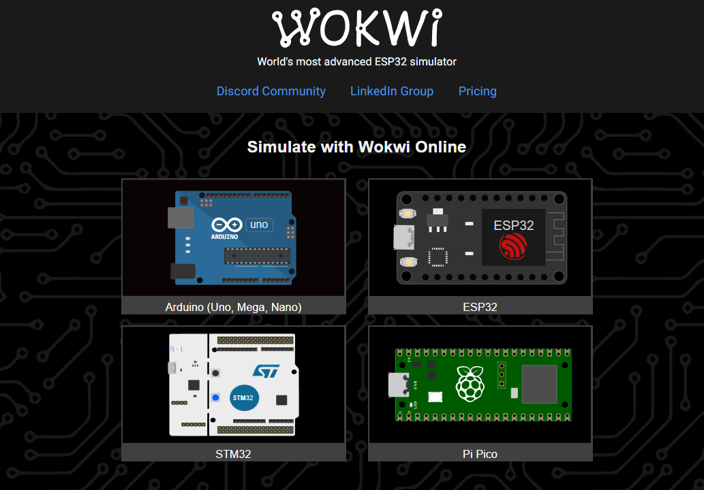
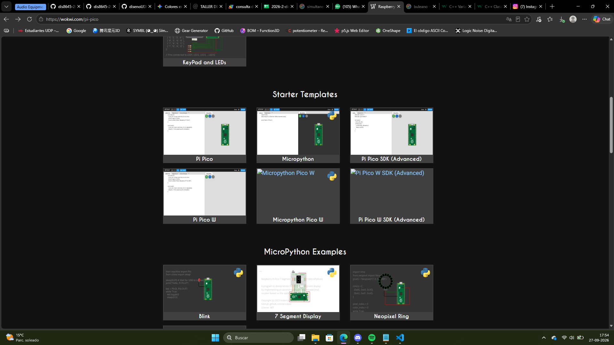
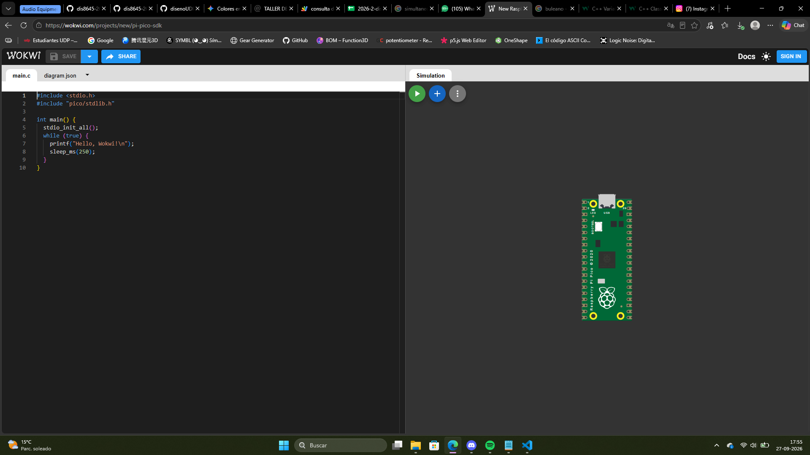

# sesion-06b

## apuntes sesión

### [Wokwi](https://wokwi.com/)

En esta clase trabajamos con Wokwi, un simulador con mucho parecido a Tinkercad. En este podemos escribir código y hacer pruebas para ejecutarlo de manera On-Line, evitando así causar daños a nuestras placas (además de realizar pruebas en caso de no poseer un microcontrolador)



Existe diversidad de microcontroladores para hacer pruebas, solo que nos enfocaremos en Raspberry Pi Pico

<br>



Además podremos elegir múltiples ejemplos de proyectos y plantillas para desarrollar ideas. Nosotros utilizaremos "_Pi Pico SDK (Adanced)_"

<br>



Ya tenemos una plantilla con la que iniciar nuestros proyectos.

Vamos a desglosar el código que vemos:

```cpp

#include <stdio.h>
#include "pico/stdlib.h"

int main() {
  stdio_init_all();
  while (true) {
    printf("Hello, Wokwi!\n");
    sleep_ms(250);
  }
}

```

```cpp
// copia y pega ese archivo
// ojo que esta entre <>
// este archivo esta en un lugar lejano
// que tiene que ver con C
#include <stdio.h>
// este otro esta entre ""
// entre "" es literalmente
// en ese lugar
// en este caso
// al lado de este archivo
// hay una carpeta pico/
// y adentro esta stdlib.h
#include "pico/stdlib.h"


// mi propia funcion
// tipo nombre
// parentesis murcielagos
// diseno top-down
int prueba() {
  int x = 3;
  int y = 6;
  int resultado = x * y;
  return resultado;
}


// funcion main()
// es de tipo int
// las int cuando corren
// retornan un entero
int main() {
  // esta funcion
  // inicializa raspico
  stdio_init_all();
  while (true) {
    // printf("Hello, Wokwi!\n");
    // convertir de int a chars
    printf("%d\n", prueba());
    sleep_ms(250);
  }
}
```

## encargos

## lectura
