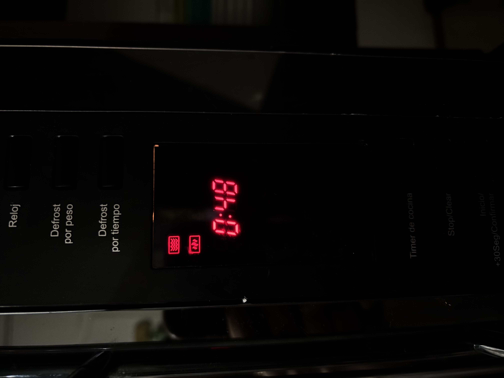
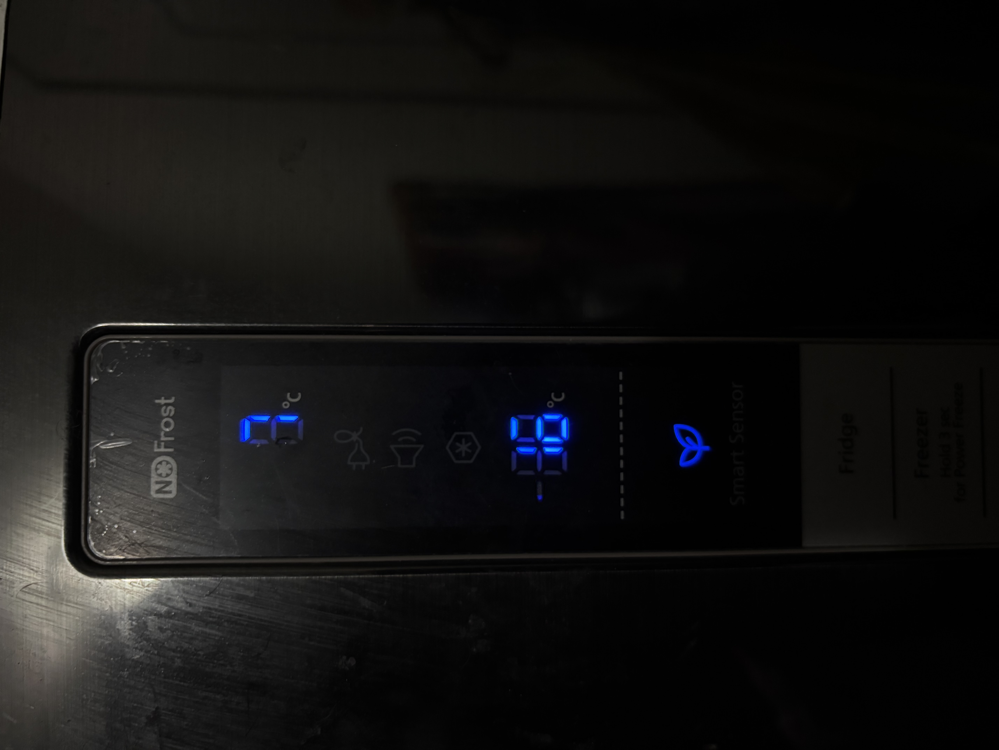
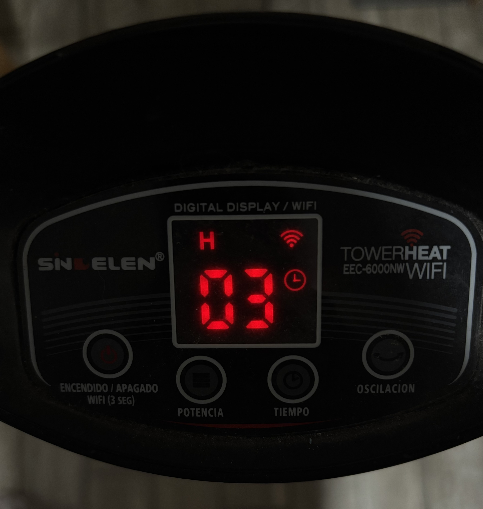
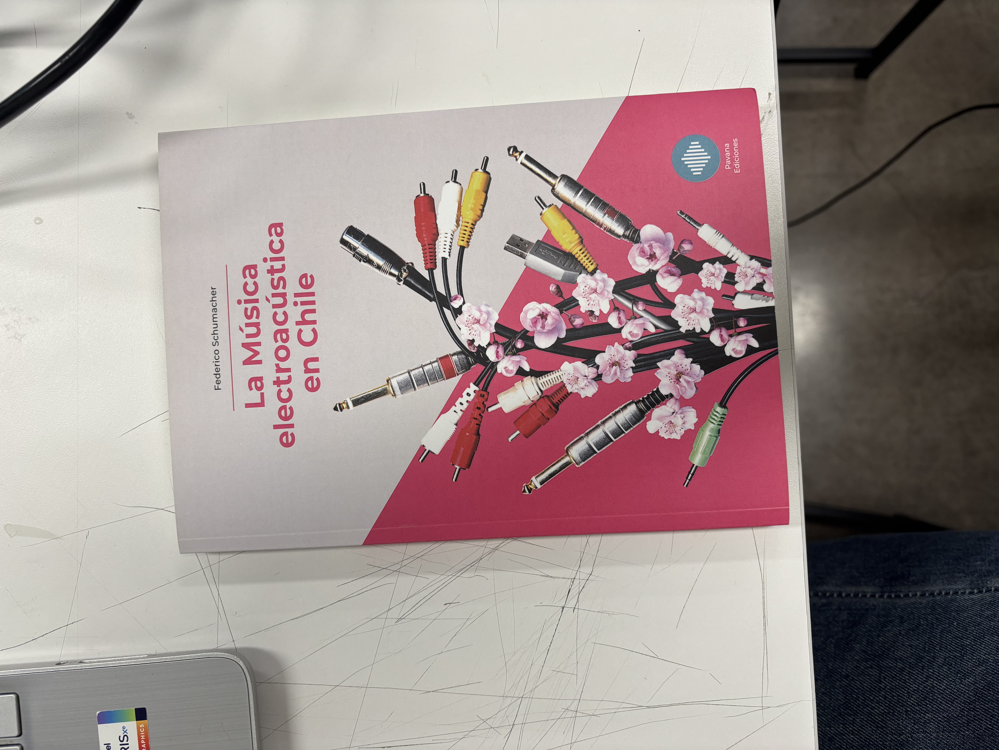

# sesion-01a

martes 2026-08-11

## apuntes sesión

08:30 a 09:00 am. introducción, charla

09:00 am. inicio de clases (materia) y pasar lista

**comunicación** 

vía pública discord, etiquetar a: 
- @montoyamoraga
- @misaa.cc
- @emilia

vía correo: siempre poner en asunto dis8645-resumenTema
  - aaron.montoya@mail.udp.cl
  - matias.serrano@mail.udp.cl
  - emilia.guerra@mail.udp.cl

### datos importantes
- aprender a mandar correos (siempre mandar copia a equipo docente y responder con copia a todos)
- listados o datos escribirlos de preferencia en orden alfabético
- no utilizar mayúsculas 
- [] = **corchete**
- ( = **paréntesis**
- { = **murciélago**
-  en canvas se encuentran los siguientes link:
    - notas
    - asistencia
    - bitácoras

### github
- calendario en github -dis8645
- los archivos no pueden tener otros archivos siempre debe existir una carpeta (carpeta contiene archivos)
- comandos:
   - cambiar nombre de la imagen, sin espacios, ni mayúsculas (archivos tampoco deben tener espacio en su nombre)
   - imágenes debe incluir: 
      - ejemplo: 
   - doble espacio y guion listado (puntito blanco) 

encargos de todos los martes, leer libro: **la música electroacústica en chile** (subir foto a discord)

## encargos

**1-autorretrato: describir variables y funciones de ustedes.**

### variables físicas

  - **extremidades externas:** dedos, manos, brazos, pies y piernas los cuales me permiten realizar mis actividades diarias, por ejemplo: levantar una caja con mis manos y brazos, escribir/teclear en el computador con mis dedos o caminar/correr con mis piernas y pies; también a través de estas se da el tacto (piel) para la interacción y exploración de diversas cosas (objetos, texturas, personas, animales, entre otras), así como lo es el tocar objetos o agarrarlos 
  - **rostro y sentidos:** me permiten
     - ojos para mirar, observar, enfocar, percibir formas y colores
     - nariz para oler y distinguir aromas
     - orejas para escuchar, detectar sonidos, tonos y mantener el equilibrio
     - boca para hablar, cantar, balbucear, gritar, comer, beber, morder, masticar, saborear, escupir, silbar
     - tacto (piel) en el rostro cumple una función de protección y sensibilidad, captando la sensación del viento, calor, frío, dolor o roces delicados (caricias o cuando otra persona te toca el rostro)
  - **rasgos únicos y apariencia:**
     - forma y color del pelo: liso, largo y de color negro
     - tono de piel: tono medio o trigueño claro
     - altura: 163 cm
     - contextura: media
     - forma de uñas: largo medio 
     - huellas dactilares: únicas en cada dedo
     - papilas gustativas: ubicadas en la lengua para distinguir sabores (dulce, salado, amargo, ácido, picante, umami)

### funciones

   - **moverse y realizar tareas:** uso del conjunto de huesos, músculos, ligamentos y articulaciones en las extremidades las cuales me permiten lograr el desplazamiento ya sea para caminar, correr, saltar, trotar, escalar, esquivar, patear o mantener el equilibrio; también me permite la manipulación de objetos ya sea agarrar, levantar, escribir, apretar, teclear, jalar, empujar, soltar, sostener, lanzar o manipular objetos con precisión
   - **comer y expresarse:** la boca como ya dije anteriormente sirve para demasiadas cosas
      - proceso de alimentación: cuando mi boca se coordina con los dientes, lengua y glándulas para morder, masticar, saborear, tragar, beber o escupir, permitiendo el ingreso de los alimentos y líquidos hacia mi cuerpo
      - proceso de comunicación: cuando mi boca se coordina con los labios, lengua y cuerdas vocales para la generación de sonidos y aire, la cual me permite hablar, cantar, balbucear, gritar, silbar o gesticular, como puente de interacción social para compartir mis pensamientos, ideas, sentimientos o simplemente para poder comunicarme de manera verbal con las demás personas
   - **procesos internos:**
      - sistema circulatorio mi corazón recibe la sangre y la bombea para distribuir oxígeno y nutrientes por todo el cuerpo a través de las arterias y venas
      - sistema digestivo al recibir alimentos y líquidos por mi boca, estos pasan por mi estomago e intestinos para absorber energía y desechar lo restante
      - sistema respiratorio hace que entre aire por mi nariz y las envía a mis pulmones para extraer el oxígeno y expulsar lo que no sirve al exhalar
      - sistema inmunológico mis defensas se activan internamente para combatir virus y bacterias, las cuales me protegen de enfermedades
      - sistema nervioso percibe estímulos del entorno los cuales llegan a mi cerebro para procesar la información y estados de ánimo
      - sistema óseo y muscular sostienen todos mis órganos internos y trabajan en conjunto para darle firmeza y movilidad a mi cuerpo

### **integración de todo lo anterior:** 
la combinación coordinada de todos estos permite que mi cuerpo funcione adecuadamente como un todo, manteniéndome con vida 

**2-investigar pantallas de segmentos, tomar fotos, documentar contexto, lugar, ubicación, alfabetos posibles, usos, comparar entre resultados encontrados, al menos 3 ejemplos distintos. https://en.wikipedia.org/wiki/Segment_display**

**¿Qué son pantallas de segmentos?**
- son dispositivos electrónicos que representan caracteres numéricos y alfabéticas
- funciona mediante la iluminación o desactivación de un grupo de trazos fijos
- los trazos son fabricados habitualmente con diodos LED o tecnología de cristal líquido (LCD),
- actúan como componentes individuales que componen el mensaje visual

**tipos principales**
- 7 segmentos
   - su diseño posee solo líneas horizontales y verticales con la forma tradicional de un número **8**
   - su función principal es mostrar números del 0 al 9 y una cantidad muy reducida de letras simples
   - su uso y complejidad es más económica, requiere un circuito sencillo y consume poca energía (ideal para relojes o básculas)
- 14 y 16 segmentos:
   - su diseño posee una suma de líneas diagonales e el centro y trazos divididos que forman una especie de asteriscos.
   - su función principal es mostrar el alfabeto completo de la **A** a la **Z**, números y símbolos matemáticos o especiales tales como ** +, *, ? **
   - su sistema es más versátil para mostrar texto completo, pero exige circuitos de control más avanzados

**¿Dónde se pueden encontrar?**
- microondas
- lavadoras
- secadoras
- relojes
- calculadoras
- básculas
- refrigeradores
- turneros de bancos y farmacias
- entre otros

ejemplos de fotos:

**ejemplo 1: microondas**

microondas con una pantalla de 7 segmentos con luz roja que muestra la cuenta regresiva

**ejemplo 2: refrigerador**

refrigerador con una pantalla de 7 segmentos con números de color azul

**ejemplo 3: estufa**

estufa eléctrica con una pantalla de 7 segmentos en color rojo 

**observación:** 
- me di cuenta al subir las imágenes que solo tome fotos de pantallas de 7 segmentos pero con distintas funciones
   - **microondas** muestra el tiempo en cuenta regresiva para distintos procesos, como la cocción, la descongelación o el calentamiento de alimentos
   - **refrigerador** visualiza la temperatura en grados Celsius, valores positivos para la refrigeración y negativos para el congelador
   - **estufa eléctrica** indica las horas de encendido programado
- además de lo ya visible, como son los colores y el diseño, el refrigerador utiliza un **LED azul**, mientras que el microondas y la estufa utilizan un **LED rojo**

## lectura

nos dejaron elegir un libro para leer durante el semestre en el cual debemos dejar 2 citas por clase y leer mínimo 100 paginas durante el semestre

libro escogido **La Música electroacústica en Chile** de Federico Schumacher

¿Quién es Federico Schumacher?
- Federico nació en Santiago de Chile en 1963
- es compositor e investigador
- se graduó en la Universidad de Chile y Doctor de Música por la Universidad Federal de Minas Gerais en Brasil
- se especializa en obras acusmáticas por el cual fue premiado nacional e internacionalmente
- su área de interés es la investigación sobre la música electroacústica, cómo se percibe la música acusmática y la conservación del patrimonio sonoro tecnológico 
- actualmente es académico en el Departamento de Sonido de la Universidad de Chile

### capítulos leído del libro 
- **(Buenos) propósitos**
  - en este capitulo habla sobre como el autor comenzó a estudiar en Francia y se dio cuenta de lo frustrante que era que no hubiera prácticamente nada de información sobre la historia de la música electroacústica en Chile.
  - al ser el también compositor, decidió investigar por su propia cuenta para rescatar el trabajo de sus colegas, descubriendo que la historia era mucho más valiosa de lo que creía, aunque la información estaba muy dispersa y con vació
  - finalmente, explica que 20 años después pudo actualizar el libro para agregar lo sucedido desde 2005: el gran impacto del Festival Ai-Maako, el surgimiento de Arte Sonoro y la llegada de la enseñanza universitaria de esta disciplina el país
 - **Advertencia al lector advertido**
  - este capítulo el autor hace una pausa para buscar aclarar y definir los distintos términos técnicos para que nadie se confunda al leer (de ahí el titulo del capítulo)
  - explica de manera sencilla el origen de los conceptos como la **música concreta** (hecha con ruidos y grabaciones reales) y la **música electrónica** (creada solamente mediante aparatos), mostrando cómo ambas evolucionaron con el tiempo hacia nombres como **música acusmática, Tape Music** o **música mixta**
  - finalmente, concluye que usará música electroacústica como el termino general para reunir todas estas formas de crear sonidos con tecnología a lo largo del libro

### citas del libro

**cita 1**: página 12

**_"Si a pesar de mis buenos propósitos, aún existe otro compositor que se ha escapado en este recuento, ruego la indulgencia debida para quien desde hace algunos años vive fuera del país..."_**

esta cita me gusto, debido a la honestidad del autor al reconocer que se le pudo pasar alguien y pide disculpas

**cita 2**: página 16

**_"En definitiva, para este trabajo se preferirá el termino Música Electroacústica como genérico de todas las variaciones del tema que venimos de revisar"_**

esta cita me gusto porque el autor se deja de rodeos y toma una decisión practica

