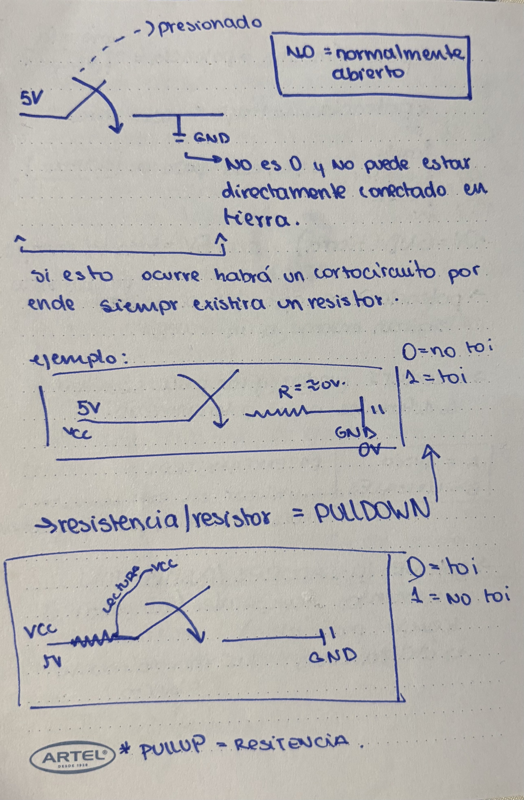

# sesion-02a

martes 2026-08-18

## apuntes sesión

08:30 am 

partimos hablando que íbamos a **programar en clase** pero luego del primer proyecto
- hacer grupos de 3 o 4 para el siguiente encargo (encargo ya subido en carpeta **00-docentes**, para el siguientes viernes)
- todos los martes empezaremos con lectura que estemos leyendo
- no es necesario entender lo que estamos leyendo (ejemplo: poesía)
- **revisar que son y de donde vienen las cosas**
- hablamos un poco sobre **Jackie Élie Derrida** y **Manuela Infante**

**Jackie Élie Derrida:**  fue un filósofo francés conocido por desarrollar el análisis **semiótico denominado deconstrucción**
  - **semiótica:** disciplina científica y filosófica que estudia los signos, los símbolos y los procesos de significación mediante los cuales los seres humanos creamos y transmitimos sentido

**Manuela Infante:** es una dramaturga, directora, actriz y músico chilena (revolucionando el mundo del teatro)

09:24 am apuntes clases

esta clase veremos como programar:
- **potenciómetro (perrilla)**
   - encoders no son potenciómetros, ya que estos pueden girar siempre
   - los potenciómetros giran entorno a un rango
   - potenciómetro A = audio 
   - potenciómetro B = lineales (este utilizaremos en el semestre)
- **botones/pushbutton**
   - botones/pulsadores/pushbutton
   - elementos temporales (al pasar el timepo pas alago)
   - este semestre utilizaremos **N.O = normalmente abierto**
 
foto de mi cuaderno sobre lenguaje simbólico de PUSHBUTTON




- **toggles**
   -  interruptor


### ejercicio hecho en clases

Arduino UNO R4


```C++

const int patitaLectura = A0;

int valorLectura = -1;


void setup() {

 Serial.begin(9600);
}

void loop() {
 valorLectura = analogRead(patitaLectura); 
  Serial.println (valorLectura);

}

```


## encargos

encargo02a:

1- en tu fork, ir a actions, y aceptar que corran github worfklows. subir pantallazo con demostración de que han corrido actions exitosas en tu repo. esto es crucial, si no lo haces, no agregaremos tus apuntes al repo, y las tareas se tomarán como no entregadas. si en tu fork las actions no son exitosas, no serán tampoco agregadas al repo común ni evaluadas.

- revisado en clases por Aaron :)

2- conformar grupos de 3 a 4 personas para la realización del proyecto-1. compartir 2 placas de desarrollo por grupo, documentar estudio conjunto de C++, microcontroladores, botones, potenciómetros.

**grupo:** 
- Emilia Contreras (hazzaily)
- Katalina Riquelme (riyakatalinaa)
- falta uno :(

## lectura

nos dejaron elegir un libro para leer durante el semestre en el cual debemos dejar 2 citas por clase y leer mínimo 100 paginas durante el semestre

libro escogido **La Música electroacústica en Chile** de Federico Schumacher

### capítulo leído del libro 
- **Chile, los años '50 y la Música**
   - cuenta que en Chile específicamente en la década de los 50 en plena guerra fría, bajo las tensiones políticas de la **ley maldita** y la sucesión de tres gobiernos de distinto signo político
   - cuenta que fue una época muy favorecedora para la música gracias a la Universidad de Chile (IEM, festivales, revista m musical chilena) y la creación de la **orquesta filarmónica** y escuelas privadas
   - habla también sobre la llegada de la vanguardia y el dodecafonismo a través de figuras clave como **Free Focke** y **Gustavo Becerra**, quienes impulsaron la enseñanza fuera de los esquemas tradicionales
   - finaliza destacando el surgimiento de dos grandes generaciones de compositores (**Amenábar** y **Asuar**) y la vida cultural alrededor de Il Bosco y la obra de **Violeta Parra**.


### citas del libro

**cita 1**: 

**_"Si bien la mayor parte de la enseñanza de la composición se sigue concentrando en la Universidad de Chile, ésta demostró una cierta incapacidad de adaptar sus métodos a las nuevas técnicas composicionales de la vanguardia de aquel tiempo."_**

página 19

**opinión:** esta cita me gustó porque el autor no le tuvo miedo al criticar a la "universidad tradicional" por quedarse estancada y no dar espacio a lo nuevo que estaba pasando en la música

**cita 2**: 

**_"No olvidemos que también esta década es aquella de las noches interminables en Il Bosco, donde nuestros jóvenes músicos se cruzaban entre copas con artistas de todo orden, y que es en estos años cuando comienza a ser reconocida en Chile la figura y la obra de Violeta Parra."_**

página 20

**opinión:** cita me gustó porque muestra que la música y el arte no solo nacen en un aula de clases o en ambiente formal, sino también en la vida diaria, tal como lo dice en la cita, compartiendo con entre copas con otros artistas

