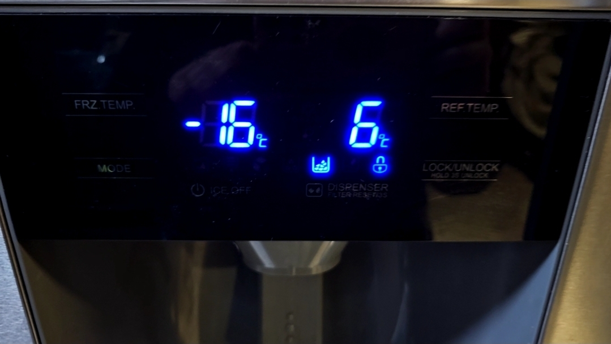
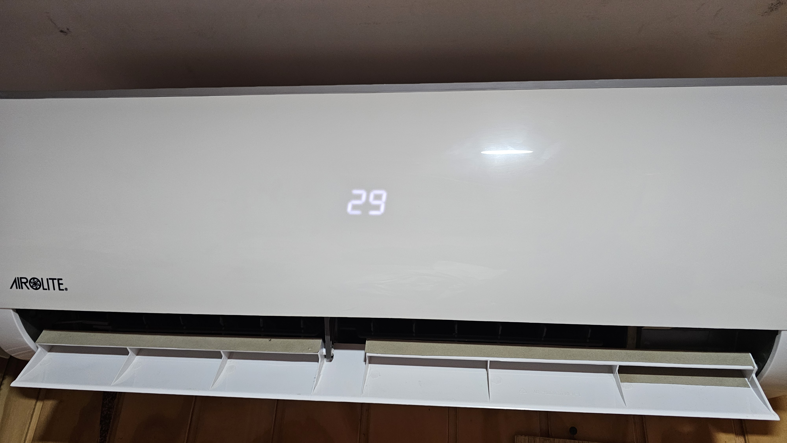
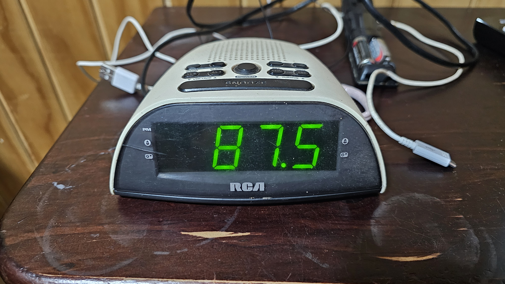
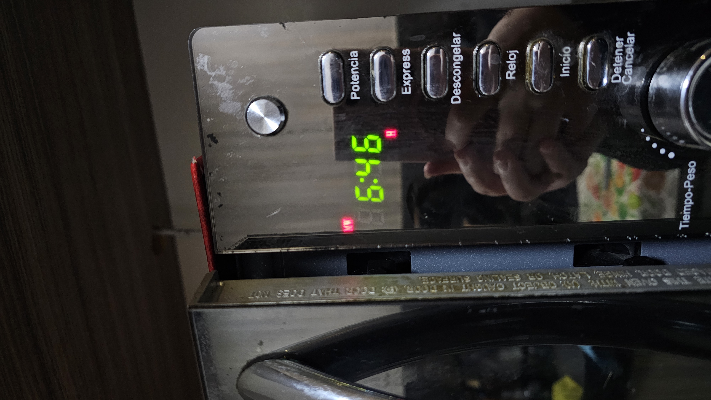
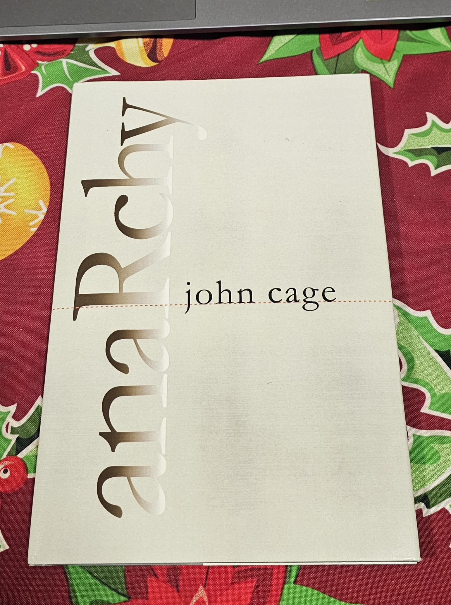

# sesion-01a

## apuntes sesión

No pude asistir a esta clase (ni a las 3 siguientes) porque estuve con licencia médica tras una operación; por el momento la recuperación ha sido favorable y me pude incorporar entes de la licencia :). Reconstruí estos apuntes a partir de lo que me compartieron mis compañeros.

La sesión comenzó con una introducción a GitHub y Git: qué es, para qué sirve (llevar un historial de cambios) y la importancia de crear un fork del repositorio del taller para trabajar en tu propia versión.

Datos prácticos que se mencionaron:
- Seleccionar con doble clic para reducir posibilidades de error.
- Nunca usar mayúsculas en nombres de archivo, a menos que sea un caso importante.
- Los nombres de archivo de imagen deben ir en minúscula y sin espacios, con guion es mejor.
- Para agregar imágenes al README.md: ``

Símbolos y su nomenclatura:
- `{}` → murciélago / llaves
- `[]` → corchete
- `()` → paréntesis

### Ejercicio en clase: variables y funciones a través del ascensor

Se hizo un ejercicio grupal analizando fotos de ascensores para identificar en conjunto qué es constante y qué es variable en su funcionamiento:

- El ascensor para en los pisos que está programado para parar.
- Eje de coordenadas: eje Z.
- Sistema: poleas, motores, cables, uso del contrapeso.
- Depende de la electricidad (antes era un bien público, hoy es distinto).
- Tiene un precio asociado y se trabaja con datos duros.
- Uso curioso de los números (ej: en Japón no hay piso 4).
- Puede tener subsuelos, estacionamientos, nivel manzana.
- Botones auxiliares: emergencia, bomberos, prender/apagar luz o aire.
- Sticker de mantención, tiempo que la puerta se mantiene abierta.
- Un dato importante: los nombres que le asignemos a las cosas nos deben hacer las cosas más fáciles.

Con esto se introdujo la lógica de programación:

```
if (estoy en un piso) {
  abrirPuerta();
  sonarAlarma();
}
```

Si algo tiene `();` quiere decir que es una acción (función).

---

## encargos

1. autorretrato: describir variables y funciones de ustedes.
2. investigar pantallas de segmentos, tomar fotos, documentar contexto, lugar, ubicación, alfabetos posibles, usos, comparar entre resultados encontrados, al menos 3 ejemplos distintos. https://en.wikipedia.org/wiki/Segment_display

### 1. Autorretrato: describir mis variables y funciones

¿Qué son las variables? Una variable es un nombre que representa un valor que puede cambiar.

**Mis variables:**
- nombre = Narely Riquelme
- edad = 21
- altura = 1.60 m
- color_pelo = castaño oscuro
- color_ojos = café claro
- lugar_residencia = Lampa
- gustos_musicales = indie pop, R&B
- estado_ánimo = variable, pero generalmente esperanzada
- intereses = diseño
- cualidades = creativa, empática

**Mis funciones:**
Mis funciones corresponden a las acciones que realizo día a día, como bañarme, lavarme los dientes, preparar mis comidas, tomar micro a la universidad, estudiar, prestar atención, socializar con amigos, escuchar música y darme tiempo para mis hobbies.

### 2. Investigar pantallas de segmentos

**1. Pantalla del refrigerador**



- contexto: pantalla de control ubicada en la puerta del dispensador de agua/hielo.
- lugar/ubicación: refrigerador de mi casa.
- uso: mostrar la temperatura del congelador (FRZ.TEMP) y del refrigerador (REF.TEMP) en °C.
- alfabeto posible: números del 0 al 9, con signo "-" para temperaturas bajo cero.
- los segmentos se encienden en color azul y se acompañan de íconos táctiles para hielo, dispensador y bloqueo.

**2. Pantalla del aire acondicionado**



- contexto: panel frontal del equipo, integrado de forma discreta en la carcasa blanca.
- lugar/ubicación: living de mi casa.
- uso: mostrar la temperatura configurada (en este caso, 29°C).
- alfabeto posible: números del 0 al 9.
- a diferencia de las otras pantallas, esta no tiene un marco oscuro visible; los segmentos solo se notan al estar encendidos, casi ocultos en la superficie blanca.

**3. Radio reloj despertador**



- contexto: pantalla de un radio reloj antiguo tipo velador.
- lugar/ubicación: mi pieza.
- uso: mostrar la hora o la frecuencia de radio sintonizada (en la foto, 87.5).
- alfabeto posible: números del 0 al 9 y el punto decimal.
- segmentos en color verde, es de las pantallas más "clásicas" que tengo en casa.

**4. Microondas**



- contexto: panel de control del microondas, junto a botones de potencia, express, descongelar, etc.
- lugar/ubicación: cocina de mi casa.
- uso: mostrar la hora (6:46) y el modo en uso (ícono "MW" para microondas).
- alfabeto posible: números del 0 al 9, además de íconos indicadores como "H".
- segmentos en color verde, similares a los del radio reloj.

En general, las cuatro pantallas usan segmentos para mostrar principalmente números, variando en color (azul, blanco, verde) y en visibilidad del marco. Todas cumplen la misma función básica: comunicar un dato (temperatura, hora, frecuencia) de forma rápida y clara.

---

## lectura

### Libro del semestre


El profe entregó a cada estudiante un libro de una colección, para leer como mínimo 1 página al día durante el semestre (idealmente terminarlo). Cada martes hay que escribir un resumen de lo leído con citas del libro.

### John Cage — *Anarchy* (1988), p. v

- **Qué entendí:** En la primera página, Cage cuenta cómo llegó a admirar las ideas de Buckminster Fuller sobre organizar el mundo según las necesidades humanas y no según fronteras políticas. Usa el ejemplo de una isla en Hawái, donde un túnel unió a dos tribus que antes estaban en guerra, para defender la idea de que no necesitamos gobiernos, solo garantizar servicios básicos a todos.
- **Cita interesante:** "That government is best which governs not at all"
- **Reflexión personal:** Me pareció fuerte la idea de que el problema no es la falta de recursos, sino cómo los repartimos y protegemos con "fronteras imaginarias". Es una lectura densa por el inglés, pero el ejemplo de la isla lo hace bien concreto y fácil de visualizar.
