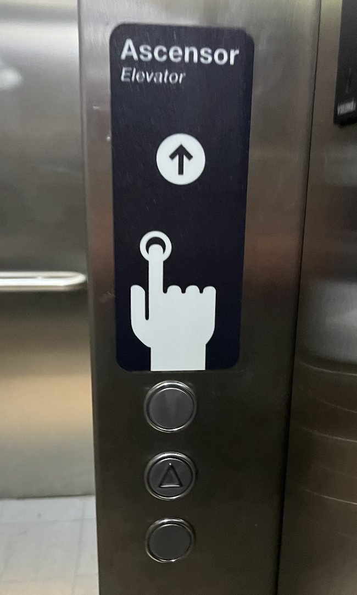
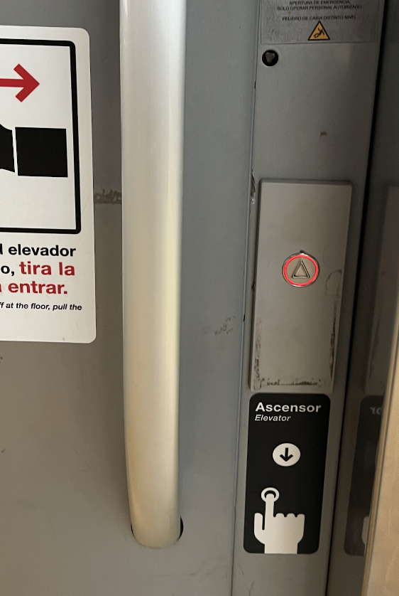
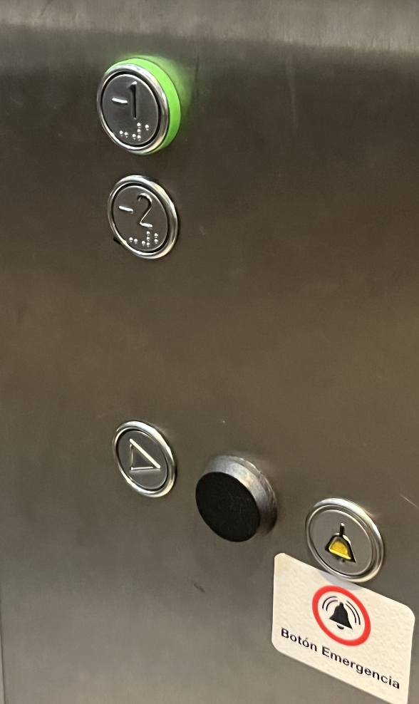

# sesion-00b

## apuntes sesión

Esta clase fue de introducción, pudimos ver los proyectos de Aarón y Mati, y también conocernos entre nosotros con mini presentaciones personales. Estoy muy emocionada de volver a este taller ;)

### Charla Heidi Jalkh

La primera clase del taller, empezó con una charla de Heidi Jalkh. Partió hablando de sus proyectos: primero, el bioinspirado que, guiándose en el movimiento de los pétalos de una flor, replicaba el movimiento en una estructura de goma eva, lo que comentaba que se podía modificar como se comporta la estructura, dependiendo de la forma generando diferentes reacciones. 

Luego el proyecto favorito de los que mencione fue el bioconstruido. A partir de hongos podía teñir estructuras, explorando las propiedades del hongo se podían generar diferentes posibilidades y experimentaciones del material. Fue muy interesante el punto de su explicación donde explicaba que los hongos son territoriales, por lo que al intentar combinar los hongos para generar colores, no funcionaba porque se formaban divisiones entre los tipos de hongo, por lo que esto igual fue un “atao” pero que resultó interesante para la experimentación. 

Hubieron algunos problemas con la presentación y me distraje con los problemas de la pantalla pero, me parece que es un tema poco común abordado e interesante de proponer: el que nosotros tengamos que adaptarnos al funcionamiento de la naturaleza.  

## encargos

### **Ascensor 1**

Esta botonera exterior de ascensor se encuentra en la estación de Metro República, en el -1. Cuenta con tres botones exteriores, donde el del centro tiene un símbolo de triángulo y los otros dos botones no tienen símbolo. Cuenta con un cartel que dice que hay que presionar un círculo pero no indica cual. Además no queda claro para qué es cada círculo y, asumiendo que si yo quiero subir apretaba el de arriba y, al contrario, si quiero bajar, pero el del centro con triangulo creo que no sé para qué serviría y termina siendo un diseño muy confuso para algo tan sencillo que es llamar al ascensor. 

Sinceramente yo cuando estoy sola prefiero no usar este tipo de asesor porque me da un poco de pánico no saber si apreté algo mal y quedar encerrada. 

- tres botones exteriores
- dos botones metálico plano, sin diseño
- un botón metálico con un símbolo de triángulo 
- no tienen luz
- no se puede diferenciar para qué es cada botón
- personalmente creo que me confundiria y apretaba cualquiera para llamarlo 

### **Ascensor 2**

Esta botonera de ascensor es de la estación de metro Elisa Correa, y la tomé desde la parte donde está el andén del metro,  me llamó mucho la atención porque me fijé que era de un solo botón como mencionaba Aarón en clase, la verdad es mucho más sencillo de usar, se repite nuevamente el símbolo triangular y tiene una luz roja alrededor, algo que también se me hizo muy diferente es que ya no se encuentran estos ascensores y este se tenía que deslizar la puerta para entrar. 

- un botón exterior 
- símbolo de triángulo 
- es el botón con el que “llamamos al ascensor”
- dice que para entrar hay que tirar la puerta
- el botón tiene un aro de luz roja 
- el botón se presiona

### **Ascensor 3**

Esta botonera es de la misma estación de Metro República pero es la parte interior (al abrir las puertas). Se pueden observar cinco botones: uno que indica -1, que es la parte de la boletería del metro y el -2 es el andén del metro. Estos dos botones son los únicos que cuentan con sistema braille.

Luego hay nuevamente con un botón con símbolo de triángulo, solo que este se ve diferente, como si estuviera de costado en comparación al anterior. El siguiente botón en negro, creo que se ve que es de decoración, porque no se ve funcional pero creo que es bastante inccesario o no sabria para cual es razón de poner ese elemento justo ahí.

Finalmente el botón con símbolo de campana, que indica que es de emergencia, el símbolo es bastante claro y destaca bien, así que es fácil de encontrarlo y suponer para que sirve. 

- hay 4 botones interiores
- indican dos pisos -1 y -2 
- botón -1 tiene luz verde 
- cuenta con lectura braille
- cuenta con un botón inferior con símbolo de triángulo, para cerrar la puerta (creo)
- hay un botón negro que desconozco para que será
- finalmente un botón con un símbolo de campana, que es en caso de emergencias 

**Estos botones funcionan como la comunicación entre la máquina y el usuario**

