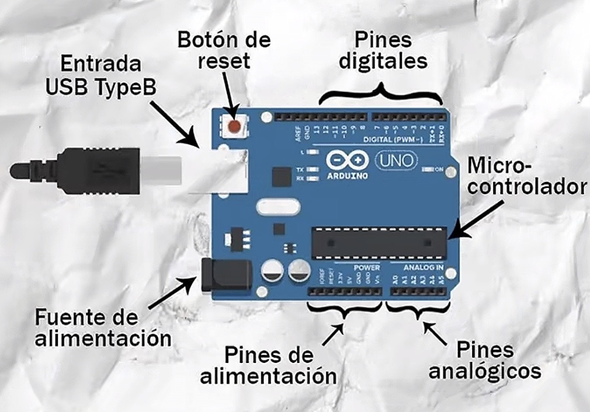
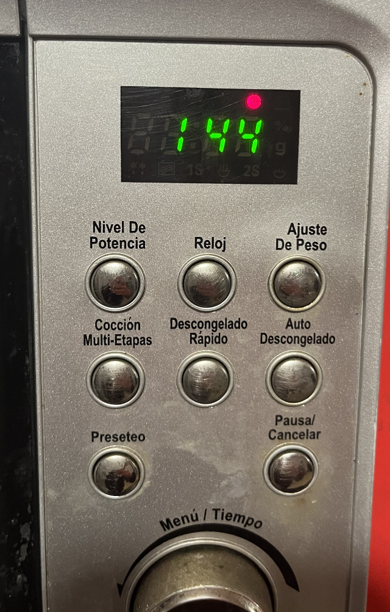
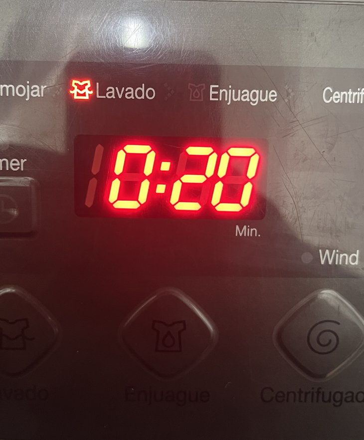
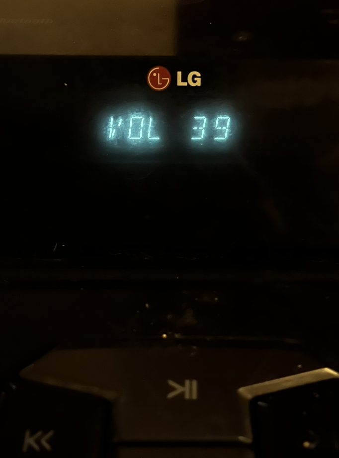

# sesion-01a

## apuntes sesión

apunte clase martes 11/08:

En esta clase empezamos con una introducción de GitHub, luego una actividad en clase de conversar y analizar las fotografías que pudimos sacar de los ascensores. También tuvimos una explicación sobre el funcionamiento de ellos. 

Con mis compañeras, analizamos los distintos botones, el orden de los pisos, incluso que algunos contaban con aire acondicionado, etc.

Primero empezamos a recopilar qué es lo que conforma un ascensor: 

- poleas
- motores
- pisos 
- movimiento en eje z
- carril
- electricidad
- contrapeso 
- espejos (aesthetic)

  **Variable y funciones**

- paréntesis: función o acción
- Sin paréntesis : dato

 ### ¿Qué es un Arduino?

  Es una placa electrónica programable. Recibe instrucciones mediante código para controlar sensores, luces, motores y otros dispositivos electrónicos.

  ¿Cómo funciona? 
  
Cargándole un código desde el computador y el Arduino lo ejecuta, para activar o leer componentes electrónicos, como sensores, LEDs o motores.

 

## encargos

encargo 01-a:

autorretrato: describir variables y funciones de ustedes. 

- Variables son datos, funciones son acciones.
(para estudiar: <https://thecodingtrain.com/tracks/code-programming-with-p5-js>)

*para recordar : los lenguajes de programación tienen variables, con distinta sintaxis, p5.js 
- en nuestro taller usaremos C++, también llamado Cpp, o C más 
- <https://www.w3schools.com/cpp/cpp_variables.asp>

  *Variable:* En programación, una variable está formada por un espacio en el sistema de almacenaje (memoria principal de un ordenador) y un nombre simbólico (un identificador) que está asociado a dicho espacio. Ese espacio contiene una cantidad de información conocida o desconocida, es decir un valor. El nombre de la variable es la forma usual de referirse al valor almacenado: esta separación entre nombre y contenido permite que el nombre sea usado independientemente de la información exacta que representa.

  - En computación una variable puede ser utilizada en un proceso repetitivo: puede asignársele un valor en un sitio, ser luego utilizada en otro, y más adelante reasignársele un nuevo valor para más tarde utilizarla de la misma manera. (wikipedia)

### Variables = cosas que pueden describir

- Nombre: Yaira 
- Edad: 21
- Altura: 1,52 m
- Carrera: diseño 
- Color favorito: rosado
- Intereses: dibujar
- Cantidad de horas que duermes: muchas
- Música que escuchas: pop
- Lugares que frecuentas: universidad 

ejemplo en C++

    string nombre = "Yaira";
    int edad = 21;
    string carrera = "Diseño Gráfico";

    string color_favorito = "rosado";

    string lugares_que_frecuentas[] = {"universidad", "metro", "casa" }

*Funciones:* Una función es una acción o conjunto de acciones que se puede ejecutar para realizar una tarea específica. 

ejemplo en C++ 

    FUNCIONES = acciones que realizo

      void imaginar() {
      // crear nuevas ideas
      }

*(aún no entiendo bien las funciones por lo que preferí ir de a poco)*
 
## ítem 2 

investigar pantallas de segmentos, tomar fotos, documentar contexto, lugar, ubicación, alfabetos posibles, usos, comparar entre resultados encontrados, al menos 3 ejemplos distintos. 

### Pantalla de segmentos 

- Una pantalla de segmentos es un dispositivo electrónico de visualización formado por varios elementos independientes llamados segmentos (generalmente diodos LED o cristal   líquido) que se encienden o apagan en diferentes combinaciones para representar números y caracteres alfanuméricos (Wikipedia).

“La típica pantalla digital que usa segmentos para formar números o letras. Dependiendo de qué segmentos se enciendan, puedes construir distintos números.”

 

### Microondas : electrodoméstico de cocina.

La pantalla se encuentra en la parte frontal y arriba del menú de botones, indicando el tiempo para calentar, también puede mostrar distintos modos de función potencia, reloj, ajuste de peso, cocción multi-etapas, descongelado rápido, auto descongelado, preseteo, pauta/cancelar, además una perilla de menú / tiempo. Las pantallas de microondas suelen utilizar pantallas de cuatro dígitos de 7 segmentos para mostrar los tiempos. Su función es reconocer rápidamente una cantidad de tiempo.

### Lavadora: electrodoméstico para aseo

Se encuentra en la parte frontal en el menú de opciones y puede indicar tiempo restante, programa, temperatura, velocidad de centrifugado o estados del ciclo, dependiendo del modelo. Mayormente es para indicar tiempo de lavado pero también puede representar textos como por ejemplo: programas de lavado eco, rápido, etc.  temperatura, centrifugado o símbolos. 

### Parlante: dispositivo electrónico para reproducir sonido.

En este parlante se encuentra en la parte frontal cerca de los botones y de las perillas de volumen, para comunicar información relacionada con la reproducción como radio bluetooth y volumen. Puede utilizar números y algunas letras o abreviaciones. Funciona como una interfaz entre el dispositivo y el usuario, sobre lo que está haciendo el parlante.

## lectura

libro que tengo que leer: 

- un resumen de lo leído, dos citas 

La sociedad del espectáculo se publicó por primera vez en la editorial Buhet-Chastel de París en 1967.

