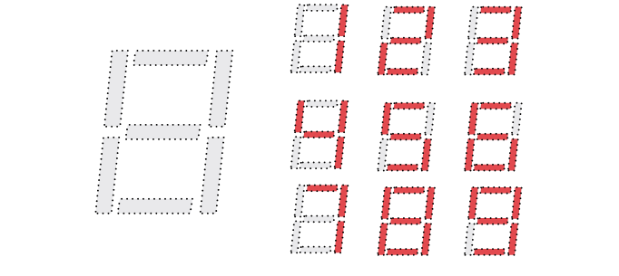

# sesion-01a

## apuntes sesión

apunte clase martes 11/08:

En esta clase empezamos con una introducción de GitHub, luego una actividad en clase de conversar y analizar las fotografías que pudimos sacar de los ascensores. También tuvimos una explicación sobre el funcionamiento de ellos. 

Con mis compañeras, analizamos los distintos botones, el orden de los pisos, incluso que algunos contaban con aire acondicionado, 

Primero empezamos a recopilar qué es lo que conforma un ascensor: 

- poleas
- motores
- pisos 
- movimiento en eje z
- carril
- electricidad
- contrapeso 
- espejos (aesthetic)

  **Variable y funciones**

- paréntesis: función o acción
- Sin paréntesis : dato

## encargos

encargo 01-a:

autorretrato: describir variables y funciones de ustedes. investigar pantallas de segmentos, tomar fotos, documentar contexto, lugar, ubicación, alfabetos posibles, usos, comparar entre resultados encontrados, al menos 3 ejemplos distintos. 

- Variables son datos, funciones son acciones.
(para estudiar: <https://thecodingtrain.com/tracks/code-programming-with-p5-js>)

*para recordar : los lenguajes de programación tienen variables, con distinta sintaxis, p5.js 
- en nuestro taller usaremos C++, también llamado Cpp, o C más 
- <https://www.w3schools.com/cpp/cpp_variables.asp>

  *Variable:* En programación, una variable está formada por un espacio en el sistema de almacenaje (memoria principal de un ordenador) y un nombre simbólico (un identificador) que está asociado a dicho espacio. Ese espacio contiene una cantidad de información conocida o desconocida, es decir un valor. El nombre de la variable es la forma usual de referirse al valor almacenado: esta separación entre nombre y contenido permite que el nombre sea usado independientemente de la información exacta que representa.

  - En computación una variable puede ser utilizada en un proceso repetitivo: puede asignársele un valor en un sitio, ser luego utilizada en otro, y más adelante reasignársele un nuevo valor para más tarde utilizarla de la misma manera. (wikipedia)

### Variables = cosas que pueden describir

- Nombre: Yaira 
- Edad: 21
- Altura: 1,52 m
- Carrera: diseño 
- Color favorito: rosado
- Intereses: dibujar
- Cantidad de horas que duermes: muchas
- Música que escuchas: pop
- Lugares que frecuentas: universidad 
- Estado de ánimo: nerviosa
- Energía: 60% de 100%
- creatividad: constante
- paciencia: poca

### Funciones: cosas que haces

- pensar
- comer
- aprender
- conocer

Estoy un poco confundida pero según la forma que pude entenderlo me quedó claro de esta forma: 

- Variables:  quién soy / qué datos tengo.
- Funciones:  qué hago / cómo funciono.

Pantalla de segmentos 

- Una pantalla de segmentos es un dispositivo electrónico de visualización formado por varios elementos independientes llamados segmentos (generalmente diodos LED o cristal   líquido) que se encienden o apagan en diferentes combinaciones para representar números y caracteres alfanuméricos (Wikipedia).

“La típica pantalla digital que usa segmentos para formar números o letras. Dependiendo de qué segmentos se enciendan, puedes construir distintos números.”

## lectura

libro que tengo que leer: 

- un resumen de lo leído, dos citas 

La sociedad del espectáculo se publicó por primera vez en la editorial Buhet-Chastel de París en 1967.

