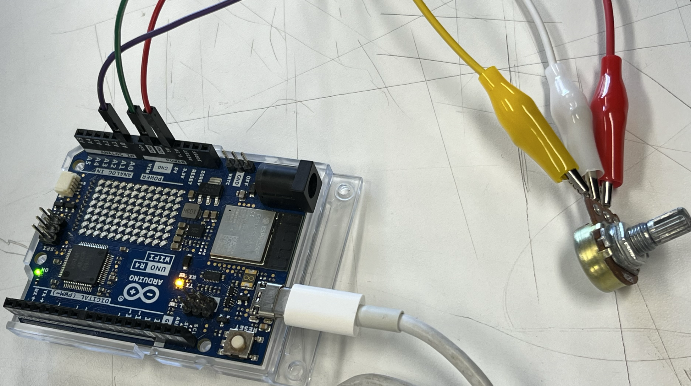
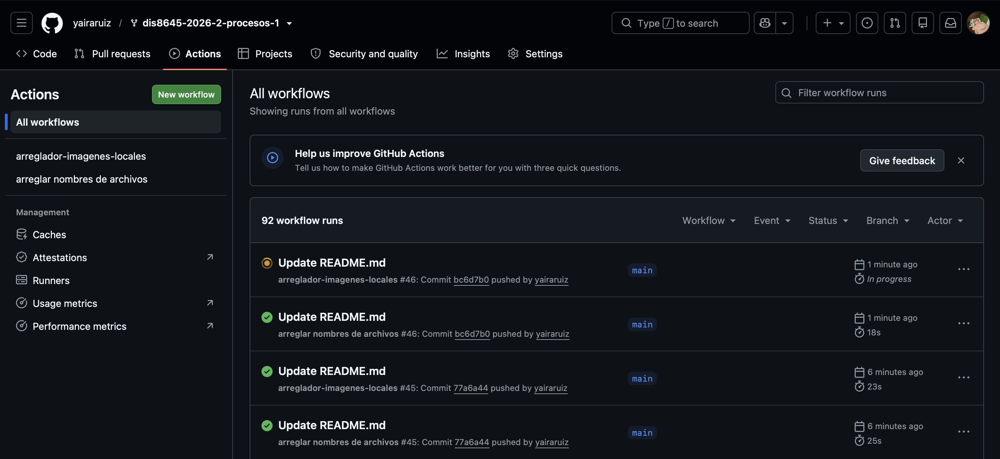

# sesion-02a

clase 18/08

## apuntes sesión

### Potenciómetro 

**potenciómetro (resistor variable):  nos permite regular potencia** es un interfaz que tiene forma para encapsular dos resistencias

- la patita 2 es la que mueve el valor en un constante

- los potenciónmetros giran en torno a un rango.  

+ potencia = energía/tiempo 

+ en electricidad la potencia es: voltaje x corriente 

+ vamos a hacer circuitos (por donde transitan electrones), 

+ la corriente es un flujo de electrones y el potenciómetro

### **Botones** (pulsadores) 

  + pushbutton
 
https://docs.arduino.cc/built-in-examples/digital/Button/

*resistencia pull down : permite llegar a tierra con calma*

Código para conectar un potenciómetro a Arduino UNO R4 WIFI

    const int patitaLectura = "A0"; 

    int valorLectura = -1;

    void setup() {
      Serial.begin(9600);

    }

    void loop() {
      Serial.println("hoolaa");
     valorLectura = analogRead(patitaLectura);
     Serial.println(valorLectura);
    }

*¿Qué es Serial? dar un mensaje en orden (el contrario de en paralelo), el puerto USB es serial y funciona a diferentes velocidades*

acá conectamos el Arduino a un potenciómetro en clases 

## encargos

1- en tu fork, ir a actions, y aceptar que corran github worfklows. subir pantallazo con demostración de que han corrido actions exitosas en tu repo. esto es crucial, si no lo haces, no agregaremos tus apuntes al repo, y las tareas se tomarán como no entregadas. si en tu fork las actions no son exitosas, no serán tampoco agregadas al repo común ni evaluadas.

2- conformar grupos de 3 a 4 personas para la realización del proyecto-1. compartir 2 placas de desarrollo por grupo, documentar estudio conjunto de C++, microcontroladores, botones, potenciómetros.

Mi grupo es :

- Magdalena Balart
- Catalina Oyanedel
- Yaira Ruiz
- Marcela Zuñiga

### Investigación C++ 

C++ es un lenguaje de programación multiplataforma que se utiliza para crear aplicaciones de alto rendimiento.Fue desarrollado por Bjarne Stroustrup como una extensión del lenguaje C.

+ C++ permite a los programadores tener un alto nivel de control sobre los recursos del sistema y la memoria.

Se puede encontrar en:

- Sistemas operativos
- Interfaces gráficas de usuario (GUI)
- Sistemas integrados (embedded systems)

  **Programación orientada a objetos**
  
C++ permite organizar los programas mediante clases y objetos

+ Dar una estructura más clara al programa
+ Reutilizar código
+ Reducir los costos de desarrollo

**C++ puede utilizarse para crear aplicaciones que se adapten a diferentes plataformas o sistemas**

+ Permite tener bastante control sobre los recursos del computador y la memoria, por lo que puede utilizarse para crear programas que necesitan ser eficientes y rápidos

  ### Sintaxis de C++
  
La sintaxis son las reglas que indican cómo se debe escribir el código para que C++ pueda entenderlo:

     #include <iostream>
     using namespace std;

     int main() {
         cout << "Hello World!";
         return 0;
     }

+ #include <iostream>: incluye herramientas para entrada/salida

+ using namespace std; permite usar elementos de la biblioteca estándar sin escribir std

+ int main() : función principal, donde comienza el programa

+ { } : indican el inicio y final de un bloque de código

+ cout : muestra información en pantalla

+ << : envía información a cout

+ ; : indica el final de una instrucción

+ return 0; : termina correctamente main()

Existen diferentes tipos de variables (Las variables son contenedores que sirven para guardar datos o valores), dependiendo del tipo de dato que queremos almacenar:

| Tipo de variable | Se declara como | Uso |
|---|---|---|
| Entero | `int` | Guarda números enteros, sin decimales |
| Decimal | `float` | Guarda números con decimales |
| Decimal de mayor precisión | `double` | Guarda números decimales con mayor precisión que `float` |
| Carácter | `char` | Guarda un solo carácter, letra o símbolo |
| Texto | `string` | Guarda palabras, textos o cadenas de caracteres |
| Booleano | `bool` | Guarda valores de verdadero (`true`) o falso (`false`) |
| Entero grande | `long` | Guarda números enteros de mayor rango |
| Entero muy grande | `long long` | Guarda números enteros de un rango aún mayor |
| Entero sin signo | `unsigned int` | Guarda números enteros iguales o mayores que 0 |

Para crear una variable debemos indicar:
tipo + nombre de variable + valor

+ También podemos crear la variable primero y asignarle un valor después

+ Una variable puede cambiar de valor

  **Otros tipos de datos:**

  - cout sirve para mostrar información en pantalla
 
  <https://www.w3schools.com/cpp/cpp_intro.asp>
  <https://www.w3schools.com/cpp/cpp_variables.asp>
  
## lectura

*capítulo 1*

Debord explica que el espectáculo es fundamental para la  sociedad moderna y está directamente relacionado con la economía y el sistema de producción. Las personas pasan de valorar lo que son, a valorar lo que tienen y finalmente lo que parecen ser. También plantea que el espectáculo es una conversación unilateral: mantiene el orden social y las desigualdades existentes.

También habla de cómo la producción y la tecnología pueden provocar aislamiento, porque objetos creados por nosotros mismos refuerzan la separación entre las personas. Algo que me llamó mucho la atención, considerando que es un libro viejito, es la idea del espectáculo como una unión contradictoria, las personas están conectadas a través de “las imágenes”, pero al mismo tiempo permanecen separadas unas de otras. Me gusta pensar en “las imágenes” de una forma más amplia, como una referencia a cualquier tipo de representación de la realidad que vivimos actualmente. También se plantea que la sociedad se vuelve espectadora de su propia realidad, observándola como si fuera algo externo a ella misma.

+ “El espectáculo reúne lo separado, pero lo reúne en tanto que separado”

+ " El hombre separado de su producto produce cada vez con mayor potencia todos los detalles de su mundo, y así se encuentra cada vez más separado del mismo. En la medida en que su vida es ahora producto suyo, tanto más separado está de su vida "

