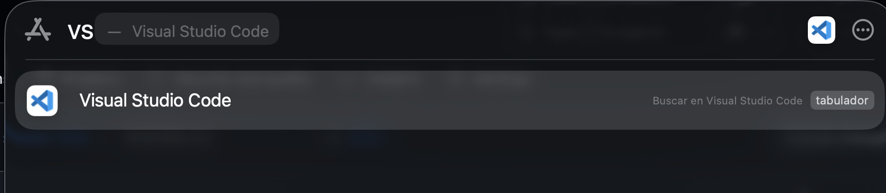
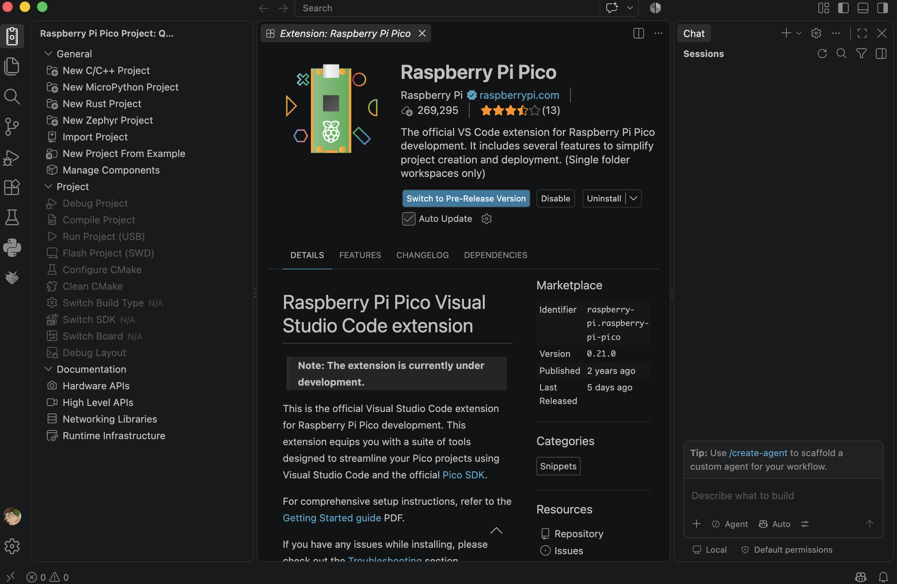
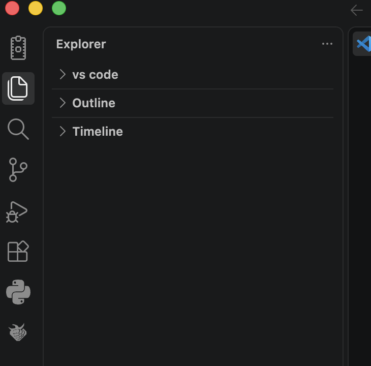

# sesion-02b

clase cancelada por cierre de udp

## apuntes sesión
## encargos

encargo02b:

subimos videos en canvas de hoy, son 3 videos.

1: instalar visual studio code, cami está regrabando el video parte 1 porque tuvimos un problema ténico, les avisará por discord cuando esté listo

2: ver los videos parte 2 y parte 3, aunque no tengan una placa raspberry pi, anotar dudas, tratar de subir código a sus placas si es que las piden.

descargar extensiones: 

+ C/C++
+ markdownlint
+ Raspberry Pi Pico

  
  
* hay que saber que micropyhton estamos usando 
*no marcar risc-v
usar la versi+on más nueva (v.2.3.0)
usar en Stdio support : Console over USB (disables other USB use) permite mandar mensajes por el puerto USB
en Code generation options :  solo activar Generate C++ code

seguí los pasos pero no me dio la opción para ver el main.cpp, solo me aparece: 

  

## lectura
