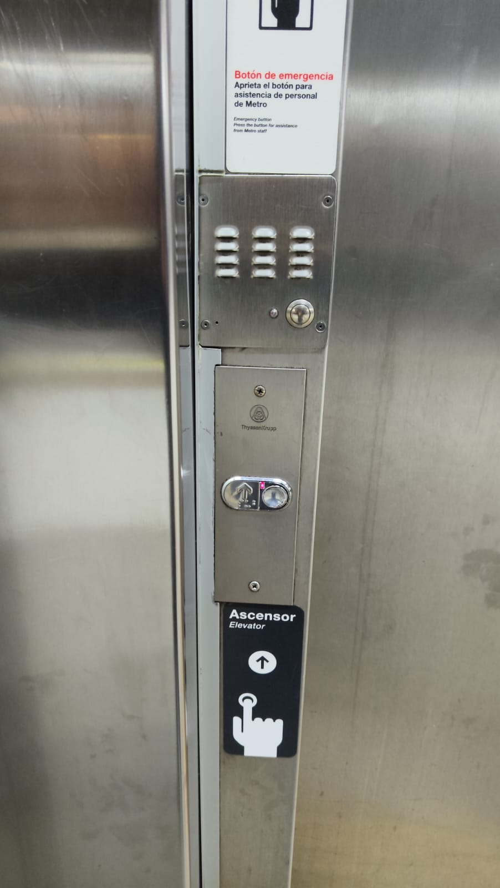
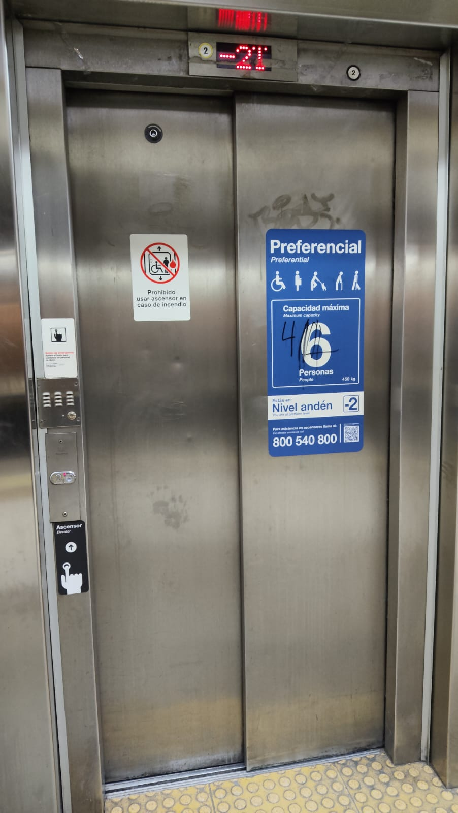
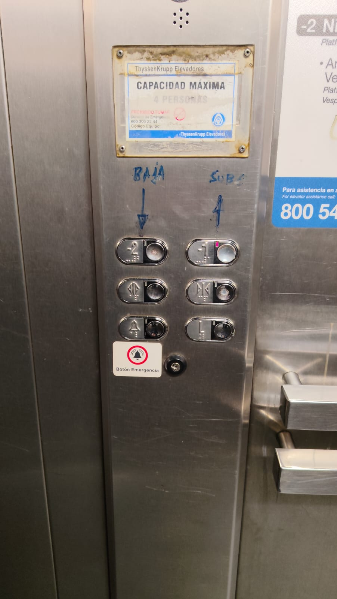
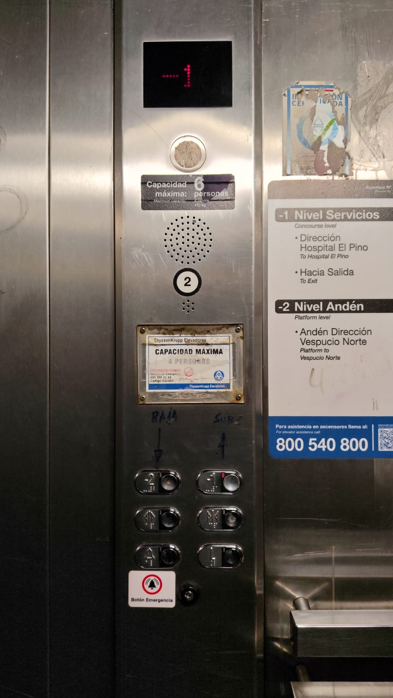
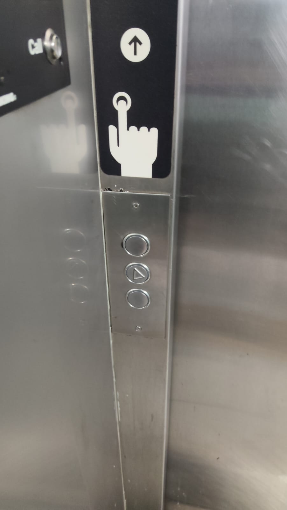
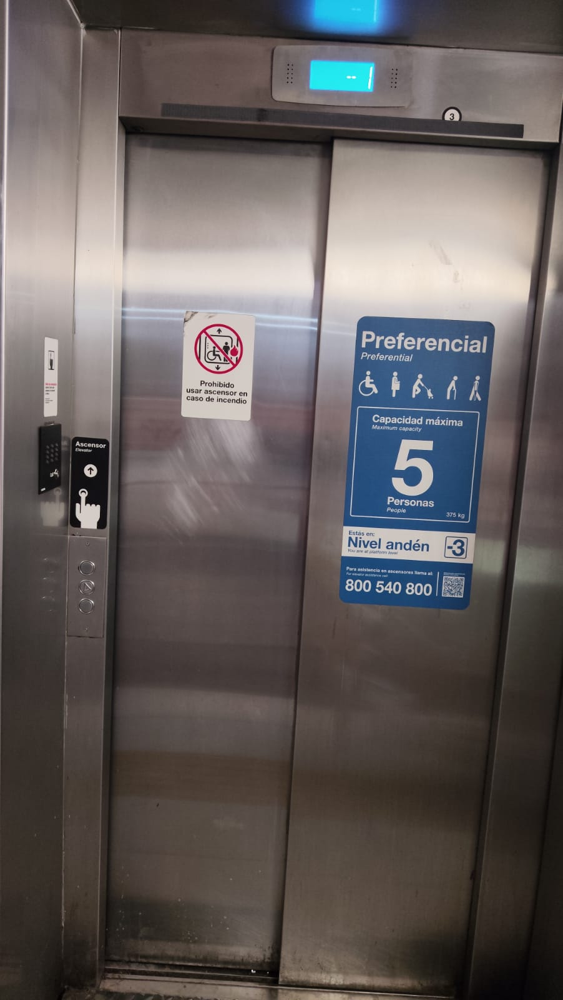
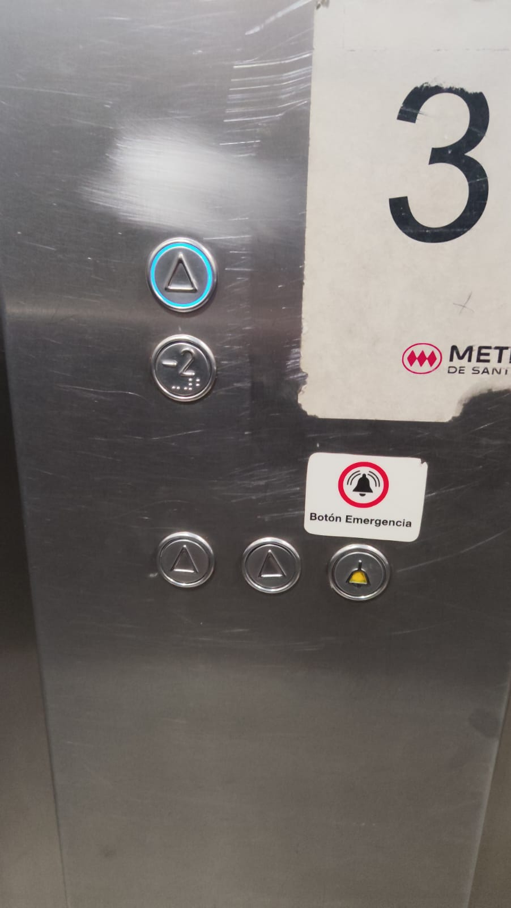
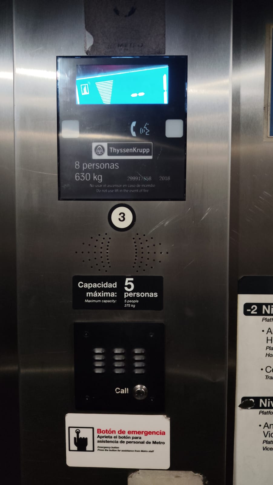
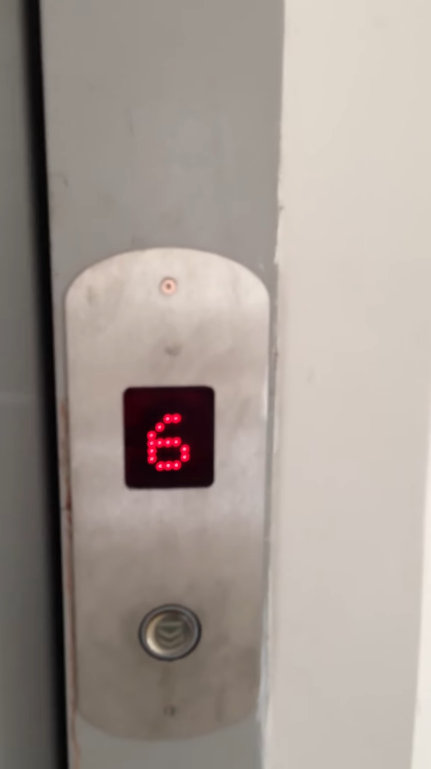
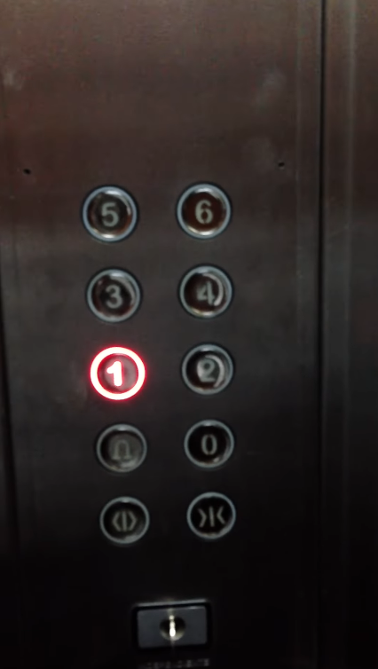

# sesion-00b

11-08-2026

## apuntes sesión

Introducción al ramo y charla de taller materia situada.

Diseñadora experimental.

### Materiales Bio inspirados.

- Taller Materia situada
- Una forma distinta de pensar los materiales
- Trabajan con materiales y biomateriales.
- Estudio de planta: Material, forma, comportamiento. Todo en uno
- Estructura celular y la absorción de agua cambian la forma
- El material es el mecanismo

### Biofabricado

Qué propiedades pueden aportar a partir de distintas especies.

Interacciones fúngicas.

Cómo trabajan y se transforman estos materiales, se adapta una grilla que permita la colonización de los hongos por mayor oxigenación.

Importante es que se entienda de manera general lo que está pasando a la hora de exponerlo.

Proyectos con distintos materiales para crear colores y estructuras.

### Materiales Biobasados

Se utilizan los "desechos" de materiales, se utilizan para construir nuevos materiales donde tienen mayor impacto dependiendo de su función específica.

Se crean piezas con procesos artesanales.

En el taller Materia situada es qué otra cantidad podemos conocer con el material que es la excusa y el material principal es el cobre.

## encargos

**Encargo 1**

Traer fotos de 3 botoneras de ascensores y traer 3 textos que las describan.

### Solución

**Ascensor 1**

**Ascensor Metro Zapadores:**

A la primera vista antes de entrar se encuentra un botón a la altura de un metro sesenta centímetros del tamaño un poco más grande que un dedo pulgar el cual hay que apretar idealmente con el dedo índice o de no tener dedos con algo que se tenga a la comodidad más cercana, mover el dedo o la extremidad hacia el botón cercano y hunda el botón ejerciendo fuerza hacia adelante con el dedo, objeto u otra extremidad disponible y funcional en medida de lo indicado anteriormente.

El botón a su izquierda tiene una flecha que apunta hacia arriba y abajo unos puntos que indican lo mismo escrito en braille, cuando se pulsa el botón se enciende una luz que indica que el ascensor se está moviendo a la planta (piso) que se solicitó y esto se puede ver por medio de una pantalla que enciende leds en forma de números que están escritos y van cambiando a medida que el ascensor llega a cada planta indicando en dónde se encuentra.

Arriba de esta botonera hay un botón solo extra donde no tiene explicación de uso pero se podría intuir que es para presionar y hablar con alguien que esté dentro del ascensor.

Cuando el ascensor llega la puerta que estaba enfrente se desplaza de izquierda a derecha permitiendo el ingreso.

Dentro de este mismo ascensor hay otra disposición de botones los cuales están a la misma altura mencionada anteriormente pero desplazados en una grilla 3 x 2 “3 filas y 2 columnas” donde en los primeros 2 botones de arriba está escrito menos “-2” y a la derecha de este escrito menos “-1”.

Inmediatamente debajo del “-2” está un símbolo con un triángulo hacia la izquierda, una línea vertical en medio y un triángulo hacia la derecha, lo que indica que se “abren las puertas”.

El botón a la derecha de este tiene los mismos símbolos que el botón anterior pero las puntas de los triángulos tienden a converger hacia la línea vertical del centro, lo que indica “cierre de puertas”.

Inmediatamente abajo del botón de apertura de puertas está un símbolo con una forma de campana con un sticker abajo de este que describe que el botón asociado a este símbolo es un “Botón de emergencia”.

Por último a la derecha de este botón de la campana hay una letra L escrita a la izquierda del botón que puede significar en inglés “lower” o vestíbulo, en inglés “Lobby”.

Cada uno de estos botones tiene una luz roja que se enciende al presionar cada uno de los botones particularmente y por separado, se encuentra arriba a la izquierda de estos mismos.

Arriba de la botonera se encuentra unos orificios por donde sale el sonido que va indicando en qué piso se encuentra el elevador y más arriba una pantalla que indica los números del piso que se encuentra nuevamente con luces led rojas dibujando el número.

**Ascensor 2**

**Ascensor Metro Santa Ana:**

En la primera vista al estar frente al ascensor cerrado se encuentra una pantalla en la parte superior que indica en qué piso se encuentra el ascensor.

En la parte izquierda se encuentran 3 botones que aparentemente son presionables pero el único botón disponible para presionar o hace la función de hundirse y generar una reacción es el que se encuentra en medio de estos botones distribuidos de forma vertical, el botón presionable tiene el símbolo de un triángulo con una de sus 3 puntas apuntando hacia la derecha.

Cuando se aprieta el botón se enciende una luz alrededor del botón de color azul, lo que nos indica que ya fue presionado.

Al interior del ascensor hay 3 botones en lo más abajo visibles, el de la izquierda y el del medio tienen el mismo símbolo del triángulo apuntando esta vez hacia arriba “aunque estos 2 botones no son presionables”, mientras que el último botón de estos 3 que se encuentra a la derecha tiene un símbolo de una campana con amarillo en el centro.

Arriba de estos 3 botones se encuentran 2, uno arriba que tiene el mismo símbolo del triángulo apuntando hacia arriba el cual si se presiona también genera la reacción de indicar que fue presionado anteriormente con el aro de luz que lo envuelve y abajo de este mismo otro botón con un “-2” menos dos escrito en él, con unos puntos abajo que es idioma braille para presionarlo igualmente.

Arriba de estos 2 botones tiene unos orificios que indican por sonido en qué piso se encuentra el elevador y arriba de estos orificios una pantalla que indica con números escritos en qué piso se encuentra.

**Ascensor 3**

**Edificio:**

En primer impacto estando frente a la botonera de este ascensor solo hay una pantalla que indica el número del piso en el que se encuentra con luces led rojas escribiendo el número de dicho piso y un botón para llamar el ascensor que se enciende solo cuando se presiona pero no se mantiene encendido, en este caso un símbolo con una línea horizontal y una línea doblada que apunta hacia abajo.

Al ingresar hay una botonera con números que van en zigzag de izquierda a derecha de abajo hacia arriba con los números de los pisos indicando que van desde el cero “0” hasta el seis “6”.

A la izquierda del cero se encuentra el botón con símbolo de campana para pedir ayuda, abajo del botón de la campana un símbolo que tiene una línea vertical en el centro y unas líneas apuntando hacia la derecha e izquierda en cada lado que indican “apertura de puertas” y a la derecha de este otro botón con símbolo de una línea vertical con las mismas líneas mencionadas anteriormente a los lados pero esta vez convergen hacia el centro de la línea vertical central indicando “cierre de puertas”.

En este caso dentro del ascensor si se mantiene encendido el botón que se presionó para ir hacia el piso indicado cuando el botón tiene números pero cuando es un símbolo no numérico NO se mantiene encendido el botón si no se está presionando.

Arriba de esta botonera existe una pantalla que de igual forma como al ser visto desde afuera, adentro indica los números del piso en el que se encuentra por medio de leds rojas dentro de la pantalla dibujando el número.

## lectura

Resumen:

La Raspberry Pi fue creada inicialmente para incentivar la programación con pocas unidades lanzadas al mercado y vendiéndose todas al poco tiempo de lanzarse, lo cual hizo que siguiera creciendo esta organización sin fines de lucro, el libro que tengo actualmente es una guía para principiantes que te ayuda a empezar con esta herramienta y te incentiva a utilizarla al igual que muchos otros usuarios que ya están interesados y utilizan para sus propios fines.

2 Citas:

"Este pequeñísimo y asequible ordenador cuesta menos que la mayoría de videojuegos, pero se puede usar para aprender a codificar, construir robots y crear todo tipo de proyectos extraños y maravillosos" Pág. 5

"-más o menos del tamaño de una tarjeta de crédito- pero eso no impide que sea potente: un Raspberry Pi puede hacer cualquier cosa que haga un ordenador más grande y de mayor consumo" Pág. 8

Pregunta:

Es específica y tal vez la respondan más adelante en el libro pero como dice que puedes jugar y hacer lo mismo que con cualquier otro ordenador, el tipo de juegos que se pueden jugar son los retro con una Raspberry Pi? Tipo Tetris y más pixel o se podrá correr algún juego más demandante?

Referente:

El autor Gareth Halfacree es un escritor y periodista autónomo especializado en temas tecnológicos, y previamente trabajó como administrador de sistemas en el sector educativo.

Twitter: @ghalfacree

y su sitio web: freelance.halfacree.co.uk.

Aseveración:

Raspberry Pi es un ordenador.
