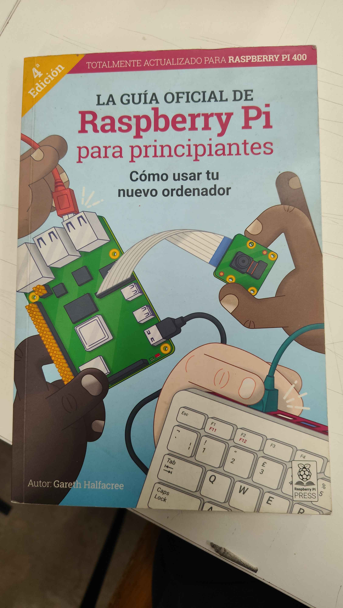

# sesion-01a

11-08-2026

## apuntes sesión

Me llevé este libro

Tarea: subir imágenes con texto de los ascensores al repositorio

Linux es gratuito y de fuente abierta

Git lo creó Linus Torvalds para poder hacer commits por la complejidad de crear un sistema operativo en equipo

Git: Tonto en británico

Trabajo en grupo

- En la mayoría de los ascensores que investigamos no tienen piso cero.
- Algunos específicos tienen una tarjeta con chip para habilitar los pisos y son específicos para llegar a donde se desea.
- Otros especiales, como el ascensor de bomberos, tienen llaves que habilitan poder presionar los botones.
- En algunos ascensores específicos se encuentran letras escritas, como por ejemplo "L", lo que significa, según entendemos, "Lobby".

**Datos internos que maneja serían:** Número de plantas, dónde se encuentra el ascensor, puertas, hay algunos que no tienen puertas y máximo hemos visto hasta 2, botones, tienden a moverte en un eje que es el Z, espejos es "opcional", poleas, motores, contrapeso, carril, electricidad.

Parte de interés: Botones, ¿qué botones encontramos?

Números enteros, números positivos y números negativos y no había cero, en Estados Unidos no está el 13, no está el 4 en Japón, hay maneras simbólicas de describir las variables, variable piso actual y variable piso destino, botones auxiliares.

Invitación a destruir el ascensor de cerrar puertas.

Variable de tiempo de puerta abierta, ej.: t = 100 milisegundos.

Funciones del ascensor:
Subir y bajar, detenerse, abrir y cerrar las puertas, hacer sonar alarma.

Todas las funciones "palabras" que estén escritas con un paréntesis al lado "()" significa que hay una acción, importante entender y cómo se describen las variables, funciones y puntos de vista para programar.

## encargos

**1. autorretrato: describir variables y funciones de ustedes.**

Variables mias: tengo extremidades como dedos, brazos, piernas entre otros que utilizo para llevar a cabo actividades en mi día a día ojos para ver, nariz para oler, orejas para escuchar, boca para hablar o comer y cada una de estas tiene más elementos que hacen parte de un sistema tanto en el interior como en el exterior por ejemplo en la boca tengo dientes con los cuales muerdo la comida y la legua que sirbe para mober o posicionar lo alimentos, sentir el sabor y ademas me ayuda a poder pronunciar adecuadamente las palabras que quiero decir o expresar a otro usuario.

en el interior cambien tenemos sistemas como la division de las extremidades por medio de los huesos con las cuales podemos movernos, sistema sanguineo que recorre todo el cuerpo que entre todas sus funciones transporta el oxigeno, sistema digestivo que permite procesar alimentos, respiratorio que lleva el aire hacia los pulmones y cada uno de estos sistemas hace funciones particulares que se dividen en mas procesos especificos para mantenerme vivo.

variables tambien existen como la forma lisa o crespa del cabello, el color o tonos de piel y de cabello por medio de la melanina, la forma de uñas, dedos, huesos, huellas dactilares, papilas gustativas y orejas varia tambien con otros usuarios la altura el peso, contextura y formas de pensar.

Cada pequña cosa hasta la maxima expresion de lo que puedo ser se combina de micro procesos importantes que conforman un too para que funcione adecuadamente mi existencia con vida.

**2. investigar pantallas de segmentos, tomar fotos, documentar contexto, lugar, ubicación, alfabetos posibles, usos, comparar entre resultados encontrados, al menos 3 ejemplos distintos.** https://en.wikipedia.org/wiki/Segment_display

Es un dispositivo de visualización que utiliza partes individuales o pequeñas luces que se encienden y se apagan para formar números o caracteres. Los más comunes son las pantallas de 7 segmentos, que se utilizan solo para números, y pantallas alfanuméricas de 14 segmentos y de 16 segmentos, que pueden mostrar números y letras del alfabeto latino. Generalmente utiliza LED o cristales líquidos "LCD", siendo común encontrarla en relojes y calculadoras.

Se pueden encontrar en usos como:

- Relojes digitales.
- Calculadoras.
- Pesas digitales.
- Timers de cocina.
- Calefacción.
- Máquinas de ejercicio.

Ejemplos de fotos y contextos:

- Reloj de mano digital personal y de uso común que venden en la feria, con varias funciones en las que aparecen letras y símbolos, pero principalmente, en cuanto a lo esencial, son los números de la hora que los indica en el centro del reloj mismo.

- Calculadora de estudio se encuentra con estudiantes de escuelas, universitarios, escritorios y oficinas de trabajo principalmente. En mi caso está en mi casa y permite mostrar números, una cantidad limitada de letras como: E, F, L, C o H que pueden formarse con ciertas combinaciones de segmentos y símbolos de operaciones.

- Timer de cocina, muestra principalmente números positivos que van retrocediendo hasta llegar a cero para que apenas llegue a cero suene inmediatamente, tiene solo 3 botones azules y en ellos está escrito MIN: de minutos, SEG: de segundos y en el último está escrito INICIAR/PARAR, que indica si iniciar la cuenta regresiva o detener la cuenta regresiva, para colocar todo en cero o "apagar" hay que apretar el botón de MIN junto al de SEG a la vez por medio segundo de tiempo.

**Comparativa**

Entre los 3 hay botones que aunque tengan funciones distintas, sirven para darle órdenes a las pantallas de segmentos según lo que se les quiera pedir y para lo que está hecha su función. Las pantallas pueden tener distintas formas, pero la distribución de los fragmentos es la misma en cada objeto. Todos los objetos son capaces de cumplir su función para la que fueron programados y no hubo problema en mostrar los números, que fue en lo que estos 3 objetos se destacaron, aunque para distintas funciones específicas.

Lo único distinto, pero que no cambió más que la estética y la visión en caso de que hubiera mucha luz para poder ver los números, dado el contexto en que con este objeto sí se sale a la luz del sol, es que el reloj tiene una luz que alumbra de color verde para darle mayor visibilidad a los fragmentos que muestran en su forma los números.

## lectura

Resumen:

En esta guía conocemos la Raspberry Pi 4 Model B y Raspberry Pi 400, las versiones más recientes y potentes de Raspberry Pi, como dice el libro, pero también tiene otros modelos de la familia Raspberry Pi, lo cual hace que hasta el día de hoy podamos tener algunas versiones actualizadas para requerimientos específicos. Aunque el idioma sigue siendo el mismo desde la primera versión, puede ser utilizado en cualquiera de las versiones disponibles y funcionará sin problemas.

A diferencia de un ordenador normal, este tiene todos los componentes y puertos a la vista, aunque se le puede comprar una carcasa para mayor protección, al estar expuestos los componentes facilita conectar los distintos extras, denominados periféricos.

2 Citas:

"incluso es posible utilizar la versión más reciente del sistema operativo Raspberry Pi y ejecutarla en un prototipo original del modelo B prelanzamiento" Pág.9

"no es una cita, pero en la pág. 10 muestra la imagen con letras de la A a la N explicando qué es cada componente visto en la tarjeta. Ej.: A-Entrada de alimentación USB tipo C" Pág.10

Pregunta:

Raspberry Pi me hace preguntar si ¿será el computador más pequeño del mundo y si al menos es el más pequeño de uso comercial?.

Referente:

Tipos de computadoras muy pequeñas.

Científicas (microscópicas): Creadas por IBM o universidades (como el Michigan Micro Mote), usadas para rastrear objetos e investigación.

Mini PC comerciales (de bolsillo o cubo): Marcas como Chuwi, Geekom o Minisforum fabrican computadoras completas que caben en la palma de la mano.

Aseveración:

Lo que aprendas se puede aplicar fácilmente a otros modelos de Raspberry Pi independientemente de con cuál aprendas.
